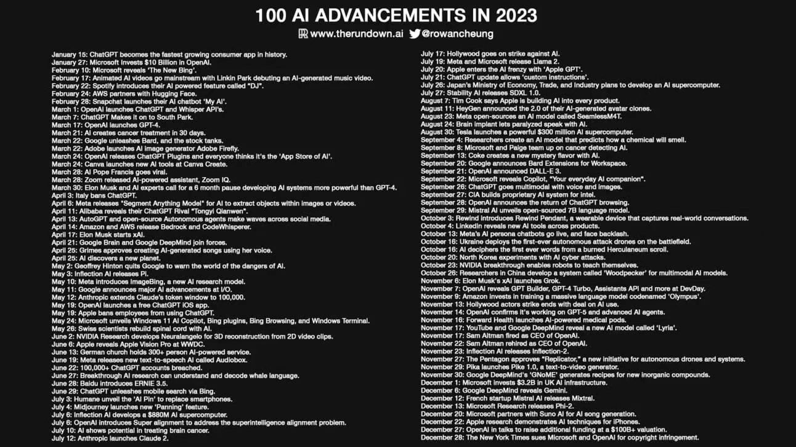

自从 2022 年末 ChatGPT 横空出世以来，AIGC 发展的热浪一浪接一浪。The Rundown AI 的作者整理了 2023 年发生在 AI 领域的 100 件大事。原文链接 *https://www.therundown.ai/p/the-biggest-ai-events-in-2023*。

## 一月份

* 1 月 15 日：**ChatGPT 变为历史上增长最快的应用程序**。
* 1 月 27 日：微软向 OpenAI 投资 100 亿美金。

## 二月份

* 2 月 10 日：微软推出“新 Bing”。
* 2 月 17 日：Linkin Park 首次推出人工智能生成的音乐视频，动画人工只能成为主流。
* 2 月 22 日：Spotify 推出了自家的 AI 产品，名为“DJ”。
* 2 月 24 日：AWS 与 Hugging Face 达成合作。
* 2 月 28 日：Snapchat 发布了自家的 AI 聊天机器人 “My AI”。

## 三月份

* 3 月 1 日：**OpenAI 推出 ChatGPT 及 Whisper API**。
* 3 月 7 日：South Park 的最新一集是用 ChatGPT 写的。
* 3 月 17 日：OpenAI 发布 GPT-4。
* 3 月 21 日：AI 在 30 天内创造出来治疗癌症的方案。
* 3 月 22 日：Google 发布了 Bard，但是股价暴跌。
* 3 月 22 日：Adobe 发布了 AI 图像生成器 Adobe Firefly。
* 3 月 24 日：OpenAI 发布了 ChatGPT 插件，所有人都认为这是 “AI 时代的 App Store”
* 3 月 24 日：Canva 在 Canva Create 上发布了新的 AI 工具。
* 3 月 28 日：AI Pope Francis 迅速走红。
* 3 月 28 日：Zoom 发布了 AI 助手，Zoom IQ。
* 3 月 30 日：在开发比 GPT-4 更强大的系统这件事上，埃隆马斯克和专家呼吁，需要暂停六个月。

## 四月份

* 4 月 3 日：**意大利禁止 ChatGPT**。
* 4 月 6 日：Meta 发布了 AI “Segment Anything Model”，用来从图片或视频中提取对象。
* 4 月 11 日：阿里巴巴发布了自家的 ChatGPT 版本“通义千问”。
* 4 月 13 日：AutoGPT 和开源治理组织在网络上掀起了讨论热潮。
* 4 月 14 日：Amazon 和 AWS 发布了 Bedrock 及 CodeWhisperer。
* 4 月 17 日：埃隆马斯克开启了 xAI。
* 4 月 21 日：Google Brain 和 Google DeepMind 强强联手。
* 4 月 25 日：格莱姆斯允许使用她的声音来用 AI 创建歌曲。
* 4 月 25 日：**AI 发现了一个新的星球**。

## 五月份

* 5 月 2 日：**Geoffrey Hinton 从 Google 辞职并发出了 AI 危险的警告**。
* 5 月 3 日：Inflection AI 发布了 Pi。
* 5 月 10 日：Meta 介绍了一个新的 AI 研究模型 ImageBing。
* 5 与 11 日：**Google 在 I/O 大会上宣布了 AI 的重大进展**。
* 5 月 11 日：Anthropic 将 Claude 的 token 窗口扩展到 100,000。
* 5 月 19 日：OpenAI 发布了一个免费的 ChatGPT iOS 应用。
* 5 月 19 日：苹果禁止员工使用 ChatGPT。
* 5 月 24 日：微软推出了 Windows 11 AI Copilot、Bing 插件、Bing 浏览器及 Windows 终端。
* 5 月 26 日：瑞士科学家使用 AI 重建脊髓。

## 六月份

* 6 月 2 日：英伟达研究人员开发了 Neuralangelo，用于从 2D 视频切片中进行 3D 重建。
* 6 月 6 日：在 WWDC 大会上，苹果发布了 Apple Vision。
* 6 月 13 日：德国教堂举办了 300 多人的人工智能服务。
* 6 月 19 日：Meta 发布了新的文本生成语音的 AI 产品 Audiobox。
* 6 月 22 日：超过 100,000 个 ChatGPT 帐户遭到泄露。
* 6 月 27 日：突破性的人工智能研究可以理解和解码鲸鱼语言。
* 6 月 28 日：百度介绍了 ERNIE 3.5。
* 6 月 29 日：ChatGPT 通过 Bing 推出移动搜索服务。

## 七月份

* 7 月 3 日：Humane 推出 “AI Pin” 来取代智能手机。
* 7 月 4 日：Midjourney 发布了新的 “Panning” 功能。
* 7 月 6 日：Inflection AI 开发了价值 8.8 亿美元的人工智能超级计算机。
* 7 月 6 日：OpenAI 引入超级对齐来解决超级智能对齐问题。
* 7 月10 日：AI 显示出治疗脑癌的潜力。
* 7 月 12 日：**Anthropic 发布了 Claude 2**。
* 7 月 17 日：好莱坞针对 AI 进行了罢工。
* 7 月 19 日：Meta 和微软发布 Llama 2。
* 7 月 20 日：苹果凭借 “App GPT” 步入 AI 浪潮。
* 7 月 21 日：ChatGPT 更新了允许“自定义指令”这一功能。
* 7 月 26 日：日本经济产业省计划开发 AI 超级计算机。
* 7 月 27 日：Stability AI 发布了 SDXL 1.0。

## 八月份

* 8 月 7 日：苹果公司 CEO 宣布苹果正在将 AI 应用到所有产品。
* 8 月 11 日：**HeyGen 发布 HeyGen 2.0**。
* 8 月 23 日：Meta 开源了 AI 模型 SeamlessM4T。
* 8 月 24 日：大脑植入物让瘫痪者能够与 AI 对话。
* 8 月 30 日：特斯拉价值 3 亿美元的强大人工智能超级计算机。

## 九月份

* 9 月 4 日：研究人员创建了一个 AI 型来预测化学物质的气味。
* 9 月 8 日：微软和 Paige 在使用 AI 进行癌症检测上展开合作。
* 9 月 13 日：可口可乐使用 AI 创造了新的口味。
* 9 月 20 日：Google 宣布推出 BardWorkspace 扩展。
* 9 月 21 日：**OpenAI 宣布了 DALL-E 3 的诞生**。
* 9 月 22 日：微软推出了 Copilot，号称“你的日常 AI 伴侣”。
* 9 月 26 日：ChatGPT 实现了语音和图像的多模态。
* 9 月 27 日：CIA 为英特尔构建了专门的 AI 系统。
* 9 月 28 日：OpenAI 宣布了 ChatGPT 浏览功能的回归。
* 9 月 29 日：Mistral AI 发布了一个开源的、参数达70 亿的大语言模型。

## 十月份

* 10 月 3 日：Rewind 推出了 Rewind Pendant，这是一款可捕捉现实世界对话的可穿戴设备。
* 10 月 4 日：LinkedIn 展示了跨产品的新 AI 工具。
* 10 月 13 日：Meta 的 AI 个人聊天机器人上线后，遭遇滑铁卢。
* 10 月 16 日：乌克兰在战场上部署了有史以来第一架自主攻击无人机。
* 10 月 16 日：AI 破亿了被烧毁的 Herculaneum 古卷中的第一个文字。
* 10 月 20 日：朝鲜尝试用 AI 进行网络攻击。
* 10 月 23 日：英伟达研究有了新的突破，能够是机器人自己学习。
* 10 月 26 日：**中国研发人员开发了一款名为“啄木鸟”的多模态修正框架，用来解决多模态大语言模型的幻觉问题**。

## 十一月份

* 11 月 6 日：埃隆马斯克的 xAI 发布了 Grok。
* 11 月 7 日：**OpenAI 在 DevDay上 发布了 GPT Builder、GPT-4 Trubo、助理 API 及其他内容**。
* 11 月 9 日：亚马逊投资训练了一个代号为 “Olympus” 的大型语言模型。
* 11 月 13 日：好莱坞就 AI 的使用达成了协议。
* 11 月 14 日：OpenAI 承认了他们正在研发 GPT-5 以及更高级的 AI agent。
* 11 月 16 日：Forward Health 推出人工智能医疗舱。
* 11 月 17 日：Youtube 和 Google DeepMind 发布了一个新的 AI 模型 “Lyria”。
* 11 月 17 日：**OpenAI CEO Sam Altman 被解雇**。
* 11 月 22 日：**Sam Altman 重新执掌 OpenAI**。
* 11 月 23 日：Inflection AI  发布了 Inflection-2。
* 11 月 27 日：五角大楼批准了“Replicator”，这是一项针对自主无人机和系统的新举措。
* 11 月 29 日：**Pika 发布了 Pika 1.0，这是一个用文本来生成视频的 AI 产品**。
* 11 月 30 日：Google DeepMind 的“GNoME” 生成了一种新的无机化合物配方。

## 十二月份

* 12 月 1 日：微软在英国 AI 基础设施上投资了 32 亿美金。
* 12 月 6 日：**Google DeepMind 发布了 Gemini**。
* 12 月 12 日：法国初创公司 Mistral AI  发布了 Mistral。
* 12 月 13 日：微软研究发布了 Phi-2。
* 12 月 20 日：微软与 Suno AI 在用人工智能生成歌曲上达成了合作。
* 12 月 22 日：苹果研究展示了 iPhone 的人工智能技术。
* 12 月 27 日：**OpenAI 正在洽谈以 1000 亿美金的估值来筹集资金**。
* 12 月 28 日：《纽约时代》起诉微软和 OpenAI 侵犯版权。
