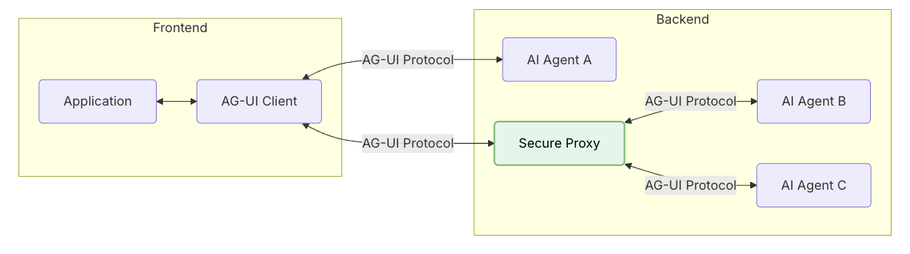
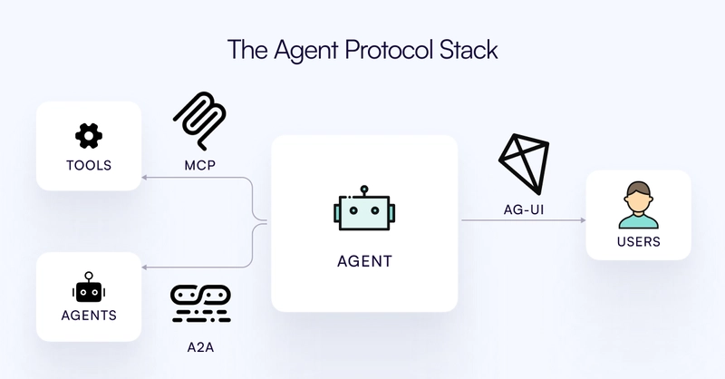

## 什么是 AG-UI

AG-UI（Agent User Interaction Protocol，智能体用户交互协议） 是一个开放的、轻量的、基于事件的协议，由 CopilotKit 公司发布，它通过标准 HTTP 或可选的二进制通道，以流式方式传输一系列 JSON 事件，主要用来对 AI agent 和前端应用程序的交互进行标准化。AG-UI 是由 CopilotKit 公司发布。

> CopilotKit 是一家成立于 2022 年的 AI 初创公司，聚焦在产品的 AI 助手打造上。官网的介绍是：**AI Copilots for your product. Build fast, customize effortlessly.** 官网地址为：https://www.copilotkit.ai/。

## AG-UI 主要解决什么问题

CopilotKit 公司的人员解释，当前大多数 agent 都属于后端自动化工具，执行一些数据迁移、表单填写、内容总结一类的任务，这些 agent 在后台运行，对用户不可见。但是交互式 agent（比如 Cursor、Windsurf、Devin 等）已经实现了与用户的实时协同工作，它们也将带来海量的应用场景。这种情况下，就需要这些 agent 能够具备**实时更新**、**工具编排**、**可共享的可变状态**、**安全边界控制**以及**前端同步**等能力。为此他们构建并发布了 AG-UI 协议。

## AG-UI 介绍



- **Application**：用户交互用到的应用程序（比如 chat 或其他任何 AI 应用）
- **AG-UI 客户端**：通用的通信客户端，诸如 `HttpAgent`，或用于连接现有协议的专用客户端
- **Agent**：后端用户处理用户请求并生成流式响应的 agent
- **Secure Proxy**：能够提供额外能力或作为安全代理的后端服务

### 核心组件

AG-UI 的核心组件包括**协议层（Protocol Layer）、标准化 HTTP 客户端（Standard HTTP Client）、消息类型（Message Type）、运行智能体（Running Agent）、状态管理（State Management）、工具交接（Tools and Handoff）以及事件（Events）**。

#### 协议层（Protocol Layer）

AG-UI 协议层主要为 agent 通信提供一个灵活的基础。协议的核心让应用程序能够运行 agent 并且接受到事件流。

#### 标准 HTTP 客户端

AG-UI 提供了一个标准的 HTTP 客户端 `HttpAgent`，可用于连接任何支持 POST 请求的端点。该端点接收 `RunAgentInput` 类型的请求体，并返回 `BaseEvent` 对象的数据流。 

`HttpAgent` 支持 **HTTP SSE (Server-Sent Events)** 和 **HTTP binary protocol** 两种模式。

#### 消息类型

AG-UI 为 agent 通信的不同方面定义了一些事件策略，主要包括：

- **Lifecycle events**：`RUN_STARTED`、`RUN_FINISHED`、`RUN_ERROR`、`STEP_STARTED`、`STEP_FINISHED`
- **Text message events**：`TEXT_MESSAGE_START`、`TEXT_MESSAGE_CONTENT`、`TEXT_MESSAGE_END`
- **Tool call events**：`TOOL_CALL_START`、`TOOL_CALL_ARGS`、`TOOL_CALL_END`
- **State management events**：`STATE_SNAPSHOT`、`STATE_DELTA`、`MESSAGES_SNAPSHOT`
- **Special events**：`RAW`、`CUSTOM`

#### 运行 Agent

创建 agent 客户端实例并启用 agent。

#### 状态管理

AG-UI 通过专用事件对状态进行管理，目前提供的事件有：

- **STATE_SNAPSHOT**：某一时刻的完整状态表示；
- **STATE_DELTA**：使用 JSON 补丁格式（RFC 6902）的增量状态变更；
- **MESSAGES_SNAPSHOT**：表示完整的对话历史；

#### 工具和交接

AG-UI 通过标准化事件来提供 agent 之间的任务移交的和工具的使用。

#### 事件

AG-UI 中的所有通信都是基于类型事件。每一个事件都继承自 `BaseEvent`，其借口如下：

```
interface BaseEvent {
  type: EventType
  timestamp?: number
  rawEvent?: any
}
```

## MCP vs A2A vs AG-UI

去年底 Anthropic 发布了 MCP（Model Context Protocol），今年 Google 又发布了 A2A（Agent to Agent），都是面向这一轮 AI 发展的协议。

相比于 MCP 和 A2A，AG-UI 主要聚焦在智能体和用户（agent-user）的交互层上。它和 MCP 于 A2A 并不是竞争关系。这三者在 AI 生态中的作用不同：

- AG-UI：主要处理由用户（人）参与的交互以及流式更新用户界面；
- A2A：主要促进智能体（agent-to-agent）之间的通信和协作；
- MCP：主要解决跨不同模型之间工具调用的标准化和上下文处理问题；

这三者互为补充。举个简单的例子：相同的 agent 可以通过 A2A 来跟其他的 agent 进行通信，同时又使用 AG-UI 来跟用户进行交互，另外还能通过 MCP 来进行工具的调用（tool call）。这三个协议，完成用户-Agent-LLM之间交互的标准化。

三个协议构成的 Agent 协议栈如下图所示：


