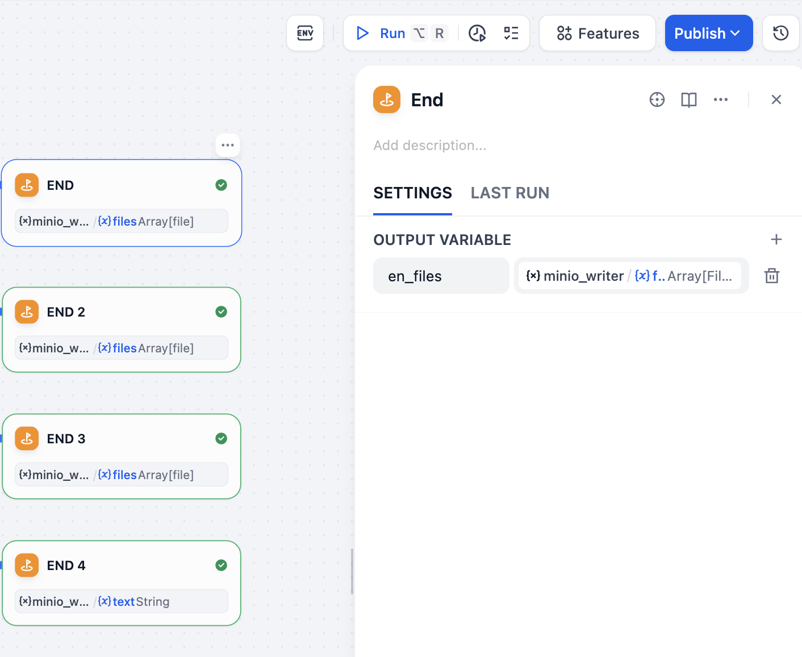

本文利用 Dify + RustFS + Milvus 搭建一个文档的多语言翻译 workflow，实现将**将中文文档同时翻译为英语、日语、俄语、韩语**（如果想要，可以随意加）。有了 AI，文档的撰写和多语种翻译从未想过今天这样高效。

## 关于 Dify

Dify 是一款开源的大语言模型（LLM）应用开发平台。它融合了后端即服务（Backend as Service）和 LLMOps 的理念，使开发者可以快速搭建生产级的生成式 AI 应用。即使你是非技术人员，也能参与到 AI 应用的定义和数据运营过程中。目前 Dify 在 GitHub 上的 Star 已经超过 **116k**。

## 关于 RustFS 和 Milvus

关于 RustFS 和 Milvus 可以查阅过往的博客文章：

- [Milvus + RustFS + Vibe Coding，快速 DIY 一个 Chatbot](../milvus/index.md)
- [新一代对象存储 RustFS 的 MCP 扩展实践](../rustfs-mcp/index.md)

## 安装 Dify

Dify 官方提供了 [`docker-compose.yaml`](https://github.com/langgenius/dify/blob/main/docker/docker-compose.yaml)来通过 Docker Compose 的方式私有化部署一个 Dify 实例。官方也提供了这种安装模式下各组件的架构示意图：


由架构图中看到，Dify 会将向量数据存储向量数据库，而且官方支持多款向量数据库，诸如 `weaviate`、`qdrant`、`opensearch`、`miluvs` 等。需要通过 `VECTOR_STORE` 来指定使用的向量数据库。本次实践使用 `milvus`，需要对 `docker-compose.yaml` 文件做一些变更。

### Milvus 配置修改

修改的配置如下：

* *指定使用 milvus 向量数据库

```
VECTOR_STORE: ${VECTOR_STORE:-milvus}
```

* *镜像更换

，将当前官方默认的 2.5.15 替换为 2.6.0 或 2.6.2

```
image: milvusdb/milvus:v2.6.0
```

> 使用默认的 `2.5.15` 镜像出现了 IndexNode 19530 端口被占用的问题，更换镜像后问题消失。

* 修改 milvus 地址

```
MILVUS_URI: ${MILVUS_URI:-http://milvus-standalone:19530}
```

### Minio 配置修改

在上一篇文章[Milvus + RustFS + Vibe Coding，快速 DIY 一个 Chatbot](../milvus/index.md)中写到了，milvus 支持将 minio 配置为对象存储后端，由于 RustFS 作为 minio 的完全平替，因此可以将 RustFS 配置为 milvus 的对象存储后端，在 `docker-compose.yaml` 文件中添加如下内容：

```
  rustfs:
    container_name: dify-rustfs
    image: rustfs/rustfs:1.0.0-alpha.60
    environment:
      - RUSTFS_VOLUMES=/data/rustfs0,/data/rustfs1,/data/rustfs2,/data/rustfs3
      - RUSTFS_ADDRESS=0.0.0.0:9000
      - RUSTFS_CONSOLE_ADDRESS=0.0.0.0:9001
      - RUSTFS_CONSOLE_ENABLE=true
      - RUSTFS_EXTERNAL_ADDRESS=:9000
      - RUSTFS_CORS_ALLOWED_ORIGINS=*
      - RUSTFS_CONSOLE_CORS_ALLOWED_ORIGINS=*
      - RUSTFS_ACCESS_KEY=rustfsadmin
      - RUSTFS_SECRET_KEY=rustfsadmin
    ports:
      - "9000:9000" # S3 API port
      - "9001:9001" # Console port
    volumes:
      - rustfs_data_0:/data/rustfs0
      - rustfs_data_1:/data/rustfs1
      - rustfs_data_2:/data/rustfs2
      - rustfs_data_3:/data/rustfs3
      - logs_data:/app/logs
    restart: unless-stopped
    healthcheck:
      test:
        [
          "CMD",
          "sh", "-c",
          "apk add curl && curl -f http://localhost:9001/health"
        ]
      interval: 30s
      timeout: 10s
      retries: 3
      start_period: 40s
    networks:
      - milvus
```

注释掉与 minio 相关的内容：

```
  minio:
    container_name: milvus-minio
    image: minio/minio:RELEASE.2023-03-20T20-16-18Z
    profiles:
      - milvus
    environment:
      MINIO_ACCESS_KEY: ${MINIO_ACCESS_KEY:-minioadmin}
      MINIO_SECRET_KEY: ${MINIO_SECRET_KEY:-minioadmin}
    volumes:
      - ./volumes/milvus/minio:/minio_data
    command: minio server /minio_data --console-address ":9001"
    healthcheck:
      test: ["CMD", "curl", "-f", "http://localhost:9000/minio/health/live"]
      interval: 30s
      timeout: 20s
      retries: 3
    networks:
      - milvus
```

更新以下环境变量信息：

```
  MINIO_ACCESS_KEY: ${RUSTFS_ACCESS_KEY:-rustfsadmin}
  MINIO_SECRET_KEY: ${RUSTFS_SECRET_KEY:-rustfsadmin}
```

同时需要告诉 Dify 使用 S3 存储而不是本地存储：

```
STORAGE_TYPE: ${STORAGE_TYPE:-s3}
```

将 S3 相关的环境变量信息更改为 RustFS 实例的具体信息：

```
  S3_ENDPOINT: ${S3_ENDPOINT:-http://rustfs:9000}
  S3_REGION: ${S3_REGION:-cn-east-1}
  S3_BUCKET_NAME: ${S3_BUCKET_NAME:-difyai}
  S3_ACCESS_KEY: ${S3_ACCESS_KEY:-rustfsadmin}
  S3_SECRET_KEY: ${S3_SECRET_KEY:-rustfsadmin}
  S3_USE_AWS_MANAGED_IAM: ${S3_USE_AWS_MANAGED_IAM:-false}
```

需要修改的信息已经整理完毕，下面开始正式安装部署。

### 安装 Dify

将 [Dify](https://github.com/langgenius/dify)代码克隆到本地，按照前面步骤中的变更修改 `docker-compose.yaml` 文件，然后执行如下命令进行安装：

```
docker compose -f docker-compose.yaml up -d
```

查看安装结果：

```
docker compose ps
NAME                     IMAGE                                       COMMAND                  SERVICE             CREATED      STATUS                            PORTS
dify-rustfs              rustfs/rustfs:1.0.0-alpha.58                "/entrypoint.sh rust…"   rustfs              3 days ago   Up 3 days (healthy)               0.0.0.0:9000-9001->9000-9001/tcp, [::]:9000-9001->9000-9001/tcp
docker-api-1             langgenius/dify-api:1.9.0                   "/bin/bash /entrypoi…"   api                 3 days ago   Up 3 days                         0.0.0.0:5001->5001/tcp, [::]:5001->5001/tcp
docker-db-1              postgres:15-alpine                          "docker-entrypoint.s…"   db                  3 days ago   Up 3 days (healthy)               5432/tcp
docker-nginx-1           nginx:latest                                "sh -c 'cp /docker-e…"   nginx               3 days ago   Up 3 days                         0.0.0.0:80->80/tcp, [::]:80->80/tcp, 0.0.0.0:443->443/tcp, [::]:443->443/tcp
docker-plugin_daemon-1   langgenius/dify-plugin-daemon:0.3.0-local   "/bin/bash -c /app/e…"   plugin_daemon       3 days ago   Up 3 days                         0.0.0.0:5003->5003/tcp, [::]:5003->5003/tcp
docker-redis-1           redis:6-alpine                              "docker-entrypoint.s…"   redis               3 days ago   Up 3 days (healthy)               6379/tcp
docker-sandbox-1         langgenius/dify-sandbox:0.2.12              "/main"                  sandbox             3 days ago   Up 3 days (healthy)               
docker-ssrf_proxy-1      ubuntu/squid:latest                         "sh -c 'cp /docker-e…"   ssrf_proxy          3 days ago   Up 3 days                         3128/tcp
docker-web-1             langgenius/dify-web:1.9.0                   "/bin/sh ./entrypoin…"   web                 3 days ago   Up 3 days                         3000/tcp
docker-worker-1          langgenius/dify-api:1.9.0                   "/bin/bash /entrypoi…"   worker              3 days ago   Up 3 days                         5001/tcp
docker-worker_beat-1     langgenius/dify-api:1.9.0                   "/bin/bash /entrypoi…"   worker_beat         3 days ago   Up 3 days                         5001/tcp
milvus-etcd              quay.io/coreos/etcd:v3.5.5                  "etcd -advertise-cli…"   etcd                3 days ago   Up 3 days (healthy)               2379-2380/tcp
milvus-standalone        milvusdb/milvus:v2.6.0                      "/tini -- milvus run…"   milvus-standalone   3 days ago   Up 4 seconds (health: starting)   0.0.0.0:9091->9091/tcp, [::]:9091->9091/tcp, 0.0.0.0:19530->19530/tcp, [::]:19530->19530/tcp
```

所有服务运行正常后，dify web 页面可通过 `localhost/install` 访问（如果是在云端服务器安装，可将 `localhost` 替换为服务器 IP）。

初始化登录需要设置邮箱地址和密码，设置完毕登录，可看到 Dify web 页面：


> 图中的 docs-trans 不是默认的，是我自己创建的 workflow。

接下来利用 Dify 构建一个 workflow：**将 RustFS 与 milvus 集成的中文文档（一个 Markdown 文件）翻译成英语、日语、俄语以及韩语**。

## 构建 Dify workflow

整体流程如下：


### 上传文件

Dify workflow 中支持对文件进行上传，而且支持多种文件格式，包括 `TXT`、`PDF`、`MARKDOWN`、`DOCS` 等。

在 Dify Start 节点的 `SETTINGS --> INPUT FIELD` 中选择文件类型，并选择文件上传方式：


本次实践使用 [RustFS 和 Milvus 集成的文档](https://docs.rustfs.com/zh/integration/milvus.html)，是一个 Markdown 文件，因此文件类型选择 **Document**；上传方式选择 **Local Upload**。

### 读取文件内容

由于 LLM 没法直接读取文件内容，所以 Dify 提供了 [**文档提取器**](https://docs.dify.ai/zh-hans/guides/workflow/node/doc-extractor)来读取 Start 节点中上传的内容，然后将其喂给 LLM 进行翻译。

在 Start 节点后添加一个 **DOC EXTRACTOR** 节点，输入为 Start 节点上传的 Markdown 文件，输出为提取的文本内容（这时候会生成一个 text 变量，后续可引用），这些内容作为下一步，也就是 LLM 的输入，所以在 **DOC EXTRACTOR** 节点的 **NEXT STEP** 中都是 LLM。


### 用 LLM 翻译文档

Dify 的 LLM 节点可以调用大模型的能力来对上一个节点的输出内容进行操作。而且主流的大模型都支持，可以在 **Web 页面 --> Plugins** 中搜索可用的大模型，比如此次使用的 DeepSeek：


选择之后点击 **Install** 即可。

安装完毕后，要在模型提供商（Model Provider）中配置 API Key，后续才可在 Workflow 中调用：


然后添加 LLM 节点：


还需要做好以下配置：

- 在 **MODEL** 下拉菜单中选择想要使用（提前安装且配置了 API Key 的模型才会出现在该列表中），比如此次选择了 `DeepSeek`；
- 设置好提示词，也就是告诉大模型要做什么事情；比如本次使用的提示词为：

  ```
  假设你是一位 RustFS 专家，将下面的内容翻译成英文/日语/俄语/韩语，同样按照 Markdown 格式输出，内容如下：
  ```

  > 切记，要在系统提示词中选择上 **DOCS EXTRACTOR** 节点的输出（是一个 text 变量，输入 `/` 可直接选择）。

为每一个 **DOC EXTRACTOR** 都选择了一个 LLM，使用了类似的提示词（唯一的差别就是翻译的语种）。整体配置如下：


接下来将 LLM 的输出直接上传到 RustFS。

> Dify 内置一个 API 服务，可以将上一步的文件作为输出进行预览和下载。这需要调整一下 `docker-compose.yaml` 文件，为了方便，直接使用现成的 RustFS 实例作为文档的最终输出载体，而且还能体验一下 Dify 的工具功能。

### 将文档上传至 RustFS

Dify 工具节点可以选择不同的工具来对上一个节点的内容进行处理，目前官方支持的工具有三种：

- **内置工具**：Dify 第一方提供的工具；
- **自定义工具**：用户自己导入或配置的工具；
- **工作流**：将编排好的工作流发布为工具来使用）。

本次实践使用 Dify 提供的内置工具 —— minio 来存储翻译之后的内容。

工具在使用之前需要先安装，在 Dify Web 首页的 **Tools** 中搜索可用的工具：


> 由于已经安装好了 minio，所以 minio 展现在了最上面，如果未安装，在下面的搜索结果中，点击蓝色的 **install** 按钮即可完成安装。

在节点添加中点击 **Tool** 来选择已经安装好的工具 —— minio：


由于是上传文件，所以选择 MINIO_WRITER，然后输入 RustFS 实例相关信息：


主要信息：

- **MinIO Endpoint URL**：RustFS 实例地址（比如是 `localhost:9000`）；
- **MinIO Access Key**：RustFS Access Key ID（比如默认的 `rustfsadmin`）；
- **MinIO Secret Key**：RustFS Secret Key ID（比如默认的 `rustfsadmin`）；
- **Bucket Name**：存储文件的存储桶名称，须提前在 RustFS 上创建。
- **Object Name**：文件上传到存储中之后的对象名称，自定义即可；
- **Content**：工具节点的输入，也就是 LLM 节点的输出，选择 `text` 即可；

由于本次实践是将中文文档翻译为 4 种不同语言，所以添加了 4 个 MINIO_WRITER 节点：


### 结束

Dify 每个工作流的尾部都要加一个结束节点，正常添加即可。



## 运行 workflow

点击右上角的 **Run** 按钮即可开始 workflow 的运行，点击之后在出现的界面中上传需要翻译的中文文档（Markdown 格式），然后点击 **Start Run**：


可以在界面上清晰的看到 workflow 的进度：


流程全部执行完毕后，可以在所有节点的右上角上看到绿色的通过标志。


## 结果验证

本次是将上传的 Markdown 文档（文件名称为 `milvus.md`）翻译成英语、日语、俄语、韩语，然后分别上传到 RustFS 实例的四个存储桶中：en-translation、jp-translation、ru-translation、kr-translation，每个存储桶中对应有一个对象，分别是：en-milvus.md、jp-milvus.md、ru-milvus.md、kr-milvus.md：


存储桶中的存储对象：


可以直接选择某一个对象文件，点击啊 **Preview** 进行内容查看，比如查看韩语文档：


内容如下：


可以用类似的方法查看其他语言的文档内容，如果审核无误，可以直接下载，然后进行文档提交。

## 结束语

Dify 提供了一种灵活的方式让用户自行构建 AI 应用，整个过程可能就是拖拉拽 + 简单的编程，相比于全程使用 API 来将各种服务或者工具串联起来的纯编程模式，Dify 确实体验更好，不过要想熟练使用 Dify，也需要解决两个问题：

- 深度了解 Dify，包括架构和各个功能的使用，这个阅读文档 + 多动手实践就可以；
- 用户需要清楚的知道自己想要的 AI 应用或者 workflow 是怎样的，换言之，用户需要知道如何将 AI 能力引入到自己的实际需求中，这种情况下 Dify 才能发挥最大作用；


另外，minio 作为全球知名的对象存储系统，确实使用广泛，但是完全可以用 RustFS 来对 minio 进行平替。

Dify workflow 一旦上手，就会想 DIY 各种有趣工作流来优化自己的工作方式。后续还会继续探索 Dify 和其他应用的集成实践。感兴趣的可以关注这个号！
