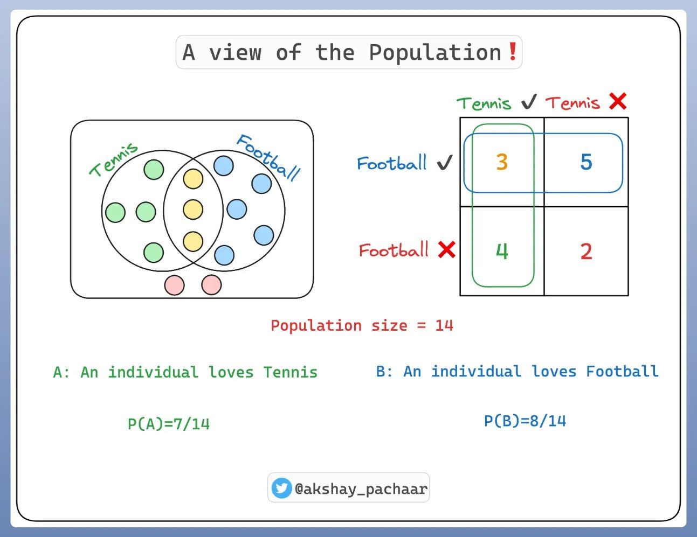
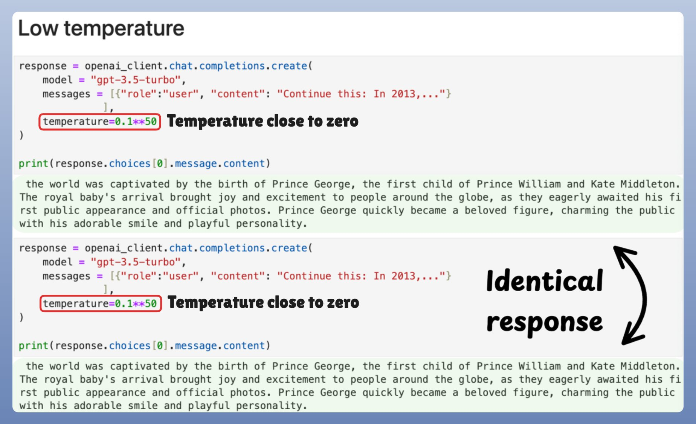

最近在 x 上看到 Akshay 分享的一组图解 LLM 工作原理的帖子，感觉内容通俗易懂，就搬运过来汉化一下，方便大家一起学习！

Akshay 是一位 AI/ML 工程师，他在 x 上的介绍如下图所示：

## LLM 工作原理解释

### 条件概率解释

他提到，在介绍 LLM 之前，需要先了解一下**条件概率**（conditional probability），应该是与高中、大学学的概率学相关。有一个很形象的例子：

有 14 个人，他们中的一部分人（7 个）喜欢网球、一部分人（8个）喜欢足球、少部分人（3 个）同时喜欢网球和足球、也有极少一部分人（2 个）都不喜欢网球和足球。用图表示如下：

所以如果要表示喜欢网球的人数概率，表示方法为 P(A)，结果是 7/14；喜欢足球的人数概率，表示方法为 P(B)，结果为 8/14；同时喜欢网球和足球的人数概率，表示方法为 P(A∩B)，结果是 3/14；同时表示既不喜欢网球又不喜欢足球的人数概率，表示方法为 P(AUB)，结果为 2/14。

那什么条件概率呢？

其实就是在另外一件事情发生的前提下，某件事情发生的概率。比如上面的事件 A 和事件 B，如果要表示在事件 B 发生的前提下，事件 A 发生的概率，那么表示方法是P(A∣B)。

所以，如果要计算一个人在喜欢足球的情况下，还喜欢网球的概率，计算方法为 P(A|B)=P(A∩B)/P(B)=(3/14)/(8/14)=3/8。

再拿阴天和下雨天为例来将条件概率：如果将今天下雨当作事件 A，阴天可能下雨作为事件 B（尝试来讲，阴天会有下雨的可能），而且事件 B 会影响下雨的预测。所以，阴天的时候就可能会下雨，这个时候就可以说条件概率 P(A|B) 是非常高的。

### LLM 预测解释

回到 LLM 上来说，这些模式的任务就是预测下一个出现的单词。这就和前面讲的条件概率类似：**如果给定已经出现过的单词，那下一个最可能出现的单词是哪一个？**

所以，要预测下一个单词，**模型就要根据之前给定的单词（上下文）来为每一个接下来可能出现的单词进行条件概率的计算，条件概率最高的单词就会被作为预测单词所选中**。

而 LLM 学习的是一个高维度的单词序列概率分布。这个分布的参数就是经过训练的权重。但是这种概率毕竟是一种预测，并不是实际的结果，所以这个过程中就有一个 **损失计算(Loss calculation)** 的概念。

> 以下内容来自 ChatGPT。

Loss calculation（损失计算） 是指模型在预测过程中产生的误差的度量，通常用来衡量模型预测的结果与实际目标之间的差异。通过最小化损失函数，模型能够不断优化其参数，以提高对新数据的预测能力。

上图中提到的 Cross-entropy loss 和 Negative log-likehood 是两种损失函数。

* Cross-entropy loss

Cross-entropy loss 指交叉墒损失，用来度量模型预测的概率分布与真实标签（即实际单词）间的差异。

**交叉墒** 用于计算两个概率分布之间的差异。在语言模型中，一个概率分布是模型对每个可能的下一个单词的预测概率，另一个是实际的单词标签的“真实分布”（通常是一个one-hot分布，即正确单词的概率为1，其他为0）。交叉熵损失的计算公式如下：

* Negative Log-Likelihood

Negative Log-Likelihood，负对数似然，简称 NLL。是机器学习中常用的一个损失函数，尤其在 概率模型 和 分类问题 中广泛应用。

> 以上内容来自 ChatGPT。

这种概率预测并选择最有可能的单词会带来一个问题**如果总是选择可能性最大的单词，那么结果就是重复性的，这就让 LLM 显得缺乏创造性**。

所以，这里面就有一个 **temperature（温度）**的概念产生。

## temperature（温度）

LLM 中，temperature（温度）是一个调整模型输出概率分布的超参数，通常用于文本生成和采样。它影响生成文本时的**多样性**和**创造性**，以及模型在选择下一个单词时的随机性。

因为在 LLM 中，大模型通常会生成一个概率分布，表示下一词在给定上下文下出现的可能性。例如，模型可能会为每个可能的下一个单词生成一个概率，就像前面图中所画的：

上下文是“The boy went to the“，下一个单词可能是“Cafe、Hospital、Playground、Park、School“，这几个单独对应的概率是“0.1、0.05、0.4、0.15、0.3“。

temperature 控制如何从概率分布进行采样：

* Low temperature（低温度，比如 0.1 ~ 0.5）：模型的输出会更加具有确定性，也就是更倾向于选择概率较高的单词，此时生成的文本更连贯、理性，内容更“保守”，但是也可能缺乏多样性和创意。

* High temperature（高温度，比如 0.8 ~ 1.0）：模型的输出会更加随机，也就使得低概率的单词有更大的机会被选中。这会增加生成文本的多样性和创造性，但是也可能导致输出不那么流畅或不太符合上下文。

temperature 是通过使用 softmax 函数来调整每个词的 logits（即原始的未经过归一化的分数）进行的。

> softmax 函数是一个激活函数，用来讲向量中的每个值转换成一个概率分布。其输出的每个值都会被转换成一个介于 0 和 1 之间的概率，并且所有输出的概率之和等于 1。

随后，作者给了两个不同 temperature 时候的示例来说明差别，第一张图是 low temperature 的，第二张图是 high temperature 的。

所以 LLM 并不是选择最佳（概率最大）的 token，而是对预测进行采样。所以，概率最高的 token 也有可能不会被选中。

所以，在 softmax 函数中，温度引入了一些调整，反过来这种调整又影响了采样过程。

最后作者给了一个很直观的代码示例来对 temperature 对采样的影响：

