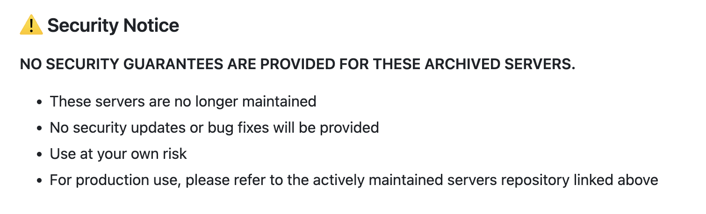
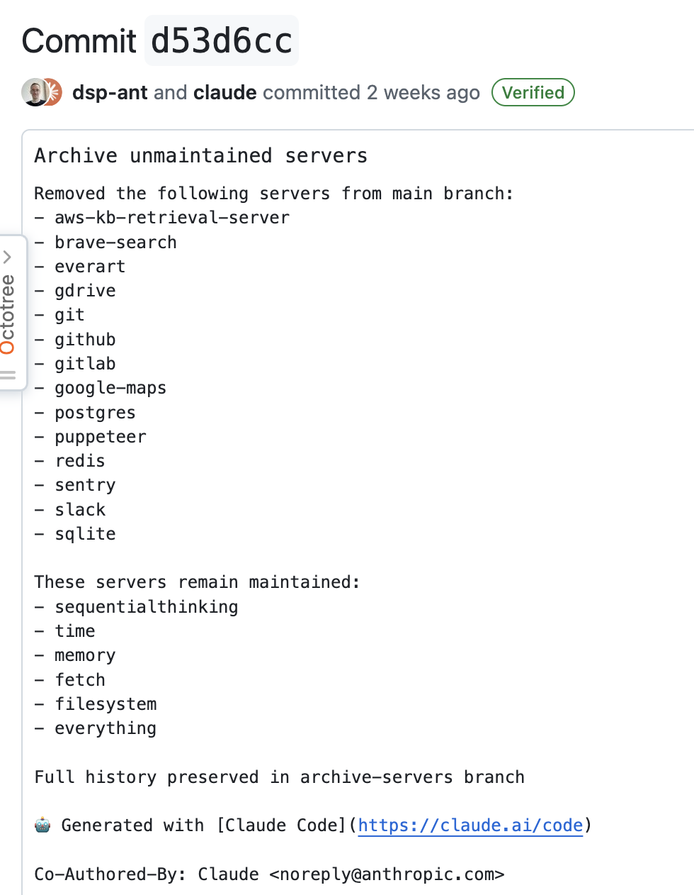
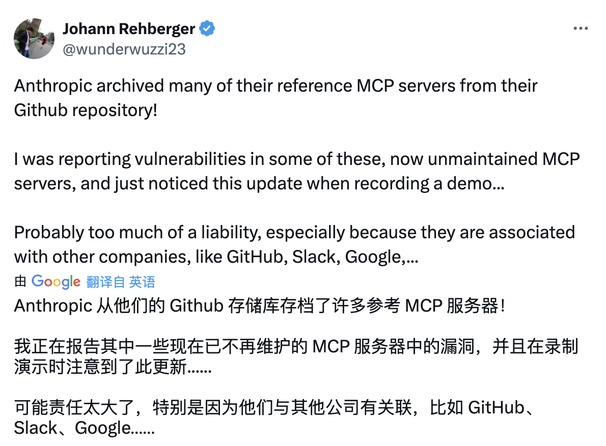
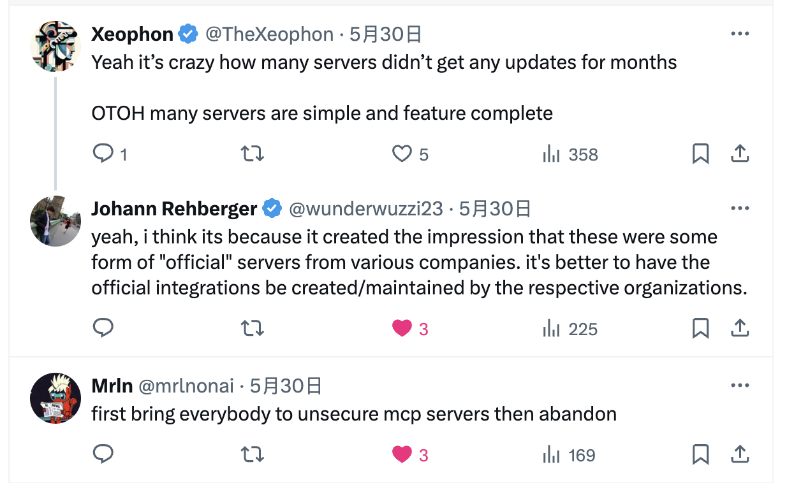

之前研究 MCP 的时候，发现了 Anthropic 官方 GitHub repo 中有一些 [MCP Server]((https://github.com/modelcontextprotocol/servers))，还自行对 GitLab、Git 进行了扩展（Git 扩展代码还提了 PR）。今天再次查看这个 repo 时候，发现很多 MCP Server 不见了。刚开始以为是找错仓库了，后来再次确认，发现**这些 MCP Server 被归档了**，归档的仓库包括 GitHub、GitLab、Google、Slack 等十多个。

在官方仓库中也没有写明具体原因，只是在 README 中写了一些归档的 MCP Server，这些 Server 被单独放在了一个 [repo](https://github.com/modelcontextprotocol/servers-archived) 中，里面关于归档，写了这么一段话：

> This repository contains historical reference implementations for the Model Context Protocol (MCP). These servers were created to demonstrate MCP features and SDK capabilities but are now archived.

意思大概是**这个仓库包含了一些 MCP 的历史参考实现。这些 MCP 当初的目的是为了演示 MCP 功能及SDK能力，现已被归档**。看样子，大白话就是 **当初为了证明 MCP 有用，就搞了这么多 Demo，让你们相信 MCP 是真牛逼，现在你们都上道了，那我就撤了，有一种师父领进门，修行在个人的感觉**。

另外，就是告诉大家**现在这些 Server 的安全性我们已经不负责了，不建议大家使用了**。

关于归档的提交也看了一下，没有特别的地方：

## 网友的态度

目前在网上没有太多关于这个事件的讨论。在 X 上有一个名叫 Johann Rehberger 的网友发布了一个关于归档的帖子：

有一种新能源汽车直播在直播过程中突然听到公司倒闭了的即视感。

下面网友的回复更有意思：

尤其最后一个，简直是神来之笔 **Anthropic 把大家带给了大家不安全的 MCP Server，然后自己跑了**。

## MCP Server 需要解决这几个问题

过去几个月一直在看 MCP 相关的内容，上面提到的 Repo 也浏览过很多次，自己做过一些扩展，发现当前 MCP Server 有以下几个问题：

* **维护性差**：由于 MCP Server 构建 & 扩展相对容易，如果对产品熟悉，就可以创建一个 MCP Server，并扩展其中的 Tool，要是没有很好的规划，Tool 会多到数不过来。这个问题在 Anthropic MCP Server 中已经可见一斑了，归档之前，有超 400 个 PR 在等待合入，绝大多数 PR 都与 Tool 的扩展有关，但是很多 PR 都没人处理、没人审核。导致那些 MCP Server 功能没有得到扩展，侧面印证了维护的缺失。
* **安全性低**：这些 MCP Server 对应的产品都是世界级的，全球有数以千万计的用户，如果这些 MCP Server 包含安全问题，那后果会是很严重。有很多分析 MCP 安全风险的文章，比如将敏感信息打印出来，甚至发送到其他地方，而且这些可以在用户无感的情况下发生。
* **碎片化**：由于 MCP Server 的一些 SDK 已经很成熟了，所以构建一个 MCP Server 不是很难的事情，就导致同一个 MCP Server 可能会有很多种实现。比如说针对 Kubernetes，就有 mcp-server-kubernetes、kubectl-mcp-server、kubernetes-mcp-server 等多个实现。这时候，用户就很难选择。换言之，没有一个 **MCP 单一可信源** 让用户快速找到自己想要的 MCP Server 并放心使用。

所以，如果 MCP 真要成为 AI 时代的 HTTP，Type-C，可能需要：

* **官方投入**：这次归档的很多 MCP Server 并不是产品方（比如 GitHub、GitLab、Slack 等）自己编写发布的。如果要打造一个企业级成熟稳定的 MCP Server，没有谁比这些产品 Owner 更合适来构建并维护 MCP Server 了。
* **MCP Hub 的打造**：现在针对 MCP Server 并没有一个“集中集散地”（比如 Dockerhub），就导致用户无法查找安全可用的 MCP Server。如果有一个 MCP Hub，MCP Server 维护者就可以将其发布到 Hub 上，用户在 Hub 上来搜，能很好的解决可发现行、复用性以及对于安全性也有一定的提升。

这次归档，不知是可以促使众多官方 MCP Server 的发布，让 MCP 的发展再向前迈一步，还是说就像中台一样，大家玩的热火朝天的时候，始作俑者突然开始拆台了。

