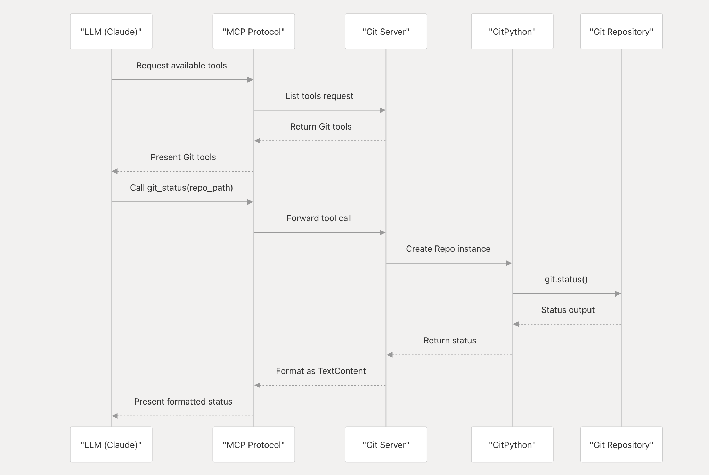
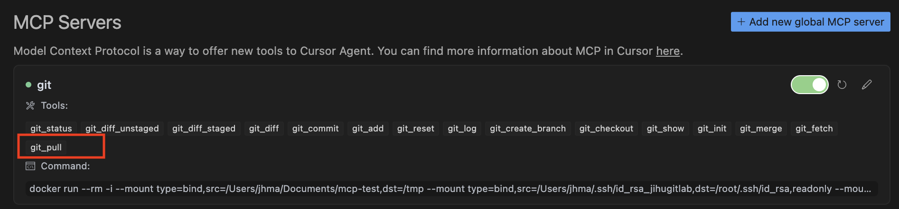
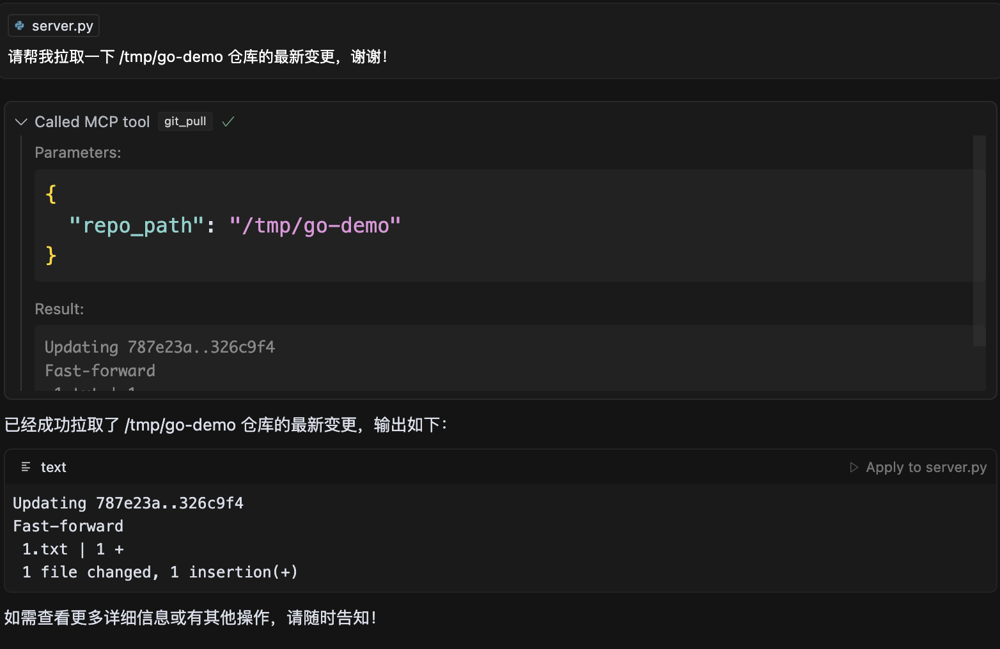

在之前的文章[GitLab MCP Server tools 功能扩展实战](https://majinghe.github.io/aigc/mcp-gitlab/)中提到了，Anthropic 在发布 MCP 的时候发布了一些开箱即用的 MCP Server，而 mcp-server-git 就是其中一个，目前支持的 Tools 有：

- `git_status`：显示工作树的状态。输入为仓库的路径；
- `git_diff_unstaged`：查看工作区中尚未被提交到暂存区的文件变更。输入为仓库路径；
- `git_diff_staged`：查看已经提交到暂存区的文件变更。输入为仓库路径；
- `git_diff`：显示分支或提交间的不同。输入为仓库的路径或要对比的目标分支或提交；
- `git_commit`：提交变更到仓库。输入为仓库路径和提交信息；
- `git_add`：添加变更文件到暂存区。输入为仓库路径和变更文件；
- `git_reset`：恢复变更。输入为仓库路径；
- `git_log`：查看提交历史。输入为仓库路径，展示的最大提交数（默认是 `10`）；
- `git_create_branch`：创建新分支。输入为仓库路径，分支名称，新分支的基分支；
- `git_checkout`：切换分支。输入为仓库路径和分支名称；
- `git_show`：查看提交的详细内容。输入为仓库路径和 revision；
- `git_init`：初始化一个仓库。输入为仓库路径；

## 实践指南

mcp-server-git 可以通过 `uv`、`pip` 来安装使用。当然最方面的肯定是在 AI 应用中配置使用，比如 Claude、VS Code、Cursor 等。本文直接采用在 Cursor 中配置 MCP，并使用 docker 的方式。

### 安装配置

首先需要配置，过程和使用[GitLab MCP Server](../mcp-gitlab/index.md)的配置是一样的。在 Cursor 中选择**Perference（偏好设置） --> Cursor Settings --> MCP**：


点击右上角的**Add new global MCP server**，在出现的界面中输入如下内容：

```
{
"mcpServers": {
  "git": {
    "command": "docker",
    "args": ["run", "--rm", "-i", "--mount", "type=bind,src=/YOUR-HOST-PATH-TO-HOST-DEMO-REPO,dst=/tmp", "mcp/git"]
  }
}
}
```

需要注意的是，docker 的使用用到了卷的挂载，把本地需要操作的仓库挂到到容器里面，MCP 是在容器中执行相关的 git 命令。

添加完毕，Git MCP Server 就会启动成功，显示绿色：


如果要是在宿主机上看，还有对应的容器在运行：

```
docker ps
CONTAINER ID   IMAGE                  COMMAND                   CREATED        STATUS        PORTS                       NAMES
fe13055d2a99   mcp/git                "mcp-server-git"          12 hours ago   Up 12 hours                               fervent_poitras
```

感兴趣可以直接用 `docker logs -f` 查看运行日志。

### 实践演示

#### `git status` 演示

由于大部分 tool 功能都是基于既有的仓库进行（`git_init` 除外），所以可以先在挂载的宿主机目录下 clone 好一个仓库。然后在 Cursor 上打开 Chat 窗口。输入如下提示词来演示 `git status`：

```
请帮我获取一下 /tmp/go-demo 下面的文件变更状态，谢谢！
```

接着会看到 Cursor 直接调用了 `git_status` tool，并且会询问你是否运行：


点击运行之后，就会显示工作区文件变更的详情（和直接执行 `git status` 是一样的），最后 Cursor 会做一个总结，告知哪个文件进行了变更：


#### `git add & commit` 演示

接下来对变更文件进行提交，继续使用如下提示词：

```
请帮我把所有的变更文件进行提交，提交信息为 change port，谢谢！
```

可以看到 Cursor 调用了 `git_add` 和 `git_commit` 两个 tool，每一个 tool 都需要 approve 才进行，而且在 commit 时候使用的 commit message 就是提示词中给予的：


#### `git log` 演示

接着测试一下 `git_log` 查看对应的提交历史。使用如下提示词：

```
我想看一下最近3 次的提交历史，谢谢！
```

响应如下：


#### `git show` 演示

接着查看一下最近一下提交的内容详情。使用如下提示词：

```
请帮我查看一下最近一次提交的文件变更详情，谢谢！
```

可以看到 Cursor 调用了 `git_show` tool。


Tool 的参数为

```
{
  "repo_path": "/tmp/go-demo",
  "revision": "07efa13c73862001610bba9c22260e4f7477068a"
}
```

其中 `revision` 也就是最近一次提交的 commit ID。返回的结果就是变更详情：

```
Commit: 07efa13c73862001610bba9c22260e4f7477068a
Author: root
Date: 2025-05-18 02:58:40+00:00
Message: change port

--- main.go
+++ main.go
@@ -12,5 +12,5 @@ func handler(w http.ResponseWriter, r *http.Request) {
 
 func main() {
     http.HandleFunc("/opensource", handler)
-    log.Fatal(http.ListenAndServe(":9999", nil))
+    log.Fatal(http.ListenAndServe(":9900", nil))
 }
```

## 源码解读 & 扩展实践

Git MCP Server 的源代码放在 https://github.com/modelcontextprotocol/servers/tree/main/src/git 目录下，使用 Python 编写。目录结构如下：

```
.
├── Dockerfile
├── LICENSE
├── README.md
├── pyproject.toml
├── src
│   └── mcp_server_git
│       ├── __init__.py
│       ├── __main__.py
│       └── server.py
├── tests
│   └── test_server.py
└── uv.lock
```

关于 MCP Server 的主要实现都在 `server.py` 文件中。借用 DeepWiki 可以清晰的看出整个实践思路：



可以看出，所有的操作最终都是依靠执行 `git` 命令实现，而这借助了 Python 的一个 Git 模块 GitPython。

首先，定义了一个 MCP Server，源代码如下：

```
async def serve(repository: Path | None) -> None:
    logger = logging.getLogger(__name__)

    if repository is not None:
        try:
            git.Repo(repository)
            logger.info(f"Using repository at {repository}")
        except git.InvalidGitRepositoryError:
            logger.error(f"{repository} is not a valid Git repository")
            return

    server = Server("mcp-git")
```

然后定义了 Tool list，里面就包含当前支持的 `git_status`、`git_log` 等：

```
    @server.list_tools()
    async def list_tools() -> list[Tool]:
        return [
            Tool(
                name=GitTools.STATUS,
                description="Shows the working tree status",
                inputSchema=GitStatus.schema(),
            ),
```

要想扩展一个，在此部分中增加对应的 Tool 即可。比如新增一个 `git_pull` 的 Tool，新增如下内容即可：

```
Tool(
    name=GitTools.PULL,
    description="Pull the update from the repository",
    inputSchema=GitPull.schema(),
)
```

其中 GitTools 是一个类，里面用枚举的方式定义了 Tool 的名称：

```
class GitTools(str, Enum):
    STATUS = "git_status"
    DIFF_UNSTAGED = "git_diff_unstaged"
    DIFF_STAGED = "git_diff_staged"
    ......
```

新增一个 Tool，也需要添加对应的枚举信息，比如针对 `git_tool`，新增如下内容：

```
PULL = "git_pull"
```

而 Tool 最终的功能实现，是直接调用 GitPython 仓库，比如对于 `git pull`，新增如下内容：

```
def git_pull(repo: git.Repo) -> str:
    return repo.git.pull()
```

`git.pull` 就是调用 GitPython 库，里面有原生的 pull 函数。

最后就是 Tool 的调用。定义如下：

```
@server.call_tool()
    async def call_tool(name: str, arguments: dict) -> list[TextContent]:
        repo_path = Path(arguments["repo_path"])
        
        # Handle git init separately since it doesn't require an existing repo
        if name == GitTools.INIT:
            result = git_init(str(repo_path))
            return [TextContent(
                type="text",
                text=result
            )]
            
        # For all other commands, we need an existing repo
        repo = git.Repo(repo_path)

        match name:
            case GitTools.STATUS:
                status = git_status(repo)
                return [TextContent(
                    type="text",
                    text=f"Repository status:\n{status}"
                )]

            ......
```

新增 `git_pull` 的内容：

```
case GitTools.PULL:
    result = git_pull(repo)
    return [TextContent(
        type="text",
        text=result
    )]
```

当调用到此 Tool 时候，就会执行 `git_pull(repo)` 函数（背后就是调用 GitPython 库，执行对应的 git 命令，然后返回结果），然后返回结果。

## 测试验证

将变更代码打包成一个容器镜像：

```
docker build -t dllhb/mcp-git:0.0.3
```

然后在 Cursor 中修改 `mcp.json` 文件中的镜像即可：

```
{
"mcpServers": {
  "git": {
    "command": "docker",
    "args": [
      "run", 
      "--rm", 
      "-i", 
      "--mount", "type=bind,src=/Users/jhma/Documents/mcp-test,dst=/tmp", 
      "--mount", "type=bind,src=/Users/jhma/.ssh/id_rsa_jihugitlab,dst=/root/.ssh/id_rsa,readonly", 
      "--mount", "type=bind,src=/Users/jhma/.ssh/known_hosts,dst=/root/.ssh/known_hosts", 
      "dllhb/mcp-git:0.0.3"]
  }
}
}
```

> 注意：由于 git pull 命令需要进行 ssh key 的验证，所以为了方便测试，将宿主机的 ssh key 挂载到了容器中。

MCP Server 加载成功后，会看到多一个 `git_pull` 的 Tool：



在 Cursor 的聊天窗口中输入如下提示词：

```
请帮我拉取一下 /tmp/go-demo 仓库的最新变更，谢谢！
```

然后就会看到 Cursor 调用了 `git_pull` 并返回了拉取变更的结果：



从结果看验证成功。

## 写在最后

目前 Git MCP Server 支持的 Tool 还很有限，理论上来讲一个 `git` 命令就是一个 Tool，所以要是扩展起来，Tool 就会很多。另外，结合 GitLab MCP Server 看，也是一样的情况。因为扩展起来容易，所以扩展很快，因此可以在 Anthropic 官方的 MCP Server Repo 中有大量的 PR 等待被审核，里面绝大部分就是对于各种 MCP Server 的扩展。如何维护好这些 MCP Server，保持可用的 Tool 是足够的、能用的，需要大量的工作，这也需要 MCP Server 对应的产品方积极参与进来。

或许，MCP Server 将来的发展方向就是完全为用户屏蔽这些细节了。

