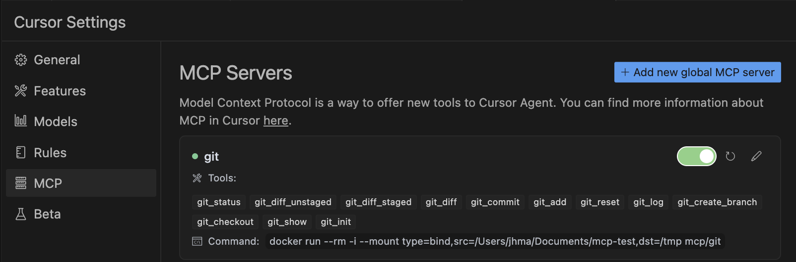
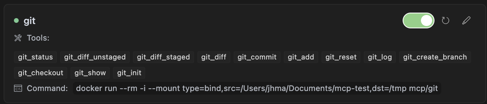
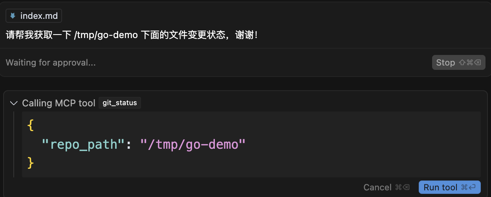
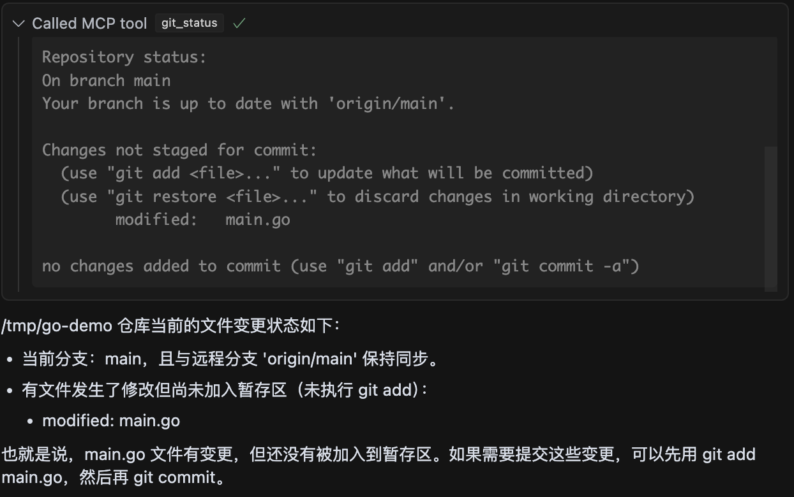
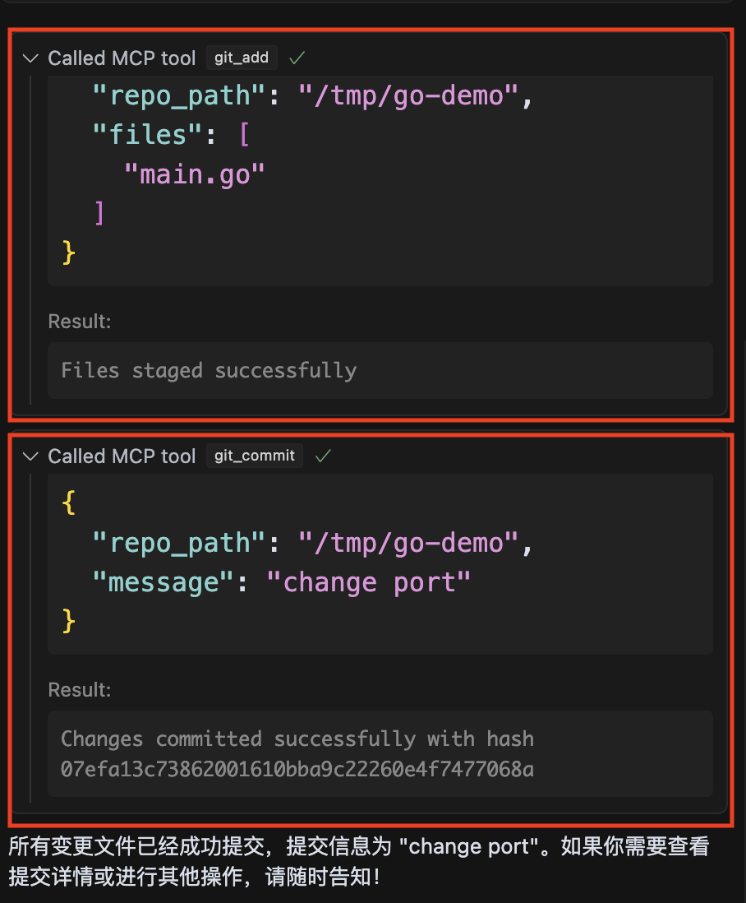
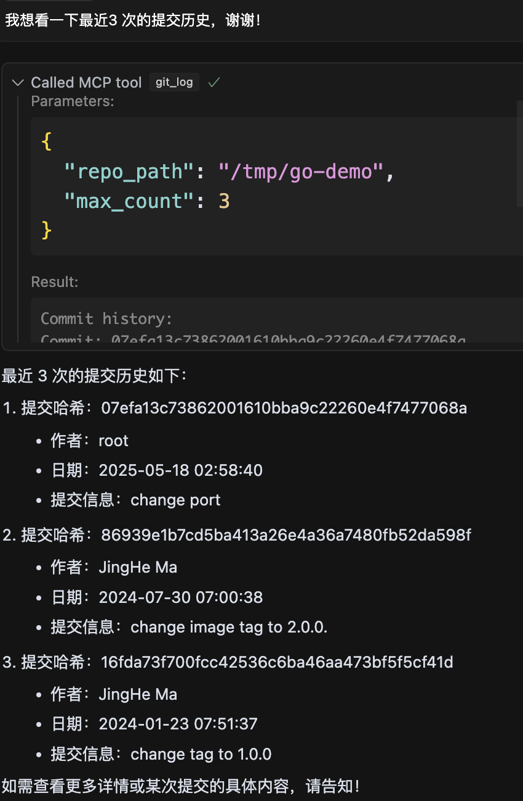
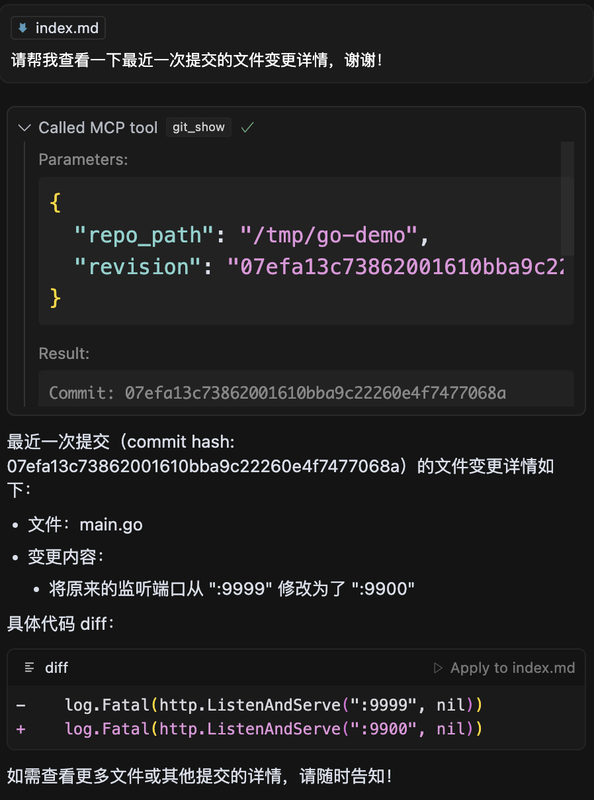

在之前的文章[GitLab MCP Server tools 功能扩展实战](https://majinghe.github.io/aigc/mcp-gitlab/)中提到了，Anthropic 在发布 MCP 的时候发布了一些开箱即用的 MCP Server，而 mcp-server-git 就是其中一个，目前支持的 Tools 有：

- `git_status`：显示工作树的状态。输入为仓库的路径；
- `git_diff_unstaged`：查看工作区中尚未被提交到暂存区的文件变更。输入为仓库路径；
- `git_diff_staged`：查看已经提交到暂存区的文件变更。输入为仓库路径；
- `git_diff`：显示分支或提交间的不同。输入为仓库的路径或要对比的目标分支或提交；
- `git_commit`：提交变更到仓库。输入为仓库路径和提交信息；
- `git_add`：添加变更文件到暂存区。输入为仓库路径和变更文件；
- `git_reset`：恢复变更。输入为仓库路径；
- `git_log`：查看提交历史。输入为仓库路径，展示的最大提交数（默认是 `10`）；
- `git_create_branch`：创建新分支。输入为仓库路径，分支名称，新分支的基分支；
- `git_checkout`：切换分支。输入为仓库路径和分支名称；
- `git_show`：查看提交的详细内容。输入为仓库路径和 revision；
- `git_init`：初始化一个仓库。输入为仓库路径；

## 实践指南

mcp-server-git 可以通过 `uv`、`pip` 来安装使用。当然最方面的肯定是在 AI 应用中配置使用，比如 Claude、VS Code、Cursor 等。本文直接采用在 Cursor 中配置 MCP，并使用 docker 的方式。

### 安装配置

首先需要配置，过程和使用[GitLab MCP Server](../mcp-gitlab/index.md)的配置是一样的。在 Cursor 中选择**Perference（偏好设置） --> Cursor Settings --> MCP**：



点击右上角的**Add new global MCP server**，在出现的界面中输入如下内容：

```
{
"mcpServers": {
  "git": {
    "command": "docker",
    "args": ["run", "--rm", "-i", "--mount", "type=bind,src=/YOUR-HOST-PATH-TO-HOST-DEMO-REPO,dst=/tmp", "mcp/git"]
  }
}
}
```

需要注意的是，docker 的使用用到了卷的挂载，把本地需要操作的仓库挂到到容器里面，MCP 是在容器中执行相关的 git 命令。

添加完毕，Git MCP Server 就会启动成功，显示绿色：



如果要是在宿主机上看，还有对应的容器在运行：

```
docker ps
CONTAINER ID   IMAGE                  COMMAND                   CREATED        STATUS        PORTS                       NAMES
fe13055d2a99   mcp/git                "mcp-server-git"          12 hours ago   Up 12 hours                               fervent_poitras
```

感兴趣可以直接用 `docker logs -f` 查看运行日志。

### 实践演示

#### `git status` 演示

由于大部分 tool 功能都是基于既有的仓库进行（`git_init` 除外），所以可以先在挂载的宿主机目录下 clone 好一个仓库。然后在 Cursor 上打开 Chat 窗口。输入如下提示词来演示 `git status`：

```
请帮我获取一下 /tmp/go-demo 下面的文件变更状态，谢谢！
```

接着会看到 Cursor 直接调用了 `git_status` tool，并且会询问你是否运行：



点击运行之后，就会显示工作区文件变更的详情（和直接执行 `git status` 是一样的），最后 Cursor 会做一个总结，告知哪个文件进行了变更：



#### `git add & commit` 演示

接下来对变更文件进行提交，继续使用如下提示词：

```
请帮我把所有的变更文件进行提交，提交信息为 change port，谢谢！
```

可以看到 Cursor 调用了 `git_add` 和 `git_commit` 两个 tool，每一个 tool 都需要 approve 才进行，而且在 commit 时候使用的 commit message 就是提示词中给予的：



#### `git log` 演示

接着测试一下 `git_log` 查看对应的提交历史。使用如下提示词：

```
我想看一下最近3 次的提交历史，谢谢！
```

响应如下：




#### `git show` 演示

接着查看一下最近一下提交的内容详情。使用如下提示词：

```
请帮我查看一下最近一次提交的文件变更详情，谢谢！
```

可以看到 Cursor 调用了 `git_show` tool。




Tool 的参数为

```
{
  "repo_path": "/tmp/go-demo",
  "revision": "07efa13c73862001610bba9c22260e4f7477068a"
}
```

其中 `revision` 也就是最近一次提交的 commit ID。返回的结果就是变更详情：

```
Commit: 07efa13c73862001610bba9c22260e4f7477068a
Author: root
Date: 2025-05-18 02:58:40+00:00
Message: change port

--- main.go
+++ main.go
@@ -12,5 +12,5 @@ func handler(w http.ResponseWriter, r *http.Request) {
 
 func main() {
     http.HandleFunc("/opensource", handler)
-    log.Fatal(http.ListenAndServe(":9999", nil))
+    log.Fatal(http.ListenAndServe(":9900", nil))
 }
```

## 源码解读

