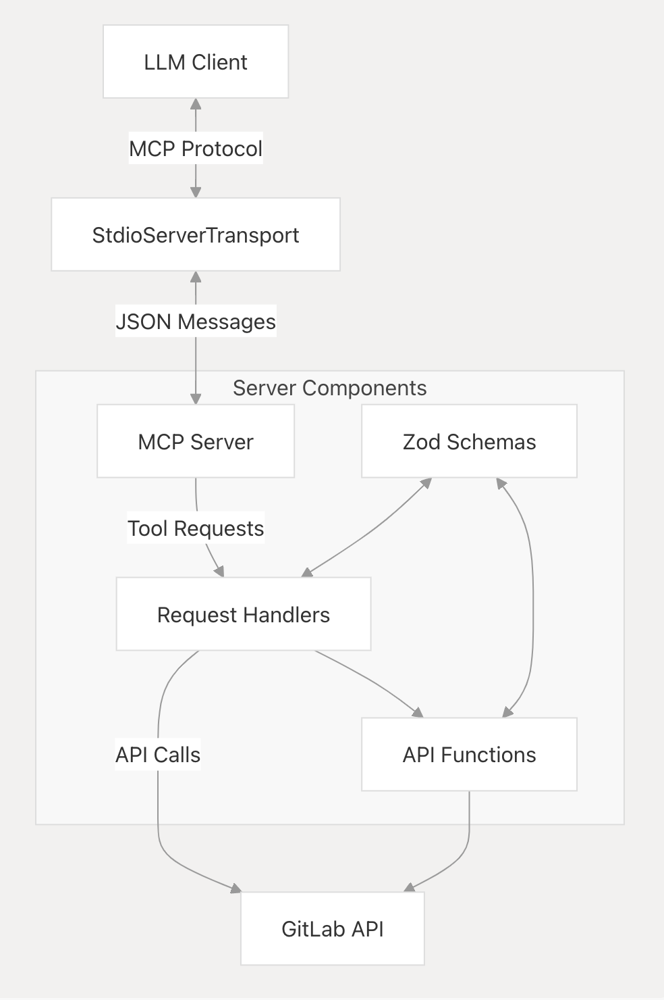
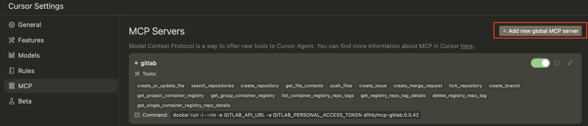
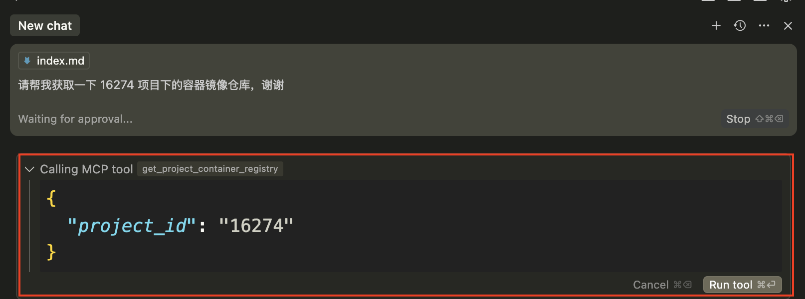
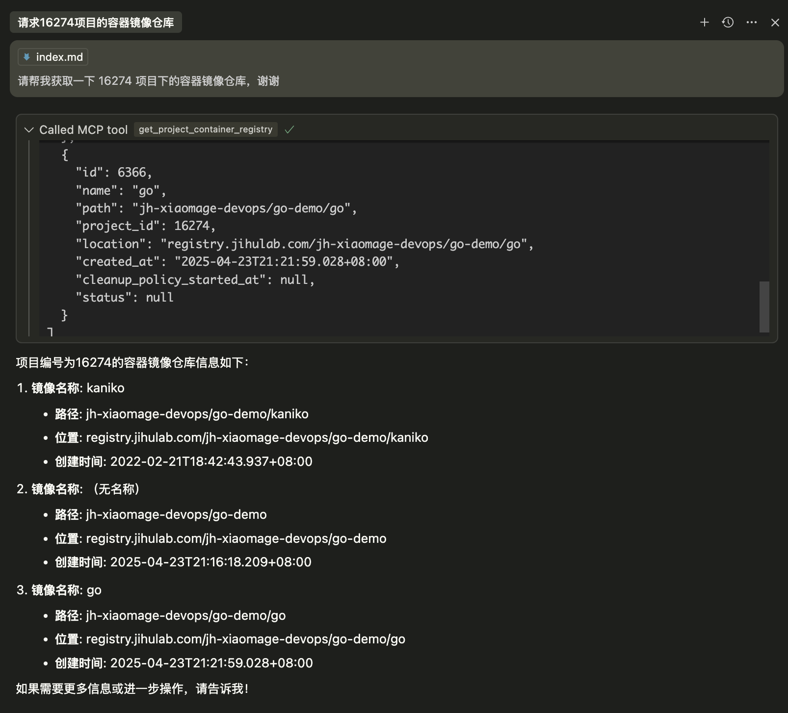

Anthropic 发布 MCP 的时候，在 GitHub 上发布了一些 MCP Server，比如 git、filesystem、redis 等。GitLab MCP Server 也是其中的一个，主要用来通过自然语言对 GitLab 仓库进行操作。

目前，提供的 Tools 支持的功能有 9 个：

- `create_or_update_file`：在项目中创建或更新单个文件；
- `push_files`：在当提交中推送多个文件；
- `search_repositories`：在 GitLab 中搜索项目；
- `create_repository`：创建一个新的仓库；
- `get_file_contents`：获取文件或目录内容；
- `create_issue`：创建一个新的议题；
- `create_merge_request`：创建一个新的合并请求；
- `fork_repository`：派生项目；
- `create_branch`：创建一个新分支；

通过查看上述功能的具体实现，发现扩展起来难度不大。下面分享在 Tools 中增加容器相关操作的功能。

## 原理分析

正好借用好友分享的 DeepWiki 生成了一个整体的架构图：



主要包含**Server Initialization、Authentication、Data Models (Schemas)、API Functions、Request Handlers、Server Transport**重要部分，后面实践部分会提及相关源代码。

## 扩展实践

### 先看目录结构

GitLab MCP Server 是用 TypeScript 编写的，源代码位于 `servers/src/gitlab` 目录下：

```
.
├── Dockerfile
├── README.md
├── index.ts
├── package-lock.json
├── package.json
├── schemas.ts
└── tsconfig.json

0 directories, 7 files
```

文件说明：

- `Dockerfile`：用来构建 GitLab MCP Server 容器镜像，最后 Server 可以以容器的方式部署运行；
- `index.ts`：Server 实现的主体部分，主要是通过调用 GitLab API 来实现对 GitLab 的操作；
- `package.json`：用于管理项目的依赖、记录 GitLab MCP Server 的元数据等；
- `schemas.ts`：主要用于定义数据结构；
- `tsconfig.json`：TypeScript 的核心配置文件，主要用于编译；

后面的实践主要修改 `index.ts` 和 `schemas.ts` 两个文件。

### 分析 GitLab API

GitLab API 很多，有针对项目、分支、议题、流水线等多种功能的。本次实践来扩展容器镜像仓库相关的（Container Registry Repo）。比如获取项目中的镜像仓库。官方提供的 API 为

```
GET /projects/:id/registry/repositories
```

所需的输入参数为：

| 属性 | 类型 | 是否必须 | 描述 |
| -- | -- | -- |-- |
|  `id`  |   integer/string | 是   | 项目 ID 或 URL 编码的路径   |
| `tags`   |  boolean  | 否   | 如果为 `true`，则仓库中的 tags 就会以数组形式列出   |
| `tags_count`   |  boolean  |  否  | 如果为 `true`，则会列出仓库中的 tag 数量   |

项目中的镜像仓库详情会以**数组**形式返回（**这一点很重要，因为返回的数据格式不同，需要对数据格式进行不同的处理**），示例如下：

```
[
  {
    "id": 1,
    "name": "",
    "path": "group/project",
    "project_id": 9,
    "location": "gitlab.example.com:5000/group/project",
    "created_at": "2019-01-10T13:38:57.391Z",
    "cleanup_policy_started_at": "2020-01-10T15:40:57.391Z",
    "status": null
  },
  {
    "id": 2,
    "name": "releases",
    "path": "group/project/releases",
    "project_id": 9,
    "location": "gitlab.example.com:5000/group/project/releases",
    "created_at": "2019-01-10T13:39:08.229Z",
    "cleanup_policy_started_at": "2020-08-17T03:12:35.489Z",
    "status": "delete_ongoing"
  }
]
```

### 开始实践

#### 定义数据结构

首先需要定义数据结构（Schema），根据 API 的返回数据格式，在 `schemas.ts` 中定义好数据结构：

```
# 定义 API 请求所需的数据结构
export const GetProjectContainerRegistrySchema = z.object({
  project_id: z.string().describe("Project ID or URL-encoded path"),
  tags: z.boolean().optional(),
  tags_count: z.boolean().optional()
});

# 定义 API 返回所需的数据结构
export const GitLabContainerRegistrySchema = z.object({
  id: z.number(),
  name: z.string(),
  path: z.string(),
  project_id: z.number(),
  location: z.string(),
  created_at: z.string(),
  cleanup_policy_started_at: z.string().nullable().optional(),
  status: z.string().nullable().optional()
});

# 将上述 Schema 转换为数组结构，因为 API 返回的是数组结构
export const GitLabContainerRegistryListSchema = z.array(GitLabContainerRegistrySchema);

# 导出类型，以便在 `index.ts` 中使用
export type GitLabContainerRegistry = z.infer<typeof GitLabContainerRegistrySchema>;
export type GetProjectContainerRegistry = z.infer<typeof GetProjectContainerRegistrySchema>
```

#### 实现 Server 部分

这部分主要修改三个部分：**添加获取项目镜像仓库的处理函数（异步处理）、在 `server.setRequestHandler` 的 ToolList 中增加获取项目容器镜像仓库信息以及对前述函数的调用**。

对于获取项目镜像仓库的处理函数，比较简单，就使用 ts 调用 GitLab 对应的 API：

```
async function getProjectContainerRegistry(
  projectId: string
): Promise<GitLabContainerRegistryList> {
  const response = await fetch(
    `${GITLAB_API_URL}/projects/${encodeURIComponent(projectId)}/registry/repositories`,
    {
      headers: {
        "Authorization": `Bearer ${GITLAB_PERSONAL_ACCESS_TOKEN}`
      }
    }
  );

  if (!response.ok) {
    throw new Error(`GitLab API error: ${response.statusText}`);
  }

  return GitLabContainerRegistryListSchema.parse(await response.json());
}
```

需要注意：

- **输入参数**：使用了项目 ID；
- **函数返回**：返回了一个 `GitLabContainerRegistryList` 类型的 Promise；
- **访问令牌**：调用 GitLab API 需要个人访问令牌，可以通过在 GitLab 实例上点击**头像 > 个人访问令牌** 来创建；

在 `server.setRequestHandler(ListToolsRequestSchema, async ()` 中添加对应的 tools，这个根据对应的格式写入即可：


```
server.setRequestHandler(ListToolsRequestSchema, async () => {
  return {
    tools: [
      {
        name: "create_or_update_file",
        description: "Create or update a single file in a GitLab project",
        inputSchema: zodToJsonSchema(CreateOrUpdateFileSchema)
      },
      ......太长，删除其他......
      {
        name: "get_project_container_registry",
        description: "Get the container registry for a GitLab project",
        inputSchema: zodToJsonSchema(GetProjectContainerRegistrySchema)
      }
    ]
  };
});
```

在 `server.setRequestHandler(CallToolRequestSchema, async (request)` 中添加对于 Tools 的调用，就是 switch...case 的格式：

```
case "get_project_container_registry": {
    const args = GetProjectContainerRegistrySchema.parse(request.params.arguments);
    const registry = await getProjectContainerRegistry(args.project_id);
    return { content: [{ type: "text", text: JSON.stringify(registry, null, 2) }] };
}
```

需要注意的是要在 `index.ts` 中的 import 部分导入在 `schemas.ts` 中定义好的数据结构。

通过上述两步，获取项目容器镜像仓库的 tools 添加和调用就加好了，接下来就是测试。

### 测试验证

通过在 Cursor 中添加 GitLab MCP Server 来验证。所以分为 MCP 添加 + 验证两步走。

#### 构建 GitLab MCP Server

GitLab MCP Server 可以通过 Docker 的方式来运行部署（这部分建议阅读过往的文章[Docker 发布 MCP & Toolkit 计划](../mcp-docker/index.md)。所以可以先构建一个容器镜像，利用目录下的 Dockerfile 即可。执行如下命令：

```
docker build -t dllhb/mcp-gitlab:0.0.1 -f src/gitlab/Dockerfile . --no-cache
```

**注意**：选择自己熟悉的镜像托管仓库即可。

#### 添加 MCP Server

在 Cursor 上添加 MCP 的方式：**点击左上角的  Cursor > Settings > Cursor Settings**，选择 MCP：



然后点击 **Add new global MCP server**，会出现一个 `mcp.json` 文件，添加如下内容：

```
{
  "mcpServers": { 
    "gitlab": {
      "command": "docker",
      "args": [
        "run",
        "--rm",
        "-i",
        "-e",
        "GITLAB_PERSONAL_ACCESS_TOKEN",
        "-e",
        "GITLAB_API_URL",
        "mcp/gitlab"
      ],
      "env": {
        "GITLAB_PERSONAL_ACCESS_TOKEN": "<YOUR_TOKEN>",
        "GITLAB_API_URL": "https://jihulab.com/api/v4" 
      }
    }
  }
}
```

所需参数：

- **GitLab 个人访问令牌**：参照前面提到的方式创建即可
- **GitLab 实例 API URL**：GitLab 实例的 URL，可以是 SaaS 也可以是私有化部署地址，本文使用极狐GitLab SaaS 测试，所以地址为 `https://jihulab.com/api/v4`。

点击保存 `mcp.json` 文件，然后可以看到在 MCP 中 gitlab 的按钮变绿色，在后台可以看到启用了一个容器：

```
docker ps
CONTAINER ID   IMAGE                     COMMAND                  CREATED         STATUS         PORTS                       NAMES
a119237ba3a1   dllhb/mcp-gitlab:0.0.1   "node dist/index.js"     6 minutes ago   Up 6 minutes                               cool_lumiere
```

感兴趣的可以用 `docker logs -f` 查看日志。

#### 开始验证

打开 Cursor 的聊天窗口（可以使用快捷键 cmd + L），然后输入提示词：

```
请帮我获取一下 16274 项目下的容器镜像仓库，谢谢!
```

可以看到出现了 `Called MCP tool` 的对话框，选中的 tool 为 `get_project_container_registry`，也就是前面添加的 tool，参数为项目 ID，如果同意运行，点击 `Run tool` 即可：



然后就可以看到对话框中获取出来了对应的信息：

```
[
  {
    "id": 534,
    "name": "kaniko",
    "path": "jh-xiaomage-devops/go-demo/kaniko",
    "project_id": 16274,
    "location": "registry.jihulab.com/jh-xiaomage-devops/go-demo/kaniko",
    "created_at": "2022-02-21T18:42:43.937+08:00",
    "cleanup_policy_started_at": null,
    "status": null
  },
  {
    "id": 6365,
    "name": "",
    "path": "jh-xiaomage-devops/go-demo",
    "project_id": 16274,
    "location": "registry.jihulab.com/jh-xiaomage-devops/go-demo",
    "created_at": "2025-04-23T21:16:18.209+08:00",
    "cleanup_policy_started_at": null,
    "status": null
  },
  {
    "id": 6366,
    "name": "go",
    "path": "jh-xiaomage-devops/go-demo/go",
    "project_id": 16274,
    "location": "registry.jihulab.com/jh-xiaomage-devops/go-demo/go",
    "created_at": "2025-04-23T21:21:59.028+08:00",
    "cleanup_policy_started_at": null,
    "status": null
  }
]
```

这个响应和直接用 curl 调用 API 是一样的。然后 Cursor 还总结了一下内容：



说明 tools 添加并调用成功。然后我有利用同样的方法添加了以下几个 tool 能力：

- `get_group_container_registry`：获取群组内的容器镜像仓库；
- `list_container_registry_repo_tags`：获取容器镜像仓库中的 tags；
- `get_registry_repo_tag_details`：获取 tag 详情；
- `delete_registry_repo_tag`：删除容器镜像仓库；
- `get_single_container_registry_repo_details`：获取容器镜像仓库详情；

经过测试都可以很好的运行。相关的代码都放在了极狐GitLab SaaS 的仓库上 https://jihulab.com/xiaomage-devops/servers/-/tree/main/src/gitlab。目前正准备给 upstream 提 PR。

## 实践思考

- 了解 MCP 最直观的方式可能就是动手实践了，否则容易人云亦云；
- 可以看出某个 MCP Server tool 的扩展比较容易，像 GitLab 这种 API 极其丰富的产品，Tool 可能多达几十个，所以这些海量 Tool 的维护是个问题；
- SDK 足够多的情况下，一个 MCP Server 可能有多种实现方式，而且实现门槛也不高，如何解决冗余也是个问题；
- MCP Server 本身的托管也是个问题，现在市面上已经有很多可以托管 MCP Server 的产品，如何解决**可信** 也是个问题；

通过实践，个人感觉如果真的让 MCP 带来更好的体验、发挥更大的价值，还有很多事情要去做，还有一段路要走。
