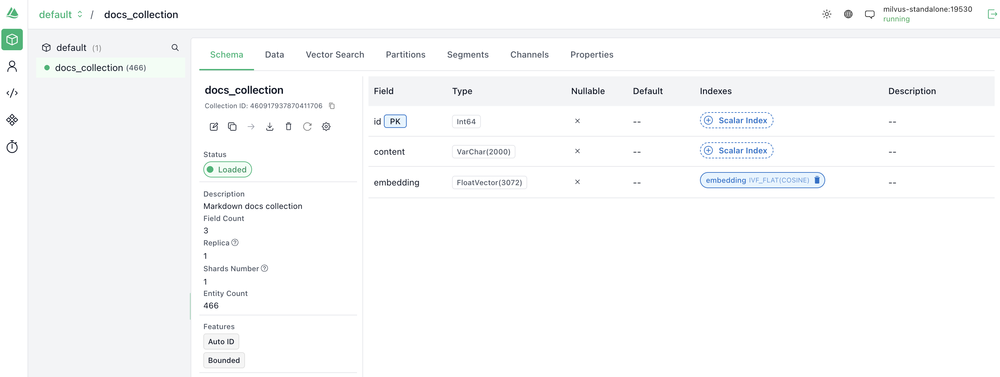
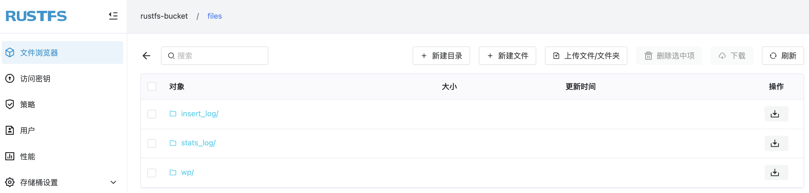
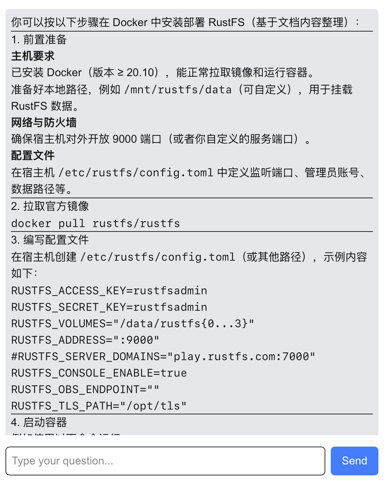

偶然点开了 milvus 的文档，想看一下 milvus 的安装使用，看到 milvus 支持 docker compose 安装以及将对象存储作为后端存储来实现存算分离，正好之前扩展 RustFS MCP 的时候，了解到 RustFS 是新一代的分布式对象存储系统，结合 milvus 的文档，想利用 milvus + rustfs + llm 来打造一个轻量级的 RAG，在 RAG Ready 之后，又想着是否可以借助这个 RAG 做一个简单的 Chatbot，于是在 Vibe Coding 的加持下，很快就完成了。整个过程的感受是：

- milvus 的中文文档写的挺好；
- RustFS 作为对象存储真好用；
- 一时 Vibe Coding 一时爽，一直 Vibe Coding 一直爽，结果就需求无法收敛；
- 通过故障排查来学习是高效的；

下面是是整个过程，enjoy。

整个过程涉及的步骤：

- milvus & rustfs 的安装；
- RustFS 中文文档的向量化；
- 向量化数据在 milvus 中的存储；
- milvus + llm 实现 RAG；
- fastapi + next.js 实现 chatbot；


## Milvus & RustFS 的安装

### 关于 Milvus

Milvus 是一款开源的向量数据库项目，由 Zilliz 开发，目前该项目已经捐赠给了 LF AI & Data 基金会。向量数据库是 AIGC 发展的重要基础设施。一次该项目在 GitHub 上已经有超 37.5k star。

### 关于 RustFS

RustFS 是一款开源的对象存储系统，用 Rust 语言编写，完全兼容 S3，可以使用二进制、Docker、Helm chart 进行安装。本地实践正好将其作为 milvus 向量数据库的存储后端。

### 使用 docker compose 安装

Milvus 官方提供的[`docker-compose.yml`](https://github.com/milvus-io/milvus/blob/master/docker-compose.yml)文件中包含了对于 milvus、minio 的安装。但是本次使用 RustFS 来替代 minio，因此需要做一些变更。关于 minio 的信息主要包括：

```
minio:
  address: localhost:9000
  port: 9000
  accessKeyID: rustfsadmin
  secretAccessKey: rustfsadmin
  useSSL: false
  bucketName: "rustfs-bucket"
```

这部分内容包含在 [milvus repo](https://github.com/milvus-io/milvus)的 `configs/milvus.yaml` 文件中，所以要将上述内容替换，有两种方式：

- 将 `configs/milvus.yaml` 文件存放到本地，将内容替换为 RustFS 的，然后在 docker compose 中通过 volume 挂载即可；
- 修改 milvus 容器的 command，在服务启动前先用 `yq` 命令对 `configs/milvus.yaml`（在容器中地址变为 `/milvus/configs/milvus.yaml`）中的 minio 信息进行修改，然后启动 milvus 服务；

本地实践选择了第一种方式，所以会在 `docker-compose.yml` 文件中 milvus 服务的 volume 中增加了一个：

```
- ${DOCKER_VOLUME_DIRECTORY:-.}/volumes/milvus/milvus.yaml:/milvus/configs/milvus.yaml:ro
```

整体的 `docker-compose.yml` 文件包含的服务有：

#### etcd

milvus 依赖于 etcd：

```
  etcd:
    container_name: milvus-etcd
    image: quay.io/coreos/etcd:v3.5.18
    environment:
      - ETCD_AUTO_COMPACTION_MODE=revision
      - ETCD_AUTO_COMPACTION_RETENTION=1000
      - ETCD_QUOTA_BACKEND_BYTES=4294967296
      - ETCD_SNAPSHOT_COUNT=50000
    volumes:
      - ${DOCKER_VOLUME_DIRECTORY:-.}/volumes/etcd:/etcd
    command: etcd -advertise-client-urls=http://etcd:2379 -listen-client-urls http://0.0.0.0:2379 --data-dir /etcd
    healthcheck:
      test: ["CMD", "etcdctl", "endpoint", "health"]
      interval: 30s
      timeout: 20s
      retries: 3
```

#### attu

可以可视化查看 milvus 情况的一个服务，也是有 zilliz 研发且开源的（注意 2.6 以后是闭源的）

```
  attu:
    container_name: milvus-attu
    image: zilliz/attu:v2.6
    environment:
      - MILVUS_URL=milvus-standalone:19530
    ports:
      - "8000:3000"
    restart: unless-stopped
```

#### rustfs 服务

作为对象存储后端，存储 milvus 中的数据：


```
  rustfs:
    container_name: milvus-rustfs
    image: rustfs/rustfs:1.0.0-alpha.58
    environment:
      - RUSTFS_VOLUMES=/data/rustfs0,/data/rustfs1,/data/rustfs2,/data/rustfs3
      - RUSTFS_ADDRESS=0.0.0.0:9000
      - RUSTFS_CONSOLE_ADDRESS=0.0.0.0:9001
      - RUSTFS_CONSOLE_ENABLE=true
      - RUSTFS_EXTERNAL_ADDRESS=:9000  # Same as internal since no port mapping
      - RUSTFS_CORS_ALLOWED_ORIGINS=*
      - RUSTFS_CONSOLE_CORS_ALLOWED_ORIGINS=*
      - RUSTFS_ACCESS_KEY=rustfsadmin
      - RUSTFS_SECRET_KEY=rustfsadmin
    ports:
      - "9000:9000" # S3 API port
      - "9001:9001" # Console port
    volumes:
      - rustfs_data_0:/data/rustfs0
      - rustfs_data_1:/data/rustfs1
      - rustfs_data_2:/data/rustfs2
      - rustfs_data_3:/data/rustfs3
      - logs_data:/app/logs
    restart: unless-stopped
    healthcheck:
      test:
        [
          "CMD",
          "sh", "-c",
          "curl -f http://localhost:9000/health && curl -f http://localhost:9001/health"
        ]
      interval: 30s
      timeout: 10s
      retries: 3
      start_period: 40s
```

#### milvus

milvus 向量数据库，采用 standalone 模式：

```
  standalone:
    container_name: milvus-standalone
    image: milvusdb/milvus:v2.6.0
    command: ["milvus", "run", "standalone"]
    security_opt:
    - seccomp:unconfined
    environment:
      ETCD_ENDPOINTS: etcd:2379
      MINIO_ADDRESS: rustfs:9000
      MQ_TYPE: woodpecker
    volumes:
      - ${DOCKER_VOLUME_DIRECTORY:-.}/volumes/milvus:/var/lib/milvus
      - ${DOCKER_VOLUME_DIRECTORY:-.}/volumes/milvus/milvus.yaml:/milvus/configs/milvus.yaml:ro
    healthcheck:
      test: ["CMD", "curl", "-f", "http://localhost:9091/healthz"]
      interval: 30s
      start_period: 90s
      timeout: 20s
      retries: 3
    ports:
      - "19530:19530"
      - "9091:9091"
    depends_on:
      - "etcd"
      - "rustfs"
```

配置好相关参数后，直接执行命令即可启动所有服务：

```
docker compose -f docker-compose.yml up -d
```

启动的容器有：

```
docker ps
CONTAINER ID   IMAGE                                             COMMAND                  CREATED          STATUS                      PORTS                                                                                      NAMES
4404b5cc6f7e   milvusdb/milvus:v2.6.0                            "/tini -- milvus run…"   53 minutes ago   Up 53 minutes (healthy)     0.0.0.0:9091->9091/tcp, :::9091->9091/tcp, 0.0.0.0:19530->19530/tcp, :::19530->19530/tcp   milvus-standalone
40ddc8ed08bb   zilliz/attu:v2.6                                  "docker-entrypoint.s…"   53 minutes ago   Up 53 minutes               0.0.0.0:8000->3000/tcp, :::8000->3000/tcp                                                  milvus-attu
3d2c8d80a8ce   quay.io/coreos/etcd:v3.5.18                       "etcd -advertise-cli…"   53 minutes ago   Up 53 minutes (healthy)     2379-2380/tcp                                                                              milvus-etcd
d760f6690ea7   rustfs/rustfs:1.0.0-alpha.58                      "/entrypoint.sh rust…"   53 minutes ago   Up 53 minutes (unhealthy)   0.0.0.0:9000-9001->9000-9001/tcp, :::9000-9001->9000-9001/tcp                              milvus-rustfs
```

其中，milvus 在 `ip:19530` 可用；rustfs 在 `ip:9000` 可用；attu 在 `ip:8000` 可用。

## RustFS 文档的向量化

本次实践以 [RustFS 中文文档](https://docs.rustfs.com/zh)包含的 80 个 Markdown 文件为基础数据，将其进行分片并向量化。通过 Python 来实现。代码如下：

```
# 3. 读取 Markdown 文件
def load_markdown_files(folder):
    files = glob.glob(os.path.join(folder, "**", "*.md"), recursive=True)
    docs = []
    for f in files:
        with open(f, "r", encoding="utf-8") as fp:
            docs.append(fp.read())
    return docs

# 4. 切分文档（简单按段落）
def split_into_chunks(text, max_len=500):
    chunks, current = [], []
    for line in text.split("\n"):
        if len(" ".join(current)) + len(line) < max_len:
            current.append(line)
        else:
            chunks.append(" ".join(current))
            current = [line]
    if current:
        chunks.append(" ".join(current))
    return chunks
```

整体思路就是遍历 RustFS 中文文档下面的 Mardown 文件，然后将其内容输出为 docs 列表，然后再根据换行符（`\n`）将内容切片处理（这个地方的方式还可以更加精细化，感兴趣地可以自行调整），最终输出切片后的字符串列表（chunks）。

接下来通过使用 `text-embedding-3-large` 模型将上述的字符串列表进行向量化：

```
def embed_texts(texts):
    response = client.embeddings.create(
        model="text-embedding-3-large",
        input=texts
    )
    return [d.embedding for d in response.data]
```

接下来就可以将这些数据存储到 milvus 中了。

## 将向量化数据存储到 milvus

milvus 中使用 collection 和 schema 来对数据进行存储管理：

```
# 链接 milvus
connections.connect("default", host="ip", port="19530")

# 定义 Collection Schema
fields = [
    FieldSchema(name="id", dtype=DataType.INT64, is_primary=True, auto_id=True),
    FieldSchema(name="content", dtype=DataType.VARCHAR, max_length=2000),
    FieldSchema(name="embedding", dtype=DataType.FLOAT_VECTOR, dim=3072),
]
schema = CollectionSchema(fields, description="Markdown docs collection")

# 创建 collection
if utility.has_collection("docs_collection"):
    utility.drop_collection("docs_collection")

collection = Collection(name="docs_collection", schema=schema)

# 插入数据
collection.insert([all_chunks, embeddings])
collection.flush()
```

可以在 attu 服务上查看，在 collections 中有一个 `docs_collection`：




可以在 RustFS 上看到存储的数据：



## milvus + llm，构建 RAG

Milvus 已经存储了 RustFS 中文文档的向量化数据，再配合 llm（本次实践选择 GPT），就可以构造一个简单的 RAG。整体思路是：**将查询向量化，然后在 milvus 中检索相似的文档（或片段），然后拼接好 prompt，最后点用 llm，获得最终答案**。代码如下：

```
    query_embedding = embed_texts(query)

    # 2. 从 Milvus 检索相似文档
    search_params = {"metric_type": "COSINE", "params": {"nprobe": 10}}
    results = collection.search(
        data=[query_embedding],
        anns_field="embedding",
        param=search_params,
        limit=3,
        output_fields=["content"]
    )

    docs = [hit.entity.get("text") for hit in results[0]]

    # 3. 拼接 RAG Prompt
    prompt = f"你是一个 RustFS 专家，请基于以下文档回答：\n\n{docs}\n\n用户问题：{query}"

    # 4. 调用 LLM
    response = client.chat.completions.create(
        model="gpt-5-chat", 
        messages=[{"role": "user", "content": prompt}],
        # max_tokens=16384,
        # temperature=1.0,
        # top_p=1.0,
    )

    answer = response.choices[0].message.content

    return {"answer": answer, "sources": docs}
```

测试查询语句为：

```
如何在 Docker 中安装 RustFS
```

返回结果：

> 根据你提供的文档，在 **Docker** 中安装 **RustFS** 的步骤如下：  

> ---
>
> ## **Docker 安装 RustFS 步骤**
>
> ### 1. 确认环境要求
> - **宿主机已安装 Docker**（版本 ≥ 20.10）
> - 预留一个本地路径作为数据挂载目录，例如：
>   ```bash
>   /mnt/rustfs/data
>   ```
> - 确保宿主机 **9000 端口**（或自定义端口）开放
>
> ---
>
> ### 2. 准备配置文件
> 在宿主机创建配置文件 `/etc/rustfs/config.toml`，示例内容如下：
> ```bash
> RUSTFS_ACCESS_KEY=rustfsadmin
> RUSTFS_SECRET_KEY=rustfsadmin
> RUSTFS_VOLUMES="/data/rustfs{0...3}"
> RUSTFS_ADDRESS=":9000"
> #RUSTFS_SERVER_DOMAINS="play.rustfs.com:7000"
> RUSTFS_CONSOLE_ENABLE=true
> RUSTFS_OBS_ENDPOINT=""
> RUSTFS_TLS_PATH="/opt/tls"
> ```
> > 注：路径 `/data/rustfs{0...3}` 会在容器中映射为实际的宿主机存储路径
>
> ---
>
> ### 3. 拉取官方 RustFS 镜像
> ```bash
> docker pull rustfs/rustfs
> ```
>
> ---
>
> ### 4. 运行 RustFS 容器
> 执行以下命令启动：
> ```bash
> docker run -d \
>   --name rustfs \
>   -p 9000:9000 \
>   -v /mnt/rustfs/data:/data \
>   -v /etc/rustfs/config.toml:/etc/rustfs/config.toml \
>   rustfs/rustfs
> ```
> 说明：
> - `-v /mnt/rustfs/data:/data` 绑定数据存储目录
> - `-v /etc/rustfs/config.toml:/etc/rustfs/config.toml` 挂载配置文件
> - `-p 9000:9000` 暴露 S3 兼容 API 端口
>
> ---
>
> ### 5. 验证安装
> 启动完成后，在浏览器或 S3 客户端访问：
> ```
> http://<宿主机IP>:9000
> ```
> 使用配置文件中的 **Access Key** 和 **Secret Key**（如 `rustfsadmin` / `rustfsadmin`）进行登录即可。
>
> ---
>
> ✅ **总结**  
> 在 Docker 中安装 RustFS 的核心步骤是：
> 1. 准备宿主机数据目录和配置文件
> 2. 拉取官方 `rustfs/rustfs` 镜像
> 3. 使用 `docker run` 启动容器并映射端口和数据卷
> 4. 使用配置文件中的账号密码访问 S3 服务
>
> ---

## 更进一步：DIY 一个 chatbot

既然 RAG 已经可用了，那就干脆做一个 chatbot web 吧，不用每次都执行 python 脚本，在 web 页面上问问题多好。

问了一下 GPT，给出的方案是 fastapi（因为 RAG 构建代码是 python 写的）+ Next.js（用来做一个简单的用 web 页面）。

FastAPI 的作用是将 RAG “封装起来”，暴露出一个 API，然后给前端使用：

```
app = FastAPI()

@app.post("/chat")
def chat(req: ChatRequest):
    query = req.query

......
```

运行应用：

```
uvicorn main:app --reload --host 0.0.0.0 --port 9999
INFO:     Will watch for changes in these directories: ['/home/xiaomage/milvus/chatbot/.venv']
INFO:     Uvicorn running on http://0.0.0.0:9999 (Press CTRL+C to quit)
INFO:     Started reloader process [2071374] using WatchFiles
INFO:     Started server process [2071376]
INFO:     Waiting for application startup.
INFO:     Application startup complete.
```

Next.js 的核心代码如下：

```
    try {
      const res = await fetch('http://localhost:9999/chat', {
        method: 'POST',
        headers: { 'Content-Type': 'application/json' },
        body: JSON.stringify({ query: input }),
      });

      const data = await res.json();
      const botMessage: Message = { role: 'bot', content: data.answer || 'No response' };
      setMessages(prev => [...prev, userMessage, botMessage]);
    } catch (error) {
      console.error(error);
      const botMessage: Message = { role: 'bot', content: 'Error connecting to server.' };
      setMessages(prev => [...prev, botMessage]);
    } finally {
      setLoading(false);
    }
```

运行应用：

```
pnpm run dev -H 0.0.0.0 -p 3000

> rag-chatbot@0.1.0 dev /home/xiaomage/milvus/chatbot-web/rag-chatbot
> next dev --turbopack -H 0.0.0.0 -p 3000

   ▲ Next.js 15.5.3 (Turbopack)
   - Local:        http://localhost:3000
   - Network:      http://0.0.0.0:3000

 ✓ Starting...
 ✓ Ready in 1288ms
```

在浏览器中访问 `http:ip:3000/chat`，出现如下界面：


在对话框中输入：

```
如何在 Docker 中安装 RustFS?
```

返回结果：



简单的 Chatbot 就此完成。

## 写在最后

整个过程中也遇到了一些问题，通过解决问题的过程对于 milvus、向量化、RAG 有了更进一步的了解。当然，由于 Vibe Coding 确实很爽，导致需求一直不收敛，从最初始的 milvus 安装到 RAG，再到 Chatbot 的打造，后面还想继续优化整个过程，将这些代码都打包到 Dockerfile 里面，用 docker compose 运行。