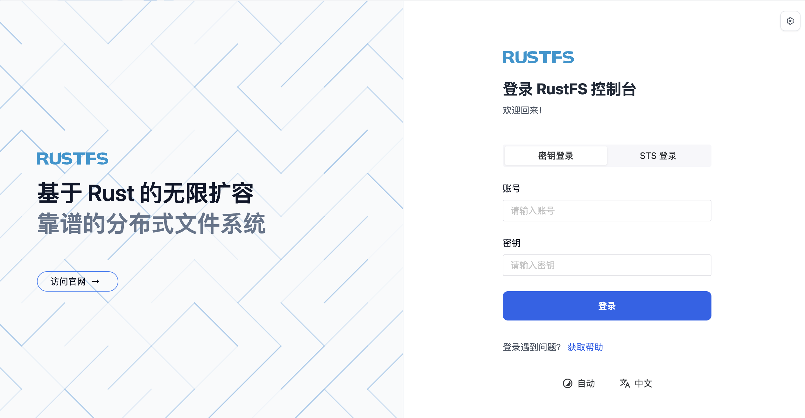
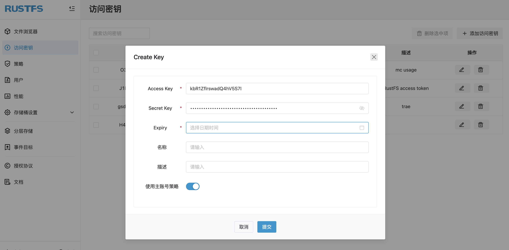
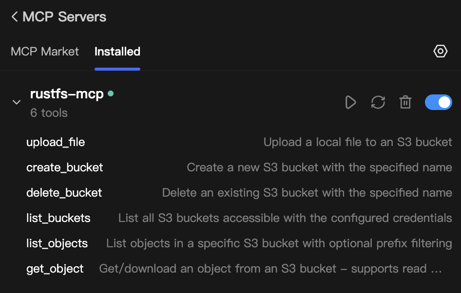
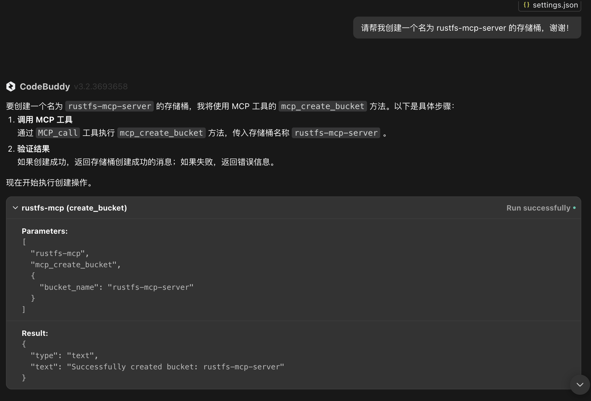
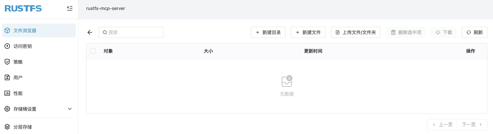
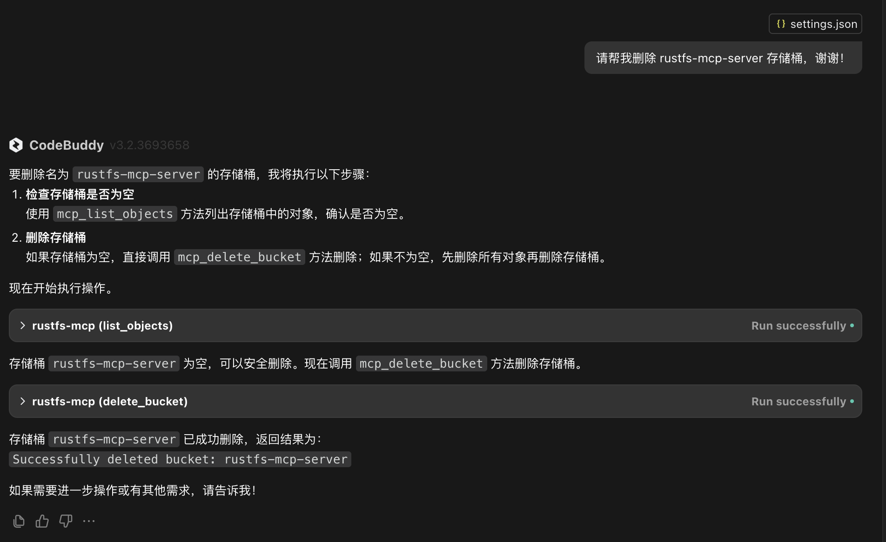

# 关于 RustFS

RustFS 是用 Rust 编写的新一代高性能对象存储，完全兼容 S3，是 MinIO 的国产平替。RustFS 是开源的，采用 Apache 2.0 许可证。目前在 [GitHub 上开源](https://github.com/rustfs/rustfs)不到两个月，已经收获 7.5k Star。根据官方发布的性能测评，在 2 Core、4GB RAM、15Gbp 以及 4x40GB 驱动的情况下，RustFS 的性能是大幅度优于 MinIO 的，目前 RustFS 还处于 1.0.0-alpha 阶段，预计未来会对在大规模使用场景下的性能进行提升。


## RustFS 的安装

RustFS 支持二进制或 Docker 安装，可以在 Linux、macOS、Windows 上运行。本文采用 Docker 的方式安装，根据[RustFS 官方安装指南](https://rustfs.com/zh/download/?platform=docker)，执行如下命令即可快速部署一个 RustFS 实例：

```
docker pull rustfs/rustfs:latest
docker run -d \
  --name rustfs \
  -p 9000:9000 \
  -v /data:/data \
  rustfs/rustfs:latest
```

安装完成后，可通过 `localhost:9000` 访问 RustFS，如下图所示：



使用默认用户名 `admin` 和密码 `admin123` 登录即可。

## RustFS MCP

RustFS MCP 是官方提供的 MCP Server，以实现通过自然语言对 RustFS 进行操作，比如 Bucket 的创建删除、Object 的上传下载等。RustFS MCP 是用 Rust 编写的，目前支持的 Tools 有：

- `list_buckets`：列出所有 Bucket；
- `list_objects`：列出 S3 存储桶中的对象，支持可选的前缀过滤；
- `upload_file`：将本地文件上传到 RustFS 存储桶；
- `get_object`：获取对象内容或下载到本地；

RustFS MCP 的代码存放在 [MCP 目录下](https://github.com/rustfs/rustfs/tree/main/crates/mcp)，目录结构为：

```
rustfs-mcp/
├── src/
│   ├── main.rs          # Entry point, CLI parsing, and server initialization
│   ├── server.rs        # MCP server implementation and tool handlers
│   ├── s3_client.rs     # S3 client wrapper with async operations
│   ├── config.rs        # Configuration management and CLI options
│   └── lib.rs           # Library exports and public API
└── Cargo.toml           # Dependencies, metadata, and binary configuration
```

下面对 RustFS MCP 的 tool 进行扩展，增加 Bucket 创建和删除。

## RustFS MCP 扩展实践

主要修改的文件是 `server.rs` 和 `s3_client.rs`。其中 `server.rs` 是 MCP Server 的入口，`s3_client.rs` 通过对 S3 Rust SDK 封装实现了一个 S3 客户端。

以下是 RustFS MCP Server 在 `server.rs` 中的主要实现部分：

```
#[tool_router(router = tool_router)]
impl RustfsMcpServer {
    pub async fn new(config: Config) -> Result<Self> {
        info!("Creating RustFS MCP Server");

        let s3_client = S3Client::new(&config).await?;

        Ok(Self {
            s3_client,
            _config: config,
            tool_router: Self::tool_router(),
        })
    }
```

其中 RustfsMcpServer 是一个结构体：

```
pub struct RustfsMcpServer {
    s3_client: S3Client,
    _config: Config,
    tool_router: ToolRouter<Self>,
}
```

因此，要扩展 tool，就需要在 RustfsMcpServer 中添加一个新的方法。比如对于 Bucket 的创建，可以添加如下方法：

```
    #[tool(description = "Create a new S3 bucket with the specified name")]
    pub async fn create_bucket(&self, Parameters(req): Parameters<CreateBucketReqeust>) -> String {
        info!("Executing create_bucket tool for bucket: {}", req.bucket_name);

        match self.s3_client.create_bucket(&req.bucket_name).await {
            Ok(_) => {
                format!("Successfully created bucket: {}", req.bucket_name)
            }
            Err(e) => {
                format!("Failed to create bucket '{}': {:?}", req.bucket_name, e)
            }
        }
    }
```

输入参数就是 Bucket 名称。整个过程会去调用 s3_client 中的 create_bucket 方法。前面说了，s3_client 是对 S3 Rust SDK 的封装，因此，需要在 s3_client.rs 中添加如下方法：

```
    pub async fn create_bucket(&self, bucket_name: &str) -> Result<BucketInfo> {
        info!("Creating S3 bucket: {}", bucket_name);

        self.client
            .create_bucket()
            .bucket(bucket_name)
            .send()
            .await
            .context(format!("Failed to create S3 bucket: {bucket_name}"))?;

        info!("Bucket '{}' created successfully", bucket_name);
        Ok(BucketInfo {
            name: bucket_name.to_string(),
            creation_date: None, // Creation date not returned by create_bucket
        })
    }
```

其中的 `self.client` 就是 S3 Rust SDK 的客户端，因此，只需要调用 S3 Rust SDK 的 `create_bucket` 方法即可。

可以用相同的扩展方法对 Bucket 的删除进行扩展，增加一个 `bucket_delete` 的 tool。

## RustFS MCP 扩展测试

RustFS MCP 支持通过[二进制或 Docker 进行部署](https://github.com/rustfs/rustfs/tree/main/crates/mcp)。本文使用 Docker 方式。根据官方提供的 Dockerfile 和构建命令，构建一个 RustFS MCP Docker 镜像：

```
# clone rustfs repo
git clone https://github.com/rustfs/rustfs.git
cd rustfs

# build rustfs-mcp docker image
docker build -f crates/mcp/Dockerfile -t rustfs/rustfs-mcp .
```

上面是在 rustfs 代码仓库根目录下进行，如果在 `crates/mcp` 目录下进行，构建命令变为：

```
docker build -f Dockerfile -t rustfs/rustfs-mcp ../../
```

在支持 MCP 的 AI 应用中（比如 Claude、Cursor、Trae 等），找到 MCP 配置，添加如下配置：

```
{
  "mcpServers": {
    "rustfs-mcp": {
      "command": "docker",
      "args": [
        "run",
        "--rm",
        "-i",
        "-e",
        "AWS_ACCESS_KEY_ID",
        "-e",
        "AWS_SECRET_ACCESS_KEY",
        "-e",
        "AWS_REGION",
        "-e",
        "AWS_ENDPOINT_URL",
        "-e",
        "RUST_LOG",
        "rustfs/rustfs-mcp"
      ],
      "env": {
        "AWS_ACCESS_KEY_ID": "YOUR_RUSTFS_ACCESS_KEY_ID",
        "AWS_SECRET_ACCESS_KEY": "YOUR_RUSTFS_SECRET_ACCESS_KEY",
        "AWS_REGION": "cn-east-1",
        "RUST_LOG": "info",
        "AWS_ENDPOINT_URL": "YOUR_RUSTFS_ENDPOINT_URL"
      }
    }
  }
}
```

过程中会用到 RustFS 访问密钥。登录 RustFS 控制台，在左侧导航栏选择 **访问密钥**，然后选择右上角的 **添加访问密钥**，输入响应的信息即可创建成功访问密钥。



保存 MCP 配置文件后，可以在 AI 应用上看到 RustFS MCP Server 已经处于运行状态，而且还可以看到可用的 tool：



在对话框中，输入如下提示词：

```
请帮我创建一个名为 rustfs-mcp-server 的存储桶！
```

返回如下：



在 RustFS 控制台上，可以看到 `rustfs-mcp-server` 存储桶被创建成功：



如果要删除这个存储桶，可以输入如下提示词：

```
请帮我删除 rustfs-mcp-server 存储桶！
```

返回如下：



从测试看，扩展的两个 tool：`create_bucket` 和 `delete_bucket` 符合预期。

当然，RustFS MCP 的扩展远不止这些，对于想学习 Rust、研究 MCP 的开发者来讲，RustFS 是一个不错的开源项目。感兴趣的可以自行研究。


