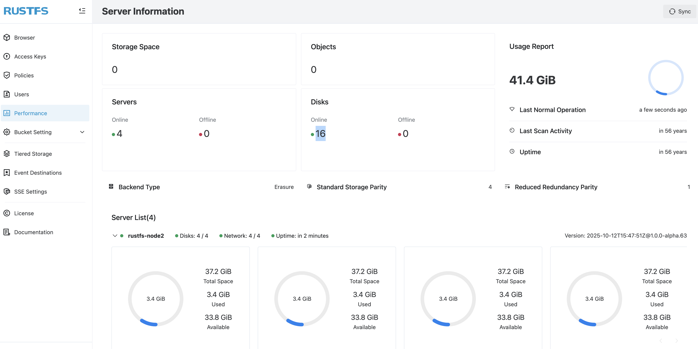

关于 RustFS 在过往的博客中已经有过介绍：

- [Milvus + RustFS + Vibe Coding，快速 DIY 一个 Chatbot](../../aigc/milvus/index.md)
- [Dify + RustFS + Milvus，构建文档多语种翻译 AI Workflow](../../aigc/dify/index.md)
- [新一代对象存储 RustFS 的 MCP 扩展实践](../../aigc/rustfs-mcp/index.md)

根据 [RustFS 官网](https://docs.rustfs.com/zh/installation/linux/)介绍，RustFS 有三种安装模式：

- 单机单盘（SNSD）
- 单机多盘（SNMD）
- 多机多盘（MNMD）

其中多机多盘属于集群式安装，也是企业使用最多的模式。多机多盘意味着要在每个服务器上都安装 RustFS 实例，本文探索用 ansible + docker compose 的方式在四台服务器上部署 MNMD 架构。

## 前提

- 五台服务器（其中一台用作 ansible 的控制节点，其余四台作为被管理节点，也就是要安装 RustFS 的节点）
- 在控制节点上安装好 ansible

## 安装流程

### 配置 ansible

现在 ansible 控制节点上确保 ansible 安装成功：

```
ansible --version
ansible [core 2.18.10]
  config file = /etc/ansible/ansible.cfg
  configured module search path = ['/root/.ansible/plugins/modules', '/usr/share/ansible/plugins/modules']
  ansible python module location = /usr/lib/python3/dist-packages/ansible
  ansible collection location = /root/.ansible/collections:/usr/share/ansible/collections
  executable location = /usr/bin/ansible
  python version = 3.12.3 (main, Aug 14 2025, 17:47:21) [GCC 13.3.0] (/usr/bin/python3)
  jinja version = 3.1.6
  libyaml = True
```

在控制节点上生成 ssh key 并 copy 到四台目标服务器：

```
# 生成 ssh key
ssh-keygen -t rsa -C "your.email.address"

# 拷贝 ssh key 到目标服务器（执行四次）
ssh-copy-id -i ~/.ssh/id_rsa_rustfs.pub root@your.server.ip
```

在控制节点上配置 `/etc/ansible/hosts` 文件，将四台服务器配置为 rustfs 群组：

```
[rustfs]
8.130.164.70
8.130.168.227
39.101.76.181
8.130.119.35
```

后续 `rustfs` 群组名称会用在 ansible playbook 中。

一切配置妥当后，用 `ansible rustfs -m ping` 命令进行测试：

```
8.130.119.35 | SUCCESS => {
    "changed": false,
    "ping": "pong"
}
8.130.164.70 | SUCCESS => {
    "changed": false,
    "ping": "pong"
}
39.101.76.181 | SUCCESS => {
    "changed": false,
    "ping": "pong"
}
8.130.168.227 | SUCCESS => {
    "changed": false,
    "ping": "pong"
}
```

看到上述结果后，可认为 ansible 和服务器配置完成，可进行 RustFS 的安装了。

**NOTE**：执行上述命令需要服务器开启 ICMP 协议。

### 编写 ansible playbook

ansible playbook 的撰写完全围绕 RustFS 的安装进行。RustFS 官方提供 docker compose 安装方式，`docker-compose.yml` 文件内容如下：

```
services:
    rustfs:
        image: rustfs/rustfs:latest
        container_name: rustfs
        hostname: rustfs
        network_mode: host
        environment:
        # Use service names and correct disk indexing (1..4 to match mounted paths)
        - RUSTFS_VOLUMES=http://rustfs-node{1...4}:9000/data/rustfs{1...4}
        - RUSTFS_ADDRESS=0.0.0.0:9000
        - RUSTFS_CONSOLE_ENABLE=true
        - RUSTFS_CONSOLE_ADDRESS=0.0.0.0:9001
        - RUSTFS_EXTERNAL_ADDRESS=0.0.0.0:9000  # Same as internal since no port mapping
        - RUSTFS_ACCESS_KEY=rustfsadmin
        - RUSTFS_SECRET_KEY=rustfsadmin
        - RUSTFS_CMD=rustfs
        command: ["sh", "-c", "apk update && apk add curl && sleep 3 && rustfs"]
        healthcheck:
        test:
            [
            "CMD-SHELL",
            "curl -f http://localhost:9000/health && curl -f http://localhost:9001/health || exit 1"
            ]
        interval: 10s
        timeout: 5s
        retries: 3
        start_period: 30s
        ports:
        - "9000:9000"  # API endpoint
        - "9001:9001"  # Console
        volumes:
        - rustfs-data1:/data/rustfs1
        - rustfs-data2:/data/rustfs2
        - rustfs-data3:/data/rustfs3
        - rustfs-data4:/data/rustfs4
        extra_hosts:
        - "rustfs-node1:172.20.92.202"
        - "rustfs-node2:172.20.92.201"
        - "rustfs-node3:172.20.92.200"
        - "rustfs-node4:172.20.92.199"
    volumes:
    rustfs-data1:
    rustfs-data2:
    rustfs-data3:
    rustfs-data4:
```

核心原理就是将上述内容写入 `docker-compose.yml` 文件并拷贝到目标服务器上，然后执行 `docker compose up -d` 命令。因此，playbook 的整体流程包括：

- 安装 docker 环境
- 创建存放 `docker-compose.yml` 文件的目录
- 生成 `docker-compose.yml` 文件
- 执行 `docker compose up -d` 命令安装 rustfs 集群
- 确认安装结果
- （optional）执行卸载命令 `docker compose down`

下面看使用到的 ansible 模块及具体实践。

#### 安装 docker 环境

本次实践所用的服务器是 Ubuntu OS，可以直接使用 shell 模块来安装 docker 环境：

```
- name: Install docker
    shell: |
        apt-get remove -y docker docker.io containerd runc || true
        apt-get update -y
        apt-get install -y ca-certificates curl gnupg lsb-release
        install -m 0755 -d /etc/apt/keyrings
        curl -fsSL https://mirrors.aliyun.com/docker-ce/linux/ubuntu/gpg | gpg --dearmor --yes -o /etc/apt/keyrings/docker.gpg
        chmod a+r /etc/apt/keyrings/docker.gpg
        echo \
            "deb [arch=$(dpkg --print-architecture) signed-by=/etc/apt/keyrings/docker.gpg] https://mirrors.aliyun.com/docker-ce/linux/ubuntu \
            $(lsb_release -cs) stable" | tee /etc/apt/sources.list.d/docker.list > /dev/null
        apt-get update -y
        apt-get install -y docker-ce docker-ce-cli containerd.io docker-compose-plugin
    become: yes
    register: docker_installation_result
    changed_when: false

- name: Installation check
    debug:
    var: docker_installation_result.stdout
```

**NOTE**：使用了 ansible 的 register 和 debug 对安装结果进行输出检查。

#### 创建目录

创建一个目录用来存放后面生成的 `docker-compose.yml` 文件，直接使用 ansible 的 `file` 的模块指定路径即可：

```
- name: Create docker compose dir
    file:
    path: "{{ docker_compose }}"
    state: directory
    mode: '0755'
```

**NOTE**：{{ docker_compose }} 是 ansible 中的变量引用，该变量定义在 playbook 的顶部：
   
```
---
- name: Prepare for RustFS installation
hosts: rustfs
become: yes
vars:
    ansible_python_interpreter: /usr/bin/python3
    install_script_url: "https://rustfs.com/install_rustfs.sh"
    docker_compose: "/home/xiaomage/rustfs/docker-compose"
```

#### 生成 `docker-compose.yml` 文件

使用 ansible 的 `copy` 模块生成 `docker-compose.yml` 文件并拷贝至目标服务器的指定目录下：

```
- name: Prepare docker compose file
    copy:
    content: |
        services:
        rustfs:
            image: rustfs/rustfs:latest
            container_name: rustfs
            hostname: rustfs
            network_mode: host
            environment:
            # Use service names and correct disk indexing (1..4 to match mounted paths)
            - RUSTFS_VOLUMES=http://rustfs-node{1...4}:9000/data/rustfs{1...4}
            - RUSTFS_ADDRESS=0.0.0.0:9000
            - RUSTFS_CONSOLE_ENABLE=true
            - RUSTFS_CONSOLE_ADDRESS=0.0.0.0:9001
            - RUSTFS_EXTERNAL_ADDRESS=0.0.0.0:9000  # Same as internal since no port mapping
            - RUSTFS_ACCESS_KEY=rustfsadmin
            - RUSTFS_SECRET_KEY=rustfsadmin
            - RUSTFS_CMD=rustfs
            command: ["sh", "-c", "apk update && apk add curl && sleep 3 && rustfs"]
            healthcheck:
            test:
                [
                "CMD-SHELL",
                "curl -f http://localhost:9000/health && curl -f http://localhost:9001/health || exit 1"
                ]
            interval: 10s
            timeout: 5s
            retries: 3
            start_period: 30s
            ports:
            - "9000:9000"  # API endpoint
            - "9001:9001"  # Console
            volumes:
            - rustfs-data1:/data/rustfs1
            - rustfs-data2:/data/rustfs2
            - rustfs-data3:/data/rustfs3
            - rustfs-data4:/data/rustfs4
            extra_hosts:
            - "rustfs-node1:172.20.92.202"
            - "rustfs-node2:172.20.92.201"
            - "rustfs-node3:172.20.92.200"
            - "rustfs-node4:172.20.92.199"
        volumes:
        rustfs-data1:
        rustfs-data2:
        rustfs-data3:
        rustfs-data4:
    dest: "{{ docker_compose }}/docker-compose.yml"
    mode: '0644'
```

`dest` 参数指定了 `docker-compose.yml` 文件存放的路径。

**NOTE**：由于是多机多盘（MNMD）安装模式，因此 RUSTFS `RUSTFS_VOLUME` 环境变量的值为 `http://rustfs-node{1...4}:9000/data/rustfs{1...4}`，因此需要将 `rustfs-node{1...4}` 和服务器的 IP 地址映射起来，这部分需要修改容器的 `/etc/hosts` 文件，在 docker compose 环境下直接使用 `extra_hosts` 即可。**需要注意的是，这部分一定要用服务器的内网地址**。

#### 执行安装

执行 `docker compose -f docker-compose.yml up -d` 命令即可安装，直接使用 `command` 模块：

```
- name: Install rustfs using docker compose
    tags: rustfs_install
    command: docker compose -f "{{ docker_compose}}/docker-compose.yml" up -d
    args:
    chdir: "{{ docker_compose }}"

- name: Get docker compose output
    command: docker compose ps
    args:
    chdir: "{{ docker_compose }}"
    register: docker_compose_output

- name: Check the docker compose installation output
    debug:
    msg: "{{ docker_compose_output.stdout }}"
```

**NOTE**：由于将 RustFS 的安装和卸载写在了同一个 playbook 中，因此使用了 ansible 的 `tags` 属性来标记不同的 task。其中用 `rustfs_install` 标记 RustFS 安装，`rustfs_uninstall` 标记卸载。因此，执行的时候使用 `tags` 来指定执行的 task，使用 `--skip-tags` 来指定跳过特定的 task。

#### （可选）卸载 RustFS

执行 `docker compose -f docker-compose.yml down` 命令卸载安装好的集群：

```
- name: Uninstall rustfs using docker compose
    tags: rustfs_uninstall
    command: docker compose -f "{{ docker_compose}}/docker-compose.yml" down
    args:
    chdir: "{{ docker_compose }}"
```

### 开始安装

将上述内容存放到一个 YAML 文件中，存放在 ansible 控制节点的目录下，比如名为 `install.yml`，执行如下命令：

```
ansible-playbook --skip-tags rustfs_uninstall install.yml
```

输出结果如下：

```

PLAY [Prepare for RustFS installation] ****************************************************************************************************************************************************************************************************

TASK [Gathering Facts] ********************************************************************************************************************************************************************************************************************
ok: [8.130.168.227]
ok: [8.130.119.35]
ok: [8.130.164.70]
ok: [39.101.76.181]

TASK [Uninstall rustfs using docker compose] **********************************************************************************************************************************************************************************************
changed: [39.101.76.181]
changed: [8.130.164.70]
changed: [8.130.119.35]
changed: [8.130.168.227]

PLAY RECAP ********************************************************************************************************************************************************************************************************************************
39.101.76.181              : ok=2    changed=1    unreachable=0    failed=0    skipped=0    rescued=0    ignored=0   
8.130.119.35               : ok=2    changed=1    unreachable=0    failed=0    skipped=0    rescued=0    ignored=0   
8.130.164.70               : ok=2    changed=1    unreachable=0    failed=0    skipped=0    rescued=0    ignored=0   
8.130.168.227              : ok=2    changed=1    unreachable=0    failed=0    skipped=0    rescued=0    ignored=0   

root@xiaomage-hs:/home/xiaomage/ansible# ansible-playbook --skip-tags rustfs_uninstall docker.yml 

PLAY [Prepare for RustFS installation] ****************************************************************************************************************************************************************************************************

TASK [Gathering Facts] ********************************************************************************************************************************************************************************************************************
ok: [8.130.119.35]
ok: [8.130.164.70]
ok: [39.101.76.181]
ok: [8.130.168.227]

TASK [Install docker] *********************************************************************************************************************************************************************************************************************
ok: [8.130.164.70]
ok: [8.130.119.35]
ok: [8.130.168.227]
ok: [39.101.76.181]

TASK [Installation check] *****************************************************************************************************************************************************************************************************************
......TLDR......
TASK [Create docker compose dir] **********************************************************************************************************************************************************************************************************
ok: [8.130.164.70]
ok: [8.130.168.227]
ok: [39.101.76.181]
ok: [8.130.119.35]

TASK [Prepare docker compose file] ********************************************************************************************************************************************************************************************************
ok: [8.130.168.227]
ok: [8.130.119.35]
ok: [8.130.164.70]
ok: [39.101.76.181]

TASK [Install rustfs using docker compose] ************************************************************************************************************************************************************************************************
changed: [8.130.164.70]
changed: [39.101.76.181]
changed: [8.130.119.35]
changed: [8.130.168.227]

TASK [Get docker compose output] **********************************************************************************************************************************************************************************************************
changed: [8.130.164.70]
changed: [8.130.168.227]
changed: [8.130.119.35]
changed: [39.101.76.181]

TASK [Check the docker compose installation output] ***************************************************************************************************************************************************************************************
ok: [8.130.164.70] => {
    "msg": "NAME      IMAGE                  COMMAND                  SERVICE   CREATED         STATUS                            PORTS\nrustfs    rustfs/rustfs:latest   \"/entrypoint.sh sh -…\"   rustfs    3 seconds ago   Up 2 seconds (health: starting)   "
}
ok: [8.130.168.227] => {
    "msg": "NAME      IMAGE                  COMMAND                  SERVICE   CREATED         STATUS                           PORTS\nrustfs    rustfs/rustfs:latest   \"/entrypoint.sh sh -…\"   rustfs    2 seconds ago   Up 1 second (health: starting)   "
}
ok: [39.101.76.181] => {
    "msg": "NAME      IMAGE                  COMMAND                  SERVICE   CREATED         STATUS                            PORTS\nrustfs    rustfs/rustfs:latest   \"/entrypoint.sh sh -…\"   rustfs    3 seconds ago   Up 3 seconds (health: starting)   "
}
ok: [8.130.119.35] => {
    "msg": "NAME      IMAGE                  COMMAND                  SERVICE   CREATED         STATUS                            PORTS\nrustfs    rustfs/rustfs:latest   \"/entrypoint.sh sh -…\"   rustfs    3 seconds ago   Up 2 seconds (health: starting)   "
}

PLAY RECAP ********************************************************************************************************************************************************************************************************************************
39.101.76.181              : ok=8    changed=2    unreachable=0    failed=0    skipped=0    rescued=0    ignored=0   
8.130.119.35               : ok=8    changed=2    unreachable=0    failed=0    skipped=0    rescued=0    ignored=0   
8.130.164.70               : ok=8    changed=2    unreachable=0    failed=0    skipped=0    rescued=0    ignored=0   
8.130.168.227              : ok=8    changed=2    unreachable=0    failed=0    skipped=0    rescued=0    ignored=0   
```

在目标服务器上可以查看安装结果：

```
docker compose ps
NAME      IMAGE                  COMMAND                  SERVICE   CREATED         STATUS                     PORTS
rustfs    rustfs/rustfs:latest   "/entrypoint.sh sh -…"   rustfs    2 minutes ago   Up 2 minutes (healthy)   
```

使用任意 RustFS 节点的 ip + 9000 端口，并用默认用户名密码 `rustfsadmin` 访问实例，在 **性能** 一栏中看到所有节点的信息：



可以看到有四个节点在线，每个节点 4 个 disk。接下来就可以使用该集群了。

### 卸载 RustFS

由于将 RustFS 的安装和卸载写到了同一个 playbook 中，并且使用了 `tags` 来标记。执行如下命令即可完成 RustFS 集群的卸载：

```
ansible-playbook --tags rustfs_uninstall install.yml
```

返回结果如下：

```
ansible-playbook --tags rustfs_uninstall docker.yml 

PLAY [Prepare for RustFS installation] ****************************************************************************************************************************************************************************************************

TASK [Gathering Facts] ********************************************************************************************************************************************************************************************************************
ok: [8.130.164.70]
ok: [8.130.168.227]
ok: [39.101.76.181]
ok: [8.130.119.35]

TASK [Uninstall rustfs using docker compose] **********************************************************************************************************************************************************************************************
changed: [8.130.168.227]
changed: [8.130.119.35]
changed: [39.101.76.181]
changed: [8.130.164.70]

PLAY RECAP ********************************************************************************************************************************************************************************************************************************
39.101.76.181              : ok=2    changed=1    unreachable=0    failed=0    skipped=0    rescued=0    ignored=0   
8.130.119.35               : ok=2    changed=1    unreachable=0    failed=0    skipped=0    rescued=0    ignored=0   
8.130.164.70               : ok=2    changed=1    unreachable=0    failed=0    skipped=0    rescued=0    ignored=0   
8.130.168.227              : ok=2    changed=1    unreachable=0    failed=0    skipped=0    rescued=0    ignored=0   
```

可在目标服务器上通过 `docker ps` 或 `docker compose ps` 查看是否卸载成功。