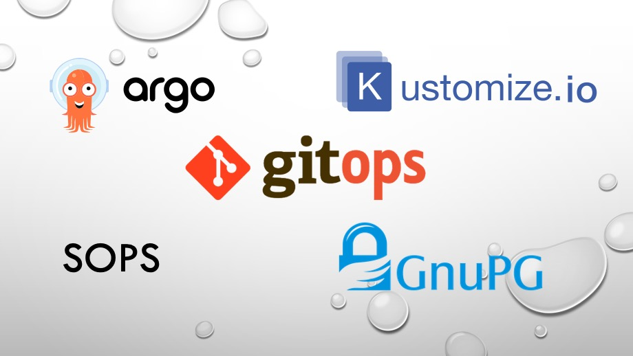

<p align="center">
</img>
</p>

# GitOps

GitOps 是 2017 年由 weaveworks 公司根据自身实践经验提出的一种云原生应用程序（其实也包括基础设施）部署与管理的模式。其区别于传统的基于 Push 的应用程序部署模式，而是用 Pull 的方式来进行的。GitOps 有以下几个核心要素：

* Git 为单一可信源（Git is the single source of truth）
* 一切皆代码（everything is code）
* 以声明式系统为基座（based on declarative）

关于 GitOps 的更多内容可以查看过往的文章[GOTC 纪实｜利用 Tekton + ArgoCD 打造云原生 GitSecOps](../../devsecops/gitops/)。


# Kustomize

[Kustomize](https://kustomize.io/)是一个 Kubernetes 原生的配置管理工具。以一种无模版（对比 Helm）的方式来定制化应用程序的配置，从而简化了云原生应用程序的使用。目前已经内置到 `kubectl` 中了。

Kustomize 的使用非常方便，**核心理念是通过 kustomization.yaml 文件来管理云原生应用程序所对应的 Kubernetes 资源**。并且可以通过 `overlay` 的方式来完成多层级的资源配置管理，很方便的实现一套配置文件对应多个不同环境。

比如下面的例子，整个配置文件的目录结构为：

```
.
├── base
│   ├── config.yaml
│   ├── jenkins-rbac.yaml
│   ├── jenkins.yaml
│   ├── jenkins_crd.yaml
│   ├── jenkins_operator.yaml
│   ├── kops-secret.yaml
│   ├── kustomization.yaml
│   └── secret
│       └── credentials.secret.yaml
└── overlays
    ├── dev
    │   ├── ingress.yaml
    │   ├── jenkins.yaml
    │   ├── kops-secret.yaml
    │   ├── kustomization.yaml
    │   └── secret
    │       └── secret.tls.yaml
    ├── prod
    │   ├── ingress.yaml
    │   ├── jenkins.yaml
    │   ├── kops-secret.yaml
    │   ├── kustomization.yaml
    │   └── secret
    │       └── secret.tls.yaml
    └── svt
        ├── ingress.yaml
        ├── jenkins.yaml
        ├── kops-secret.yaml
        ├── kustomization.yaml
        └── secret
            └── secret.tls.yaml
```

上述配置文件的目录层级展示了如何使用 Kustomize 来对三套环境（dev、svt、prod）的配置文件进行编排管理。其中 base 目录下面是多个环境共同的资源配置，而 dev、svt、prod 目录下则是每个环境所特有的配置资源。在最终使用时候，把“个性”和“共性”糅合在一起，就是最终针对某个环境的所有配置资源。

> 上述目录结构是使用 jenkins-opeator 来根据不同环境，迅速构建起一个 jenkins 示例的 kustomize 使用方法，代码仓库位于[这儿](https://github.com/majinghe/jenkins-operator)。


# Argo CD

[Argo CD](https://github.com/argoproj/argo-cd/)是一个声明式的工具，主要针对 Kubernetes 来做基于 GitOps 的持续交付。

Argo CD 的所有组件都是以 controller 的形式运行的，这些组件会监控应用程序的当前状态，并和期望状态（定义在配置文件中，而配置文件存储在 Git 上，这正是 GitOps 的精髓所在）相比较，如果发生偏差就进行自动校正（同步）。Argo CD 的架构图如下：

<p align="center">
</img>
</p>

Argo CD 的安装非常方便，只需要如下两个命令即可快速拉起一个 Argo CD 环境：

```
$ kubectl create namespace argocd
$ kubectl apply -n argocd -f https://raw.githubusercontent.com/argoproj/argo-cd/stable/manifests/install.yaml
```

一个正常运行的 Argo CD 环境由以下组件构成：

```
$ kubectl -n argocd get pods
NAME                                               READY   STATUS    RESTARTS   AGE
argocd-application-controller-0                    1/1     Running   0          24h
argocd-applicationset-controller-74b689bfd-dnc7m   1/1     Running   0          24h
argocd-dex-server-7678b55c7b-gzj5h                 1/1     Running   0          24h
argocd-notifications-controller-7b888bc548-hdpjj   1/1     Running   0          24h
argocd-redis-584f4df7d7-2m8ms                      1/1     Running   0          24h
argocd-repo-server-76f7f567d8-cg9vj                1/1     Running   0          24h
argocd-server-86d75f9788-lp78r                     1/1     Running   0          24h
```

可以看到有多个组件，相关组件的作用，可以查看 [Argo CD 官网文档](https://argo-cd.readthedocs.io/en/stable/)。


# SOPS

[SOPS: Secrets OPerationS](https://github.com/mozilla/sops)是一个针对加密文件的编辑器，支持多种文件格式，诸如 YAML、JSON、ENV、INI 以及二进制文件，支持的加密方式有 AWS KMS、GCP KMS、Azure Key Vault 以及 PGP 等。

sops 的安装也是非常方便的，安装方式可以在 [sops GitHub](https://github.com/mozilla/sops)上找到，安装完成后可以用 `--version` 来查看：

```
$ sops --version
sops 3.7.1
```

sops 支持 PGP 和 GPG，本文使用 GPG，演示之前先来学习一个冷知识：GPG 与 GPG 的区别。


## PGP vs GPG

PGP 是 “Pretty Good Privacy” 的缩写，它是由 Phil Zimmermann 开发的，最早是基于 GPL（Gnu Public License）协议来发布的，但是后来受限于美国相关法律带来的一些问题，PGP 变成了专有软件。基于此，GPG 出现了。

GPG 是 “Gnu Privacy Guard“ 的缩写，可以理解为 PGP 的一个升级或重新，它使用了和 PGP 不同的算法，而且是开源的。

## SOPS with GPG

可以根据 [GPG 官网](https://gpgtools.org/)来完成 GPG 的安装，依旧用 `--version` 来验证安装是否成功：

```
$ gpg --version
gpg (GnuPG/MacGPG2) 2.2.27
libgcrypt 1.8.7
Copyright (C) 2021 Free Software Foundation, Inc.
License GNU GPL-3.0-or-later <https://gnu.org/licenses/gpl.html>
This is free software: you are free to change and redistribute it.
There is NO WARRANTY, to the extent permitted by law.

Home: /Users/xiaomage/.gnupg
Supported algorithms:
Pubkey: RSA, ELG, DSA, ECDH, ECDSA, EDDSA
Cipher: IDEA, 3DES, CAST5, BLOWFISH, AES, AES192, AES256, TWOFISH,
        CAMELLIA128, CAMELLIA192, CAMELLIA256
Hash: SHA1, RIPEMD160, SHA256, SHA384, SHA512, SHA224
Compression: Uncompressed, ZIP, ZLIB, BZIP2
```

接下来就可以将 Argo CD、Kustomize 以及 SOPS 进行糅合了。

首先将 Kustomize 和 SOPS 做一个糅合，目的是为了在使用 Kustomize 进行 yaml 文件编排的时候用 SOPS 来完成敏感信息的管理。

# KSOPS

[KSOPS](https://github.com/viaduct-ai/kustomize-sops)是一个灵活的 Kustomize 插件，主要用于 SOPS 加密资源的处理。KSOPS 是由 Viadut 公司开发的，这是一家利用 AI 技术来为交通工具提供可靠安全的应用程序的公司。他们在使用 GitOps 来管理 Kubernetes 资源，但是他们无法找到一种能够兼容他们技术栈的方法来很好的管理敏感信息，因此他们开发了这个插件来和 Argo CD 进行集成，从而能够以更安全的方式来在 GitOps 模式下管理敏感信息。

下面的示例演示了 KSPOS 如何将 Kustomize、sops、gpg 进行结合的。

首先需要有一对 gpg key，生成方式可以参考过往文章[Kubernetes secrets 加密的几种方式](../../devsecops/secret-encrypt.md)。可以用 `gpg -k` 列取出可用的 key：

```
$ gpg -k
----------------------------------
pub   rsa4096 2021-08-03 [SC] [expires: 2024-08-02]
      852CD8F0188F5521200DAD49D5104ECDA82480F1
uid           [ultimate] xiaomage (GitOps) <devops008@sina.com>
sub   rsa4096 2021-08-03 [E] [expires: 2024-08-02]
```

上面的 `852CD8F0188F5521200DAD49D5104ECDA82480F1` 就是接下来要用到的 gpg 指纹信息。可以通过两种方式来使用此指纹信息：

## 通过环境变量

可以将上述指纹信息赋值给 `SOPS_PGP_FP`，然后以环境变量的形式注入：

```
$ export SOPS_PGP_FP="852CD8F0188F5521200DAD49D5104ECDA82480F1"
```

## 通过 .sops.yaml 文件

在 .sops.yaml 文件中使用上述指纹信息，格式如下：

```
creation_rules:
  - encrypted_regex: "^(data|stringData)$"
    pgp: "852CD8F0188F5521200DAD49D5104ECDA82480F1"
```

> `encrypted_regex` 是用正则表达式来指定需要加密的敏感信息的 `key`。

比如，有如下 Kubernetes Secret 信息：

```
cat <<EOF > secret.yaml
apiVersion: v1
kind: Secret
metadata:
  name: mysecret
type: Opaque
data:
  username: eGlhb21hZ2U=
  password: cGFzc3cwcmRAMzE4
```

在选用上述任意一种方式指定 gpg 指纹（实际是指定了用来加密的 gpg public key）后，则可以直接使用 `sops -e` 来加密此文件。

```
$ sops -e secret.yaml > secret.enc.yaml
```

接着需要定义一个 `ksops` 资源：

```
$ cat <<EOF > secret-ksops.yaml
apiVersion: viaduct.ai/v1
kind: ksops
metadata:
  name: ksops-demo
files:
  - ./secret.enc.yaml
```

在 Kustomize 的 `kustomization.yaml` 文件中通过添加 `generators` 参数即可将 `ksops` 资源添加并使用：

```
generators:
  - ./secret-generator.yaml
```

最终，使用如下命令即可构建渲染 yaml 清单文件了：

```
$ kustomize build --enable-alpha-plugins .
```


# Argo CD + Kustomize + SOPS 的使用

Argo CD 的默认安装是不支持 Kustomize + SOPS（也就是 KSOPS）的，但是在经过简单的配置修改后即可使用（目前已在 Argo CD 的 1.8.x，2.0.0，2.3.3 版本验证过）。使用方式可以参看[这个 GitHub Repo](https://github.com/majinghe/argocd-sops)。

整个演示 Demo 如下：

