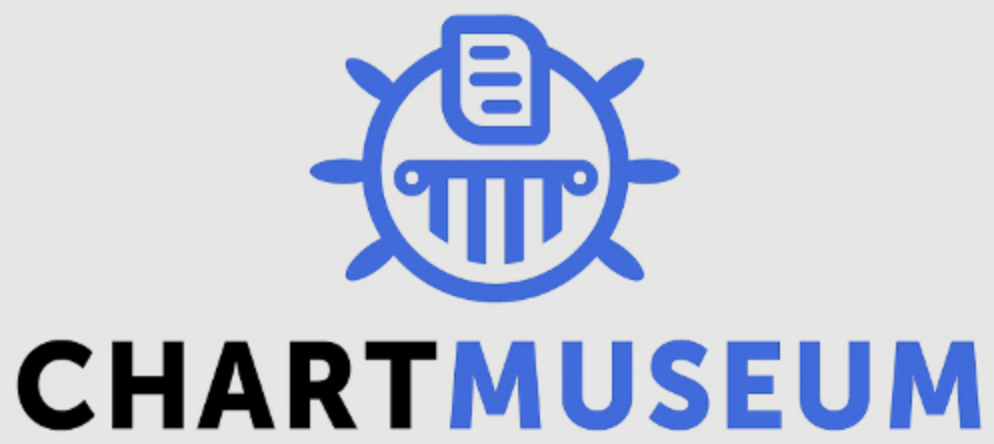
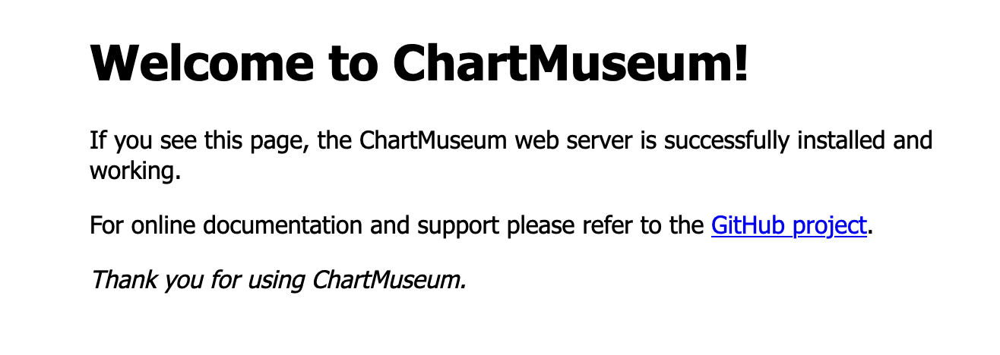
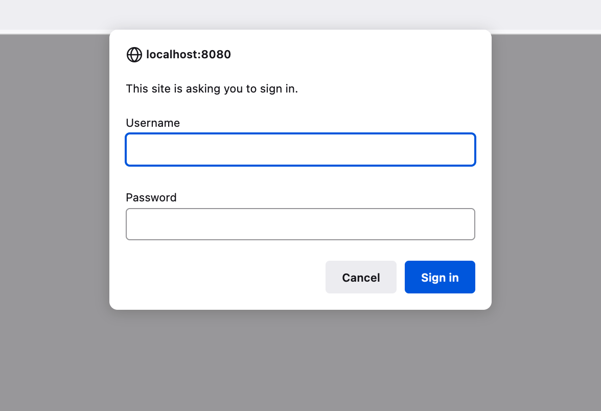
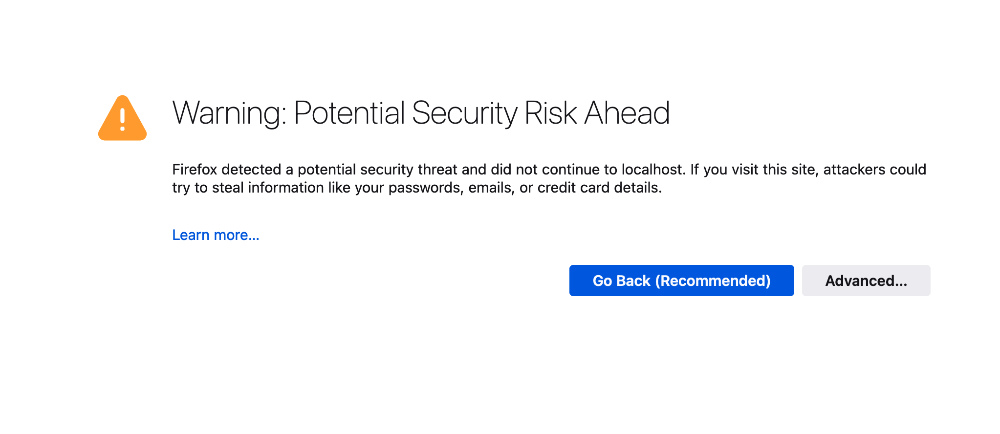

<p align="center">
</img>
</p>

# 关于 ChartMuseum

ChartMuseum 是一个用 Go 语言写的开源的 Helm Chart Repository 服务器，目前支持多种云存储后端，诸如 Google Cloud Storage、Alibaba Cloud OSS Storage、Minio 以及 etcd 等。

ChartMuseum 有多种 API 来完成对 Helm Chart Repository、Chart 以及 Server 的操作。所有可用的 API 以及使用方法可查看[GitHub Repo](https://github.com/helm/chartmuseum)。


# ChartMuseum 的使用


## ChartMuseum 的安装

ChartMuseum 的安装支持 gofish、bash 脚本以及 docker。详细使用可参考[官网](https://chartmuseum.com/#Instructions)。本文用 docker 来安装一个 ChartMuseum 实例。


```
$ docker run --rm -it \
  -p 8080:8080 \
  -e DEBUG=1 \
  -e STORAGE=local \
  -e STORAGE_LOCAL_ROOTDIR=/charts \
  -v $(pwd)/charts:/charts \
  ghcr.io/helm/chartmuseum:v0.14.0
2022-07-24T14:28:19.913Z	DEBUG	Fetching chart list from storage	{"repo": ""}
2022-07-24T14:28:19.915Z	DEBUG	No change detected between cache and storage	{"repo": ""}
2022-07-24T14:28:19.915Z	INFO	Starting ChartMuseum	{"host": "0.0.0.0", "port": 8080}
2022-07-24T14:28:19.916Z	DEBUG	Starting internal event listener
```

上述命令中选择了 local 作为后端存储，ChartMuseum 的监听端口为 8080，可以用 localhost:8080 访问实例。



## ChartMuseum 的使用

### 上传一个 Chart

首先创建一个 chart 并打包：

```
$ helm create cm-demo
Creating cm-demo

$ helm package cm-demo
Successfully packaged chart and saved it to: /Users/xiaomage/Documents/xiaomage/helm-demo/cm-demo-0.1.0.tgz

$ ls -ltr 
-rw-r--r--  1 xiaomage  staff  3754 Jul 24 22:53 cm-demo-0.1.0.tgz
```

使用如下命令上传到 ChartMuseum：

```
$ curl --data-binary "@cm-demo-0.1.0.tgz" http://localhost:8080/api/charts
{"saved":true}
```

整个过程可以查看 ChartMuseum 的 log：

```
2022-07-24T14:55:05.850Z	DEBUG	[5] Incoming request: /api/charts	{"reqID": "f84dc98c-2176-4182-96cb-585a99372c4b"}
2022-07-24T14:55:05.855Z	DEBUG	[5] Adding package to storage	{"package": "cm-demo-0.1.0.tgz", "reqID": "f84dc98c-2176-4182-96cb-585a99372c4b"}
2022-07-24T14:55:05.855Z	DEBUG	[5] PutWithLimit: per-chart-limit not set	{"reqID": "f84dc98c-2176-4182-96cb-585a99372c4b"}
2022-07-24T14:55:05.861Z	INFO	[5] Request served	{"path": "/api/charts", "comment": "", "clientIP": "172.17.0.1", "method": "POST", "statusCode": 201, "latency": "10.343201ms", "reqID": "f84dc98c-2176-4182-96cb-585a99372c4b"}
2022-07-24T14:55:05.861Z	DEBUG	[5] Event received	{"event": {"repo_name":"","operation_type":1,"chart_version":{"name":"cm-demo","version":"0.1.0","description":"A Helm chart for Kubernetes","apiVersion":"v2","appVersion":"1.16.0","type":"application","urls":["charts/cm-demo-0.1.0.tgz"],"created":"2022-07-24T14:55:05.8606406Z","digest":"7c166f8b1c87b62797c54016a713b5e7443ea138adf907a4e140f2bbb0f3a375"}}, "reqID": "f84dc98c-2176-4182-96cb-585a99372c4b"}
2022-07-24T14:55:05.861Z	DEBUG	[5] Entry found in cache store	{"repo": "", "reqID": "f84dc98c-2176-4182-96cb-585a99372c4b"}
2022-07-24T14:55:05.862Z	DEBUG	[5] Entry saved in cache store	{"repo": "", "reqID": "f84dc98c-2176-4182-96cb-585a99372c4b"}
2022-07-24T14:55:05.862Z	DEBUG	[5] Event handled successfully	{"event": {"repo_name":"","operation_type":1,"chart_version":{"name":"cm-demo","version":"0.1.0","description":"A Helm chart for Kubernetes","apiVersion":"v2","appVersion":"1.16.0","type":"application","urls":["charts/cm-demo-0.1.0.tgz"],"created":"2022-07-24T14:55:05.8606406Z","digest":"7c166f8b1c87b62797c54016a713b5e7443ea138adf907a4e140f2bbb0f3a375"}}, "reqID": "f84dc98c-2176-4182-96cb-585a99372c4b"}
2022-07-24T14:55:05.875Z	DEBUG	[5] index-cache.yaml saved in storage	{"repo": "", "reqID": "f84dc98c-2176-4182-96cb-585a99372c4b"}
```

可以看到调用了 `/api/charts` 这个 API，并且解析了 Chart 的信息，诸如版本，描述信息等。可以在后端存储查看对应的 chart：

```
$ ls -ltr charts
total 24
-rw-r--r--  1 xiaomage  staff  3754 Jul 24 22:55 cm-demo-0.1.0.tgz
-rw-r--r--  1 xiaomage  staff   734 Jul 24 22:55 index-cache.yaml
```
查看 `index-cache.yaml` 文件：

```
$ cat index-cache.yaml
apiVersion: v1
entries:
  cm-demo:
  - apiVersion: v2
    appVersion: 1.16.0
    created: "2022-07-24T14:55:05.8606406Z"
    description: A Helm chart for Kubernetes
    digest: 7c166f8b1c87b62797c54016a713b5e7443ea138adf907a4e140f2bbb0f3a375
    name: cm-demo
    type: application
    urls:
    - charts/cm-demo-0.1.0.tgz
    version: 0.1.0
generated: "2022-07-24T14:55:06Z"
serverInfo: {}
```
可以看到 chart 的信息。

也可以使用 `helm cm-push` 命令来完成推送。[cm-push](https://github.com/chartmuseum/helm-push/blob/main/README.md)是一个用来将 chart 推送到 ChartMuseum 的插件。使用如下命令安装即可：

```
$ helm plugin install https://github.com/chartmuseum/helm-push
Downloading and installing helm-push v0.10.1 ...
https://github.com/chartmuseum/helm-push/releases/download/v0.10.1/helm-push_0.10.1_darwin_amd64.tar.gz
Installed plugin: cm-push
```
然后推送：

```
$ helm cm-push cm-demo/ chartmuseum 
Pushing cm-demo-0.1.1.tgz to chartmuseum...
Done.
```
同样可以在 Registry 里面找到对应的 chart。

### list 所有 chart

调用 `/api/charts` 即可 list 所有 charts：

```
$ curl  http://localhost:8080/api/charts | jq .
  % Total    % Received % Xferd  Average Speed   Time    Time     Time  Current
                                 Dload  Upload   Total   Spent    Left  Speed
100   640  100   640    0     0  27826      0 --:--:-- --:--:-- --:--:-- 27826
{
  "cm-demo": [
    {
      "name": "cm-demo",
      "version": "0.1.0",
      "description": "A Helm chart for Kubernetes",
      "apiVersion": "v2",
      "appVersion": "1.16.0",
      "type": "application",
      "urls": [
        "charts/cm-demo-0.1.0.tgz"
      ],
      "created": "2022-07-24T15:47:35.380165176Z",
      "digest": "7c166f8b1c87b62797c54016a713b5e7443ea138adf907a4e140f2bbb0f3a375"
    }
  ],
  "cloud-native": [
    {
      "name": "cloud-native",
      "version": "0.1.0",
      "description": "A Helm chart for Kubernetes",
      "apiVersion": "v2",
      "appVersion": "1.16.0",
      "type": "application",
      "urls": [
        "charts/cloud-native-0.1.0.tgz"
      ],
      "created": "2022-07-24T15:48:04.904623867Z",
      "digest": "2b6cec2ff082c1bc61bf5c43552d7d27cfe2d0c578e596a4c19451e55bdfd190"
    }
  ]
}
```

### 删除一个 Chart

调用 `/api/charts/<name>/<version>` 即可删除对应chart，以上文的 cloud-native chart 为例：

```
$ curl  -X DELETE http://localhost:8080/api/charts/cloud-native/0.1.0
{"deleted":true}
```
再 list 一下进行确认：

```
$ curl   http://localhost:8080/api/charts/devops-is-shit/0.1.0 
{"error":"no chart name found"}
```
可以看到 chart 已经被删除。

### 使用 Helm Chart

可以使用上传到 ChartMuseum 的 chart 进行部署安装。

首先需要添加 ChartMuseum 为 Helm Chart Repo：

```
$ helm repo add chartmuseum http://localhost:8080/
"chartmuseum" has been added to your repositories

$ helm repo list
chartmuseum	http://localhost:8080/
```
接着使用 install 命令安装：

```
$ helm install cm-demo --namespace cm-demo --create-namespace chartmuseum/cm-demo
NAME: cm-demo
LAST DEPLOYED: Sun Jul 24 23:05:34 2022
NAMESPACE: cm-demo
STATUS: deployed
REVISION: 1
NOTES:
1. Get the application URL by running these commands:
  export POD_NAME=$(kubectl get pods --namespace cm-demo -l "app.kubernetes.io/name=cm-demo,app.kubernetes.io/instance=cm-demo" -o jsonpath="{.items[0].metadata.name}")
  export CONTAINER_PORT=$(kubectl get pod --namespace cm-demo $POD_NAME -o jsonpath="{.spec.containers[0].ports[0].containerPort}")
  echo "Visit http://127.0.0.1:8080 to use your application"
  kubectl --namespace cm-demo port-forward $POD_NAME 8080:$CONTAINER_PORT
```
接着查看 pod：

```
$ kubectl -n cm-demo get pods
NAME                                     READY   STATUS    RESTARTS   AGE
cm-demo-c89f796b4-wxv29   1/1     Running   0          67s
```

整个过程可以查看 ChartMuseum 的 log：

```
2022-07-24T15:00:05.374Z	DEBUG	[6] Incoming request: /index.yaml	{"reqID": "3a5f8ca9-9d3a-46ce-8c46-c795b44d47c8"}
2022-07-24T15:00:05.374Z	DEBUG	[6] Entry found in cache store	{"repo": "", "reqID": "3a5f8ca9-9d3a-46ce-8c46-c795b44d47c8"}
2022-07-24T15:00:05.375Z	INFO	[6] Request served	{"path": "/index.yaml", "comment": "", "clientIP": "172.17.0.1", "method": "GET", "statusCode": 200, "latency": "166.463µs", "reqID": "3a5f8ca9-9d3a-46ce-8c46-c795b44d47c8"}
2022-07-24T15:05:32.590Z	DEBUG	[7] Incoming request: /charts/cm-demo-0.1.0.tgz	{"reqID": "5b924457-c55a-444d-b258-7b52705e5556"}
2022-07-24T15:05:32.606Z	INFO	[7] Request served	{"path": "/charts/cm-demo-0.1.0.tgz", "comment": "", "clientIP": "172.17.0.1", "method": "GET", "statusCode": 200, "latency": "15.667215ms", "reqID": "5b924457-c55a-444d-b258-7b52705e5556"}
```

可以看到调用了 `/index.yaml` 以及 `/charts/cm-demo-0.1.0.tgz`。`/index.yaml` 是在执行 `helm repo add` 时候调用的，`/charts/cm-demo-0.1.0.tgz` 是在执行 `helm install` 时候调用的。

当然，还有很多 API 来完成 chart 查询、描述等。可在 GitHub 上进行查询。


## 其他配置

### Basic Auth

可以通过配置 Basic Auth 来完成登录认证。只需要指定 `--basic-auth-user` 与 `--basic-auth-pass` 两个参数即可。比如在 docker 启动的时候以 `-e` 的形式传入 `username` 和 `password` 即可。

```
$ docker run --rm -it \
  -p 8080:8080 \
  -e DEBUG=1 \
  -e STORAGE=local \
  -e BASIC_AUTH_USER=admin \
  -e BASIC_AUTH_PASS=password \
  -e STORAGE_LOCAL_ROOTDIR=/charts \
  -v $(pwd)/charts:/charts \
  ghcr.io/helm/chartmuseum:v0.14.0
```

再次使用 `http://localhost:8080` 登录，会出现需要输入用户名和密码的窗口：



输入用户名和密码登录即可。


### HTTPS 配置

在启动的时候指定 `--tls-cert` 与 `--tls-key` 两个参数即可开启 HTTPS。首先生成一对证书：

```
$ openssl req -x509 -sha256 -nodes -days 365 -newkey rsa:2048 -keyout cm.key -out cm.crt
```
根据输出的信息填写对应的证书信息，可以生成相应的 cert 和 key：

```
$ ls -ltr 
-rw-r--r--  1 xiaomage  staff  1708 Jul 24 23:34 cm.key
-rw-r--r--  1 xiaomage  staff  1249 Jul 24 23:34 cm.crt
```

在启动的使用通过 `-e` 传入参数即可：

```
$ docker run --rm -it \
  -p 8080:8080 \
  -e DEBUG=1 \
  -e STORAGE=local \
  -e BASIC_AUTH_USER=admin \
  -e BASIC_AUTH_PASS=password \
  -e TLS_CERT=/charts/cm.crt \
  -e TLS_KEY=/charts/cm.key \
  -e STORAGE_LOCAL_ROOTDIR=/charts \
  -v $(pwd)/charts:/charts \
  ghcr.io/helm/chartmuseum:v0.14.0
```

然后用 `https://localhost:8080` 来登录，会出现告警：



这是因为使用了自签名证书，浏览器不受信任。点击 `Advanced`，在出现的界面点击 `Accept the Risk and Continue` 即可出现需要输入用户名和密码的窗口，输入信息即可登录。
