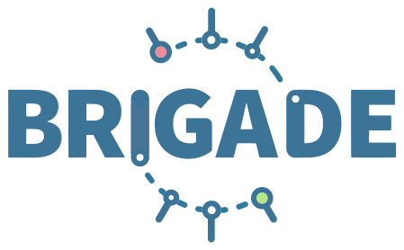
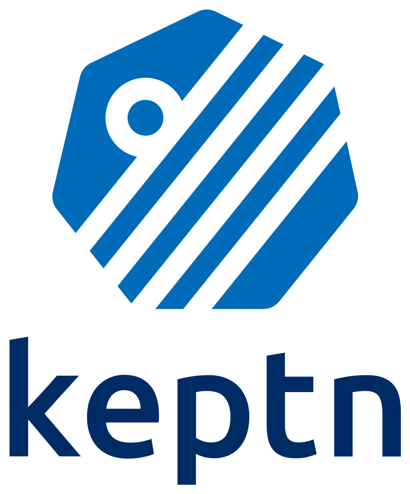

# CNCF 中与持续交付相关的项目

CNCF 中目前托管有 118 个项目，[16 个已经毕业的项目](https://www.cncf.io/projects/)，[34 个正在孵化的项目](https://www.cncf.io/projects/)以及 [58 个处于沙箱的项目](https://www.cncf.io/sandbox-projects/)。下面会梳理一下与持续交付相关的几个项目。

目前在已经毕业的项目中没有与持续交付相关的，与持续交付相关的都是孵化或者沙箱项目中。

## 处于孵化期的持续交付项目

### Argo

Argo 是在 2020 年 4 月 7 日被 CNCF 接受的。Argo 是在 Kubernetes 上来运行 workflow、管理集群以及实现 GitOps 的一个开源工具。目前下面有 Argo Workflows、Argo CD、Argo Events 以及 Argo Rollouts。

* **Argo Workflows**： 是一个 Kubernetes 原生的工作流引擎，支持 DAG 和基于步骤的工作流，有对应的[官网](https://argoproj.github.io/argo-workflows/)和 [GitHub Repo](https://github.com/argoproj/argo-workflows)。目前在 GitHub 上有 10.9k star，最新版本为 3.3.4；
* **Argo CD**： 是一个声明式的持续交付工具，主要用来实现 GitOps，有对应的[官网](https://argo-cd.readthedocs.io/en/stable/)和 [GitHub Repo](https://github.com/argoproj/argo-cd)。目前在 GitHub 上有 9.1k star，最新版本为 2.3.3；
* **Argo Rollouts**： 主要用来实现金丝雀和蓝绿部署等部署策略，有对应的 [官网](https://argoproj.github.io/argo-rollouts/)和 [GitHub Repo](https://github.com/argoproj/argo-rollouts)。目前在 GitHub 上有 1.5k star，最新版本为 1.2.0；
* **Argo Events**： 主要是针对 Kubernetes 进行基于事件的依赖管理，有对应的[官网](https://argoproj.github.io/argo-events/)和 [GitHub Repo](https://github.com/argoproj/argo-events)。目前在 GitHub 上有 1.5k star，最新版本为 1.6.3；

使用方法可以参考过往文章[ArgoCD + Kustomize + Sops，以更安全的方式实践 GitOps](../../cloud-native/argocd-kustomize-sops/)、[GOTC 纪实｜利用 Tekton + ArgoCD 打造云原生 GitSecOps](../../devsecops/gitops/)。

### Flagger

Flagger 是一个渐进式的交付工具，能够自动化运行在 Kubernetes 上的应用程序发布流程。主要是通过多种部署策略的实现来完成的，诸如金丝雀发布、A/B 测试、蓝/绿部署等。整体示意图如下：

对应有[官网](https://docs.flagger.app/)和 [GitHub Repo](https://github.com/fluxcd/flagger)。目前在 GitHub 上有 3.6k star。最新版本为 1.20.0。

### Flux

Flux 是在 2019 年 7 月 15 日成为 CNCF 项目的。Flux 是一套用于 Kubernetes 应用的持续和渐进式交付解决方案，具有开放性和可扩展性。也是实现 GitOps 的一个重要工具，GitOps Toolkit 的示意图如下：

对应有[官网](https://fluxcd.io/)和 [GitHub Repo](https://github.com/fluxcd/flux2)。目前在 GitHub 上有 3.2k star。最新版本为 0.29.5。

## 处于沙箱的持续交付项目

### Brigade

Brigade 是在 2019 年 3 月 18 日成为 CNCF 项目的。Brigade 是一个在 Kubernetes 上运行基于事件驱动脚本的工具。目前已经集成了多种事件源，而且可以进行源源不断的添加。

对应有[官网](https://brigade.sh/)和 [GitHub Repo](https://github.com/brigadecore/brigade/)。目前在 GitHub 上有 2.3k star。最新版本为 2.4.0。

### Keptn

Keptn 是在 2020 年 6 月 23 日成为 CNCF 项目的。Keptn 是一个基于事件的控制面，用于云原生应用的持续交付和自动化操作。

对应有[官网](https://keptn.sh/)和 [GitHub Repo](https://github.com/keptn/keptn)。目前在 GitHub 上有 2.3k star。最新版本是 0.13.5。

### OpenGitOps

OpenGitOps 是一套开源标准、最佳实践以及以社区为中心的教育，主要目的是帮助企业采用结构化、标准化的方法来实践 GitOps。OpenGitOps 目前是由 CNCF 的 GitOps WG（工作组）来指导，这个工作组在 CNCF App Delivery TAG 下面。这是一个面向公众开放的工作组，任何人都可以参与进去。

对应有[官网](https://opengitops.dev/)和 [GitHub Repo](https://github.com/open-gitops/），目前有多个文档、项目和网站等多个 Repo。

### OpenKruise

OpenKruise 是一个 Kubernetes 上自动化应用程序管理的工具，主要是通过 Kubernetes 的扩展机制来实现。

对应有[官网](https://openkruise.io/docs/)和 [GitHub Repo](https://github.com/openkruise/kruise)。目前在 GitHub 上有 3.2k star。最新版本为 1.1.0。

# CDF 中的持续交付项目

Continuous Delivery Foundation，简称 CDF，是一个专门关注持续交付的基金会。目前托管有 8 个项目。

## Jenkins

Jenkins 对于很多人来讲都是非常熟悉的，也是很多人实践持续交付时候选择的一个工具。Jenkins 是 CDF 初始托管的项目之一。

对应有[官网](https://www.jenkins.io/)和 [GitHub Repo](https://github.com/jenkinsci)。目前的仓库数量已经达到 2.5K，主要的仓库 [jenkins](https://github.com/jenkinsci/jenkins) star 达到 18.8k，最新版本为 2.345。

## JenkinsX

JenkinsX 能够加速云原生应用的交付，主要是通过 GitOps 手段和基于 Pull Request 的预览，来让变更快速部署到对应的环境上。

对应有[官网](https://jenkins-x.io/)和 [GitHub Repo](https://github.com/jenkins-x/jx)。目前在 GitHub 上有 4.1k star。最新版本是 3.2.309。

## Tekton

Tekton 是一个灵活且强大的开源框架，主要用来构建 CI/CD 系统，它能允许开发者在多云环境中进行应用构建、测试以及部署。有多个核心组件，诸如 Pipeline、Hub、Triggers 等。

对应有[官网](https://tekton.dev/)和 [GitHub Repo](https://github.com/tektoncd)。GitHub 上有多个 Repo，常用的 Pipeline 有 7.1k star，最新版本为 0.35.0；Triggers 有 411 star，最新版本为 0.19.1。

使用方法可以参考过往文章[用 Tekton 来生成软件物料清单（SBOM）](../../devsecops/tekton-generate-sbom/)、[用 Tekton 来检测 Apache Log4j 漏洞](../../devsecops/tekton-log4j2/)、[Tekton Chains 是如何保证 Tekton 供应链安全的](../../cloud-native/tekton-supply-chain/)。

## Spinnaker

Spinnaker 是一个开源的持续交付平台，能够以快速和高质量来发布软件变更。它通过强大的抽象层来提供引人注目的工具，以便使开发人员能够对他们的应用快速完成从代码变更到交付。

对应有[官网](https://spinnaker.io/)和 [GitHub Repo](https://github.com/spinnaker/spinnaker)。目前在 GitHub 上有 8.4k star，最新版本为 0.83.0。

## Ortelius

Ortelius 是一个开源项目，旨在简化微服务的实现。通过提供中心化的服务目录，应用团队可以轻松地进行跨集群消费和部署服务。Ortelius 在服务更新的基础上跟踪应用程序版本，并能够映射他们的服务依赖性，消除混乱和猜测。Ortelius 的独特之处在于能够跟踪你的微服务清单，并做出跨集群的差异映射。

对应有 [官网](https://ortelius.io/)和 [GitHub Repo](https://github.com/ortelius/ortelius)。目前在 GitHub 上有 225 star，最新版为 ms-ui-10.0.17。总共发布了 7 个版本。

## Screwdriver

Screwdriver 是一个独立的、可插拔的服务来帮助用户使用最新的容器技术来完成软件的构建、测试以及持续交付。

Screwdriver 始于 2012 年，是雅虎为了简化与 Jenkins 的接口而设计的一个项目，并在 2016 年根据最佳编码实践以及以 CI/CD 为目标的前提下，重构了 Screwdriver。Screwdriver 与执行器和 SCM 无关，这意味着用户可以选择更适合自己的插件或构建自己的插件。

对应有[官网](https://screwdriver.cd/)和 [GitHub Repo](https://github.com/screwdriver-cd/screwdriver)。目前在 GitHub 上有 929 star，最新版本为 4.1.0。

## Shipwright

Shipwright 是一个用来在 Kubernetes 上构建容器镜像的框架。Shipwright 能够让开发者以更简单的方式来构建容器镜像，整个过程不需要开发者去过多学习构建镜像的一些工具（原理及用法），只需要将源代码仓库和镜像仓库地址定义在一个yaml 文件中即可。目前支持多种内置的工具构建，诸如 [Kaniko](https://github.com/GoogleContainerTools/kaniko)、[Cloud Native Buildpacks](https://buildpacks.io/)、[BuildKit](https://github.com/moby/buildkit)、[Buildah](https://buildah.io/)。

对应有[官网](https://shipwright.io/)和 [GitHub Repo](https://github.com/shipwright-io/build)。目前在 GitHub 上有 411 star。最新版本为 0.9.0。

使用方法可以参考过往文章[使用 shipwright 在 Kubernetes 上构建容器镜像](../../cloud-native/shipwright/)。

## CDEvents

CDEvents 是持续交付事件的一个通用规范，为了使完整的软件生产生态具有互操作性。这个项目产生的背景是因为在一个复杂和快速发展的 CI/CD 世界中，有许多工具和平台需要相互沟通，互操作性是一个关键的问题。CDEvents 协议定义了一个事件词汇表，使工具能够以一种可互操作的方式进行通信。

对应有[官网](https://cdevents.dev/)和 [GitHub Repo](https://github.com/cdevents/spec)。目前为止，在 GitHub 上有 14 个 star。还没有发布过版本。

