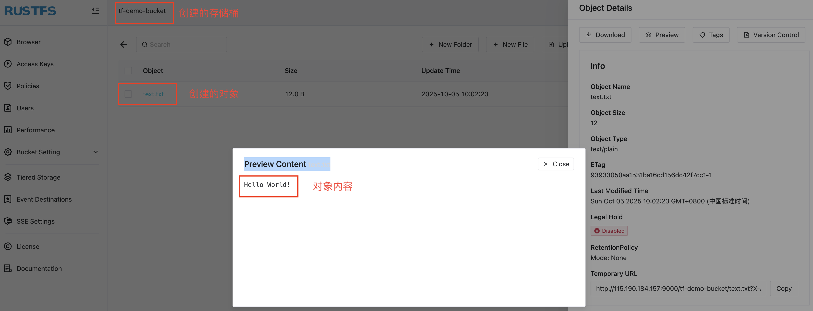

IaC（基础设施即代码）是云原生时代的重要技术栈，通过将基础设施代码化来简化基础设施的管理，而且有助于 GitOps 的实践。RustFS 作为存储领域的基础设施，也可以使用 Terraform 对其进行 IaC 化。本文分享整个实践过程。

## 前提条件

- Terraform > 1.5

    Terraform 官方提供[多种安装方式](https://developer.hashicorp.com/terraform/tutorials/aws-get-started/install-cli)，支持 windows、macOS、Linux 操作系统，根据自身需求安装完毕后，可用 `terraform --version` 或 `terraform --help` 来确认安装结果。

- 可用的 RustFS 实例

    RustFS 官方同样提供了[多种安装方式](https://docs.rustfs.com/zh/installation/linux/)，安装完毕，可通过 `http://localhost:9000` 或 `http://ip:9000` 登录验证。

## 用 Terraform 操作 RustFS 资源

Terraform 操作相关资源都是通过 provider 来实现。目前 RustFS 官方还未提供对应的 provider，但由于 RustFS 和 S3 完全兼容，而且是 minio 的平替，所以可以复用 minio 的 provider。

遗憾的是 minio 官方也并没有提供对应的 provider，但是在 GitHub 上有一个[terraform-provider-minio](https://github.com/aminueza/terraform-provider-minio)项目，可以对 minio 资源进行 IaC 管理，该 provider 也在 [Terraform 官方 Registry](https://registry.terraform.io/providers/aminueza/minio/) 中，所以，是可信、可用的。目前，此 provider 提供多种 minio 资源，可以对 `iam`、`bucket`、`object` 等进行操作。和其他 provider 的使用一样，在 terraform 配置文件中指定即可：

```
terraform {
  required_providers {
    minio = {
      source = "aminueza/minio"
      version = "3.6.5"
    }
  }
}
```

下面演示用此 provider 来对 RustFS 存储桶和对象进行操作。

### Terraform 文件配置

首先，创建一个 `main.tf` 文件，定义好 provider，需要操作的 resource 以及 resource 的输出（可选）。比如，创建一个 RustFS bucket 并且上传一个 txt 文件作为对象。

```
terraform {
  required_providers {
    minio = {
      source = "aminueza/minio"
      version = "=3.6.5"
    }
  }
}

provider "minio" {
  minio_server   = var.rustfs_endpoint
  minio_user     = var.rustfs_access_key
  minio_password = var.rustfs_secret_key
  minio_region   = var.rustfs_region
}

resource "minio_s3_bucket" "rustfs_bucket_creation" {
  bucket = var.bucket_name
  acl    = "public"
}

resource "minio_s3_object" "txt_file" {
  depends_on = [minio_s3_bucket.rustfs_bucket_creation]
  bucket_name = minio_s3_bucket.rustfs_bucket_creation.bucket
  object_name = "text.txt"
  content = "Hello World!"
  content_type = "text/plain"
}

output "minio_id" {
  value = "${minio_s3_bucket.rustfs_bucket_creation.id}"
}

output "minio_url" {
  value = "${minio_s3_bucket.rustfs_bucket_creation.bucket_domain_name}"
}
```

RustFS 实例的具体信息以及要创建的存储桶名称都定义在 `variables.tf` 文件中：

```
variable "rustfs_endpoint" {
  description = "RustFS instance endpoint"
  type        = string
  default     = "http://localhost:9000"
}

variable "rustfs_access_key" {
  description = "RustFS access key"
  type        = string
  default     = "rustfsadmin"
}

variable "rustfs_secret_key" {
  description = "RustFS secret key"
  type        = string
  default     = "rustfsadmin"
}

variable "rustfs_region" {
  description = "The region of RustFS instance"
  type        = string
  default     = "cn-east-1"
}

variable "bucket_name" {
  description = "The name of the RustFS bucket"
  type        = string
  default     = "terraform-demo-bucket"
}
```

具体的值都定义在 terraform 的变量文件 `terraform.tfvars` 中：

```
rustfs_endpoint   = "11.19.18.15:9000"
rustfs_access_key = "rustfsadmin"
rustfs_secret_key = "rustfsadmin"
rustfs_region     = "cn-east-1"
bucket_name       = "tf-demo-bucket"
```

### Terraform 操作

众所周知，terraform 有三步曲：`init`、`plan`、`apply`，来完成资源的创建。因此，在上一步骤中三个 tf 文件所在的目录下执行这三个命令。

#### 执行 `init` 命令

执行 `terraform init` 命令进行初始化：

```
terraform init
Initializing the backend...
Initializing provider plugins...
- Reusing previous version of aminueza/minio from the dependency lock file
- Using previously-installed aminueza/minio v3.6.5

Terraform has been successfully initialized!

You may now begin working with Terraform. Try running "terraform plan" to see
any changes that are required for your infrastructure. All Terraform commands
should now work.

If you ever set or change modules or backend configuration for Terraform,
rerun this command to reinitialize your working directory. If you forget, other
commands will detect it and remind you to do so if necessary.
```

> 如果是初次执行这个命令会去下载配置好的 provider，如本文中的 `aminueza/minio`。有时候会因为网络问题，可能会导致下载失败，这个时候可以选择手动下载此 provider，并将其拷贝到 terraform 的 plugins 目录下，一般是 `~/.terraform.d/plugins/`。

#### 执行 `plan` 命令

执行 `terraform plan` 命令来“预览”对资源的操作，此命令不会真正执行对资源的具体操作。

```
terraform plan

Terraform used the selected providers to generate the following execution plan. Resource actions are indicated with the following symbols:
  + create

Terraform will perform the following actions:

  # minio_s3_bucket.rustfs_bucket_creation will be created
  + resource "minio_s3_bucket" "rustfs_bucket_creation" {
      + acl                = "public"
      + arn                = (known after apply)
      + bucket             = "tf-demo-bucket"
      + bucket_domain_name = (known after apply)
      + force_destroy      = false
      + id                 = (known after apply)
      + object_locking     = false
    }

  # minio_s3_object.txt_file will be created
  + resource "minio_s3_object" "txt_file" {
      + bucket_name  = "tf-demo-bucket"
      + content      = "Hello World!"
      + content_type = "text/plain"
      + etag         = (known after apply)
      + id           = (known after apply)
      + object_name  = "text.txt"
      + version_id   = (known after apply)
    }

Plan: 2 to add, 0 to change, 0 to destroy.

Changes to Outputs:
  + minio_id  = (known after apply)
  + minio_url = (known after apply)

──────────────────────────────────────────────────────────────────────────────────────────────────────────────────────────────────────────────────────────────

Note: You didn't use the -out option to save this plan, so Terraform can't guarantee to take exactly these actions if you run "terraform apply" now.
```

从结果看，提示操作的资源有两个：

- 会创建一个名为 `tf-demo-bucket` 的存储桶；
- 会在 `tf-demo-bucket` 存储桶中创建一个对象，是一个名为 `text.txt` 的文件，内容为 `Hello World!`；

如果确认无误，执行 `apply` 命令。

#### 执行 `apply` 命令

执行 `terraform apply` 命令对资源进行真正操作。

```
terraform plan

Terraform used the selected providers to generate the following execution plan. Resource actions are indicated with the following symbols:
  + create

Terraform will perform the following actions:

  # minio_s3_bucket.rustfs_bucket_creation will be created
  + resource "minio_s3_bucket" "rustfs_bucket_creation" {
      + acl                = "public"
      + arn                = (known after apply)
      + bucket             = "tf-demo-bucket"
      + bucket_domain_name = (known after apply)
      + force_destroy      = false
      + id                 = (known after apply)
      + object_locking     = false
    }

  # minio_s3_object.txt_file will be created
  + resource "minio_s3_object" "txt_file" {
      + bucket_name  = "tf-demo-bucket"
      + content      = "Hello World!"
      + content_type = "text/plain"
      + etag         = (known after apply)
      + id           = (known after apply)
      + object_name  = "text.txt"
      + version_id   = (known after apply)
    }

Plan: 2 to add, 0 to change, 0 to destroy.

Changes to Outputs:
  + minio_id  = (known after apply)
  + minio_url = (known after apply)

──────────────────────────────────────────────────────────────────────────────────────────────────────────────────────────────────────────────────────────────

Note: You didn't use the -out option to save this plan, so Terraform can't guarantee to take exactly these actions if you run "terraform apply" now.
root@iv-ye61b0vg8wcva4gbgjxs:/home/xiaomage/terraform# 
root@iv-ye61b0vg8wcva4gbgjxs:/home/xiaomage/terraform# terraform apply

Terraform used the selected providers to generate the following execution plan. Resource actions are indicated with the following symbols:
  + create

Terraform will perform the following actions:

  # minio_s3_bucket.rustfs_bucket_creation will be created
  + resource "minio_s3_bucket" "rustfs_bucket_creation" {
      + acl                = "public"
      + arn                = (known after apply)
      + bucket             = "tf-demo-bucket"
      + bucket_domain_name = (known after apply)
      + force_destroy      = false
      + id                 = (known after apply)
      + object_locking     = false
    }

  # minio_s3_object.txt_file will be created
  + resource "minio_s3_object" "txt_file" {
      + bucket_name  = "tf-demo-bucket"
      + content      = "Hello World!"
      + content_type = "text/plain"
      + etag         = (known after apply)
      + id           = (known after apply)
      + object_name  = "text.txt"
      + version_id   = (known after apply)
    }

Plan: 2 to add, 0 to change, 0 to destroy.

Changes to Outputs:
  + minio_id  = (known after apply)
  + minio_url = (known after apply)

Do you want to perform these actions?
  Terraform will perform the actions described above.
  Only 'yes' will be accepted to approve.

  Enter a value: yes

minio_s3_bucket.rustfs_bucket_creation: Creating...
minio_s3_bucket.rustfs_bucket_creation: Creation complete after 0s [id=tf-demo-bucket]
minio_s3_object.txt_file: Creating...
minio_s3_object.txt_file: Creation complete after 0s [id=text.txt]

Apply complete! Resources: 2 added, 0 changed, 0 destroyed.

Outputs:

minio_id = "tf-demo-bucket"
minio_url = "http://11.19.18.15:9000/minio/tf-demo-bucket"
```

过程中需要确认是否执行此操作：

```
Do you want to perform these actions?
  Terraform will perform the actions described above.
  Only 'yes' will be accepted to approve.

  Enter a value: yes
```

执行结果显示，新增了两个资源（`Resources: 2 added`）。可以通过 RustFS Web 页面查看 `tf-demo-bucket` 存储桶是否存在，下面是否有名为 `text.txt` 的文件，内容为 `Hello World!`。



#### 执行 `destroy` 命令

如果想要销毁创建的资源，直接执行 `terraform destroy` 命令：

```
terraform destroy
minio_s3_bucket.rustfs_bucket_creation: Refreshing state... [id=tf-demo-bucket]
minio_s3_object.txt_file: Refreshing state... [id=text.txt]

Terraform used the selected providers to generate the following execution plan. Resource actions are indicated with the following symbols:
  - destroy

Terraform will perform the following actions:

  # minio_s3_bucket.rustfs_bucket_creation will be destroyed
  - resource "minio_s3_bucket" "rustfs_bucket_creation" {
      - acl                = "public" -> null
      - arn                = "arn:aws:s3:::tf-demo-bucket" -> null
      - bucket             = "tf-demo-bucket" -> null
      - bucket_domain_name = "http://11.19.18.15:9000/minio/tf-demo-bucket" -> null
      - force_destroy      = false -> null
      - id                 = "tf-demo-bucket" -> null
      - object_locking     = false -> null
    }

  # minio_s3_object.txt_file will be destroyed
  - resource "minio_s3_object" "txt_file" {
      - bucket_name  = "tf-demo-bucket" -> null
      - content      = "Hello World!" -> null
      - content_type = "text/plain" -> null
      - etag         = "93933050aa1531ba16cd156dc42f7cc1-1" -> null
      - id           = "text.txt" -> null
      - object_name  = "text.txt" -> null
        # (1 unchanged attribute hidden)
    }

Plan: 0 to add, 0 to change, 2 to destroy.

Changes to Outputs:
  - minio_id  = "tf-demo-bucket" -> null
  - minio_url = "http://11.19.18.15:9000/minio/tf-demo-bucket" -> null

Do you really want to destroy all resources?
  Terraform will destroy all your managed infrastructure, as shown above.
  There is no undo. Only 'yes' will be accepted to confirm.

  Enter a value: yes

minio_s3_object.txt_file: Destroying... [id=text.txt]
minio_s3_object.txt_file: Destruction complete after 0s
minio_s3_bucket.rustfs_bucket_creation: Destroying... [id=tf-demo-bucket]
minio_s3_bucket.rustfs_bucket_creation: Destruction complete after 0s

Destroy complete! Resources: 2 destroyed.
```

过程中也需要确认是否要执行销毁操作：

```
Do you really want to destroy all resources?
  Terraform will destroy all your managed infrastructure, as shown above.
  There is no undo. Only 'yes' will be accepted to confirm.

  Enter a value: yes
```

执行结果是销毁了两个资源（`Resources: 2 destroyed.`）。

如果在 RustFS Web 页面上查看，会发现之前创建的存储桶 `tf-demo-bucket` 已不存在。

可以用类似的方式来对其他资源进行操作。感兴趣的可以自行实践。

## 写在最后

复用 minio 的 provider 可以实现对 RustFS 资源的操作，侧面说明了 RustFS 是 minio 的平替。另外，通过 IaC 来操作 RustFS 资源，会让整个基础设施的管理更加简单化。