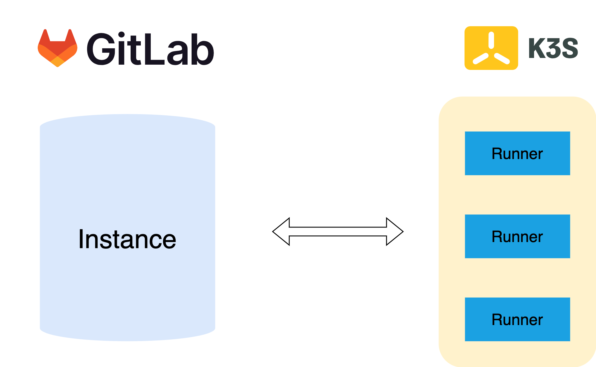
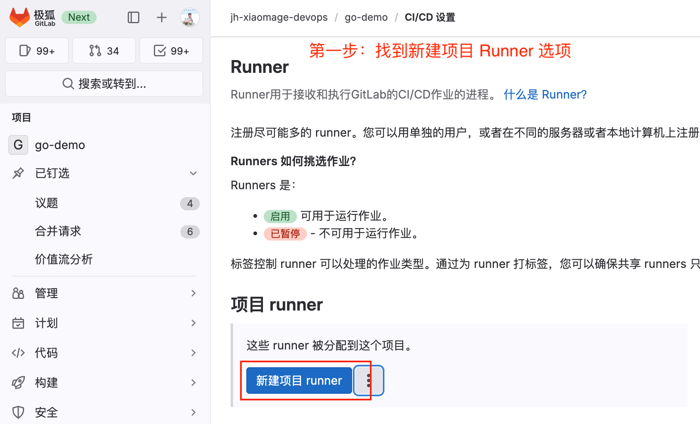
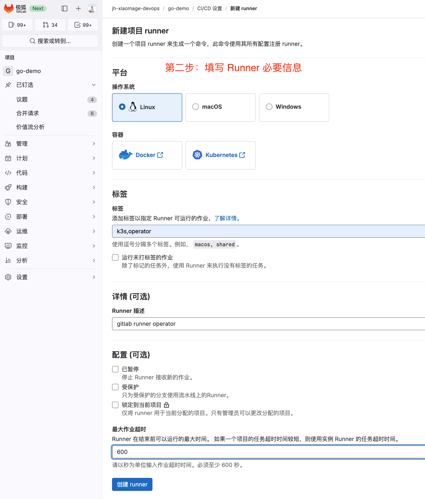
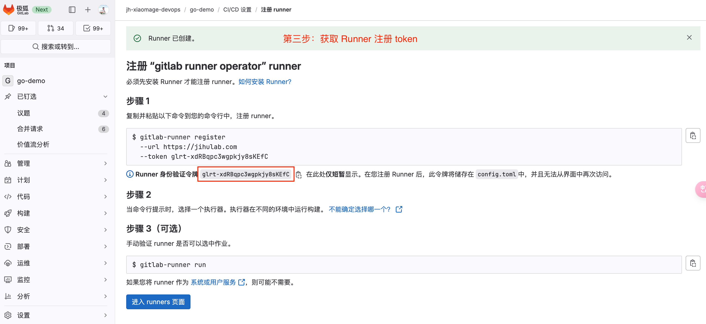
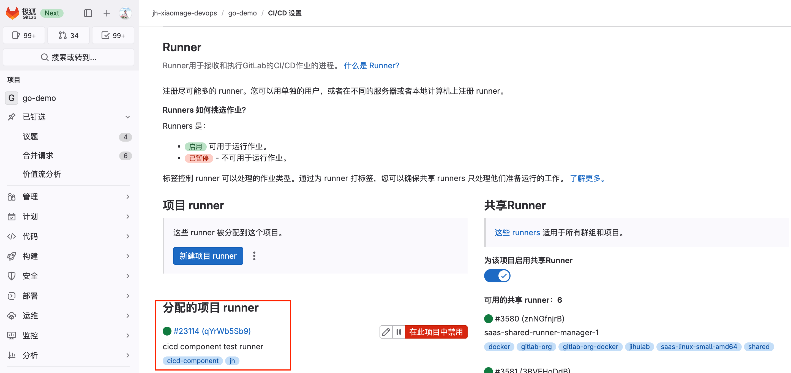
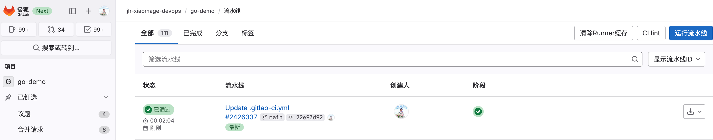
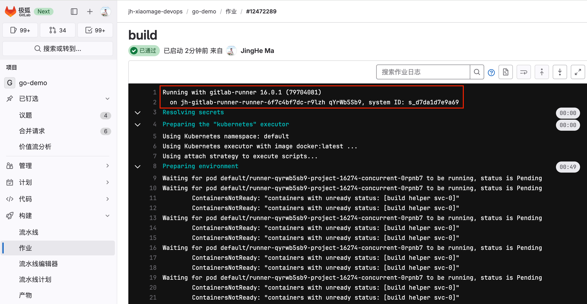

GitLab CI 是非常常用的一款 CI/CD 工具，只需要在 `.gitlab-ci.yml` 文件中用 YAML 语法编写 CI/CD 流水线即可。而 GitLab CI 能够运行的关键组件是 [GitLab Runner](https://docs.gitlab.com/runner/)。GitLab Runner 是一个轻量级、高扩展的代理，主要用来执行 GitLab CI/CD 流水线中的 Job，然后将 Job 的执行结果返回 GitLab 实例。

GitLab Runner 的安装方式有很多种，包括安装包、Docker、Helm Chart 等，本文将用 GitLab Runner Operator 的方式来在 k3s 上安装 GitLab Runner，并执行 CI/CD 流水线。关于其他安装方式的详情，可以查看 [GitLab Runner 安装文档](https://docs.gitlab.com/runner/install/)。

[GitLab Runner Operator](https://gitlab.com/gitlab-org/gl-openshift/gitlab-runner-operator) 主要是在 Kubernetes 平台上来管理 GitLab Runner。在 Kubernetes 平台上安装 GitLab Runner 有两个先决条件：

* Kubernetes 的版本必须是 v1.21.1 以上
* Cert manager 的版本为 v1.7.1 以上

本文使用 k3s 来搭建一个 Kubernetes 平台。


## k3s 的安装


[k3s](https://www.rancher.cn/k3s/) 是经 CNCF 一致性认证的 Kubernetes 发行版，专为物联网及边缘计算而设计。简言之，k3s 是一个轻量级的 Kubernetes 发行版。

k3s 的安装非常简单，对于国内用户来讲，执行如下命令可以加速 k3s 的安装：

```
curl -sfL https://rancher-mirror.rancher.cn/k3s/k3s-install.sh | INSTALL_K3S_MIRROR=cn sh -
[INFO]  Finding release for channel stable
[INFO]  Using v1.28.5+k3s1 as release
[INFO]  Downloading hash rancher-mirror.rancher.cn/k3s/v1.28.5-k3s1/sha256sum-amd64.txt
[INFO]  Downloading binary rancher-mirror.rancher.cn/k3s/v1.28.5-k3s1/k3s
[INFO]  Verifying binary download
[INFO]  Installing k3s to /usr/local/bin/k3s
[INFO]  Skipping installation of SELinux RPM
[INFO]  Creating /usr/local/bin/kubectl symlink to k3s
[INFO]  Creating /usr/local/bin/crictl symlink to k3s
[INFO]  Skipping /usr/local/bin/ctr symlink to k3s, command exists in PATH at /usr/bin/ctr
[INFO]  Creating killall script /usr/local/bin/k3s-killall.sh
[INFO]  Creating uninstall script /usr/local/bin/k3s-uninstall.sh
[INFO]  env: Creating environment file /etc/systemd/system/k3s.service.env
[INFO]  systemd: Creating service file /etc/systemd/system/k3s.service
sh: 1014: restorecon: not found
sh: 1015: restorecon: not found
[INFO]  systemd: Enabling k3s unit
Created symlink /etc/systemd/system/multi-user.target.wants/k3s.service → /etc/systemd/system/k3s.service.
[INFO]  systemd: Starting k3s
```

接着可以查看 k3s 是否安装成功：

```
#查看 k3s 版本
k3s --version
k3s version v1.28.5+k3s1 (5b2d1271)
go version go1.20.12

# 查看 k3s 集群
kubectl get nodes
NAME             STATUS   ROLES                  AGE   VERSION
vm-0-12-ubuntu   Ready    control-plane,master   38s   v1.28.5+k3s1
```

上述命令已经快速构建了一个单节点的 k3s 集群。接下来就可以在这个 k3s 集群上使用 GitLab Runner Operator 来安装 GitLab Runner 了。安装详情可以在 [OperatorHub.io](https://operatorhub.io/operator/gitlab-runner-operator) 上查看详细步骤。


## GitLab Runner Operator 的安装

在安装之前首先需要安装 cert-manager，使用如下命令可完成安装


### 安装 cert-manager 

```
$ kubectl apply -f https://github.com/jetstack/cert-manager/releases/download/v1.7.1/cert-manager.yaml

customresourcedefinition.apiextensions.k8s.io/certificaterequests.cert-manager.io created
customresourcedefinition.apiextensions.k8s.io/certificates.cert-manager.io created
customresourcedefinition.apiextensions.k8s.io/challenges.acme.cert-manager.io created

......太长了，删除一部分输出日志......

mutatingwebhookconfiguration.admissionregistration.k8s.io/cert-manager-webhook created
validatingwebhookconfiguration.admissionregistration.k8s.io/cert-manager-webhook created
```

> 上述过程中安装了 N 多 Kubernetes 资源。

### 安装 Operator Lifecycle Manager

接下来要安装 Operator Lifecycle Manager（OLM），这是一个能够对 Kubernetes 集群上 Operator 进行管理的工具。使用如下命令安装：


```
$ curl -sL https://github.com/operator-framework/operator-lifecycle-manager/releases/download/v0.26.0/install.sh | bash -s v0.26.0

customresourcedefinition.apiextensions.k8s.io/catalogsources.operators.coreos.com created
customresourcedefinition.apiextensions.k8s.io/clusterserviceversions.operators.coreos.com created

......太长了，删除一部分输出日志......

Waiting for deployment "olm-operator" rollout to finish: 0 of 1 updated replicas are available...
deployment "olm-operator" successfully rolled out
deployment "catalog-operator" successfully rolled out
Package server phase: Installing
Package server phase: Succeeded
deployment "packageserver" successfully rolled out
```

可以将上面的版本换成自己想要的版本，比如 `v0.22.0`。


### Install Operator

接下来执行如下命令来完成 Operator 的安装：

```
$ kubectl create -f https://operatorhub.io/install/stable/gitlab-runner-operator.yaml
subscription.operators.coreos.com/my-gitlab-runner-operator created
```

## 查看安装的 Operator

使用如下命令查看 Operator 是否安装成功

```
# 查看 csv 资源
$ kubectl get csv -n operators
NAME                             DISPLAY         VERSION   REPLACES                         PHASE
gitlab-runner-operator.v1.15.1   GitLab Runner   1.15.1    gitlab-runner-operator.v1.15.0   Succeeded

# 查看 pod 状态
$ kubectl -n operators get pods
NAME                                                READY   STATUS    RESTARTS   AGE
gitlab-runner-controller-manager-5b7f856fc5-fhk2f   2/2     Running   0          20h
```

接下来就可以使用 GitLab Runner Operator 来创建 GitLab Runner 了。

## 使用 Operator 创建 GitLab Runner

本文使用 GitLab 中国发行版——极狐GitLab 来进行测试。极狐GitLab 是 GitLab 除 CE/EE 之外发行的另外一个版本，专门面向中国用户。可以私有化部署，也可以使用 SaaS（jihulab.com)。

创建 GitLab Runner 之前，需要明确创建什么样的 Runner，是共享的还是专有的，是群组级别的还是项目级别的。关于 GitLab Runner 的作用范围可以查看 [GitLab Runner 官方文档](https://docs.gitlab.com/ee/ci/runners/runners_scope.html)。

### 获取 Runner 注册 token

以注册项目 Runner 为例来说，在项目 --> 设置 --> CI/CD --> Runner 中，选择**新建项目 Runner**：



点击新建项目 Runner 选项，在出现的界面中填写好对于的信息，包括 Runner 标签、描述等：



点击**创建 Runner** 就会出现注册 Runner 的命令，在命令中就有 Runner 注册的 token，默认以 `plrt` 开头。



> 一定要保存好此 token，后面会用到。

### 创建包含注册 token 的 secret

将上一步中获取的 Runner 注册 token 存入下方的 yaml 文件：

```
cat > gitlab-runner-secret.yml << EOF
  apiVersion: v1
  kind: Secret
  metadata:
    name: jh-gitlab-runner-secret
  type: Opaque
  stringData:
    runner-registration-token: REPLACE_ME # 上一步中创建的 Runner 注册 token
  EOF
```

使用如下命令创建 secret 

```
$ kubectl  apply -f gitlab-runner-secret.yml
secret/jh-gitlab-runner-secret created
```

### 创建 Runner CRD

Runner CRD yaml 文件内容如下：

```
cat > gitlab-runner.yml << EOF
apiVersion: apps.gitlab.com/v1beta2
kind: Runner
metadata:
    name: gitlab-runner
spec:
    gitlabUrl: https://jihulab.com
    buildImage: alpine
    token: jh-gitlab-runner-secret
EOF
```

参数说明：

* **gitlabUrl**：GitLab/极狐GitLab 实例的地址，本文使用极狐GitLab SaaS，地址为 `https://jihulab.com`。
* **token**：上一步创建的 secret 名称。

使用如下命令完成 Runner CRD 的创建：

```
$ kubectl apply -f gitlab-runner.yml
runner.apps.gitlab.com/jh-gitlab-runner created
```

接着确认一下 Runner CRD 是否创建成功：

```
# 查看 Runner CRD 资源
kubectl get runner
NAME               AGE
jh-gitlab-runner   20h

# 查看 Runner pod
$ kubectl  get pods
NAME                                       READY   STATUS    RESTARTS   AGE
jh-gitlab-runner-runner-6f7c4bf7dc-r9lzh   1/1     Running   0          16h
```

接着就可以在项目的 Runner 页面查看 Runner 是否注册成功：



可以看到标签为有一个该项目专用的 Runner 已经注册成功。接下来测试此 Runner。


## Runner 测试

在项目的 `.gitlab-ci.yml` 文件中写入一个构建容器镜像并推送到极狐GitLab 内置的镜像仓库的 Job 配置：

```
build:
  image: docker:latest
  stage: build
  tags:
    - jh
  services:
    - docker:20.10.7-dind
  script:
    - docker login -u "$CI_REGISTRY_USER" -p "$CI_REGISTRY_PASSWORD" $CI_REGISTRY
    - docker build -t $CI_REGISTRY_IMAGE:v1.0.0 .
    - docker push $CI_REGISTRY_IMAGE:v1.0.0
```
触发流水线，然后在项目 --> 构建 --> 流水线中查看结果：



可以看到流水线构建成功。再查看构建日志，确认构建此次流水线所需的 Runner 是否为上面创建的 Runner：



从红色方框的信息看，此次 CI/CD 流水线构建使用的就是上述用 GitLab Runner Operator 创建出来的 Runner。

## 过程中遇到的问题及修复方案


### operators 中 gcr.io 镜像不可用问题

在安装 Operator 的过程中，`gitlab-runner-controller-manager` 依赖镜像 `gcr.io/kubebuilder/kube-rbac-proxy:v0.8.0`。由于此镜像在国内无法正常拉取，会导致以下错误：

```
kubectl -n operators get pods -w
NAME                                                READY   STATUS              RESTARTS   AGE
gitlab-runner-controller-manager-6d88d9d9d4-tdf5m   0/2     ContainerCreating   0          15s
gitlab-runner-controller-manager-6d88d9d9d4-tdf5m   1/2     ErrImagePull        0          31s
gitlab-runner-controller-manager-6d88d9d9d4-tdf5m   1/2     ImagePullBackOff    0          32s
```

镜像拉取失败的详细日志：

```
Warning  Failed     45s                kubelet            Failed to pull image "gcr.io/kubebuilder/kube-rbac-proxy:v0.8.0": rpc error: code = DeadlineExceeded desc = failed to pull and unpack image "gcr.io/kubebuilder/kube-rbac-proxy:v0.8.0": failed to resolve reference "gcr.io/kubebuilder/kube-rbac-proxy:v0.8.0": failed to do request: Head "https://gcr.io/v2/kubebuilder/kube-rbac-proxy/manifests/v0.8.0": dial tcp 173.194.174.82:443: i/o timeout
Warning  Failed     45s                kubelet            Error: ErrImagePull
Normal   Pulled     45s                kubelet            Container image "registry.gitlab.com/gitlab-org/gl-openshift/gitlab-runner-operator/gitlab-runner-operator:v1.15.1" already present on machine
Normal   Created    45s                kubelet            Created container manager
Normal   Started    45s                kubelet            Started container manager
Normal   BackOff    44s (x2 over 45s)  kubelet            Back-off pulling image "gcr.io/kubebuilder/kube-rbac-proxy:v0.8.0"
Warning  Failed     44s (x2 over 45s)  kubelet            Error: ImagePullBackOff
Normal   Pulling    29s (x2 over 75s)  kubelet            Pulling image "gcr.io/kubebuilder/kube-rbac-proxy:v0.8.0"
```

提示无法拉取 `gcr.io/kubebuilder/kube-rbac-proxy:v0.8.0`。解决办法为**将上述镜像替换为 `kubesphere/kube-rbac-proxy:v0.8.0`**。替换完成后，pod 运行正常：

```
$ kubectl  -n operators get pods
NAME                                                READY   STATUS    RESTARTS   AGE
gitlab-runner-controller-manager-5b7f856fc5-fhk2f   2/2     Running   0          20h
```

> 看这个镜像应该是 kubesphere 制作的，在此感谢 kubesphere 团队所做的贡献。


###  pod 中执行 docker 命令

上面测试的 Job 是现在在 kubernetes pod 中执行 docker 命令来构建容器镜像：

```
build:
  image: docker:latest
  stage: build
  tags:
    - jh
  services:
    - docker:20.10.7-dind
  script:
    - docker login -u "$CI_REGISTRY_USER" -p "$CI_REGISTRY_PASSWORD" $CI_REGISTRY
    - docker build -t $CI_REGISTRY_IMAGE:v1.0.0 .
    - docker push $CI_REGISTRY_IMAGE:v1.0.0
```

这个过程中其实需要将宿主机的 docker.sock 文件挂在到 Runner pod 里面。这个时候就需要对于 Runner 的 config.toml 文件进行修改了。

使用 Operator 安装的 Runner，其配置文件以 configmap 的形式存在，可以在 Runner 所在的 namespace 下面查看：

```
$ kubectl  get cm
NAME                             DATA   AGE
jh-gitlab-runner-runner-config   6      20h
```
查看上述 configmap 的内容，默认情况下对于 config.toml 文件的描述仅有一下内容：

```
  config.toml: |-
    concurrent = 10
    check_interval = 30
    log_level = "info"
    listen_address = '[::]:9252'
```

在 Runner pod 中查看 `config.toml` 文件的配置：

```
[runners.kubernetes]
    host = ""
    bearer_token_overwrite_allowed = false
    image = "alpine"
    namespace = "default"
    namespace_overwrite_allowed = ""
    node_selector_overwrite_allowed = ""
    helper_image = "registry.gitlab.com/gitlab-org/ci-cd/gitlab-runner-ubi-images/gitlab-runner-helper-ocp:v16.0.1"
    poll_timeout = 180
    pod_labels_overwrite_allowed = ""
    service_account_overwrite_allowed = ""
    pod_annotations_overwrite_allowed = ""
    [runners.kubernetes.pod_security_context]
    [runners.kubernetes.init_permissions_container_security_context]
    [runners.kubernetes.build_container_security_context]
    [runners.kubernetes.helper_container_security_context]
    [runners.kubernetes.service_container_security_context]
    [runners.kubernetes.volumes]
    [runners.kubernetes.dns_config]
```

可以看到在 `[runners.kubernetes.volumes]` 配置中并没有挂载 docker.sock 文件。这时候就需要通过自定义 config.toml 文件的形式来完成文件的挂载了。整个自定义的过程可以查看[GitLab config.toml 文件自定义官方文档](https://docs.gitlab.com/runner/configuration/configuring_runner_operator.html)。

首先，创建一个 `custome-config.toml` 文件，写入挂载文件的内容：

```
[[runners]]
  [runners.kubernetes]
    [runners.kubernetes.volumes]
      [[runners.kubernetes.volumes.host_path]]
          name = "docker"
          mount_path = "/var/run/docker.sock"
          host_path = "/var/run/docker.sock"
```

然后，以文件的形式创建 configmap：

```
$ kubectl create configmap custom-config-toml --from-file config.toml=custom-config.toml
configmap/custom-config-toml created
```

然后将上述新增的 configmap 添加到 Runner 的 CRD 中：

```
apiVersion: apps.gitlab.com/v1beta2
kind: Runner
metadata:
  name: jh-gitlab-runner
spec:
  gitlabUrl: https://jihulab.com
  buildImage: alpine
  token: jh-gitlab-runner-secret
  config: custom-config-toml
```

以 config 为关键字将自定义的 configmap 内容引入。然后创建 Runner 即可。最后可以在 Runner pod 中看到如下内容：

```
    [runners.kubernetes.volumes]
      [[runners.kubernetes.volumes.host_path]]
        name = "docker"
        mount_path = "/var/run/docker.sock"
        host_path = "/var/run/docker.sock"
```

说明宿主机的 docker.sock 文件被挂载到了 Runner pod 中，这样就可以在 pod 中使用 docker 命令了。当然，这种方式存在一定的安全问题，建议使用 `kaniko` 进行镜像构建。详情可以查看过往的技术文章[Kaniko- 以一种更安全可靠的方式在Kubernetes平台上构建容器镜像](https://mp.weixin.qq.com/s/3mgiXltSvRqVV_JGUV-qSw)。

### GitHub 无法链接

在安装 Operator 的时候，因为会从 Operator GitHub 仓库拉取资源直接安装，这时候可能会遇到 GitHub 无法链接的问题（看你服务器在哪儿了）。这时候就可以在[Operator Lifycycle Manager GitHub Repo](https://github.com/operator-framework/operator-lifecycle-manager/)上看一下内容，把无法拉取的文件内容想办法搞到本地，然后在本地执行即可。比如 `install.sh`、`crds.yml`、`olm.yml`文件。当然，前提是要看懂这些文件里面的内容，适当的时候要做一些调整。当然，调整不会影响安装使用。


