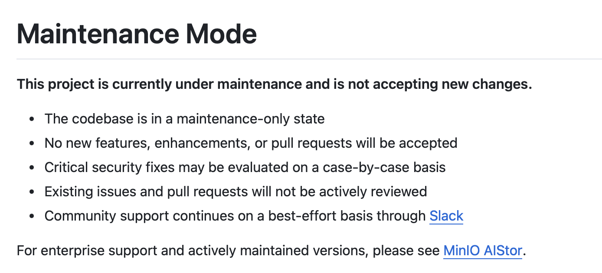
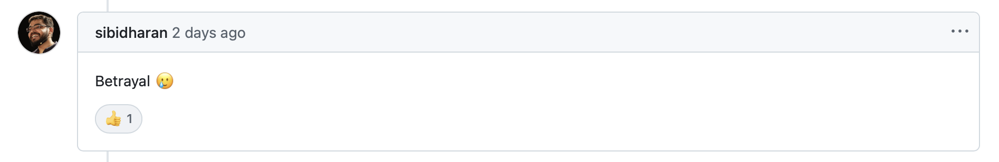

最近（准确说是 12 月 3 日），分布式对象存储领域的顶级玩家 Minio，官宣其开源项目 Minio 正式进入维护模式，具体包括：


- [代码库](https://github.com/minio/minio)处于仅维护状态；
- 不再接受新功能、增强改进以及 PR 等；
- 严重的安全漏洞会视情况而定（case by case）；
- 既有的 Issue 和 PR 将不再积极处理（目前有 42 处于 open 状态的 Issue，33 个处于 open 状态的 PR）；
- 对于社区支持，将通过 Slack 尽力而为；



此举意味着 Minio 将全面转向其商业版产品 [Minio AIStor](https://www.min.io/product/aistor)。对于 Minio 这种已经发展了 10 年（2014 年公司成立，2015 年发布首个版本）的基础设施开源项目，已经在全球积累了百万甚至千万用户，此变更也在圈里激起大浪。

## 辱骂无国界

事件发生后，就有用户在 Minio 的 GitHub Repo 下面建了一个主题为 **Maintenance Mode** 的 Issue，诸多用户在下面进行了讨论（甚至可以说是“发泄”）”：


有用户提出，这种做法难道不是违反了 AGPL 协议么？当然，也有用户给他解释了一番：**AGPL 不适用于提交者/维护者，只适用于使用者**：


有“愤怒”用户说，这是“诱骗”（估计意思是先让大家用上开源项目，然后闭源再来收费，**这味道有没有很熟悉**），而且点赞者还不少：


更有甚者，直接开始“辱骂”（称之为叛徒）：



到了最后，Minio 官方下场锁定了这个 Issue，提出这种 Issue 的讨论已经违反了[Code of Conduct](https://github.com/minio/minio/blob/master/code_of_conduct.md)，辱骂、威胁这一类的行为在 Minio 社区是不允许的。对于想要继续讨论 fork Minio 或者想继续维护甚至重写的用户，可以到 Discussion 继续讨论：


**只能说，在贡献开源项目这件事情上，开发者无国界，在 Diss 开源项目这件事情上，开发者同样无国界**。

## 逝者已矣，生者如斯

中国有句古话叫做“逝者已矣，生者如斯”，Minio 开源项目已经”官宣停摆“，任何没有结果的讨论甚至辱骂都是没有任何意义的，对于依赖对象存储的用户来讲，出路无非以下几种：

- 寻找替代品并迁移
- fork 过来继续维护
- 自己撸一个（借助于现在流行的 AI Coding，貌似也不是不可能）

对于绝大多数用户来讲，估计只能选择第一条了。在替代品方面，也有不少选择，比如 S3、Ceph、RustFS、Garage 等。

最近，正好看到一个关于私有化部署、S3 兼容的对象存储项目的测评（[Benchmarking Self-Hosted S3-Compatible Storage](https://www.repoflow.io/blog/benchmarking-self-hosted-s3-compatible-storage-a-practical-performance-comparison)。

参与评测的项目有：

- MinIO
- Ceph
- SeaweedFS
- Garage
- Zenko (Scality Cloudserver)
- LocalStack
- RustFS

测评方法为：

1. 上传/下载 7 个不同尺寸的文件：50 KB、200 KB、1 MB、10 MB、50 MB、100MB 以及 1GB；
2. 重复上传/下载 20 次，然后获取稳定的平均数据；
3. 所有测试均在相同的机器上进行，测试机器为每一种存储系统使用默认的 Docker 容器，且没有额外的卷、挂载或缓存；

测评结果：**在并行/非并行上传/下载速率方面，RustFS 和 Seaweedfs 都领先于其他项目**。

由于在开篇提到的 Issue 中，多个用户也提到了可行的替代品 —— RustFS：


下面来看一下 RustFS 的相关情况。

## 分布式存储新贵 —— RustFS

从 GitHub 上看[rustfs](https://github.com/rustfs/rustfs)是一个用 Rust 语言编写的分布式对象存储系统，兼容 S3 协议，是 Minio 的平替。自今年 7 月份开源（采用 Apache 2.0 协议）以来，已经获得 **15K** star（在基础设施类开源项目中还是挺不错的数据），更新比较频繁，目前发布了 73 个版本。从官方发布的内容看，RustFS 的优势在于：

- **开源**：采用商业友好的 Apache 2.0 协议；
- **S3 兼容**：无缝集成现有的 S3 兼容的应用或工具；
- **分布式架构**：可扩展和容错设计适用于大规模部署；
- **安装便捷**：支持二进制、Docker 以及 Helm Chart，可一键式安装；

官方也给出了和其他对象存储的对比：


> 更多内容可自行查看 GitHub Repo 或[官网](https://rustfs.com)。


## RustFS 之初体验

RustFS 支持多种安装方式：

- 二进制安装


```
curl -O https://rustfs.com/install_rustfs.sh && bash install_rustfs.sh
```

- Docker 安装

```
docker pull rustfs/rustfs:latest
docker run -d \
  --name rustfs \
  -p 9000:9000 \
  -p 9001:9001 \
  -v /data:/data \
  rustfs/rustfs:latest
```

> 注意：RustFS 容器以 `10001` 运行，需要将挂载的宿主机目录的权限修改为 `10001`，否则会出现 `permission denied` 错误。

或使用 `docker-compose.yaml`：

```
services:
  rustfs:
    image: rustfs/rustfs:latest
    container_name: rustfs
    hostname: rustfs
    environment:
      - RUSTFS_VOLUMES=/data/rustfs{1...4}
      - RUSTFS_ADDRESS=0.0.0.0:9000
      - RUSTFS_CONSOLE_ENABLE=true
      - RUSTFS_CONSOLE_ADDRESS=0.0.0.0:9001
      - RUSTFS_EXTERNAL_ADDRESS=0.0.0.0:9000  # Same as internal since no port mapping
      - RUSTFS_ACCESS_KEY=rustfsadmin
      - RUSTFS_SECRET_KEY=rustfsadmin
      - RUSTFS_CMD=rustfs
    healthcheck:
      test:
        [
          "CMD-SHELL",
          "curl -f http://localhost:9000/health && curl -f http://localhost:9001/health"
        ]
      interval: 10s
      timeout: 5s
      retries: 3
      start_period: 30s
    ports:
      - "9000:9000"  # API endpoint
      - "9001:9001"  # Console
    volumes:
      - rustfs-data1:/data/rustfs1
      - rustfs-data2:/data/rustfs2
      - rustfs-data3:/data/rustfs3
      - rustfs-data4:/data/rustfs4

volumes:
  rustfs-data1:
  rustfs-data2:
  rustfs-data3:
  rustfs-data4:
```

直接执行如下命令即可

```
docker compose up -d

#查看容器
docker ps
CONTAINER ID   IMAGE                  COMMAND                  CREATED        STATUS                  PORTS                                                           NAMES
0a957ec319ca   rustfs/rustfs:latest   "/entrypoint.sh rust…"   14 hours ago   Up 14 hours (healthy)   0.0.0.0:9000-9001->9000-9001/tcp, :::9000-9001->9000-9001/tcp   rustfs
```

- Helm Chart 安装

```
# 添加 repo
helm repo add rustfs https://charts.rustfs.com

# 安装
helm install rustfs -n rustfs --create-namespace ./ --set ingress.className="nginx"
```

安装完毕后，可使用 `http://ip:9001`（Helm Chart 安装可根据 ingress 进行登录）登录，默认用户名和米么均为 `rustfsadmin`。


登录后，可以创建存储、AK & SK 使用：


可以通过**性能**来查看节点和磁盘的信息：


### 集成实践

比如可以将 RustFS 配置为 [Docker Registry](https://github.com/distribution/distribution) 的存储后端。`docker-compose.yaml` 内容如下：

```
services:
  registry:
    restart: always
    image: registry:3
    ports:
      - 5000:5000
    environment:
      REGISTRY_STORAGE: s3
      REGISTRY_AUTH: htpasswd
      REGISTRY_AUTH_HTPASSWD_PATH: /auth/htpasswd
      REGISTRY_AUTH_HTPASSWD_REALM: Registry Realm
      REGISTRY_STORAGE_S3_ACCESSKEY: rustfsadmin
      REGISTRY_STORAGE_S3_SECRETKEY: rustfsadmin
      REGISTRY_STORAGE_S3_REGION: cn-east-1
      REGISTRY_STORAGE_S3_REGIONENDPOINT: http://rustfs.instance.ip:9000
      REGISTRY_STORAGE_S3_BUCKET: docker-registry
      REGISTRY_STORAGE_S3_ROOTDIRECTORY: /var/lib/registry
      REGISTRY_STORAGE_S3_FORCEPATHSTYLE: true
      REGISTRY_STORAGE_S3_LOGLEVEL: debug
    volumes:
      - ./auth:/auth
      - ./certs:/certs
    networks:
      - rustfs-oci

networks:
  rustfs-oci:
    driver: bridge
    name: rustfs-oci
```

拉取镜像并推送到 Docker Registry：

```
# 拉取镜像
docker pull rustfs/rustfs:1.0.0.-alpha.72

# 重新打 tag
docker tag rustfs/rustfs:1.0.0-alpha.72 localhost:5000/rustfs/rustfs:1.0.0-alpha.72

# 推送至 Docker Registry
docker push localhost:5000/rustfs/rustfs:1.0.0-alpha.72
```

在 RustFS 实例上查看：


