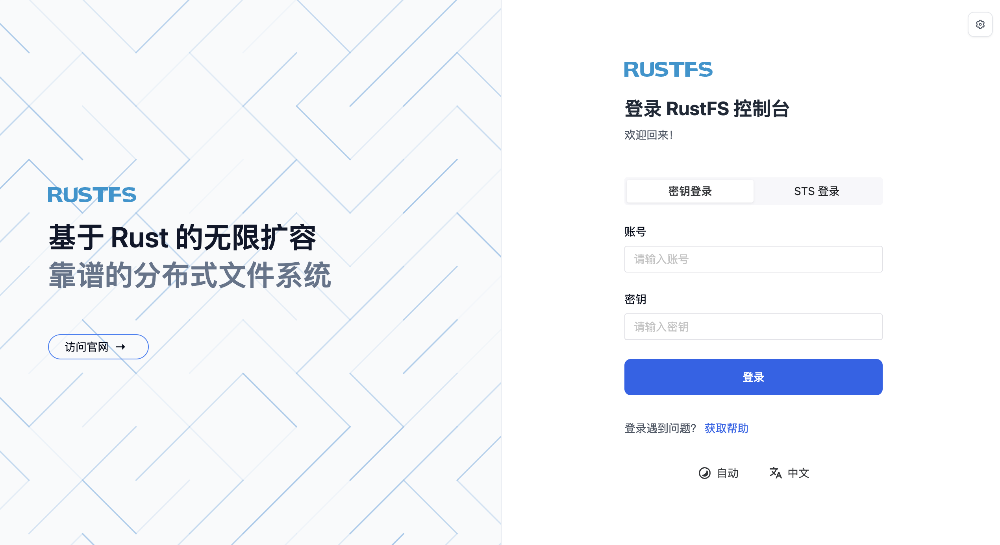

## 关于 RustFS

RustFS 是一个用 Rust 编写的开源分布式对象存储系统，完全兼容 S3，可作为 minio 的平替。支持多种安装方式：源码编译、二进制、Docker 以及 Helm Chart。K3s 和 RustFS 相结合，能够作为边缘场景的云原生存储解决方案。

## k3s 的安装


[k3s](https://www.rancher.cn/k3s/) 是经 CNCF 一致性认证的 Kubernetes 发行版，专为物联网及边缘计算而设计。简言之，k3s 是一个轻量级的 Kubernetes 发行版。

k3s 的安装非常简单，对于国内用户来讲，执行如下命令可以加速 k3s 的安装：

```
$ curl -sfL https://rancher-mirror.rancher.cn/k3s/k3s-install.sh | INSTALL_K3S_MIRROR=cn sh -
[INFO]  Finding release for channel stable
[INFO]  Using v1.28.5+k3s1 as release
[INFO]  Downloading hash rancher-mirror.rancher.cn/k3s/v1.28.5-k3s1/sha256sum-amd64.txt
[INFO]  Downloading binary rancher-mirror.rancher.cn/k3s/v1.28.5-k3s1/k3s
[INFO]  Verifying binary download
[INFO]  Installing k3s to /usr/local/bin/k3s
[INFO]  Skipping installation of SELinux RPM
[INFO]  Creating /usr/local/bin/kubectl symlink to k3s
[INFO]  Creating /usr/local/bin/crictl symlink to k3s
[INFO]  Skipping /usr/local/bin/ctr symlink to k3s, command exists in PATH at /usr/bin/ctr
[INFO]  Creating killall script /usr/local/bin/k3s-killall.sh
[INFO]  Creating uninstall script /usr/local/bin/k3s-uninstall.sh
[INFO]  env: Creating environment file /etc/systemd/system/k3s.service.env
[INFO]  systemd: Creating service file /etc/systemd/system/k3s.service
sh: 1014: restorecon: not found
sh: 1015: restorecon: not found
[INFO]  systemd: Enabling k3s unit
Created symlink /etc/systemd/system/multi-user.target.wants/k3s.service → /etc/systemd/system/k3s.service.
[INFO]  systemd: Starting k3s
```

接着可以查看 k3s 是否安装成功：

```
#查看 k3s 版本
$ k3s --version
k3s version v1.33.4+k3s1 (148243c4)
go version go1.24.5

# 查看 k3s 集群
$ kubectl get nodes
NAME             STATUS   ROLES                  AGE    VERSION
vm-0-12-ubuntu   Ready    control-plane,master   135m   v1.33.4+k3s1
```

## 安装 RustFS

使用 [RustFS Helm Chart](https://github.com/rustfs/rustfs/tree/main/helm)来在 K3s 上进行安装。克隆此仓库到本地：

```
$ git clone git@github.com:rustfs/rustfs.git
```

整个目录结构如下：

```
├── Chart.yaml
├── templates
│   ├── NOTES.txt
│   ├── _helpers.tpl
│   ├── configmap.yaml
│   ├── ingress.yaml
│   ├── secret-tls.yaml
│   ├── secret.yaml
│   ├── service.yaml
│   ├── serviceaccount.yaml
│   ├── statefulset.yaml
│   └── tests
│       └── test-connection.yaml
├── tls
│   ├── tls.crt
│   └── tls.key
└── values.yaml
```

当前 RustFS helm chart 是多机多盘（MNMD）模式，支持 4 个 pod，每个 pod 4 个 volume 以及 16 个 pod，每个 pod 一个 volume 的安装方式。默认为 4 个 pod 模式（也是推荐模式）。

根据自身需要对 `values.yaml` 中的参数进行修改，比如 CPU、Memory 的请求限制、PVC 的大小、StorageClass 的名称、Ingress 信息等。

由于在 K3s 上是通过 PVC 来当作 RustFS 实例所用到的 VOLUME，所以使用了 Rancher 自研的 [local-path-provisioner](https://github.com/rancher/local-path-provisioner)来将本地磁盘转换为 StorageClass，执行官方推荐的安装命令安装即可：

```
kubectl apply -f https://raw.githubusercontent.com/rancher/local-path-provisioner/v0.0.32/deploy/local-path-storage.yaml
```

然后查看 storageclass：

```
kubectl  get sc
NAME                   PROVISIONER             RECLAIMPOLICY   VOLUMEBINDINGMODE      ALLOWVOLUMEEXPANSION   AGE
local-path (default)   rancher.io/local-path   Delete          WaitForFirstConsumer   false                  149m
```

因此，在 `values.yaml` 文件中增加 PVC 内容：

```
storageclass:
  name: local-path
  size: 256Mi
```

然后执行 `helm install` 进行安装即可。

对于 traefki ingressclass，执行如下命令：

```
helm install rustfs -n rustfs --create-namespace ./ --set ingress.className="traefik"
```

> K3s 默认安装了 traefik，因此 traefik 默认为 ingressclass。

对于 nginx ingressclass，执行如下命令：

```
helm install rustfs -n rustfs --create-namespace ./ --set ingress.className="nginx"
```

返回如下：

```
NAME: rustfs
LAST DEPLOYED: Tue Sep 16 07:20:59 2025
NAMESPACE: rustfs
STATUS: deployed
REVISION: 1
NOTES:
1. Get the application URL by running these commands:
  http://your.rustfs.com/
```

查看 pod，pvc，ingres，svc 等资源：

```
kubectl -n rustfs get pods,pvc,ingress,svc
NAME           READY   STATUS    RESTARTS   AGE
pod/rustfs-0   1/1     Running   0          88m
pod/rustfs-1   1/1     Running   0          92m
pod/rustfs-2   1/1     Running   0          96m
pod/rustfs-3   1/1     Running   0          101m

NAME                                           STATUS   VOLUME                                     CAPACITY   ACCESS MODES   STORAGECLASS   VOLUMEATTRIBUTESCLASS   AGE
persistentvolumeclaim/data-rustfs-0-rustfs-0   Bound    pvc-5ff16d6f-217e-4e05-b553-0c9245aa8dfb   256Mi      RWO            local-path     <unset>                 145m
persistentvolumeclaim/data-rustfs-0-rustfs-1   Bound    pvc-665927f9-5bbb-4866-87ac-c4254e32cf11   256Mi      RWO            local-path     <unset>                 145m
persistentvolumeclaim/data-rustfs-0-rustfs-2   Bound    pvc-595df1fe-2196-4174-9e52-eeed6a705284   256Mi      RWO            local-path     <unset>                 145m
persistentvolumeclaim/data-rustfs-0-rustfs-3   Bound    pvc-480b6848-4cb0-416f-8e88-137ebec4e035   256Mi      RWO            local-path     <unset>                 145m
persistentvolumeclaim/data-rustfs-1-rustfs-0   Bound    pvc-0a7cc385-0378-486a-83f7-db883fe1e29d   256Mi      RWO            local-path     <unset>                 145m
persistentvolumeclaim/data-rustfs-1-rustfs-1   Bound    pvc-f304ed03-0967-4e62-b8cd-fdb2525b1018   256Mi      RWO            local-path     <unset>                 145m
persistentvolumeclaim/data-rustfs-1-rustfs-2   Bound    pvc-cf9d3539-b5a1-4e7e-95c0-a2cf99e57bc5   256Mi      RWO            local-path     <unset>                 145m
persistentvolumeclaim/data-rustfs-1-rustfs-3   Bound    pvc-9caaf98c-faee-444d-9e2c-a377aafb9fb9   256Mi      RWO            local-path     <unset>                 145m
persistentvolumeclaim/data-rustfs-2-rustfs-0   Bound    pvc-8ea082b2-ba9f-4cd6-9866-866ed541697f   256Mi      RWO            local-path     <unset>                 145m
persistentvolumeclaim/data-rustfs-2-rustfs-1   Bound    pvc-e7c69318-2648-4722-964e-cc89b798c191   256Mi      RWO            local-path     <unset>                 145m
persistentvolumeclaim/data-rustfs-2-rustfs-2   Bound    pvc-883e9eba-1038-4789-b7fc-731f6becf794   256Mi      RWO            local-path     <unset>                 145m
persistentvolumeclaim/data-rustfs-2-rustfs-3   Bound    pvc-ac8be1b7-ed72-4994-b5a5-87ef2fefcfd2   256Mi      RWO            local-path     <unset>                 145m
persistentvolumeclaim/data-rustfs-3-rustfs-0   Bound    pvc-1d80e06a-91a7-4e64-8f3f-aaadaf576bb9   256Mi      RWO            local-path     <unset>                 145m
persistentvolumeclaim/data-rustfs-3-rustfs-1   Bound    pvc-f3bca979-bec3-49fa-92d7-44c45560c94b   256Mi      RWO            local-path     <unset>                 145m
persistentvolumeclaim/data-rustfs-3-rustfs-2   Bound    pvc-ad3a9d90-db72-49d1-b372-0f321869f7a5   256Mi      RWO            local-path     <unset>                 145m
persistentvolumeclaim/data-rustfs-3-rustfs-3   Bound    pvc-fbf06576-873b-46d7-b084-c0a71ed324fe   256Mi      RWO            local-path     <unset>                 145m

NAME                               CLASS     HOSTS              ADDRESS    PORTS     AGE
ingress.networking.k8s.io/rustfs   traefik   your.rustfs.com    10.0.0.4   80, 443   30m

NAME                      TYPE        CLUSTER-IP      EXTERNAL-IP   PORT(S)           AGE
service/rustfs-headless   ClusterIP   None            <none>        80/TCP,9001/TCP   108m
service/rustfs-svc        ClusterIP   10.43.240.116   <none>        80/TCP,9001/TCP   108m
```

等待所有资源都处于 Ready 状态就可以登录 RustFS 了。

## 登录 RustFS

可以使用默认用户名和密码来登录 RustFS 实例。默认用户名和密码都写在了 `values.yaml` 中，并通过 secret 的方式以环境变量的形式注入到了 Pod 中。本次安装指定的默认用户名和密码均为 `rustfsadmin`。因此使用该用户名和密码，在浏览器中输入 Ingress 的地址 `https://your.rustfs.com` 即可看到 RustFS 的登录页面：



接着就可以来创建存储桶、对象等使用 RustFS。详细使用，可以查看 [RustFS 官方文档](https://docs.rustfs.com/zh/)。