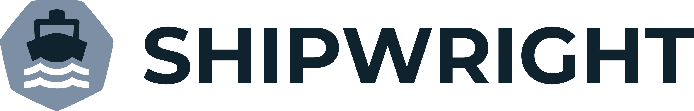

# Shipwright 介绍

[`Shipwright`](https://github.com/shipwright-io/build) 是一个可扩张的框架，用来在 Kubernetes 上构建容器镜像。`Shipwright` 支持众多流行的用于构建容器镜像的工具，比如 `Kaniko`、`Cloud Native Buildpacks`、`Buildah`等。

`Shipwright` 有构建四要素：

- **Source Code**：(WHAT)制定了我们要构建的内容
- **Output image**：(WHERE)构建镜像的推送地
- **Build Strategy**：(HOW)如何构建镜像，也就是要选择上述提到的那种工具来构建
- **Invocation**：(WHEN)什么时候开始构建镜像

Shipwright 的 Build API 是由三个核心 CRD（CustomResourceDefinitions）组成，分别是：

- **Build**：定义构建的内容以及镜像仓库地址
- **BuildStrategy and ClusterBuildStrategy**：定义了如何利用某种工具来构建镜像
- **BuildRun**：和 `Build` 相关联。可以创建 `BuildRun` 来启动和运行 `Build`。

> `Build` 和 `BuildRun` 的关系与 Tekton 中 `Task` 和 `TaskRun` 的关系是一样的。

# Shipwright 使用

## Shipwright 安装

* 安装前提

Shipwirght 依赖于 Tekton，需要提前安装 Tekton。Tekton 的安装可以参考[官网安装教程](https://tekton.dev/docs/getting-started/)。可以用 `version` 或者 `help` 命令来确认 Tekton 是否安装成功：

```
$ tkn version
Client version: 0.20.0
Pipeline version: v0.28.0
```

执行如下命令即可完成 Shipwright deployment 安装：

```
$ kubectl apply --filename https://github.com/shipwright-io/build/releases/download/v0.6.0/release.yaml
namespace/shipwright-build created
role.rbac.authorization.k8s.io/shipwright-build-controller created
clusterrole.rbac.authorization.k8s.io/shipwright-build-controller created
clusterrolebinding.rbac.authorization.k8s.io/shipwright-build-controller created
rolebinding.rbac.authorization.k8s.io/shipwright-build-controller created
serviceaccount/shipwright-build-controller created
deployment.apps/shipwright-build-controller created
customresourcedefinition.apiextensions.k8s.io/buildruns.shipwright.io created
customresourcedefinition.apiextensions.k8s.io/builds.shipwright.io created
customresourcedefinition.apiextensions.k8s.io/buildstrategies.shipwright.io created
customresourcedefinition.apiextensions.k8s.io/clusterbuildstrategies.shipwright.io created

```
可以在 `shipwright-build` namespace 下面查看 pod

```
$ kubectl -n shipwright-build get pods
NAME                                           READY   STATUS    RESTARTS   AGE
shipwright-build-controller-5f7b744cd5-cllz7   1/1     Running   0          5m31s
```

接下来需要安装 `strategy`。`strategy` 是一系列 `step` 的定义，主要是用开头叙述的集中主流镜像工具来完成镜像工作。`strategy` 有两种：`ClusterBuildStrategy`（对应的 API 是 `clusterbuildstrategies.shipwright.io/v1alpha1`）和 **BuildStrategy**（对应的 API 是 `buildstrategies.shipwright.io/v1alpha1`）。这两种的区别就是：**前者是针对集群级别的，而后者是针对 `namespace` 级别的**。

可用下面的命令完成 `strategy` 的安装：

```
$ kubectl apply --filename https://github.com/shipwright-io/build/releases/download/v0.6.0/sample-strategies.yaml
clusterbuildstrategy.shipwright.io/buildah created
clusterbuildstrategy.shipwright.io/buildkit created
clusterbuildstrategy.shipwright.io/buildpacks-v3-heroku created
clusterbuildstrategy.shipwright.io/buildpacks-v3 created
clusterbuildstrategy.shipwright.io/kaniko-trivy created
clusterbuildstrategy.shipwright.io/kaniko created
clusterbuildstrategy.shipwright.io/ko created
clusterbuildstrategy.shipwright.io/source-to-image-redhat created
clusterbuildstrategy.shipwright.io/source-to-image created
```

当然，也可以单独安装针对某个构建工具的 `strategy`，比如如下步骤即可完成针对 `kaniko` 的 `strategy`。

* 安装 Kaniko Cluster scope Strategy

```
$ kubectl apply -f https://raw.githubusercontent.com/shipwright-io/build/main/samples/buildstrategy/kaniko/buildstrategy_kaniko_cr.yaml
clusterbuildstrategy.shipwright.io/kaniko configured
```

* 安装 `kaniko-trivy` ClusterBuildStrategy

```
$ kubectl apply -f https://raw.githubusercontent.com/shipwright-io/build/main/samples/buildstrategy/kaniko/buildstrategy_kaniko-trivy_cr.yaml
clusterbuildstrategy.shipwright.io/kaniko-trivy configured
```

其实可以看到，`kaniko` 的 `strategy` 其实就是 `kaniko` 的一个封装，可以在上述的 `yaml` 文件中看到正常用 `kaniko` 进行镜像构建的步骤：

```
spec:
  buildSteps:
    - name: build-and-push
      image: gcr.io/kaniko-project/executor:v1.7.0
      workingDir: $(params.shp-source-root)
      securityContext:
        runAsUser: 0
      env:
        - name: HOME
          value: /tekton/home
        - name: DOCKER_CONFIG
          value: /tekton/home/.docker
      command:
        - /kaniko/executor
      args:
        - --skip-tls-verify=true
        - --dockerfile=$(build.dockerfile)
        - --context=$(params.shp-source-context)
        - --destination=$(params.shp-output-image)
        - --oci-layout-path=/kaniko/oci-image-layout
        - --snapshotMode=redo
        - --push-retry=3
```

至此，所有的安装已经完毕，接下来可以使用 `shipwright` 来构建镜像了。

## 使用 shipwright 构建镜像

先创建一个 `namespace`，后续的所有操作都会在这个 `namespace` 下面。

```
$ kubectl create ns shipwright-demo
namespace/shipwright-demo created
```

### 创建 Container Registry 的 Secret

使用如下内容创建一个 `Secret` 用来访问 Container Registry

```
cat > secret.yaml << EOF
apiVersion: v1
kind: Secret
metadata:
    name: dockerhub-user-pass
    annotations:
        tekton.dev/docker-0: https://index.docker.io
type: kubernetes.io/basic-auth
stringData:
    username: your-dockerhub-username
    password: your-dockerhub-password
EOF
```
使用 `kubectl apply` 命令创建 `secret`

```
$ kubectl -n shipwright-demo apply -f secret.yaml
secret/dockerhub-user-pass created
```

### 创建 Build

使用如下内容创建一个 `Build`：

```
cat > build.yaml << EOF
apiVersion: shipwright.io/v1alpha1
kind: Build
metadata:
  name: kaniko-golang-build
  annotations:
    build.build.dev/build-run-deletion: "true"
spec:
  source:
    url: https://github.com/devopsday-dl/Demo
  strategy:
    name: kaniko
    kind: ClusterBuildStrategy
  output:
    image: dllhb/shipwright-demo:v1.0.2
    credentials:
      name: dockerhub-user-pass
EOF
```

参数说明：

* **`spec.source`**：指定包含源码的 Git 仓库地址
* **`spec.strategy`**：指定需要构建镜像的 Strategy，也就是说要选择那款工具（本示例选择了 `kaniko`）
* **`spec.output`**：指定远端镜像仓库，用来存储构建出来的镜像
* **`spec.output.credentials.name`**：指定用来访问镜像仓库的 `secret`

使用 `kubectl apply` 命令创建 `build`：

```
$ kubectl -n shipwright-demo apply -f build.yaml
build.shipwright.io/kaniko-golang-build created
```

### 创建 BuildRun

使用如下内容创建 `BuildRun`：

```
$ cat > buildrun.yaml << EOF
apiVersion: shipwright.io/v1alpha1
kind: BuildRun
metadata:
  name: shipwright-buildrun-demo
spec:
  buildRef:
    name: kaniko-golang-build
EOF
```
参数说明：

* **`spec.buildRef`**：指定与此 `BuildRun` 相关联的 `Build`，也即上一步创建的 `Build`

使用 `kubectl apply` 命令创建 `BuildRun`：

```
$ kubectl -n shipwright-demo apply -f buildrun.yaml
buildrun.shipwright.io/shipwright-buildrun-demo created
```

### 结果验证

接下来可以查看 `Build`、`BuildRun` 以及 `shipwright` ns 下面的 pod
```
$ kubectl -n shipwright-demo get build,buildrun
NAME                                      REGISTERED   REASON      BUILDSTRATEGYKIND      BUILDSTRATEGYNAME   CREATIONTIME
build.shipwright.io/kaniko-golang-build   True         Succeeded   ClusterBuildStrategy   kaniko              13s

NAME                                              SUCCEEDED   REASON    STARTTIME   COMPLETIONTIME
buildrun.shipwright.io/shipwright-buildrun-demo   Unknown     Pending   10s

$ kubectl -n shipwright-demo get pods -w
NAME                                       READY   STATUS    RESTARTS   AGE
shipwright-buildrun-demo-k5jpb-pod-t6gfz   3/3     Running   0          22s
shipwright-buildrun-demo-k5jpb-pod-t6gfz   2/3     NotReady   0          22s
```

可以看到镜像的构建正在进行，可以查看一下，是否有 `taskrun` 生成

```
$ tkn -n shipwright-demo taskrun list
NAME                             STARTED        DURATION   STATUS
shipwright-buildrun-demo-k5jpb   1 minute ago   ---        Running
```
可以看到，`BuildRun` 触发了 `Build`，而 `Build` 又创建了一个 `TaksRun` 来执行镜像构建。

可以查看 `pod` 的 `log` 来查看镜像构建的过程：

```
$ kubectl -n shipwright-demo logs -f shipwright-buildrun-demo-k5jpb-pod-t6gfz -c step-build-and-push
INFO[0010] Resolved base name golang:1.12.9-alpine3.9 to builder
INFO[0010] Retrieving image manifest golang:1.12.9-alpine3.9
INFO[0010] Retrieving image golang:1.12.9-alpine3.9 from registry index.docker.io
...... TO LONG ......
INFO[0058] Unpacking rootfs as cmd COPY --from=builder /tmp/devops /usr/src/app/ requires it.
INFO[0064] WORKDIR /usr/src/app/
INFO[0064] cmd: workdir
INFO[0064] Changed working directory to /usr/src/app/
INFO[0064] Creating directory /usr/src/app/
INFO[0064] Taking snapshot of files...
INFO[0064] COPY --from=builder /tmp/devops /usr/src/app/
INFO[0064] Taking snapshot of files...
INFO[0064] CMD ["./devops"]
INFO[0066] Pushing image to dllhb/shipwright-demo:v1.0.2
INFO[0075] Pushed image to 1 destinations
```
# 写在最后

Shiwright 使用了 Kubernetes 的扩展机制（CRD），将多种主流镜像构建的工具进行了一个封装，再使用 Tekton 做一个构建引擎。原理比较简单，好处就是不用去关心每个构建工具是如何使用，因为将所有的工具做了一层封装，用户只需要通过简单的声明就可以用不同的工具来完成镜像的构建。

其实，`shipwright` 的好处就是不用去关系每个构建工具是如何使用，将所有的工具做了一层封装，用户只需要通过简单的声明就可以用不同的工具来完成镜像的构建。
