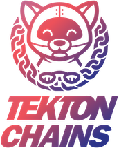
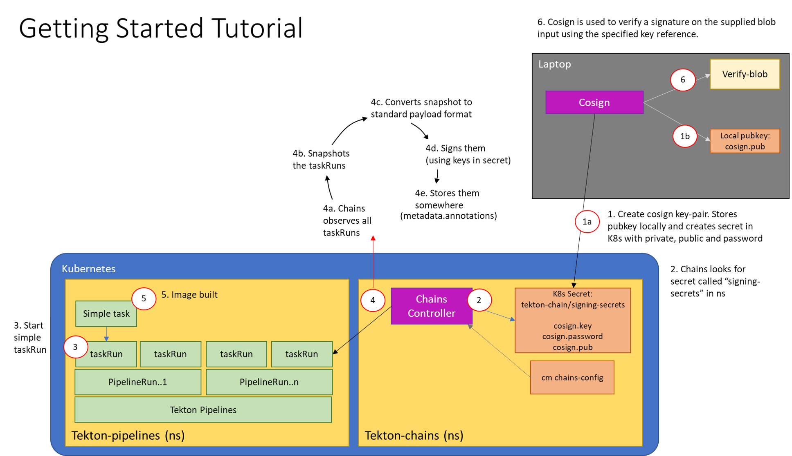

<p align="center">
</img>
</p>

# 关于 Tekton Chain

Tekton Chain 是一个 Kubernetes CRD controller，可以用来帮助用户管理 Tekton 的 supply chain security（供应链安全）。简单点说，就是更安全的获取 CI/CD Pipeline 执行的元数据，以确保利用 Tekton 构建的 CI/CD Pipeline 执行流程是安全的。

Tekton Chain 的工作原理是：观测 Tekton 集群中所有 `TaskRuns` 的执行。当 `TaskRuns` 完成执行，Chains 就会为其做一个快照，随后快照会被转换成一些标准的负载（payload）格式，并在将它们签名后进行存储。目前支持 x509、KMS 等对 `TaskRun` 以及 OCI 镜像进行签名。

大概原理如下图所示：





# Tekton Chains 安装

Tekton Chains 依赖[Tekton Pipelines](https://github.com/tektoncd/pipeline/blob/main/docs/install.md)。使用如下命令即可完成最新版本的安装：

```
$ kubectl apply --filename https://storage.googleapis.com/tekton-releases/pipeline/latest/release.yaml
```

可以在 `tekton-pipelines` namespace 下面看到有 pod 生成：

```
$ kubectl -n tekton-pipelines get pods
NAME                                          READY   STATUS        RESTARTS   AGE
tekton-pipelines-controller-99b764966-bzm9p   1/1     Running       0          5m20s
tekton-pipelines-webhook-55c9dd7446-ssvbw     1/1     Running       0          5m20s
```

用同样的方式可以完成 Tekton Chains 的安装。执行如下命令即可完成：

```
$ kubectl apply --filename https://storage.googleapis.com/tekton-releases/chains/latest/release.yaml
```

安装完毕，会在 `tekton-chains` namespace 下面生成一个 pods：

```
$ kubectl -n tekton-chains get pods -w
NAME                                        READY   STATUS              RESTARTS   AGE
tekton-chains-controller-5948c9fcc8-6gxk5   0/1     ContainerCreating   0          11s
tekton-chains-controller-5948c9fcc8-6gxk5   1/1     Running             0          34s
```

# Tekton Chains 的设置

Tekton Chains 的设置有以下三个部分：

- 为 Chains controller 添加认证（方便将签名后的镜像推送至 OCI 镜像仓库）
- 生成一个加密密钥，并配置 Chains 使用此密钥进行签名
- 其他的额外配置（以 `configmap` 的形式存储在 `tekton-chains` namespace 下面，主要包括 `TaskRun`、`OCI`、`KMS`、`Storage`等的一些配置）

## 支持的签名密钥

目前支持 x509、Cosign、KMS 以及处于实验阶段的 Keyless signing。本文选择使用 Cosing。

### cosign

[cosign](https://github.com/sigstore/cosign)是一个开源项目，主要针对 OCS registry 做容器签名、验证和存储。目的是让签名成为无形的基础设施。

cosign 生成的 key 是以 `secret` 的方式存储在 Kubernetes 集群上的，在 `signing-secrets` namespace 下面，可以用如下的命令生成 `cosign.key` 和 `cosigh.pub`：

```
$ cosign generate-key-pair k8s://tekton-chains/signing-secrets
```

整个过程会让你输入一个 `password`，此 `password` 是用来解密 `cosign.key` 的。整个过程会在 `tekton-chains` namespace 下面生成一个名为 `signing-secrets` 的 `secret`：

```
ubectl -n tekton-chains get secret
NAME                                   TYPE                                  DATA   AGE
signing-secrets                        Opaque                                3      6d3h
```
可以看到里面有三条数据，其实就是 `cosign.key`、`cosign.pub`、`password`：

```
$ apiVersion: v1
data:
  cosign.key: LS0tLS1CRUdJTiBFTkNSWVBURUQgQ09TSUdOIFBSSVZBVEUgS0VZLS0tLS0KZXlKclpHWWlPbnNpYm1GdFpTSTZJbk5qY25sd2RDSXNJbkJoY21GdGN5STZleUpPSWpvek1qYzJPQ3dpY2lJNgpPQ3dpY0NJNk1YMHNJbk5oYkhRaU9pSllVeXRxYlhGYVJWQlVUVXhtYkhkbU9IVkljbTV4ZWpSVE5GVmhXblpSClJVOXVhR3AzU1RVME1XSnpQU0o5TENKamFYQm9aWElpT25zaWJtRnRaU0k2SW01aFkyd3ZjMlZqY21WMFltOTQKSWl3aWJtOXVZMlVpT2lKUlpUSmtVazF1UjJsSlVEZE5hVkEzTURkVloyTlBUR2c1VDFOU1NqUTRkaUo5TENKagphWEJvWlhKMFpYaDBJam9pYTJ4Q1drWXlRMGhLTkdSMVJIQmplQzlQYUVoQ05FbHdNM1ZIYzJWbVJFSnNSVEZ3CldsWmhkR0pOY0djNFlVTkhOM1JZVmxBNFIwdG1SWFU0Y2pFMlkyWnBkVmRKYmsxSVFUVnJNV0ZtUldobU5WVkwKY0dFcmIzSkVVell2UzJzcmFtVjFWMnQxZFdoeWJIWm1TRzFyWkV0MGMzVldWU3MzTkhWbVMzcFNaM0IxYzJWTApPSGN3ZWtWWWNYWkVVazV0T1dWbmRsZGliVTU2VFhsWFp6Vk5ZWGRzZW1oeVNUWlNXak4yUW5JNWFEWjJkMHBXCmNsVlRXVWd4ZFVOVU9HZFNXbGxUZEZaWmVGVkRRM0l3VkVFOVBTSjkKLS0tLS1FTkQgRU5DUllQVEVEIENPU0lHTiBQUklWQVRFIEtFWS0tLS0tCg==
  cosign.password: cGFzc3cwcmQ=
  cosign.pub: LS0tLS1CRUdJTiBQVUJMSUMgS0VZLS0tLS0KTUZrd0V3WUhLb1pJemowQ0FRWUlLb1pJemowREFRY0RRZ0FFdzJVTy95V2VlVi90REcvczZDbDlPVzdWRktxUQpDaUgyZFhPVlc2N3dVV1hoSjhJTTEvSUo4Q1UwdmFGM3kvQ25kZDJUQ1Y5NmVCempxUEdxQlNOZDdBPT0KLS0tLS1FTkQgUFVCTElDIEtFWS0tLS0tCg==
immutable: true
kind: Secret
metadata:
  name: signing-secrets
  namespace: tekton-chains
type: Opaque
```

# Tekton Chain 的使用

首先需要对 `artifacts.oci.storage` 参数做一些修改，目的是为了告诉 Chains 使用默认的 `tekton` artifact 并且禁用 `OCI` artifact。执行如下命令即可完成设置：

```
$ kubectl patch configmap chains-config -n tekton-chains -p='{"data":{"artifacts.oci.storage": ""}}'
```

接下来使用 https://github.com/majinghe/tekton-chains-demo 中代码创建一个 `taksrun`，执行步骤都在此代码 repo 里面。这是一个拉取源代码并且构建容器镜像的 `taskrun`。创建 `taskrun` 的最后两步为执行如下命令：

```
$ kubectl -n tekton-demo apply -f task.yaml
task.tekton.dev/build-docker-image created

kubectl -n tekton-demo apply -f taskrun.yaml
taskrun.tekton.dev/build-docker-image-run created
```

查询 `taskrun`、`task`：

```
$ tkn -n tekton-demo task list
NAME                 DESCRIPTION   AGE
build-docker-image                 1 minute ago

$ tkn -n tekton-demo tr list
NAME                     STARTED        DURATION   STATUS
build-docker-image-run   1 minute ago   ---        Running
```

可以看到名为 `build-docker-image-run` 的 `taskrun` 以及名为 `build-docker-image` 的 `task` 已经创建成功，并且在运行了(STATUS 为 `Running`）。可以在 `tekton-demo` namespace 下面看到相应的 pod

```
$ kubectl -n tekton-demo get pods -w
NAME                         READY   STATUS     RESTARTS   AGE
build-docker-image-run-pod   2/4     NotReady   0          2m47s
build-docker-image-run-pod   1/4     NotReady   0          3m7s
build-docker-image-run-pod   0/4     Completed   0          3m8s
```

可以看到 `taksrun` 已经执行结束（pod STATUS 为 `Completed`）。可以再次查看：

```
$ tkn -n tekton-demo task list
NAME                 DESCRIPTION   AGE
build-docker-image                 4 minutes ago

$ tkn -n tekton-demo tr list
NAME                     STARTED         DURATION    STATUS
build-docker-image-run   4 minutes ago   3 minutes   Succeeded
```

接下来就是 Tekton Chains 上场的时间了。在上述 `TaskRuns` 执行结束后，Chains 会对 `TaskRuns` 做一个快照，并将快照转换成标准的负载格式，然后将其进行签名，最后将签名结果进行存储（诸如存储在 `metadata.annotations` 中）。

将 `TaskRun` 的名称以环境变量的形式注入：

```
$ export TASKRUN=build-docker-image-run
```

获取 `TaskRun` 的具体信息

```
$ kubectl -n tekton-demo get taskrun $TASKRUN
NAME                     SUCCEEDED   REASON      STARTTIME   COMPLETIONTIME
build-docker-image-run   True        Succeeded   18m         15m
```

接下来就可以从 `TaskRuns` 获取签名信息和负载了（signature 和 payload，以 base64 的形式存储在 annotations 中了）：

```
$ export TASKRUN_UID=$(kubectl -n tekton-demo get taskrun $TASKRUN -o=json | jq -r '.metadata.uid')
$ kubectl -n tekton-demo get taskrun $TASKRUN -o=json | jq  -r ".metadata.annotations[\"chains.tekton.dev/payload-taskrun-$TASKRUN_UID\"]" | base64 --decode > payload
$ kubectl -n tekton-demo get taskrun $TASKRUN -o=json | jq  -r ".metadata.annotations[\"chains.tekton.dev/signature-taskrun-$TASKRUN_UID\"]" | base64 --decode > signature
```

上述操作将 payload 和 signature 存储在了两个文件中：

```
-rw-r--r--  1 xiaomage  staff     3 Dec 18 20:14 payload
-rw-r--r--  1 xiaomage  staff     3 Dec 18 20:14 signature
```

最后，使用 `cosign` 命令进行校验即可：

```
$ cosign verify-blob --key cosign.pub --signature ./signature ./payload
Verified OK
```

可以看到验证结果是成功的，证明此次 `TaskRun` 的构建过程没有遭受篡改。这就是 Tekton Chains 功能的核心原理。
