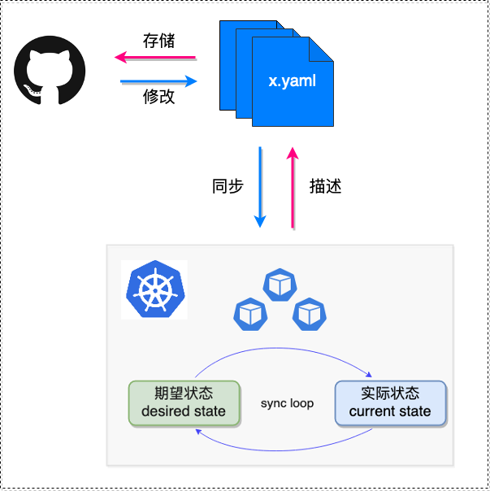
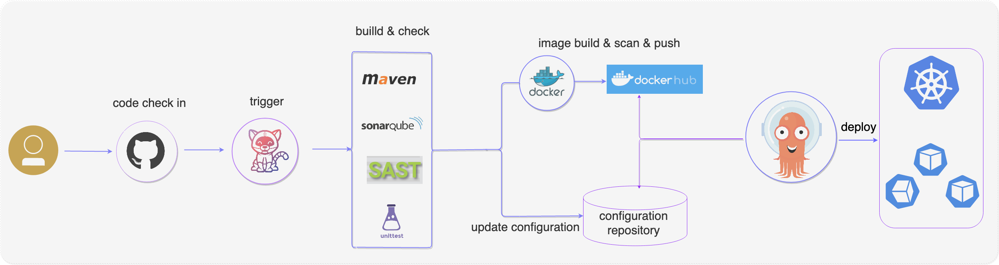

我有幸参加了 2021 年 7.9—7.10 在上海举行的 GOTC（全球开源技术大会）并以**利用 Tekton + ArgoCD 打造云原生 GitSecOps**为题做了分享。下面是分享的文字回顾。

## 云原生应用交付之痛

云原生未来以来，随着云原生的持续升温，云原生应用的交付也成了人们重点讨论的焦点。容器化技术和声明式系统对于应用程序的交付确实起到了很大的帮助，可以帮我们很方便的实现一键式部署和持续交付。典型的流程如下：


上述流程包含了从开发人员提交代码到代码构建检测再到镜像构建最后进行数据以及后续测试的流程（可能每个公司针对不同项目会略有不同，但是整体不会有太大出入）。当做好自动化以后，上述流程可以很好的实践持续集成、持续部署、持续交付，从而提升研发效率的。但是却也有一个很大的问题：流程都是从左往右进行（我称之为一杆子到底），针对于云原生应用（一切都可以用 yaml 文件进行描述，并存储在配置仓库中），很难保证配置描述和云原生底座（kubernetes 集群）上的实际状态真正相符，随着时间的推移，很容易发生另外一种“配置漂移”（配置仓库和实际状态不相符合）。

这种情况下就免不了人工智能（Human Intelligence）的再次介入，来：

* 登陆 kubernetes 集群，查看应用程序相应的状态，包括对某些环境变量、资源配置、版本信息等进行确认。
* 通过查看 IAM 用户信息及其他审计工具来应对安全合规团队的审计（比如列举出某个集群的用户以及用户曾经做了哪些操作）
* 用 kubectl 命令来做一些变更

随着集群数量和应用程序的增多，来自不同团队的上述灵魂拷问，会让很多人的崩溃的。既然有痛点就想个办法搞定它。


## 痛则思变

既然云原生应用的部署底座是 Kubernetes，而 Kubernetes 是一种声明式系统，也即意味着应用可以用 yaml 文件来进行描述的（实际也是这么做的，众多的 yaml 文件用 helm 或者 kustomize 来做一个编排管理，其实不仅仅是应用，基础设施也可以做到这些，也即常说的基础设施即代码），只要把这些 yaml 文件存储在 GitHub/GitLab 等上，再有一个自动同步的机制——完成 GitHub/GitLab 上描述文件的变更到 kubernetes 集群上应用的更新。这就是 GitOps 可以完成的事情。



从上面的图可以看出，GitOps 的两个核心点：


* **以声明式系统为基座（典型如 Kubernetes）**
* **以 Git（GitHub/GitLab等）为单一可信源**

改变的思路已经找到了，核心点也确定了，剩下的就是找到一个合适的工具来完成 GitOps 这一环节。针对 GitOps，目前有两款比较好用的工具，是[flux](https://github.com/fluxcd/flux2)和[argocd](https://github.com/argoproj/argo-cd/)。我选用了 ArgoCD。具体原因在后续的文章会和 flux 做一个对比，然后给出结论，敬请期待。

下面是 ArgoCD 的架构图，其有多个组件都是以 pod 的形式进行部署的（在后面的 demo 中可以看到），用户可以通过 UI、CLI、API 等方式来使用它，当其相关组件接收到外部请求就会做相应的动作，诸如在 Kubernetes 集群上部署应用程序或者发出通知等。更多信息可以查看[官网](https://github.com/argoproj/argo-cd/)。


## GitOps 实现之拦路虎

### 敏感信息处理

GitOps 的核心原则之一就是：一切皆代码，随后用 GitHub/GitLab 等对代码进行版本控制。这就引出了第一个问题：代码中的敏感信息怎么处理。我一直以来倡导的是不要将敏感信息放到代码然后推送至参数，为此还用了 git-secrets 来检测代码中的敏感信息（可查看 [git-secrets —— 从源头把控，防止敏感信息泄漏](https://mp.weixin.qq.com/s?__biz=Mzg3NjIzODc5NA==&mid=2247483812&idx=1&sn=bf827f939e383670b1ac7f12f9310fd4&chksm=cf340301f8438a1750ebbf572c9faee51fae12ea297474b89e854f90bce3431be2faf28f2689&mpshare=1&scene=1&srcid=0713Jpos7rw22iYn2SdcJlyU&sharer_sharetime=1626161942979&sharer_shareid=69a671b032908bc53da173d06860fd16&exportkey=ASViVFsA0mXvjNXU%2B02vlGg%3D&pass_ticket=nOCryZHOHqGg7fssbtg2s8S0Kn46FvoTLDmByUzgsdz7XJ3Q4bG%2BLVx2KTxmGEM7&wx_header=0#rd)这篇公众号）。

除此以外，我们还有另外一种手段，那就是将敏感信息进行加密后推送至仓库（只要保证加密所用的 key，就能很好的保证敏感信息的泄漏）。关于加密所用的手段，可以查看 CNCF 发布的 Secrets Management Technology Radar。


从技术雷达看，有多种手段诸如 Vault，Sealed Secrets，Sops 等开源产品，也有 AWS KMS，GCP Secrets Management 等厂商提供的产品。关于 Vault 的原理解析即落地实践，可以查看[DevSecOps Secret Data 管理之 Vault —— 以更安全的方式管理 Secret Data](https://mp.weixin.qq.com/s?__biz=Mzg3NjIzODc5NA==&mid=2247483804&idx=1&sn=92fe066f18f3af1eca9e724f77297b27&chksm=cf340339f8438a2fb87eb46e6ba4ea42f472311862b5e10330e23215320fcba6ebbb658627ed&mpshare=1&scene=1&srcid=0713s3vuifpec5CoOIxUrEk2&sharer_sharetime=1626161960234&sharer_shareid=69a671b032908bc53da173d06860fd16&exportkey=ASUtmuKT9kXifv0B3hA3EPg%3D&pass_ticket=nOCryZHOHqGg7fssbtg2s8S0Kn46FvoTLDmByUzgsdz7XJ3Q4bG%2BLVx2KTxmGEM7&wx_header=0#rd) 这篇公众号。关于 Sealed Secrets 等方式可以查看 [Kubernetes secrets 加密处理的几种方式](https://mp.weixin.qq.com/s?__biz=Mzg3NjIzODc5NA==&mid=2247484040&idx=1&sn=27198636bbe7a40308bcf3c9a876c4b4&chksm=cf34002df843893b4011a06afc74d57dd94b8f736428a662c1ad1a0984d7e7d81d64ab335e55&mpshare=1&scene=1&srcid=0713RvdyGqQlUG0CofT4Vl6i&sharer_sharetime=1626162044969&sharer_shareid=69a671b032908bc53da173d06860fd16&exportkey=AeGrg566FqPpvTZr1AgbfVE%3D&pass_ticket=nOCryZHOHqGg7fssbtg2s8S0Kn46FvoTLDmByUzgsdz7XJ3Q4bG%2BLVx2KTxmGEM7&wx_header=0#rd)这篇公众号。

下面我们讲讲我的公众号中没有涉及过的 sops 方式。

[sops](https://github.com/mozilla/sops)是一个加密文件的编辑器，支持多种文件格式，诸如 YAML、JSON、ENV、INI 及二进制格式，可以利用 AWS KMS、GCP KMS、Azure Key Vault、age 和 PGP 进行加密。详细内容可以查看[官网](https://github.com/mozilla/sops)。下面是一个使用示例。


不管采用哪种工具，其背后的原理都类似：采用非对称加密，有一对用于加解密的 key，加密是通过 public key 将敏感信息进行加密；解密是通过 private key 将加密信息解密，并生成 kubernetes 能识别的 secret 资源，最终被应用程序所使用。

加密示意图


解密示意图


### 镜像生成

ArgoCD 用名字就能看出（有个 CD），它侧重于持续部署这一块儿，但是完整的软件开发生命周期还有 CI 阶段，也就是说给 ArgoCD 一个镜像，它就能帮助我们完成镜像，但是它却不管镜像从哪儿来。这时候我们选择了[Tekton](https://github.com/tektoncd)来帮助我们完成源码到镜像的华丽转变。

Tekton是一个强大而灵活的开源框架，用于创建CI/CD系统。允许开发人员构建、测试和部署跨越云供应商和内部系统。


其整体分为两部分：EventListener 和 Pipeline。EventListener 主要用来监听 GitHub/GitLab 等系统的事件（push，pr 等），然后解析相关的参数（代码变更文件、提交人等），随后参数被传递到后面的 Pipeline 环节。Pipeline 是一个很形象的抽象，CI/CD 就像工厂的流水线一样（pipeline），原材料是源码，每一个工人处理一个步骤（task），可能是一个动作（one step），也可能是多个动作（multiple step），然后交付给下一个工人（task），最后产出产品（software）。


所以最终结果就是下面所示的源码作为输入，经过 Tekton，最后就变成了镜像仓库上面的镜像。


当然，这块儿用的代码也是比较简单的，代码拉取部分（包括源码和配置仓库）
```
resources:
  - name: source-apim
    resourceSpec:
      type: git
      params:
        - name: revision
          value: master
        - name: url
          value: https://your.source.code.github.com.url.git
  - name: devops
    resourceSpec:
      type: git
      params:
        - name: revision
          value: master
        - name: url
          value: https://your.devops.code.github.com.url.git
  - name: docker-image
    resourceSpec:
      type: image
      params:
        - name: url
          value: your/docker/image/url
```
用 kaniko 构建镜像（关于 kaniko 可以查看我的这篇公众号[Kaniko- 以一种更安全可靠的方式在Kubernetes平台上构建容器镜像](https://mp.weixin.qq.com/s?__biz=Mzg3NjIzODc5NA==&mid=2247483792&idx=1&sn=a9d2ae04e0f96a3e86f0e9be65278763&chksm=cf340335f8438a23ffa7f183a30e633ffe15ebaad6f0482fa5b627c228e77c174942125605a2&mpshare=1&scene=1&srcid=0713pDTuYlPH1sXIGvcebij7&sharer_sharetime=1626166995430&sharer_shareid=69a671b032908bc53da173d06860fd16&exportkey=AQCFIg6XTyk2BcZT29%2FqymE%3D&pass_ticket=vEuGJ1hGcsAzq45rGm4upuf8tS9robfkQEzT56LdzyJFlZ8OjK1etYyHnl5c7LZJ&wx_header=0#rd)
```
- name: image-build-and-push
  image: gcr.io/kaniko-project/executor:v0.17.1
  env:
    - name: "DOCKER_CONFIG"
      value: "/tekton/home/.docker/"
  command:
    - /kaniko/executor
  args:
    - --dockerfile=$(resources.inputs.source-code.path)/Dockerfile
    - --destination=$(resources.outputs.docker-image.url):$(params.image-tag)
    - --context=$(resources.inputs.source-code.path)
```

## GitSecOps 体系

基于上述的技术栈，就完成了 GitSecOps 体系：**Tekton + ArgoCD + Kustomize + SOPS(GPG) = GitSecOps**。



当然，仅仅是做了敏感信息加密和镜像安全扫描，就能称之为 GitSecOps，岂不是有点 too yong too simple 了。其实还要融合更多的安全内容进去，关于这块儿可以查看我的公众号[关于DevSecOps，你应该知道这些](https://mp.weixin.qq.com/s?__biz=MzIzMTQ0NDE2NQ==&mid=2247483959&idx=1&sn=b96bfe79fe8a1da72e477c56a8f61bdd&chksm=e8a5599ddfd2d08baf90e5da7955044213acb87893fd6a02e1af5774be18b0da9103e62df858&mpshare=1&scene=1&srcid=0713pGB8kTeiOzi9u1X8pGOB&sharer_sharetime=1626167790129&sharer_shareid=69a671b032908bc53da173d06860fd16&exportkey=AVCRQtogr2aJq21gylLlhDM%3D&pass_ticket=vEuGJ1hGcsAzq45rGm4upuf8tS9robfkQEzT56LdzyJFlZ8OjK1etYyHnl5c7LZJ&wx_header=0#rd)以及我在 2020 年中国 DevOps 社区峰会成都站的分享：[纵深防御：DevSecOps 的落地实践](https://www.bilibili.com/video/BV1Ya411F7iW?from=search&seid=4292643220169196885)。

## Demo

相关 Demo 可以看[小马哥说 DevOps 的 B 站](https://www.bilibili.com/video/BV1cq4y1W7PZ)。

## 演示代码仓库

1. https://github.com/majinghe/argocd-sops.git

2. https://github.com/majinghe/tekton-demo.git

3. https://github.com/majinghe/GitOps-demo.git

4. https://github.com/majinghe/Demo.git

