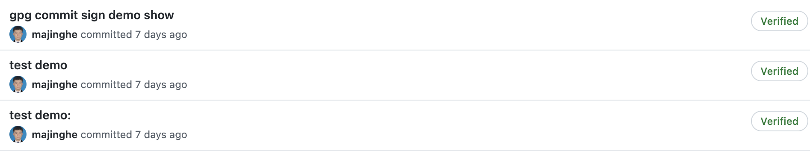
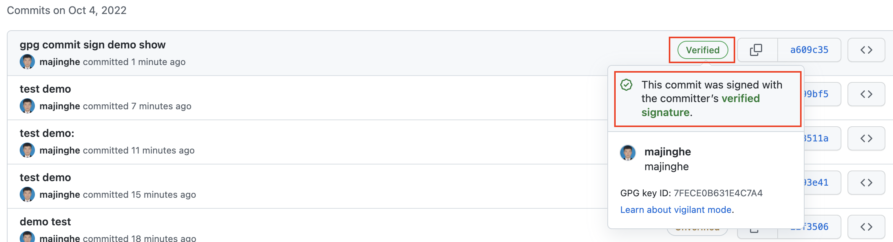
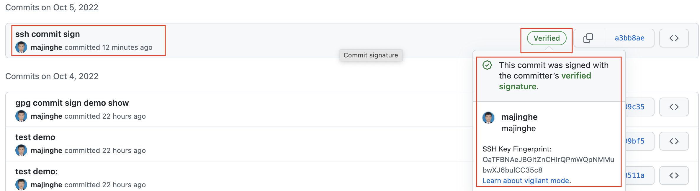
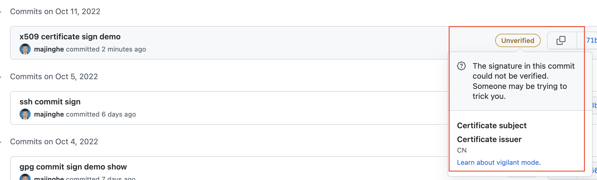
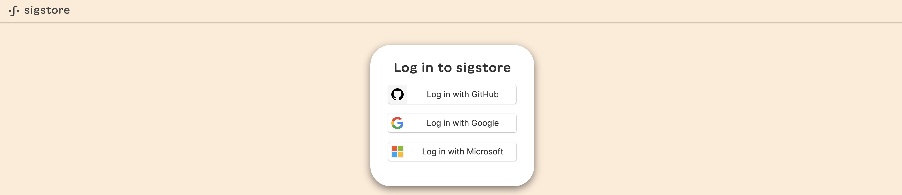
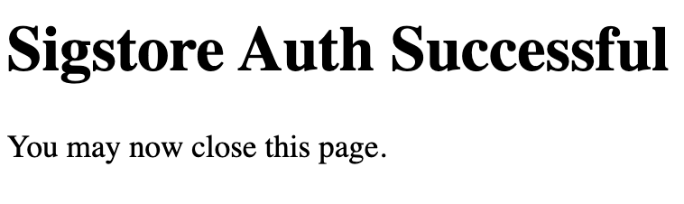
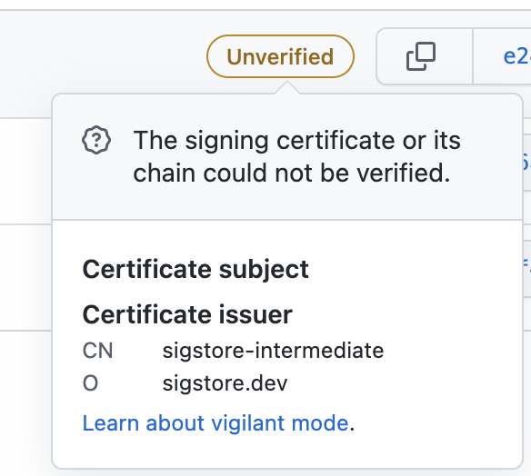

## 为何要进行 commit/tag 签名

对于 commit/tag 签名，可能大家的直观感受就是 GitHub 上一个绿色的 `Verified` 标志：



至于为什么需要对 git commit/tag 进行签名的原因一言以蔽之就是：**证明代码的提交来自真正的作者，防止提交的代码被篡改，保证提交代码的安全性**。

如果不对 commit/tag 进行签名，可以通过 git 的  `--author="Author Name <email@address.com>"` 来对 commit 信息的作者信息进行篡改，然后提交，这就导致了代码提交者有可能并不是真实的作者本人，如果提交的代码中有恶意代码，会对既有代码造成危害。签名验证就是为了保证代码的提交着和作者是同一个人。

对 commit/tag 进行签名验证的方法比较多，主流的有 GPG、SSH、X.509 证书等这种需要自己维护本地 key 的方式，也有 sigstore 新推出的 gitsign 这一 keyless 的签名方式。


## commit/tag 进行签名的几种方法

### 使用 GPG 进行 commit/tag 签名

使用 GPG 对 commit 进行签名，通常有以下几步：

* 检查本地是否有 GPG key

使用如下命令查看本地是否有存在的 GPG key：

```
$ gpg --list-secret-keys --keyid-format=long
```

如果本地有现成的 key 而且可用则可以直接用来在 GitHub 上进行配置并进行使用。如果没有现成的 key 或者现有的 key 已经过期，则可以根据下面的步骤生成新的 key。

* （optional）生成 GPG key

GPG key 的生成可以通过命令 `gpg --full-generate-key` 来进行，详细步骤可以查看过往博客[Kubernetes secrets 加密的几种方式](../../devsecops/secret-encrypt.md)。

生成之后可以用第一步中的命令进行查看：

```
$ gpg --list-secret-keys --keyid-format=long
sec   rsa4096/7FECE0B631E4C7A4 2022-10-04 [SC] [expires: 2023-10-04]
      F34E4D7D1BCD43FD20C2D0817FECE0B631E4C7A4
uid                 [ultimate] xiaomage (commit signature) <devops008@sina.com>
```

* 添加 GPG key 到源代码托管平台

以 GitHub 为例说明如何讲 GPG key 添加到相应的源代码托管平台（其他系统类似）。

添加之前先要 list 出 GPG public key，使用如下命令即可：

```
$ gpg --armor --export 7FECE0B631E4C7A4
-----BEGIN PGP PUBLIC KEY BLOCK-----

mQINBGM8UokBEADIWM5kqfYZ4xvJLLaBVoVl0dp48PjUNydg4SHmjh7sWYF8GTEm
.....................YOUR GPG PUBLIC KEY........................
1QwgprVd9P4iOXMxlL4MKSvHVfA+146jO3akdnQ5Hhb387XFXUUykq9ZOaWnlOW8
1EkQDhI3xZ5HOs4i677fNkrRypyt4jnXXw==
=tWFF
-----END PGP PUBLIC KEY BLOCK-----
```

> `7FECE0B631E4C7A4` 是上一步 list 出来的 GPG key ID。

在 Settings --> SSH and GPG keys 中选择 `New GPG key` 并将上述内容粘贴进去点击 `Add GPG key` 即可。

* 配置 Git config

通过配置 Git config 来告知 Git 使用 GPG 进行签名：

```
$ git config --global user.signingkey YOUR-GPG-KEY-ID
```

本文示例的 GPG key ID 为 `7FECE0B631E4C7A4`。

* 签名 commit

在代码变更之后使用 `-S` 进行 commit 签名：

```
$ git commit -S -m "gpg commit sign demo show"
```

在代码被推送到 GitHub 上，可以看到绿色的 `Verified` 徽章：



使用同样的方法也可以对 tag 进行签名。

```
$ git tag -S tag_name -m "tag sign message"
$ git push --tags
```

在 tags 界面查看即可。在后续的演示中 tag 的签名均是一样的，不再重复演示。


### 使用 SSH 进行 commit/tag 签名

使用 SSH 对 commit/tag 签名的过程和使用 GPG 是一样的，首先需要一对 SSH key，可使用本地已有的，也可以使用 `ssh-keygen` 命令重新创建一对。再将 SSH key 添加到 GitHub 账号上，方法与 GPG 的添加一致。唯一有区别的在于以下几点：

* 将 SSH key 添加到 ssh-agent

使用 `ssh-add` 命令将 SSH key 的 private key 添加到 ssh-agent，同时会添加 passphrase 到 keychain（如有 passpharse 的话）：

```
$ ssh-add ~/.ssh/id_rsa_commit_sign
Identity added: /Users/xiaomage/.ssh/id_rsa_commit_sign (devops008@sina.com)
```

* 配置 Git config

通过配置 Git config 来告知 Git 使用 SSH 进行签名：

```
$ git config --global user.signingkey YOUR-SSH-PUBLIC-KEY"
```

> YOUR-SSH-PUBLIC-KEY 为生成或者使用既有的 SSH public key。

* 签名 commit

在进行代码变更之后使用如下命令进行签名：

```
$ git commit -S -m "ssh commit sign"
[main a3bb8ae] ssh commit sign
 1 file changed, 1 insertion(+)
```
推送代码到 GitHub，可以看到有了绿色的 `Verified` 徽章，可以查看签名信息：



从详细的签名信息可以看到是通过 SSH 进行签名的（列出了 SSH Key Fingerprint）。

### 使用 X.509 进行 commit/tag 签名

[Smimesign](https://github.com/github/smimesign) 就是一种可以用 x509 证书来对 commit/tag 进行签名的方法。使用 Smimesign 进行签名的步骤如下：

* 确保有 X.509 证书

可以用 `smimesign --list-keys` 查看本地是否有证书存在，如果没有则可以在公共 CA 进行购买。本文演示用了自签名的证书并导入了 Keychain Access，证书信息如下：

```
$ smimesign --list-keys
       ID: 2dd0bea94c9e6a55c9f4b86e78b7b9f2a976c96d
      S/N: b5c3f7f30bbbd1b7
Algorithm: SHA256-RSA
 Validity: 2022-10-11 11:59:46 +0000 UTC - 2023-10-11 11:59:46 +0000 UTC
   Issuer: CN=xiaomage.devops.com,OU=MKT,O=JH,L=DL,ST=LN,C=CN
  Subject: CN=xiaomage.devops.com,OU=MKT,O=JH,L=DL,ST=LN,C=CN
   Emails: devops008@sina.com
```

> smimesign 的安装可以查看[安装指南](https://github.com/github/smimesign#installation)。

* 配置 Git config

通过配置 Git config 来告知 Git 使用 X.509 证书进行签名。如果是对所有仓库进行配置，则执行如下命令：

```
$ git config --global gpg.x509.program smimesign
$ git config --global gpg.format x509
```

如果只是针对单个仓库，执行如下命令即可：

```
$ cd PATH-TO-REPOSITORY
$ git config --local gpg.x509.program smimesign
$ git config --local gpg.format x509
```

配置签名的 `key`，也即上述 list 出来的 certificate ID：`2dd0bea94c9e6a55c9f4b86e78b7b9f2a976c96d`。

```
$ git config --global user.signingkey 2dd0bea94c9e6a55c9f4b86e78b7b9f2a976c96d
```

* 签名 commit/tag

在进行代码变更之后使用如下命令进行签名：

```
$ git add . && git commit -S -m "x509 certificate sign demo"
[main 71ba9bd] x509 certificate sign demo
 1 file changed, 1 deletion(-)
```

推送代码到 GitHub，可以查看签名验证信息：



> 显示 `Unverified` 是因为使用了自签名的证书，无法被 GitHub 信任。


以上可以看出，不管是使用 GPG、SSH 还是 X.509 证书对于 commit/tag 进行签名，本质都是用存储在本地的 secret key 进行签名的。这需要用户必须小心保护好保存在本地的签名 key。而下面要介绍的 gitsign 却是一种不需要自身维护本地 key 的签名方法。

## 关于 gitsign

[gitsign](https://github.com/sigstore/gitsign) 是 [sigstore](https://github.com/sigstore) 的一个开源项目，通过 keyless 的方式进行 Git 签名。gitsign 受启发于 [smimesign](https://github.com/github/smimesign) 项目，但是最大的不同是使用 keyless 的方式。

### gitsign 的安装

gitsign 的安装非常方便，可以使用 Homebrew 进行安装：

```
brew install sigstore/tap/gitsign
```

也可以通过 `go` 命令进行安装：

```
go install github.com/sigstore/gitsign@latest
```

通过 `--help` 或者 `-v` 来查看安装是否成功：

```
gitsign version v0.3.1
parsed config:
{
  "Fulcio": "https://fulcio.sigstore.dev",
  "Rekor": "https://rekor.sigstore.dev",
  "ClientID": "sigstore",
  "RedirectURL": "",
  "Issuer": "https://oauth2.sigstore.dev/auth",
  "ConnectorID": "",
  "LogPath": ""
}
```

> 目前最新版本就是 `0.3.1`。


### gitsign 的使用

gitsign 使用之前，需要先进行配置，如果是针对单个仓库，执行如下配置：

```
cd /path/to/my/repository
git config --local commit.gpgsign true  # Sign all commits
git config --local tag.gpgsign true  # Sign all tags
git config --local gpg.x509.program gitsign  # Use gitsign for signing
git config --local gpg.format x509  # gitsign expects x509 args
```

如果配置对所有仓库生效，执行如下配置：

```
git config --global commit.gpgsign true  # Sign all commits
git config --global tag.gpgsign true  # Sign all tags
git config --global gpg.x509.program gitsign  # Use gitsign for signing
git config --global gpg.format x509  # gitsign expects x509 args
```

接着使用 `git commit` 进行代码提交：

```
git commit --allow-empty --message="Signed commit"
```

浏览器会弹出如下界面：



选择一种登录方式，本文选择使用 GitHub 账号进行登录，点击 `Log in with GitHub`，随后会跳转到**http://localhost:55378/auth/callback?code=prlznslbnfteh7w7xscqcpiq3&state=2Fd3Pr0UlZa828WOi2HnPibGzIn**并出现 **Sigstore Auth Successful** 的界面：



签名结束会在命令行有如下输出：

```
Your browser will now be opened to:
https://oauth2.sigstore.dev/auth/auth?access_type=online&client_id=sigstore&code_challenge=p1jWW0LGMOfaNgB2czu2jR5Dhhr6rMW4yH4byuN0kBM&code_challenge_method=S256&nonce=2Fd3PpOa33YuYuuPPBNLECv2Uge&redirect_uri=http%3A%2F%2Flocalhost%3A55378%2Fauth%2Fcallback&response_type=code&scope=openid+email&state=2Fd3Pr0UlZa828WOi2HnPibGzIn
[main e24636b] Signed commit
```

接着推送到 GitHub 对应的仓库即可，在 commit 界面看到显示为**`Unverified`**：


点击 Unverified 可以看到签名证书的信息：



之所以显示 `Unverified` 是因为：

1. sigstore 的 CA root 并不是 GitHub trust root 的一部分
2. 因为 Gitsign 的临时密钥只在短时间内有效，使用标准的 x509 验证会认为证书过期后无效。验证需要包括通过 Rekor 进行的验证，以验证证书在使用时是否有效。

sigstore 团队期望能和 GitHub 团队通过协作在将来解决这个问题，让验证变成绿色的 `Verified`。


可以看到用 gitsign 进行签名的时候，不需要本地先生成用户签名的 key，在执行 commit 的时候会从 fulcio 获取用于签名的证书，然后用这些证书信息对 commit 进行签名，并将签名信息上传到 rekor。整个过程像 **keyless** 一样。更多关于 flucio、rekor 的内容，可以查阅[sigstore 官网](https://www.sigstore.dev/)。
