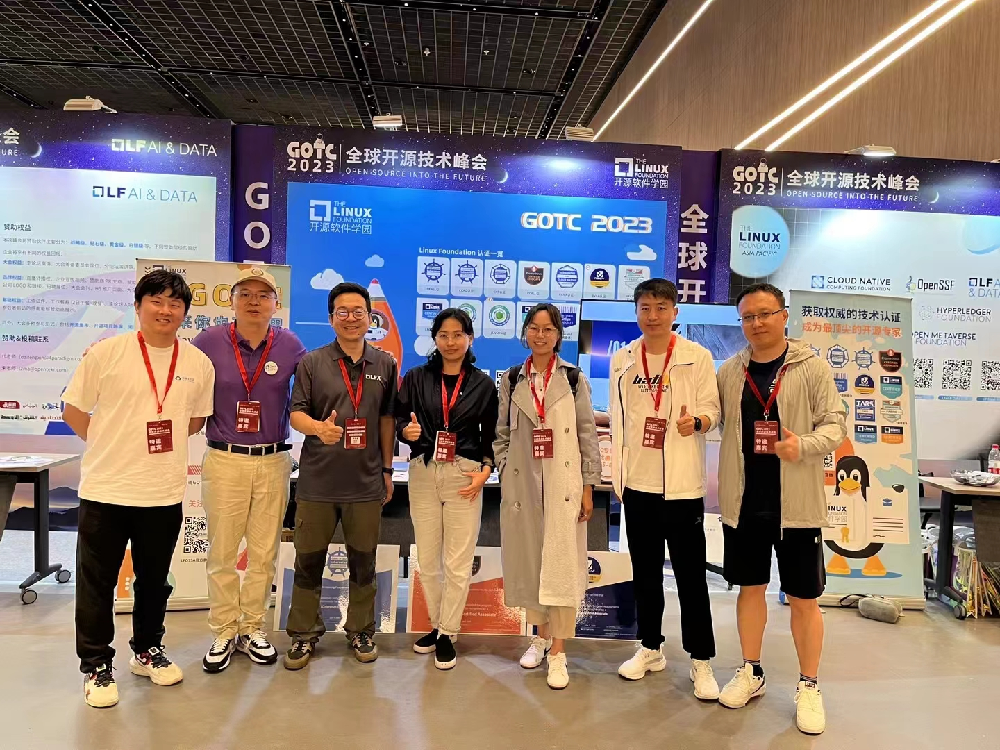
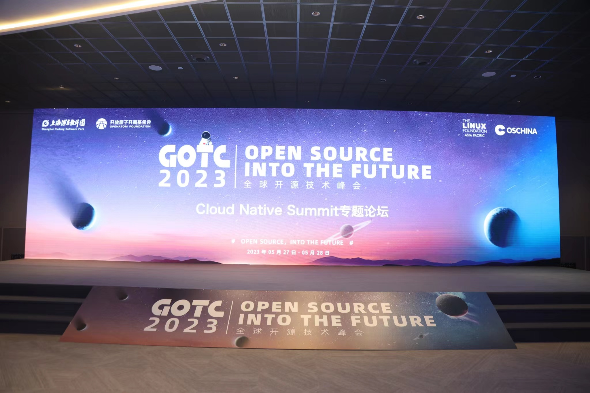
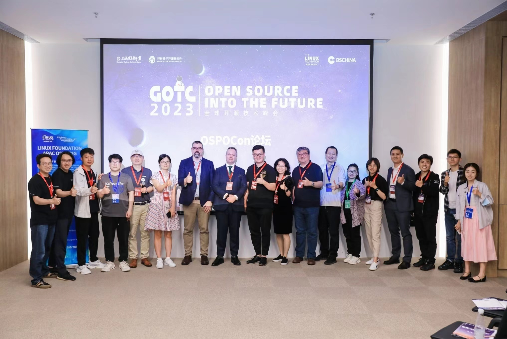
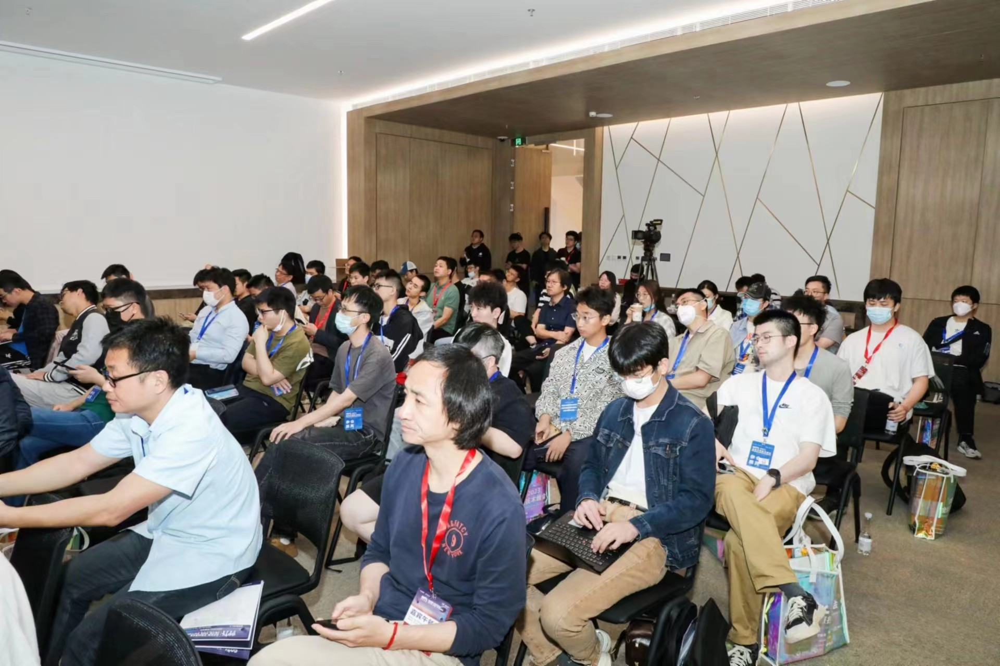
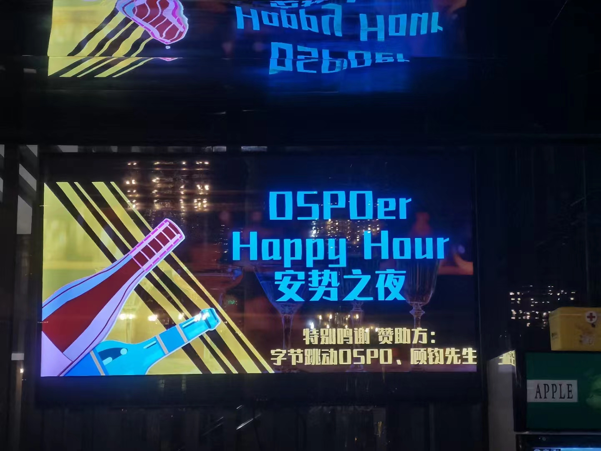
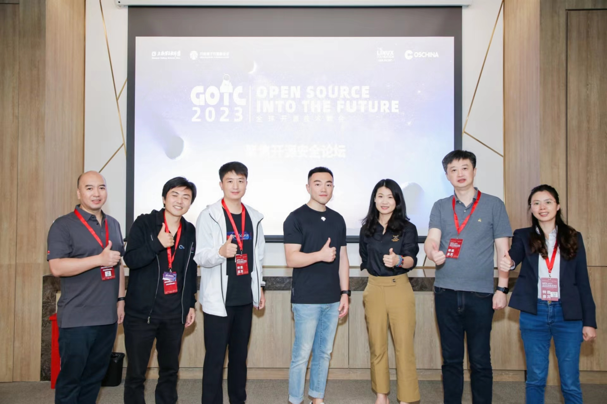
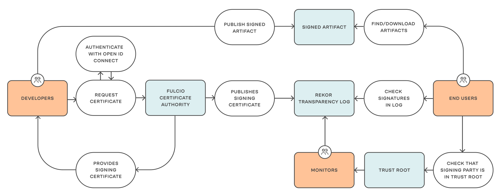
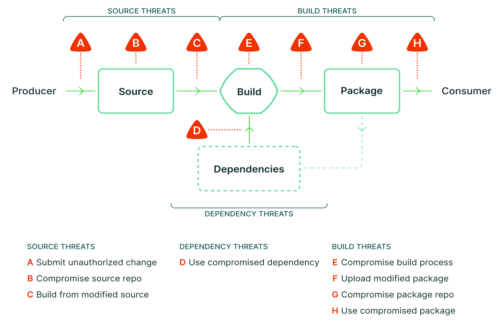

GOTC 结束快两周了，写一点迟到的参会体验。

这是我第二次参加 GOTC，上一次是 2021 年，同样是在上海，和 WAIC（世界人工智能大会）在同一个会场，很多参加人工智能的参会人员可能还不知道有一个 GOTC 大会的存在。这次的 GOTC 大会也是在上海，相比于上次，此次大会是单独举办，在张江科学会堂。整个会议持续了两天，第一天是主论坛，第二天是 17 个分论坛，聚焦在云原生、OSPO、开源安全、
AI、Rust、eBPF、OpenSDV 软件定义汽车等。规格及规模不可谓不大。

以下是一些个人参会体验，Enjoy！！！

## LFAPAC 布道师团队再聚首

LFAPAC 开源布道师团队始于 2020 年，最初只有10人，发展至今已经 30 余人。每次的开源大会，也是分散在各地的布道师们面基的日子，此次大会大概有 10 位左右的布道者到场，首次见到了 Maggie，Maggie 说这是过去几年首次从香港来上海，很开心；也首次面基了上次在北京 OSPOCon 上擦肩而过的龙文选老师。当然，遗憾的是大家在各自关注的会场或者展台交流，所有到场的布道者并没有完成一张集体留念。

## 走向深水区的云原生

云原生分会场依旧是 GOTC 大会的主角，一整天的分享，18 个议题。晓辉被拉了过去，当了一天的主持。我在看了其他分会场的场地规模和舞台设置后，我告诉他，你这个云原生分会场是此次所有分论坛中逼格最高的了。

我只听了个别几个议题，给我的感觉是云原生经过了这几年的狂飙式发展，很多东西已经走入深水区，讲师分享的有些内容都比较深，但是分享的内容几乎没有那种“啊哈 moment”的感觉了，甚至有部分议题有点像“大厂秀肌肉”，不知道是否符合中小群体用户的胃口。这一点在会后和其他小伙伴进行了交流，大家的整体感觉都差不太多。

## 持续亮相的 OSPOCon

建盛老师和强哥在 2021 年发起的 OSPO 万里行，应该可以算作 OSPOCon 的雏形。当初通过不定期走进企业去交流开源、布道开源，发展至今，围绕 OSPO 已经聚集了不少人。2021 年 GOTC，仅有 OSPO 的一个圆桌，到了今年 OSPO 有了一整个会场，一整天的活动，上午是 OSPOCon，下午是 lbrahim 关于开源合规的工作坊。

当然，在刚刚过去的 4 月份，国内首次完成了 OSPO Summit 的举办。OSPO 从最开始的小型聚会，到如今频繁登陆顶级开源会议甚至自己 host 完整的 Summit，OSPO 的发展似乎印证了那句话：**积小流以成江海**。

我应该参与了 OSPO 这几年的大部分活动，对于 OSPO 从开始到现在的发展真的是感同身受。开源的魅力可能不在于听别人讲，而在于自己亲身经历，亲自参与，用建盛老师的话说就是：learning by contribution。

## 因为 ChatGPT 而火爆的 AI 分会场

去年底火起来的 ChatGPT，让 AI 这把火持续在燃烧。由谭中意老师出品的 AI 分论坛（slogan 是 AI is everywhere）自然也成了所有分会场中最热门的会场，用座无虚席来讲也是毫不过分。

可能在人人自危的年代，大家都想学一下 AI 相关的知识，让自己能够在将来不被淘汰。毕竟有人说：**AI 会淘汰人，但是不会淘汰那些会用 AI 的人**。

## 开源的尽头是饭局

交（吃）流（饭）可能是所有开源活动的最终归宿，也是大家参与度非常高的环节。

第一天晚上，活动主办方为所有参会嘉宾提供了晚宴：自助。重点是有各种口味的小龙虾，让大家实现了小龙虾自由，就餐地点瞬间就被涌入的开源人群挤的满满当当，充分验证了一句话：吃饭不积极，思想有问题。一边吃小龙虾，一边聊哪个口味的好吃，似乎忘记了还有开源这回事情（此处保命狗头一个）。由于吃的太尽兴，我也忘记了拍照，这个成为了所有参会流程中唯一缺失照片的环节。

第二天晚上，是由安势信息、字节 OSPO、顾均老师个人三方赞助的 OSPOer 之夜。关注 OSPO 的人都再次聚到了酒吧，而这个酒吧应该是被包场了，服务人员可能没见过一次涌入这么多人，去了就是要吃的、要喝的（此处再来保命狗头一个）。大家一边吹着晚风、一边喷着花露水（坐在外面就吸引了蚊子部队的到来）、一边喝着各种叫不上名字的酒，聊着大家熟悉的话题，直到很晚很晚。

## 随性而为可能效果出奇

酒吧出来之后，在门口碰到了建盛老师，随后又遇到了刘洁老师。本来大家都是准备打车各自回酒店，但是站在那儿就聊起来了，比如此次大会的一些感受，情况，重点聊起了如何让其他更多布道者参与进来，大家一起做事情。结果一聊就是半小时，在刘洁老师不得不赶紧回去赶写作业之后，我、晓辉和建盛老师，索性决定不坐车，步行走回酒店！！！

这是一次大约四十分钟的徒步旅程，十一点的街上，行人很少、车辆也很少（也可能说明了，我们在的地方比较偏僻，不是上海夜生活的核心），我们开着导航，一边走一边聊，晓辉和建盛老师聊了很多关于文化、开源、商业等之类的发散性问题。至于细节，都留在那个夜晚的那几条街上了。

这次夜聊，完全是随性而为，话题也很发散，但是越到后面大家聊的东西就越多，可能就像那句话说的：无心插柳柳成荫。有时候跳出条条框框的设置，可能会看到更多，学到更多。这种美妙的夜晚就不配图了。

思绪还是要回来，回到正题上来，毕竟此次参会不是为了吃吃喝喝，还是要学习的。我在聚焦开源安全分论坛有一个主题分享：使用 Sigstore 主力 SLSA 框架的落地”。此论坛的出品人是杨轩老师，我听完了所有的分享，整体感受是：任重道远。

## 开源软件供应链安全任重而道远

我从 2019 年开始接触 DevSecOps，然后实施落地 DevSecOps，再到现在的布道 DevSecOps。这几年的整体感受就是：**安全似乎处在一个叫好不叫座、重要不等于重视困境里面**。似乎每个人都知道安全很重要，但是与我有什么关系呢？再叠加目前很多人对于开源的认知还远远未到开源还有安全需要考虑的这一层面，关键还加上一个高逼格的供应链做前缀，这种开源软件供应链安全的局面真的是：**困难他妈给困难开门，真TM困难**。调侃归调侃，还是回归到正题。

下午的分享首先是由杨轩老师开场，接着由 OpenSSF 总经理 Brain 做了远程分享。后面就是按部就班的议题分享了，分别是：

* 新思科技王永雷老师：基于网络弹性法案的企业级开源供应链安全解决方案
* 本人：Sigstore 助力 SLSA 框架的落地实践
* 安势信息的朱贤曼老师：基于 SBOM 的开源风险管理实践
* 华为的华为的崔锦国/王智老师：防微杜渐，构筑企业开源安全防御体系
* AWS 的郑予彬老师：从亚马逊独特文化看开源安全
* LFAPAC 开源布道师龙文选老师：用 SBOM 提升软件供应链安全
* 字节跳动的陈越老师：生产环境下多工作负载的安全建设实践
* 悬镜的董毅老师：基于代码疫苗技术的开源软件供应链安全治理
* 思探明的王宇老师：开源软件供应链安全的挑战与实践

下午分享的核心内容，大约围绕以下几个点：

* 开源使用率很高，但是开源安全的形式不容乐观

多位嘉宾都引用了 Synopsys 《Open Source Security and Risk Analysis report》（2022/2023 年）中的一些数据，比如 2023 年的报告中指出：96% 的扫描样本库中包含开源代码；76% 的样本库本身就是开源的。而 84% 的扫描样本库中至少包含一个漏洞，48% 的样本库包含高危漏洞。这些数据都说明，开源已经无处不在，但是其安全形势不容乐观，需要予以重视。

更多数据，感兴趣的可以查看上面提到的报告。

* SBOM 是构建开源软件供应链安全的关键要素

SBOM（Software Bill of Materials）是软件组成物料清单，**核心原理是通过增强透明性来提高软件安全性**。企业可以通过 SBOM 的使用来清楚的盘点自身的数字资产。目前 SBOM 的生成大多等同于 SCA，国内外有很多 SCA 产品目前主打的也是 SBOM 这一点。关于 SBOM 的详细内容，可以查看过往的公众号文章[从 Anchore 软件供应链安全报告深挖 SBOM & SPDX](https://majinghe.github.io/devsecops/sbom/)。

此次大会，多位分享嘉宾的主题都与 SBOM 有关，足以证明 SBOM 对于实现软件供应链安全的重要性。

* Sigstore & SLSA 

Sigstore 是 OpenSSF 基金会托管的一个项目簇，下面有多个开源项目，如聚焦代码签名的 gitsign、对 OCI 镜像签名的 cosign、一个免费可用的 CA center fulcio、存储签名元数据的 rekor 以及用于确保只有签名验证通过的镜像才可以部署到目标 Kubernetes 集群上的 Policy controller 等。这些项目能够使用“keyless”的方式对于制品进行签名验证，通过防止制品被篡改来提高安全性，大概的原理如下：

当开发者想要对制品（代码、镜像等）进行签名时，先从 fulcio（CA center）申请一个签名证书，然后用对应的证书进行制品签名，签名之后的制品被推送到制品库（代码托管平台、镜像仓库等），同时这些证书信息会被当成签名元数据存储到 rekor 里面；当终端用户使用此制品时，会先验证。验证的过程就是从 rekor 里面获取签名元数据，然后进行验证。

关于 gitsign、cosign 及 Policy Controller 的使用，可以查阅过往公众号文章[gitsign，一种keyless 的方式来对 git commit 进行签名验证](https://majinghe.github.io/devsecops/gitsign/)、[使用 cosign 来签名和验证 OCI 镜像，并和 Tekton CI/CD 集成](https://majinghe.github.io/devsecops/cosign/)及[使用 Policy Controller 实现签名镜像在 Kubernetes 集群上的部署](https://majinghe.github.io/devsecops/policy-controller/)。

SLSA(Supply-chain Levels for Software Artifacts) 是源于 Google 的一个软件供应链安全框架，现在已经被 OpenSSF 采用，作为一个能够指导开源软件供应链安全的框架。**SLSA 围绕生产者、来源、构建、包、依赖及使用者这几个方面来识别开源软件供应链中的安全风险**。可以通过一些手段来避免这些潜在风险或者减轻潜在风险带来的后果。前面提到的 SBOM、Sigstore 都是 SLSA 落地的有效手段。目前 SLSA 正式发布了 1.0 版本，内容还在持续迭代当中。更多详细内容可以查看[SLSA 官网](https://slsa.dev/)。

上面是众多分享嘉宾提到的一些重点内容概括，下面是我个人对于开源软件供应链安全发展的一些看法和想法。

* SBOM、Sigstore、SLSA 还远远不够

尽管业界已经达成共识，SBOM 是实践软件供应链安全的关键手段。但是 SBOM 也仅仅是增强了软件组件的可见性，以便在漏洞发生时候能够快速响应，及时避免被攻击。但是 SBOM 并不能解决组件自身的安全性，比如组件内部漏洞的发现，而且对于 SBOM 来讲，生产者和消费者之间还存在 Gap：**SBOM 的生成相对而言比较容易，现在有很多开源的工具，可以直接集成到 CI/CD Pipeline 中实现 SBOM 的自动生成，但是消费者如何去消费 SBOM，如何将 SBOM 的消费集成到企业软件研发流程中，这是个大问题**。

同样地，尽管 sigstore 下面有很多项目，但是目前仅仅聚焦在制品的签名验证，也就是保证制品的完整性和可靠性。但是暂时并没有涉及制品构建流程的可信安全（比如 CI/CD Pipeline 的安全），还有制品自身漏洞的挖掘、披露、修复的相关流程等。

而 SLSA 也在快速迭代中，目前也仅仅在一些知名开源项目中进行着实践，如何在企业内部落地实践 SLSA 也是需要值得探索的地方。

因此，SBOM、Sigstore、SLSA 为开源软件供应链的安全保障指出了一条可行的道路以及可以落地实践的项目，但是距离让企业、组织都真正重视开源软件供应链安全并落地实践，还需要做更多的工作。

* 政策驱动，多方协作，助力开源软件供应链安全的实践

向来政策的制定与实施都能对技术或者理念的推广和落地起到强力推动的作用，比如 2021 年 5 月，美国发布国家安全行政命令，同年 9 月欧盟颁布了网络弹性法案。这些政策都对于开源软件供应链安全有一些明确的信息输出。一些企业已经在这方面进行了重金投入，比如 Google、微软、IBM、华为等。目前来看，国内在针对开源软件供应链安全方面的政策法规的制定上还有发挥的空间，需要国内企业和组织一起协同落地一些具有指导意义的政策法规。

* 开源软件供应链安全需要从小众变成大众

目前关注开源软件供应链安全的群体还是比较小众且聚焦的，也就是之前关注开源或者关注安全的一波人（比如 OSPO），这些人在整个软件行业的从业人员中的占比还是非常少的，而开源软件供应链安全的最理想状态应该是使用开源的个人、企业、组织中的大部分人员甚至所有人员都应该具备这种安全意识，然后慢慢形成一种“肌肉记忆”般的安全文化，才能让开源软件供应链安全真正落地，也能让开源发挥真正的作用（比如降本、加速创新等）。

## 后记

最后还是用强哥常用的一句话来结尾：If you want to go fast, go alone; If you want to go far, go together。这句话可能不仅适用开源、安全，也适用日常生活。与大家共勉。

