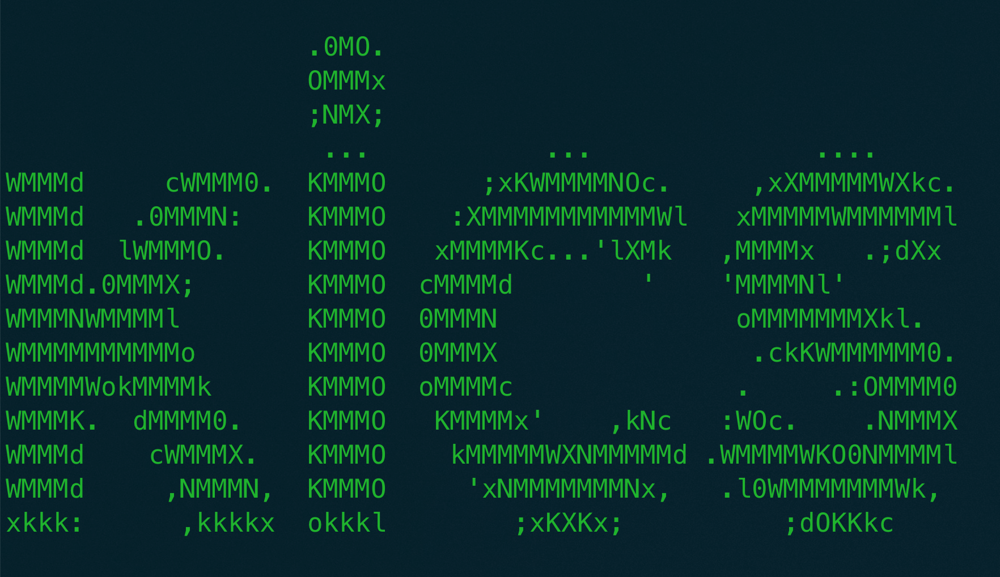
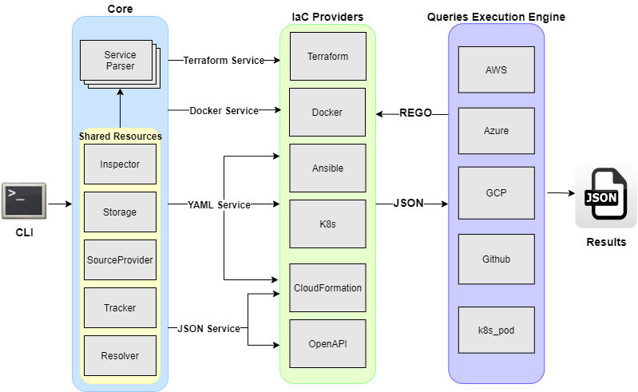

## 关于 KICS

[KICS](https://github.com/Checkmarx/kics) 是 Keeping Infrastructure as Code Secure 的缩写，是一个开源项目，主要用来在开发早期发现基础设施即代码中的一些安全漏洞、合规问题以及错误配置等。目前支持多种平台，诸如 Terraform、Kubernetes、Docker、Helm、Ansible 等。


### KICS 的原理

KICS 是插件式架构，具有可扩展的 IaC 语言解析管道，可以轻松地整合新的 IaC 语言和查询。KICS 有几个主要的组件：CLI、解析器（parser）、查询执行引擎（queries exection engine）、IaC 提供者（IaC provider）、安全查询（security queries）以及结果写入器（results writer）。各组件的主要功能为：


* **CLI**：为 KICS 提供命令行输入；
* **解析器**：负责解析输入的 IaC 文件（比如 terraform 及其他形式）；
* **IaC 提供者**：将 IaC 语言转换成规范化的 JSON；
* **查询执行引擎**：对规范化的 JSON 使用 REGO 查询；
* **安全查询**：针对每个安全漏洞和错误配置进行前置 REGO 查询；
* **写入器**：将结果写入到 JSON 文件中；


架构图如下：




## 使用 KICS 扫描 IaC

可以通过源码构建、brew 或者 docker 的方式来使用 KICS。详细使用方法可以参考[KICS 安装官方文档](https://github.com/Checkmarx/kics/blob/master/docs/getting-started.md)。本文选择用 docker 的方式来使用 KICS。docker 镜像为 `checkmarx/kics:latest`。可以通过启动容器的方式来查看 KICS 的用法：

```
$ docker run -t checkmarx/kics --help
Keeping Infrastructure as Code Secure

Usage:
  kics [command]

Available Commands:
  generate-id    Generates uuid for query
  help           Help about any command
  list-platforms List supported platforms
  remediate      Auto remediates the project
  scan           Executes a scan analysis
  version        Displays the current version

Flags:
      --ci                  display only log messages to CLI output (mutually exclusive with silent)
  -h, --help                help for kics
  -f, --log-format string   determines log format (pretty,json) (default "pretty")
      --log-level string    determines log level (TRACE,DEBUG,INFO,WARN,ERROR,FATAL) (default "INFO")
      --log-path string     path to generate log file (info.log)
      --no-color            disable CLI color output
      --profiling string    enables performance profiler that prints resource consumption metrics in the logs during the execution (CPU, MEM)
  -s, --silent              silence stdout messages (mutually exclusive with verbose and ci)
  -v, --verbose             write logs to stdout too (mutually exclusive with silent)

Use "kics [command] --help" for more information about a command.
```

查看 KICS 支持的平台类型：

```
$ docker run -t checkmarx/kics list-platforms
Ansible
AzureResourceManager
Buildah
CloudFormation
DockerCompose
Dockerfile
GRPC
GoogleDeploymentManager
Kubernetes
OpenAPI
Terraform
```

### 使用 KICS 扫描 Dockerfile

使用如下的 Dockerfile 来进行扫描：

```
FROM golang:1.12.9-alpine3.9 as builder
WORKDIR /tmp
COPY main.go /tmp
RUN go build main.go

FROM alpine:latest
WORKDIR /usr/src/app/
COPY --from=builder /tmp/main /usr/src/app/
CMD ["./main"]
```

使用如下命令进行扫描并查看输出结果：

```
docker run -t -v $PWD:/tmp/  checkmarx/kics scan -t Dockerfile -p "/tmp/"

                   .0MO.
                   OMMMx
                   ;NMX;
                    ...           ...              ....
WMMMd     cWMMM0.  KMMMO      ;xKWMMMMNOc.     ,xXMMMMMWXkc.
WMMMd   .0MMMN:    KMMMO    :XMMMMMMMMMMMWl   xMMMMMWMMMMMMl
WMMMd  lWMMMO.     KMMMO   xMMMMKc...'lXMk   ,MMMMx   .;dXx
WMMMd.0MMMX;       KMMMO  cMMMMd        '    'MMMMNl'
WMMMNWMMMMl        KMMMO  0MMMN               oMMMMMMMXkl.
WMMMMMMMMMMo       KMMMO  0MMMX                .ckKWMMMMMM0.
WMMMMWokMMMMk      KMMMO  oMMMMc              .     .:OMMMM0
WMMMK.  dMMMM0.    KMMMO   KMMMMx'    ,kNc   :WOc.    .NMMMX
WMMMd    cWMMMX.   KMMMO    kMMMMMWXNMMMMMd .WMMMMWKO0NMMMMl
WMMMd     ,NMMMN,  KMMMO     'xNMMMMMMMNx,   .l0WMMMMMMMWk,
xkkk:      ,kkkkx  okkkl        ;xKXKx;          ;dOKKkc


Scanning with Keeping Infrastructure as Code Secure v1.5.12


Preparing Scan Assets: Done
Executing queries: [---------------------------------------------------] 100.00%

Files scanned: 1
Parsed files: 1
Queries loaded: 48
Queries failed to execute: 0

------------------------------------

Healthcheck Instruction Missing, Severity: LOW, Results: 1
Description: Ensure that HEALTHCHECK is being used. The HEALTHCHECK instruction tells Docker how to test a container to check that it is still working
Platform: Dockerfile

	[1]: ../../tmp/Dockerfile:9

		008:
		009: FROM alpine:latest
		010:


Image Version Using 'latest', Severity: MEDIUM, Results: 1
Description: When building images, always tag them with useful tags which codify version information, intended destination (prod or test, for instance), stability, or other information that is useful when deploying the application in different environments. Do not rely on the automatically-created latest tag
Platform: Dockerfile

	[1]: ../../tmp/Dockerfile:9

		008:
		009: FROM alpine:latest
		010:


Missing User Instruction, Severity: HIGH, Results: 1
Description: A user should be specified in the dockerfile, otherwise the image will run as root
Platform: Dockerfile

	[1]: ../../tmp/Dockerfile:9

		008:
		009: FROM alpine:latest
		010:


Results Summary:
HIGH: 1
MEDIUM: 1
LOW: 1
INFO: 0
TOTAL: 3

Scan duration: 7.366705761s
```
可以看到扫描出来了三个安全问题，高中低各一个。高危漏洞指没有指定容器的启用用户，中危漏洞是指使用了 `latest` 镜像 tag，低危漏洞是指没有使用 HEALTHCHECK。修复之后的 Dockerfile 如下：

```
FROM golang:1.12.9-alpine3.9 as builder
WORKDIR /tmp
COPY main.go /tmp
RUN go build main.go

FROM alpine:3.10
RUN addgroup -S devsecops && adduser -S devsecops -G devsecops
WORKDIR /usr/src/app/
COPY  --from=builder /tmp/main /usr/src/app/
USER devsecops
HEALTHCHECK CMD curl --fail http://localhost:9999 || exit 1
CMD ["./main"]
```

再次扫描：

```
 docker run -t -v $PWD:/tmp/  checkmarx/kics scan -t Dockerfile -p "/tmp/"

                   .0MO.
                   OMMMx
                   ;NMX;
                    ...           ...              ....
WMMMd     cWMMM0.  KMMMO      ;xKWMMMMNOc.     ,xXMMMMMWXkc.
WMMMd   .0MMMN:    KMMMO    :XMMMMMMMMMMMWl   xMMMMMWMMMMMMl
WMMMd  lWMMMO.     KMMMO   xMMMMKc...'lXMk   ,MMMMx   .;dXx
WMMMd.0MMMX;       KMMMO  cMMMMd        '    'MMMMNl'
WMMMNWMMMMl        KMMMO  0MMMN               oMMMMMMMXkl.
WMMMMMMMMMMo       KMMMO  0MMMX                .ckKWMMMMMM0.
WMMMMWokMMMMk      KMMMO  oMMMMc              .     .:OMMMM0
WMMMK.  dMMMM0.    KMMMO   KMMMMx'    ,kNc   :WOc.    .NMMMX
WMMMd    cWMMMX.   KMMMO    kMMMMMWXNMMMMMd .WMMMMWKO0NMMMMl
WMMMd     ,NMMMN,  KMMMO     'xNMMMMMMMNx,   .l0WMMMMMMMWk,
xkkk:      ,kkkkx  okkkl        ;xKXKx;          ;dOKKkc


Scanning with Keeping Infrastructure as Code Secure v1.5.12


Preparing Scan Assets: Done
Executing queries: [---------------------------------------------------] 100.00%

Files scanned: 1
Parsed files: 1
Queries loaded: 48
Queries failed to execute: 0

------------------------------------


Results Summary:
HIGH: 0
MEDIUM: 0
LOW: 0
INFO: 0
TOTAL: 0

Scan duration: 6.053745825s
```

可以看到所有级别的安全问题都为 0。证明问题已经被修复。

> **注意**：上述 Dockerfile 修复只是为了验证  KICS 的 IaC 扫描能力，需要根据自身场景进行 Dockerfile 的准确编写与修复。

### 使用 KICS 扫描 Helm Charts

使用 `helm create` 创建一个 helm chart：

```
$ helm create kics
Creating kics
```

使用 KICS 进行扫描：

```
docker run -t -v $PWD:/tmp/  checkmarx/kics scan -t Kubernetes -p "/tmp/"

                   .0MO.
                   OMMMx
                   ;NMX;
                    ...           ...              ....
WMMMd     cWMMM0.  KMMMO      ;xKWMMMMNOc.     ,xXMMMMMWXkc.
WMMMd   .0MMMN:    KMMMO    :XMMMMMMMMMMMWl   xMMMMMWMMMMMMl
WMMMd  lWMMMO.     KMMMO   xMMMMKc...'lXMk   ,MMMMx   .;dXx
WMMMd.0MMMX;       KMMMO  cMMMMd        '    'MMMMNl'
WMMMNWMMMMl        KMMMO  0MMMN               oMMMMMMMXkl.
WMMMMMMMMMMo       KMMMO  0MMMX                .ckKWMMMMMM0.
WMMMMWokMMMMk      KMMMO  oMMMMc              .     .:OMMMM0
WMMMK.  dMMMM0.    KMMMO   KMMMMx'    ,kNc   :WOc.    .NMMMX
WMMMd    cWMMMX.   KMMMO    kMMMMMWXNMMMMMd .WMMMMWKO0NMMMMl
WMMMd     ,NMMMN,  KMMMO     'xNMMMMMMMNx,   .l0WMMMMMMMWk,
xkkk:      ,kkkkx  okkkl        ;xKXKx;          ;dOKKkc


Scanning with Keeping Infrastructure as Code Secure v1.5.12


Preparing Scan Assets: Done
Executing queries: [---------------------------------------------------] 100.00%

Files scanned: 4
Parsed files: 3
Queries loaded: 146
Queries failed to execute: 0

------------------------------------

Root Container Not Mounted Read-only, Severity: LOW, Results: 1
Description: Check if the root container filesystem is not being mounted read-only.
Platform: Kubernetes

	[1]: ../../tmp/kics/templates/deployment.yaml:30

		029:         {{- toYaml .Values.podSecurityContext | nindent 8 }}
		030:       containers:
		031:         - name: {{ .Chart.Name }}


CPU Limits Not Set, Severity: MEDIUM, Results: 1
Description: CPU limits should be set because if the system has CPU time free, a container is guaranteed to be allocated as much CPU as it requests
Platform: Kubernetes

	[1]: ../../tmp/kics/templates/deployment.yaml:48

		047:               port: http
		048:           resources:
		049:             {{- toYaml .Values.resources | nindent 12 }}


Privilege Escalation Allowed, Severity: HIGH, Results: 1
Description: Containers should not run with allowPrivilegeEscalation in order to prevent them from gaining more privileges than their parent process
Platform: Kubernetes

	[1]: ../../tmp/kics/templates/deployment.yaml:30

		029:         {{- toYaml .Values.podSecurityContext | nindent 8 }}
		030:       containers:
		031:         - name: {{ .Chart.Name }}


NET_RAW Capabilities Not Being Dropped, Severity: HIGH, Results: 1
Description: Containers should drop 'ALL' or at least 'NET_RAW' capabilities
Platform: Kubernetes

	[1]: ../../tmp/kics/templates/deployment.yaml:30

		029:         {{- toYaml .Values.podSecurityContext | nindent 8 }}
		030:       containers:
		031:         - name: {{ .Chart.Name }}


Results Summary:
HIGH: 2
MEDIUM: 10
LOW: 7
INFO: 0
TOTAL: 19

Scan duration: 4.371884514s
```

可以看到总计有 19 处安全问题。可以根据提示进行修复，修复之后再次扫描即可。


## 将 KICS 集成到 Tekton CI/CD 中

使用 Tekton 创建一个 task，内容如下：

```
apiVersion: tekton.dev/v1beta1
kind: Task
metadata:
  name: build-docker-image
spec:
  resources:
    inputs:
      - name: source-code
        type: git
  steps:
    - name: dockerfile-kics-scan
      image: checkmarx/kics
      script: |
        #! /bin/sh
        kics scan -t Dockerfile -p $(resources.inputs.source-code.path)
```

然后创建 `Task` 即可。然后用 `TaskRun` 触发一个 `Task`，可以查看两者的状态：

```
$  tkn -n tekton-kics tr list
NAME                     STARTED         DURATION     STATUS
dockerfile-kics-scan-run   4 minutes ago   21 seconds   Succeeded

$ tkn -n tekton-kics t list
NAME                 DESCRIPTION   AGE
dockerfile-kics-scan                 4 minutes ago
```

整个构建过程会在 `tekton-kics` namespace 下面创建一个 pods：


```
$ kubectl -n tekton-kics get pods -w
NAME                         READY   STATUS            RESTARTS   AGE
build-docker-image-run-pod   0/4     PodInitializing   0          7s
build-docker-image-run-pod   4/4     Running           0          13s
build-docker-image-run-pod   4/4     Running           0          13s
build-docker-image-run-pod   2/4     NotReady          0          15s
build-docker-image-run-pod   0/4     Completed         0          22s
build-docker-image-run-pod   0/4     Completed         0          24s
```

通过 `logs -f` 可查看构建过程：

```
kubectl -n tekton-kics logs -f build-docker-image-run-pod -c step-dockerfile-kics-scan

                   .0MO.
                   OMMMx
                   ;NMX;
                    ...           ...              ....
WMMMd     cWMMM0.  KMMMO      ;xKWMMMMNOc.     ,xXMMMMMWXkc.
WMMMd   .0MMMN:    KMMMO    :XMMMMMMMMMMMWl   xMMMMMWMMMMMMl
WMMMd  lWMMMO.     KMMMO   xMMMMKc...'lXMk   ,MMMMx   .;dXx
WMMMd.0MMMX;       KMMMO  cMMMMd        '    'MMMMNl'
WMMMNWMMMMl        KMMMO  0MMMN               oMMMMMMMXkl.
WMMMMMMMMMMo       KMMMO  0MMMX                .ckKWMMMMMM0.
WMMMMWokMMMMk      KMMMO  oMMMMc              .     .:OMMMM0
WMMMK.  dMMMM0.    KMMMO   KMMMMx'    ,kNc   :WOc.    .NMMMX
WMMMd    cWMMMX.   KMMMO    kMMMMMWXNMMMMMd .WMMMMWKO0NMMMMl
WMMMd     ,NMMMN,  KMMMO     'xNMMMMMMMNx,   .l0WMMMMMMMWk,
xkkk:      ,kkkkx  okkkl        ;xKXKx;          ;dOKKkc


Scanning with Keeping Infrastructure as Code Secure v1.5.12


Files scanned: 1
Parsed files: 1
Queries loaded: 48
Queries failed to execute: 0

------------------------------------


Results Summary:
HIGH: 0
MEDIUM: 0
LOW: 0
INFO: 0
TOTAL: 0

Scan duration: 3.556468026s
```

结果显示没有任何安全漏洞，是因为使用了前述修复之后的 Dockerfile 来进行演示。

关于其他 IaC 的扫描以及与 Tekton 的集成与上述演示的类似，在此不做详述。


