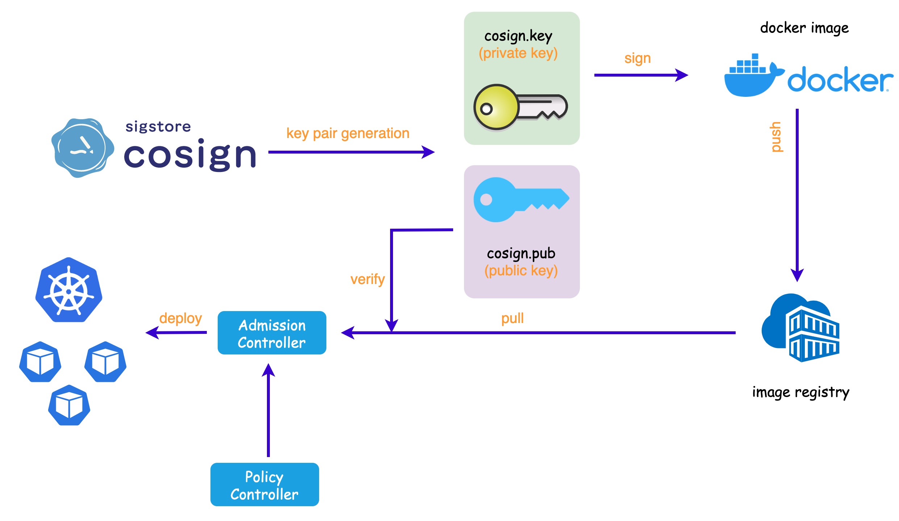

# 使用 Policy Controller 实现签名镜像在 Kubernetes 集群上的部署

之前的文章中写了用 cosign 对于容器镜像进行签名和验证，避免容器镜像被篡改。而如何确保只有被签名的镜像才能被部署到 Kubernetes 集群上呢？

答案就是：**Policy Controller**。


## 什么是 Policy Controller

`Policy Controller` 是一个 Admission Controller，通过对来自于 `cosign` 的供应链元数据进行验证，进而完成在 Kubernetes 集群上的策略执行。`Policy Controller` 能够确保 Kubernetes 集群上运行的容器镜像和用户确认的镜像是一致的，能够有效保障云原生应用程序安全。

Cosign 和 Policy Controller 结合使用，能够实现：只有被正确签名的镜像，在验证通过后方可部署到对应的 Kubernetes 集群上。大概原理图如下：




## Policy Controller 的安装

可以使用 [Policy Controller Helm Chart](https://github.com/sigstore/helm-charts/tree/main/charts/policy-controller) 来完成 Policy Controller 的安装：

* Step 1: 添加 Helm Repo
```

$ helm repo add sigstore https://sigstore.github.io/helm-charts
"sigstore" has been added to your repositories
```

* Step 2：Helm Install

```
$ helm repo update
...Successfully got an update from the "sigstore" chart repository
Update Complete. ⎈Happy Helming!⎈

$ helm install policy-controller -n cosign-system sigstore/policy-controller --devel
NAME: policy-controller
LAST DEPLOYED: Mon Apr 10 23:47:27 2023
NAMESPACE: cosign-system
STATUS: deployed
REVISION: 1
TEST SUITE: None
```

* Step 3：Installation Check

```
$ kubectl -n cosign-system get pods
NAME                                                READY   STATUS    RESTARTS   AGE
policy-controller-policy-webhook-55987c6b86-29kvk   1/1     Running   0          4m32s
policy-controller-webhook-56ff86dff9-xs69r          1/1     Running   0          4m32s
```

## Policy Controller 的使用


Policy Controller 之所以能够实现只有签名验证通过的镜像才能够被部署到目标 Kubernetes 上的一个重要因素是 `ClusterImagePolicy`。

`ClusterImagePolicy` 指定了验证镜像的 `Policy`，只有满足 `Policy` 的镜像才会被“认可”，才能被部署到集群上。而满足的方式就是使用 `spec.authorities.key` 去对镜像（已经签名了的镜像）进行验证。

因此需要创建一个 `ClusterImagePolicy`：

```
cat << EOF | kubectl apply -f - 
apiVersion: policy.sigstore.dev/v1beta1
kind: ClusterImagePolicy
metadata:
  name: cosign-cip
spec:
  images:
  - glob: "**"
  authorities:
    - key:
        hashAlgorithm: sha256
        data: |
          -----BEGIN PUBLIC KEY-----
          content in cosign.pub generated by you
          -----END PUBLIC KEY-----
EOF
```

需要注意的是，key 的形式有多种，详情可以查看 [Sigstore 官网之 Configuring key authorities](https://docs.sigstore.dev/policy-controller/overview/#configuring-key-authorities)。

接着使用过往文章[使用 cosign 来签名和验证 OCI 镜像，并和 Tekton CI/CD 集成](https://majinghe.github.io/devsecops/cosign/)中的方法，使用 cosign 来生成一对 key（cosign.key 和 cosign.pub），再使用[Demo 库]()的代码和 `Dockerfile` 构建一个镜像并用 cosign 镜像签名：

```
$ docker build -t dllhb/sigstore-cip:0.1
$ docker push dllhb/sigstore-cip:0.1
$ cosgin sign --key cosign.key dllhb/sigstore-cip:0.1
```
然后将此镜像部署到目标 Kubernetes 集群上。

在此之前，需要在 Kubernetes 目标集群上的目标 namespace 上开启容器镜像验证功能：

```
$ kubectl create ns cosign-test
$ kubectl label namespace cosign-test policy.sigstore.dev/include=true
```

然后以上述签名的镜像为准，创建一个 `deploymet` 并查看 `pod`：

```
## Create deployment
$ kubectl -n cosign-test create deploy signed --image=dllhb/sigstore-cip:0.1
deployment.apps/signed created

## Check the pods status
$ kubectl -n cosign-test get pods
NAME                     READY   STATUS    RESTARTS   AGE
signed-d96ddf479-nglrk   1/1     Running   0          43m
```
可以看到签名的镜像被成功部署。

对 Demo 库中的代码进行简单修改，再次构建一个新镜像：

```
$ docker build -t dllhb/sigstore-cip:0.2
$ docker push dllhb/sigstore-cip:0.2
```
> 注意，此次没有对镜像做签名。

以此镜像为基准，再次创建一个 `deployment`：

```
$ kubectl -n cosign-test create deploy unsigned --image=dllhb/sigstore-cip:0.2
error: failed to create deployment: admission webhook "policy.sigstore.dev" denied the request: validation failed: failed policy: cosign-cip: spec.template.spec.containers[0].image
index.docker.io/dllhb/sigstore-cip@sha256:9ea9f50d0651e5c29804d1768bac11e5b3424fd1ee7b871d8db2edb817fd47ea signature key validation failed for authority authority-0 for index.docker.io/dllhb/sigstore-cip@sha256:9ea9f50d0651e5c29804d1768bac11e5b3424fd1ee7
b871d8db2edb817fd47ea: no matching signatures:
```

返回结果显示，创建失败，原因是 `admission webhook "policy.sigstore.dev" denied the request`。也就是 `Policy Controller` 阻止了未经过签名的镜像被部署到目标集群上。

在 Policy Controller Webhook pod 中可以找到如下 log：


```
$ kubectl -n cosign-system logs -f policy-controller-webhook-56ff86dff9-7m9qm
{"level":"error","ts":"2023-04-28T13:47:31.881Z","logger":"policy-controller","caller":"webhook/validation.go:47","msg":"error validating signatures: no matching signatures:\n","commit":"89ef904-dirty","knative.dev/kind":"apps/v1, Kind=Deployment","knative.dev/namespace":"cosign-test","knative.dev/name":"unsigned","knative.dev/operation":"CREATE","knative.dev/resource":"apps/v1, Resource=deployments","knative.dev/subresource":"","knative.dev/userinfo":"docker-for-desktop","stacktrace":"github.com/sigstore/policy-controller/pkg/webhook.valid\n\tgithub.com/sigstore/policy-controller/pkg/webhook/validation.go:47\ngithub.com/sigstore/policy-controller/pkg/webhook.ValidatePolicySignaturesForAuthority\n\tgithub.com/sigstore/policy-controller/pkg/webhook/validator.go:752\ngithub.com/sigstore/policy-controller/pkg/webhook.ValidatePolicy.func1\n\tgithub.com/sigstore/policy-controller/pkg/webhook/validator.go:529"}
```

因此，Cosign + Policy Controller 的组合能够完成容器镜像的签名，并且在被验证通过后才可以部署到 Kubernetes 集群上，能够有效地防止容器镜像被篡改，提高云原生应用程序的安全性。
