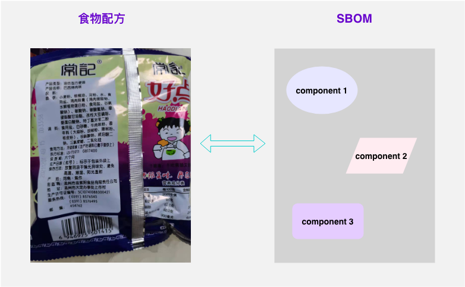

Linux 基金会在 2021 年第三季度在全球范围内发起了一个关于企业或组织采用 SBOM 的调研，最近发布了题为《Software Bill of Materials(SBOM) and Cybersecrity Readiness》的报告。报告长达 72 页，原文可以在[这儿](https://linuxfoundation.org/wp-content/uploads/LFResearch_SBOM_Report_020422.pdf)看到。下面是报告的部分内容解读。

## SBOM 背景介绍

SBOM 是 Software Bill Of Materials 的缩写，中文意思为软件物料清单。SBOM 被认为是实现软件供应链安全的重要因素之一。**SBOM 是一种正式且机器可读的元数据，主要用来唯一标识软件组件、软件依赖以及许可证数据**。SBOM 之于软件，就像配方之于食品，如下图所示：

食品配方能够清晰的知道该食品里面包含哪些原材料；SBOM 能够清楚的知道一个软件里面到底包含有哪些组件，组件之间的依赖关系是怎么样等等。目的是能够让企业对于自己所使用的软件有一个清晰的认识，一旦某个组件有安全漏洞发生（诸如 2021 年末闹的甚嚣尘上的 Log4j 漏洞），则可以通过 SBOM 来第一时间找到受影响的软件，及时进行补丁修复，从而减少由于某个特定组件发生的安全漏洞而对公司造成的损害（经济或者名声）。

SBOM 的出现和普及与开源软件供应链安全这个话题密切相关，关于这两者详细的描述可以查阅另一篇博文[从 Anchore 软件供应链安全报告深挖 SBOM & SPDX](https://majinghe.github.io/Cloud-Native-DevSecOps/devsecops/sbom/)。

## 报告解读

此次报告的分析来自于 412 分样本，重点内容如下。

### 重点数据

* 98% 的组织表示使用了开源软件；

* 95% 的组织对软件安全表示担忧；

* 76% 的组织对于 SBOM 有一定程度的认知；

* 47% 的组织正在使用 SBOM；

* 2022年，各组织对 SBOM 的使用将增加66%；

* 78% 的企业将在 2022 年使用 SBOM；

* 88% 的企业将在 2023 年使用 SBOM；

* 74% 的组织在生产和消费 SBOM；

### SBOM 重点解读

* 98% 的组织对于他们所使用软件的安全性表示担忧，其中 72% 是极度担忧。在这其中亚太地区是对软件安全性最担心的，占比达到 35%，其次是美国的 21%，其他地区占比 18%（包括欧洲，中东以及非洲）；

* 在影响组织对软件使用的因素中，安全排在第一位。许可证合规排在第二位；

* 导致组织对软件安全如此担忧的主要原因包括财务风险（占比 66%），公司声誉风险（占比 61%）以及法务风险（53%）；

* 白宫发布的[提高国家网络安全的行政命令](https://www.whitehouse.gov/briefing-room/presidential-actions/2021/05/12/executive-order-on-improving-the-nations-cybersecurity/)正在产生世界性的影响。80% 的组织都表示了解这个行政命令，而 72% 的组织表示要做出相应改变；

* 确保软件供应链安全的关键要素就是重点强调 SBOM。47% 的组织想要可扩展的漏洞报告，45% 的组织视 SBOM 为确保软件供应链安全的关键方法。39% 的组织希望 SBOM 能够支持全球范围内的唯一标识，34% 的组织希望通过使用可重复的构建来进行组件验证。如今的部分 SBOM 数据依然支持对组件的验证和对漏洞的报告。全球唯一标识也正在进行中，而这是通过对包 URLs（PURLs）做一些数据格式变动来支持的。目前来看，SBOM 支持多样化的软件供应链安全活动；

* 90% 的组织已经开启了 SBOM 之旅。10% 的组织还未有任何使用 SBOM 的计划，同时 14% 的组织正在计划使用。52% 的受访者表示已经在他们的少数、部分或者大多数业务领域开始使用 SBOM；23% 的受访者表示几乎在全业务领域使用 SBOM 或者有标准的实践来使用 SBOM。这也就意味着 76% 的组织已经开始了不同程度的 SBOM 使用；

* SBOM 的生产通常与创建商业软件的组织有密切关系，但是从报告看，他们对于 SBOM 生产的采用度非常高。只有 7% 的企业没有任何计划来生成 SBOM。另外有 40% 表示在未来 6- 24 个月之内会生成 SBOM，27% 的表示他们已经在他们的业务中或多或少生成了 SBOM。非常积极的一面是，21% 的受访者表示已经在他们所有的业务中生成了 SBOM 或者有标准的实践来使用 SBOM。总体看来，48% 的组织正在某种程度上生成 SBOM；

* 生成 SBOM 的三大收益为：**51% 的受访者表示能够更好的帮助研发人员来了解软件组件之间的依赖、49% 的受访者表示能够更容易的对组件漏洞进行监控以及 44% 的受访者表示能够更容易的进行许可证的合规管理**；

* 也有组织不知如何采用 SBOM。40% 的组织不清楚行业对于 SBOM 的承诺，39% 的组织质疑行业是否对 SBOM 所包含的内容有共识，37% 的组织还不清楚 SBOM 能给他们的客户带去什么价值；

* SBOM 的消费反映了 SBOM 的生产。仅有 6% 的组织没有任何计划来消费 SBOM。42% 的组织计划在未来 6-24 个月消费 SBOM，28% 的组织已经在他们的业务中不同程度的消费了 SBOM，18% 的组织表示已经在他们所有的业务中消费了 SBOM 或者有标准的实践来使用 SBOM。总体来看，46% 的组织在某种程度上正在消费 SBOM；

* SBOM 的消费带来的收益的显而易见的。53% 的组织报告 SBOM 提供了一个更好的方法来应对报告和合规需求。53% 的组织表示 SBOM 信息改善了对于风险的决策，49% 表示 SBOM 漏洞报告能够让组织更加迅速的了解到安全风险。SBOM 的消费利益与 SBOM 的生产利益是相辅相成的，能够产生同样的价值；

* 更多的行业共识将有助提高 SBOM 的采用和实施。62% 的组织正就如何在其 DevOps 实践中集成 SBOM 的生产/消费来寻求更好的行业共识，58% 的组织想要将 SBOM 集成到他们的风险和合规流程中，同时 53% 的组织希望行业对 SBOM 将如何发展和改进达成共识；

从报告可以看出，在各行业和组织中，SBOM 的生产/消费已经处于一种可操作的状态。但是围绕特定方法、格式和工具流的广泛的行业共识却还未达成。软件和服务厂商的高度支持将成为加快 SBOM 发展并验证 SBOM 在确保软件供应链安全方面作用的关键要素。

### 如何推进软件供应链安全的落地实践

虽然目前来看，SBOM 是实践软件供应链安全的关键因素，但是却并不是唯一因素。软件供应链安全是一个非常复杂的问题，非一个公司/组织、一款工具、一种流程能够解决，需要以下的多方因素的协同发展，才能推行软件供应链安全在各行各业落地实践。

* 基金会

基金会一般作为中立的第三方组织，能够通过项目托管、活动组织、认证培训等的方式来推进相关技术的推广和落地，同时基金会也为所托管的项目提供知识产权保护和法务支撑。比如专注于云原生的云原生计算基金会（CNCF），专注于持续交付的持续交付基金会（CDF）等等。针对软件供应链安全，Linux 基金会在 2021 年成立了[开源安全基金会](https://openssf.org)（Open Source Security Foundation，OpenSSF）。旨在让软件供应链的上游与现有社区通过协同合作，为所有人推进开源安全。

* 标准

标准在某种意义上来讲，可以认为是多方达成共识的一种具体体现。各行各业在相关标准的指导下进行生产生活。针对软件供应链安全领域，已经有一个国际标准：**SPDX(ISO/IEC 5962:2021)**。 SPDX(Software Package Data Exchange)主要用来对 SBOM 的数据进行交流，并且通过为公司和社区提供一个通用的 SBOM 格式来分享与软件供应链安全相关的重要数据，从而简化和提高合规性，减少了多余的工作。更多关于 SPDX 的内容，可以查看[SPDX 官网](https://spdx.dev)或博文[从 Anchore 软件供应链安全报告深挖 SBOM & SPDX](https://majinghe.github.io/Cloud-Native-DevSecOps/devsecops/sbom/)。

* 工具

不管何种概念、技术的发展，最终一定是落实到具体的工具来对其进行落地实践，工具是概念、技术的实践承载方式。对于软件供应链来讲来说，也是一样的。诸如 SBOM 的生成，就有众多工具来实现。工具部分可以查看[这儿](https://spdx.dev/resources/tools/)。

开源让软件交付变得更加简单，但是复杂性也斗升，保障软件供应链安全除了上面讲到的三个要素外，还需要与软件供应链安全相关的各方能够秉持**开源开放，协作协同**的理念来共同推进软件供应链安全在各行各业的真正落地实践。
