## Anchore 软件供应链安全报告解读

[Anchore](https://anchore.com/)是一家关注软件供应链安全的安全厂商，其旗下有好几款关于安全的开源项目，比如[Syft](https://github.com/anchore/syft)、[Grype](https://github.com/anchore/grype)。其在六月份发布了[《Anchore 2021 软件供应链安全报告》](https://anchore.com/software-supply-chain-security-report/)。里面有一些内容是非常值得借鉴的。下面先看一下报告展示了哪些与软件供应链安全相关的内容。

首先说一下，Anchore 的这个报告的可信度、质量都是非常高的，虽然样本数量是 425，但是样本几乎清一色的来自大厂（员工数量 > 1000），员工数量在 1001 到 2000 之间的占比为 23%，员工数量在 2001 到 5000 之间的占比为 31%，员工数量超过 5000 的占比为 46%，而且受访者有一半来自 C-level 或者 V-level。

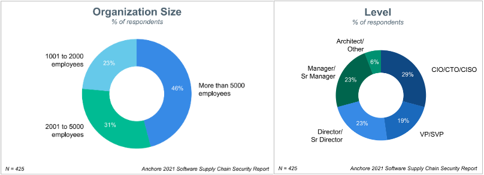

下面看一下报告的一些亮点：

* **容器采用率持续上升**

几乎三分之二的受访者表示，他们的大量应用都进行了容器化，而且 84% 的企业计划提升容器的使用。

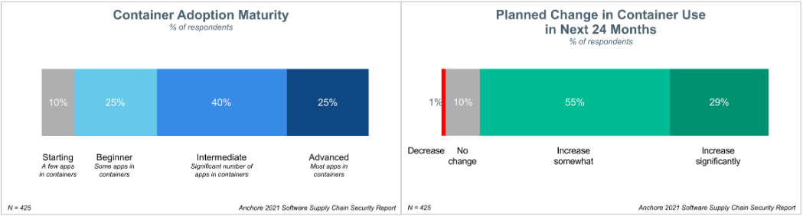

* **开源是容器安全面临的最大挑战**

Synopsys 在[Synopsys 2020 Open Source Security and Risk Analysis Report]()中提到，在对各行业的代码进行扫描之后，发现 70% 以上的代码来源于开源代码，这体现了开源代码的高采用率，这也就导致了此次报告中 23% 的受访者表示开源是容器安全面临的最大挑战。

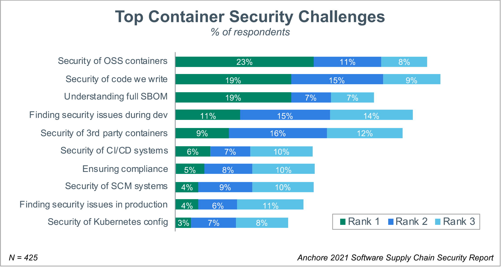

* **大多数企业受到过软件供应链攻击**

64% 的受访者表示，在过去的 12 个月，自己所在的企业受到过软件供应链攻击。三分之的受访者表示所受攻击影响比较大。

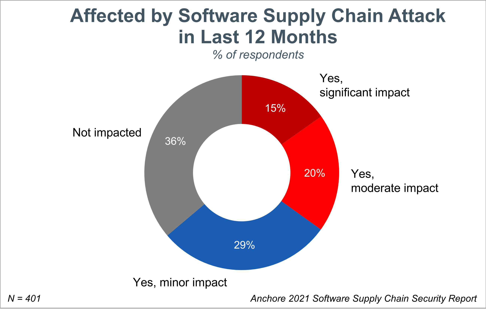

* **安全将是 2022 年的重要任务**

63% 的受访者表示继续提升容器的使用依旧是 2022 年的首要任务；60% 的受访者表示要在 2022 年提升软件供应链安全；52% 的受访者表示要在 SDLC（软件开发生命周期）中将安全检测自动化；其他受访者表示 2022 年的重要任务是容器安全左移、提升合规、在开发工具链/平台中采用Iac（基础设施即代码）以及提升 DevOps 工具链安全性。

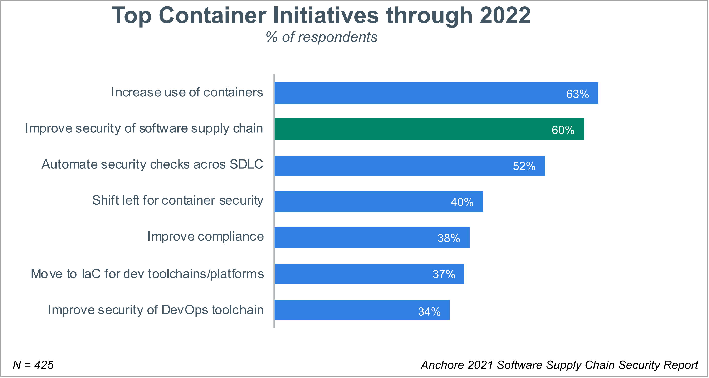

* **开发团队需要承担更多的安全责任**

企业从 DevOps 到 DevSecOps 转型的过程中，需要开发团队去承担更多的安全责任，这也是 DevSecOps *安全左移**的一个重要特征。在报告中，77% 的受访者表示已经在开发团队中指定了专门的安全人员去帮助开发团队提升安全方面的意识和能力。当然也有 10% 的受访者表示，没有这么做，13% 的受访者表示正在计划做。

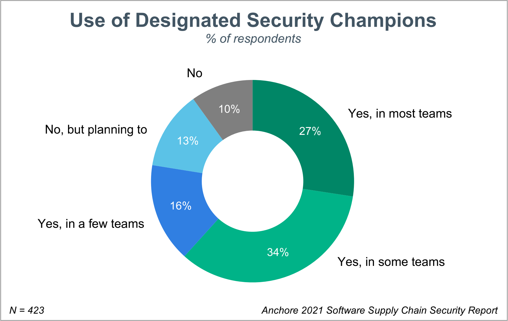

* **DevOps 被广泛使用，DevSecOps 采用率在上升**

在过去的十年间，DevOps 已经在各行各业被广泛采用。47% 的受访者表示自己所在企业的半数软件项目中都采用了 DevOps；越来越多的企业在向 DevSecOps 转型，而且设置了卓越中心（Center of Excellence (CoE)）来实践新技术。

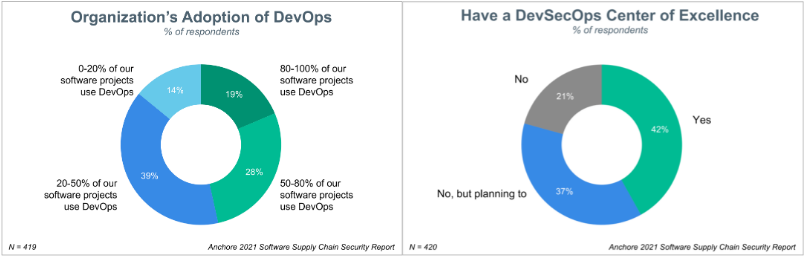

### 报告总结

上面只是列举出了一部分内容，完整报告可在文章开头的链接下载。整个报告的核心大概有以下几点：

* 云原生时代已来，容器采用率在上升，但是容器化也带来了新的安全风险和挑战
* 安全是一个不容忽视的话题，需要集合多方力量来保证软件供应量的安全
* 不应该仅仅只考虑自身应用程序的安全，而是要放眼整个软件供应链安全

当然，最后 Anchore 也给了六步法则来实现软件供应链安全，最终都是指向了自家的产品，但是思路是可以借鉴的，也即：**识别云原生应用供应链中的安全威胁 --> 从软件物料清单（SBOM）来开启容器安全体验 --> 配合容器安全扫描来确保容器化应用的安全 --> 使用其他安全手段，诸如敏感信息检测、合规扫描等 --> 最终达到软件开发生命周期中的所有人都应该为安全负责，切实保证软件供应链安全**。


报告中多次提到了软件供应链安全，但是却没有解释什么是软件供应链，如何保证软件供应链的安全。接下来我们就看看什么是软件供应链以及软件供应链安全。

## 软件供应链安全

### 供应链

供应链不是一个新词，英语为 `Supply Chain`，维基百科的定义为：**在商业领域，供应链是一个由参与向消费者提供产品或者服务的组织、人员、活动、信息以及资源所组成的系统。供应链活动涉及将自然资源、原材料和零部件转化为成品并交付给最终客户的所有流程**。通俗点说，一般指供应一种商品所需要的流程。

下图能帮助大家更好的理解供应链：

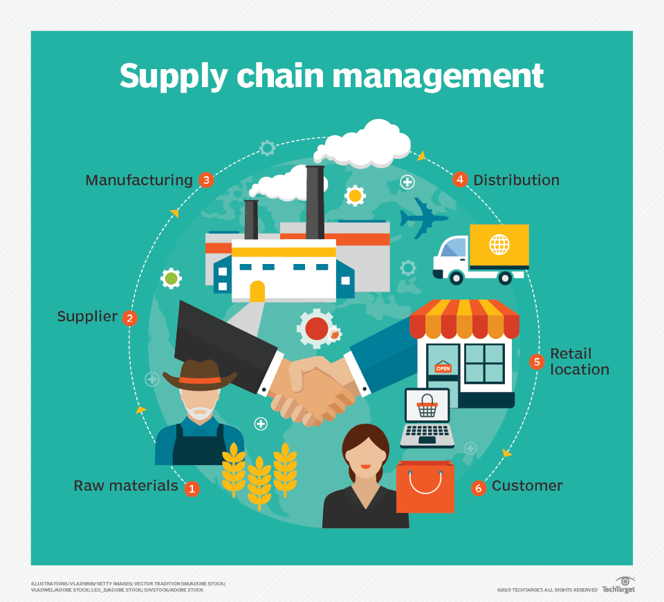

> 图片来源：https://whatis.techtarget.com/definition/supply-chain。

### 软件供应链

软件供应链指一个企业所依赖的软件，包括研发、运营、销售等各项活动所依赖的软件以及与软件评估、生产和分发的任何活动。一般来说软件供应链有三个方面：软件生产者（供应商/上游）、软件使用者（消费者/下游）以及软件操作者（公司或者企业）。示意图如下：

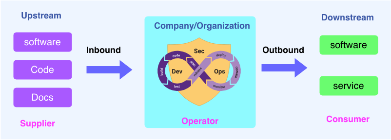

### 软件供应链安全

软件供应链安全的出现与软件供应链攻击有关，软件供应链攻击是指通过网络攻击、内部威胁或其他恶性活动在软件整个生命周期的任何阶段破坏软件。而软件是现代社会不可或缺的一部分，软件供应链安全就是要保证软件的安全，之所以提软件供应链安全而不是软件安全，是因为近几年软件攻击发生了一些变化。传统软件供应链攻击集中在公开披露的漏洞上，而近几年逐渐转向对一些开源软件的攻击，因为开源的采用率越来越高，大部分企业的应用程序都包含开源软件，如果将攻击转向上游（upstream）的开源项目，则会对众多的下游（downstream）用户产生直接影响。所以软件供应链安全也可以理解为开源软件供应链安全。

如何保证软件供应链安全呢？

* **快速响应漏洞**

当有漏洞被披漏的时候，企业或者组织需要立即采取措施，进行漏洞修复，同时通告可能受影响的上下游。但是不幸的是根据 Sonatype [2020 年软件供应链报告]显示，只有 17% 的企业或者组织能在发现漏洞的当天就采取行动，而 35% 的企业或者组织则是在 1-7 天之内。

* **及时更新软件**

及时查找软件中那些已经被废弃或者停止支持的组件，进行及时的清除、替换，并将软件或者系统升级到最新版本，这样能够降低软件或者系统受攻击的风险。

* **增加软件供应链的可视性**

如果能第一时间定位到受影响的软件组件，并及时理清楚与此组件有依赖的其他组件，就能够及时修复与此漏洞相关的所有系统，受影响的系统面和用户就会大大降低。所以增加软件供应链的可视性，比如软件组件的透明化、组件依赖的清晰化等。

至于如何通过软件供应链透明性来确保软件软件供应链安全，就与下面讲的软件物料清单（SBOM）有关。


## SBOM

SBOM 是一个正式的、可读的软件组件（包括库和模块，可以是开源的，也可以是专有的；可以是免费的，也可以是收费的）和依赖关系的清单，清单包含有关这些组件的详细信息，以及它们的层次关系。SBOM 的主要目的是唯一的标记和识别软件组件以及它们之间的关系。SBOM 就像我们在超市购买食品时，在上面看到的食品配方，标注了所用的所有材料。


### SBOM 的好处

SBOM 对软件供应商和消费者都有好处，比如：

* 识别和避免一些已知的软件漏洞
* 量化和管理 license
* 识别安全和 license 合规要求
* 量化软件包中的固有风险
* 对漏洞进行管理（包括对漏洞就行补丁修复和新漏洞的管理控制）
* 降低运营成本，提高效率以及减少计划外的工作

正因为如此，越来越多的企业在关注 SBOM。2019 年，[Gartner 提到](https://www.globenewswire.com/en/news-release/2021/05/13/2229342/22212/en/Sonatype-Embraces-CycloneDX-Standard-for-Integrating-Software-Bills-of-Materials-SBOMs.html)：

* 到 2024 年，软件供应商提供详细的、定期更新的软件材料清单将成为至少一半的企业软件买家不可谈判的要求，而 2019 年这一比例不到 5%。
* 到 2024 年，60% 的企业将会为自己创建的应用程序和提供的服务自动生成 SBOM，而在 2019 年这一比例不到 5%。

### SBOM 的基线属性

SBOM 需要有一些基线属性来对软件组件做标识，以及描述组件之间的关系。基线属性包括：

* `Author Name`：SBOM的作者（Author 并不总是等同于 Supplier）
* `Timestamp`：SBOM 最后被更新的时间戳
* `Spplier Name`：SBOM 条目中某个组件供应商的名称或者唯一标识
* `Component Name`：组件的名称或者其他标识
* `Version String`：组件的版本
* `Component Hash`：组件的加密哈希值
* `Unique Identifier`：额外的信息用来帮助唯一标识组件
* `Relationship`：SBOM 组件之间的关联（默认的 Relationship 类型是 include）

### SBOM 示例

SBOM 信息和组件之间的关系可以有多种方式展示，比如下面的 SBOM 图

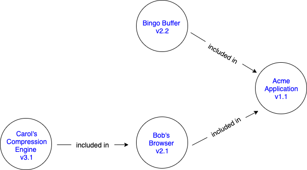


还有下面的 SBOM 表


| Component Name | Supplier | Version |Author |Hash |UID |Relationship |
| -------- | -------- | -------- |-------- |-------- |-------- |-------- |
| Application     | Acme     | 1.1     |Acme     |0x123     |234     |Primary     |
| \|--- Browser     | Bob     | 2.1     |Bob   |0x223   |334     |Included in     |
| \|--- Compression Engine| Carol  | 3.1      |Acme     |0x323     |434     |Included in     |
| \|--- Buffer     | Carol     | 2.2     |Acme     |0x423     |534     |Included in     |

两种方式表达的意思是一样的：名为“Acme Application”的组件有四个组件。其中一个就是它自身，也是主要的组件，它定义了 SBOM 的主题。Acme 创建了一个名为“Application”的组件，它有两个上游（upstream）组件，分别是 Bob 的 Browser 和 Bingo 的 Buffer。在这个例子中，Acme 能够从 Bob 处获得 Bob Browser 的 SBOM 信息，而 Bob Browser 又使用了 Carol 的 Compression Engine 组件。但是，Acme 无法获得 Carol 或 Bingo 组件的 SBOM 信息，因此 Acme 不得不自己为这两个组件创建 SBOM 信息。所以可以在表中看到，组件 Compression、Buffer 的 Supplier 分别是 Carol、Bingo，但是 Author 却是 Acme。这也印证了前面写的，Supplier 有时候和 Author 是不相同的。


### SBOM 数据格式

目前有三种主流的 SBOM 数据格式，分别是 [Software Identification (SWID) Tagging](https://csrc.nist.gov/projects/Software-Identification-SWID)、[Software Package Data Exchange (SPDX)](https://spdx.dev/)、[Cyclone Dx](https://cyclonedx.org/)。

### SBOM 的生成

`syft` 是一个用 Go 语言写的命令行工具，主要用来从容器镜像和文件系统生成软件物料清单（SBOM）。syft 的安装方式有多种，以 macOS 安装为例来说，执行如行命令即可完成安装：

```
$ brew tap anchore/syft
$ brew install syft
```

安装完毕，可通过查看 `version` 或者 `help` 来确实是否安装成功：

```
$ syft version
Application:   syft
Version:       0.21.0
BuildDate:     2021-08-23T18:25:25Z
GitCommit:     ff828fbac211e1d9e993c309461bd9e0636fc2ec
GitTreeState:  clean
Platform:      darwin/amd64
GoVersion:     go1.16.7
Compiler:      gc
```

可以直接用 `syft image` 来对某一个镜像生成 SBOM，以 `alpine:latest` 为例：

```
$ syft alpine:latest
New version of syft is available: 0.27.0
 ✔ Loaded image
 ✔ Parsed image
 ✔ Cataloged packages      [14 packages]

NAME                    VERSION      TYPE
alpine-baselayout       3.2.0-r16    apk
alpine-keys             2.3-r1       apk
apk-tools               2.12.7-r0    apk
busybox                 1.33.1-r3    apk
ca-certificates-bundle  20191127-r5  apk
libc-utils              0.7.2-r3     apk
libcrypto1.1            1.1.1l-r0    apk
libretls                3.3.3p1-r2   apk
libssl1.1               1.1.1l-r0    apk
musl                    1.2.2-r3     apk
musl-utils              1.2.2-r3     apk
scanelf                 1.3.2-r0     apk
ssl_client              1.33.1-r3    apk
zlib                    1.2.11-r3    apk
```
可以看到，`alpine:latest` 镜像中的软件包被列举出来了，有 14 个，而且每个包都有名称 `NAME`、版本 `VERSION` 以及类型 `TYPE`。

## SPDX

[Software Package Data Exchange (SPDX)](https://spdx.dev/) 是一个用于交流软件物料清单信息的开放标准，交流的信息可包括组件、许可证、版权和安全参考。SPDX 通过为公司和社区提供一个通用的格式来分享重要的数据，从而简化和提高合规性，减少了多余的工作。SPDX 在今年 九月份成为了一个国际开放标准（ISO/IEC 5962:2021）。详细内容可以查看[SPDX 成为国际公认的软件材料清单标准](https://www.linuxfoundation.org/press-release/spdx-becomes-internationally-recognized-standard-for-software-bill-of-materials/)。

### SPDX 发展史

* **2010 年 2 月**：Linux 基金会的 FOSSBazaar 工作组开始起草规范，后来被称之为 SPDX
* **2010 年 8 月**：SPDX 被宣布成为 Linux 基金会的开放合规计划的支柱之一
* **2011 年 8 月**：SPDX 1.0 规范正式发布——增加包处理
* **2012 年 8 月**：SPDX 1.1 规范发布——修复了验证算法中的缺陷
* **2013 年11 月**：SPDX 1.2 规范发布——改进了与许可证列表的互动，增加了记录项目信息的字段
* **2015 年 5 月**：SPDX 2.0 规范发布——添加了处理多个包、包和文件以及注释之间关联关系的能力
* **2016 年 8 月**：SPDX 2.1 规范发布——增加了片段，在文件中使用SPDX许可标识符来支持将包与包的外部信息参考来源相关联
* **2019 年 6 月**：SPDX 2.1.1 发布——将规范从google docs 转换到 [Github 仓库](https://github.com/spdx/spdx-spec)
* **2020 年 5 月**：SPDX 2.2 发布——新增新的 SPDX-Lite 配置文件以及更多的外部资源库标识符、关系、字段
* **2020 年 10 月**：SPDX 2.2.1 发布——将规范格式转换为 ISO 的格式并提交
* **2021 年 8 月**：SPDX 以 ISO/IEC 5962:2021 的形式发布
* **2021 年 9 月**：成为软件供应链 SBOM 的国际标准

### SPDX 文档的内容组成

SPDX 文档内容分多个部分组成，有些是必须的，有些是可选的。以 SPDX 2.1 规范来讲，有以下七部分组成：

* **Document Creation Information**—— 表明是谁创建了文件，如何创建的以及其他与创建有关的有用信息。
* **Package Information**——这部分提供了与“包”相关的信息。一个包可能由一个或多个文件组成，这些文件会是任意格式的，包括但是不限于源码、文档、二进制包等等。包信息包含了包的创作者、来源、下载 URL 以及校验和等等。它还包含了该软件包的许可摘要。
* **File Information**——这些内容是针对特定文件的。包含了在文件中找到的文件著作权（如果有的话）、文件的许可证（license）、文件的校验和以及文件的贡献者等等。
* **Snippet Information**——片断信息可用于定义文件内范围的许可。
* **Other Licensing Information**——其他许可证信息提供了一种方式来描述那些不在 SPDX 许可证列表上的许可证信息。你可以为许可证创建一个本地（对SPDX文档）标识符，并将许可证文本本身放在文档中，然后为文件引用它，就像你从许可证列表中引用许可证一样。
* **Relationships**——关联关系是在 SPDX 2.0 规范中引入的，是一种非常强大的方式来表述 SPDX 文档与其他文档是如何产生关联的。
* **Annotations**——注释是人们在文档内为不同的条目或者元素添加的意见。比如说，正在阅读文档的人可能会对某个文档以及它的许可证做一些注释。注释对于审查 SPDX 文件和传达关于包、文件、创建、许可、文件等的具体信息很有用。

每一部分内容都会有一些字段来标识 SBOM 中的相关信息。以“Package Information”来讲，详情可查看[SPDX 文档内容组成官网](https://spdx.dev/wp-content/uploads/sites/41/2017/12/spdx_onepager.pdf)。

### SPDX 文档的生成

有很多开源、商业工具可以生成 SPDX 文档。工具部分可以查看[这儿](https://spdx.dev/resources/tools/)。以 Anchore 开源的 `syft` 为例来讲，可用如下名声生成 SPDX 文档：

```
$ syft packages alpine:latest -o spdx-tag-value
New version of syft is available: 0.29.0
 ✔ Loaded image
 ✔ Parsed image
 ✔ Cataloged packages      [14 packages]

SPDXVersion: SPDX-2.2
DataLicense: CC0-1.0
SPDXID: SPDXRef-DOCUMENT
DocumentName: alpine:latest
DocumentNamespace: https://anchore.com/syft/image/alpine:latest
LicenseListVersion: 3.14
Creator: Organization: Anchore, Inc
Creator: Tool: syft-0.21.0
Created: 2021-11-03T16:06:12Z

##### Package: alpine-baselayout

PackageName: alpine-baselayout
SPDXID: SPDXRef-Package-apk-alpine-baselayout
PackageVersion: 3.2.0-r16
PackageDownloadLocation: NOASSERTION
FilesAnalyzed: false
PackageLicenseConcluded: GPL-2.0-only
PackageLicenseDeclared: GPL-2.0-only
PackageCopyrightText: NOASSERTION
ExternalRef: SECURITY cpe23Type cpe:2.3:a:alpine-baselayout:alpine-baselayout:3.2.0-r16:*:*:*:*:*:*:*
ExternalRef: SECURITY cpe23Type cpe:2.3:a:alpine_baselayout:alpine-baselayout:3.2.0-r16:*:*:*:*:*:*:*
ExternalRef: SECURITY cpe23Type cpe:2.3:a:alpine-baselayout:alpine_baselayout:3.2.0-r16:*:*:*:*:*:*:*
ExternalRef: SECURITY cpe23Type cpe:2.3:a:alpine_baselayout:alpine_baselayout:3.2.0-r16:*:*:*:*:*:*:*
ExternalRef: SECURITY cpe23Type cpe:2.3:a:alpine:alpine-baselayout:3.2.0-r16:*:*:*:*:*:*:*
ExternalRef: SECURITY cpe23Type cpe:2.3:a:alpine:alpine_baselayout:3.2.0-r16:*:*:*:*:*:*:*
ExternalRef: PACKAGE_MANAGER purl pkg:alpine/alpine-baselayout@3.2.0-r16?arch=x86_64

........（14 个 package 都有类似的输出，篇幅过长，只截取前面两个做演示）

```

最上面部分内容，就是**Document Creation Information**，里面包含了 `SPDXVersion`、`DataLicense`、`SPDXID`、等字段，代表的意思可以对照下图查阅：

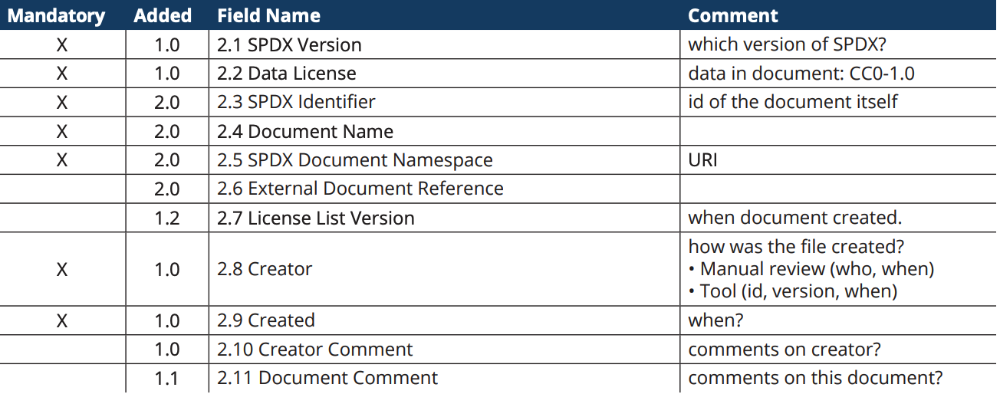
接下来的部分（`##### Package: alpine-baselayout`）是关于**Package Information**的，里面包含的字段以及字段的具体含义，可参考下图查阅：
 
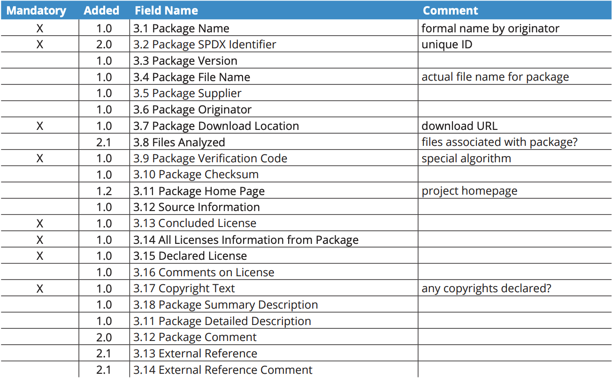

## 总结

从 Anchore 的软件供应链安全报告可以看出，安全已经受到了越来越多的重视，保证软件供应链安全的一个重要手段就是保证“软件自身组成”的透明性，这也就是 SBOM 产生的原因，有了 SBOM，还需要有标准来完成 SBOM 在软件供应链各个环节中的交换（Exchange），这也就是 SPDX 规范诞生的原因。所以，保证软件供应链安全的重要手段就是要让软件组件透明化，以便让企业或组织对软件的创建、分发以及消费有一个清晰的认识，在发生漏洞的时候能够快速找到漏洞所在的组件以及与其有依赖关系的组件，从而通过快速响应来修复漏洞，减少漏洞带来的风险，降低运营成本。

所以，软件供应链安全背后的逻辑简单来说就是：**通过透明性来建立信任**。


## 引用链接

* https://www.ntia.gov/SBOM
* https://spdx.dev/wp-content/uploads/sites/41/2017/12/spdx_onepager.pdf
* https://thenewstack.io/spdx-software-supply-chain-spec-becomes-an-iso-standard/
* https://blog.sonatype.com/software-supply-chain-a-definition-and-introductory-guide
