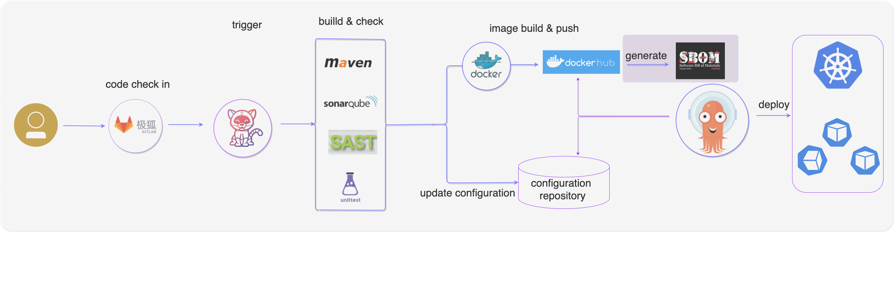

近期 Linux 基金会发布了《软件物料清单（SBOM）与网络安全可读性》报告，里面介绍了软件物料清单（以下统称为 SBOM）在现在企业中的使用情况。可以查看[报告全文](https://linuxfoundation.org/wp-content/uploads/LFResearch_SBOM_Report_020422.pdf)，也可以阅读本站的另外一篇博文[《软件物料清单与网络安全可读性》调研报告解读](https://majinghe.github.io/Cloud-Native-DevSecOps/devsecops/sbom-report/)来看一下报告内容解读。


不管是从报告还是从现在的发展趋势看，软件供应链安全收到了越来越多企业或组织的重视，而 SBOM 被视为实践与实现软件供应链安全的重要手段。如何把 SBOM 的生成嵌入到软件交付的流程中（诸如 CI/CD）也是能够推广 SBOM 落地实践的一个有效手段，下面就演示如何将 SBOM 嵌入 DevOps 的 CI/CD Pipeline 中。

## SBOM 的生成

SBOM 的生成有很多工具可以来实现，工具部分可以查看[这儿](https://spdx.dev/resources/tools/)。本文以 Anchore 开源的 [syft](https://github.com/anchore/syft) 为例来演示如何生成特定格式的 SBOM。

syft 的安装是非常方便的，可以根据不同的 OS 采用不同的安装方式。以 macOS 为例，用下面的命令即可完成安装：

```
$ brew tap anchore/syft
$ brew install syft
```

通过查看 `syft` 的版本来检查安装是否成功：

```
$ syft version
Application:   syft
Version:       0.21.0
BuildDate:     2021-08-23T18:25:25Z
GitCommit:     ff828fbac211e1d9e993c309461bd9e0636fc2ec
GitTreeState:  clean
Platform:      darwin/amd64
GoVersion:     go1.16.7
Compiler:      gc
```

可以用 `syft --help` 来查看用法，比如 `alpine:latest` 为例，可以用如下命令查看该镜像所包含的软件组件信息：

```
$ syft packages alpine:latest
New version of syft is available: 0.36.0
 ✔ Loaded image
 ✔ Parsed image
 ✔ Cataloged packages      [14 packages]

NAME                    VERSION      TYPE
alpine-baselayout       3.2.0-r16    apk
alpine-keys             2.4-r0       apk
apk-tools               2.12.7-r0    apk
busybox                 1.33.1-r6    apk
ca-certificates-bundle  20191127-r5  apk
libc-utils              0.7.2-r3     apk
libcrypto1.1            1.1.1l-r0    apk
libretls                3.3.3p1-r2   apk
libssl1.1               1.1.1l-r0    apk
musl                    1.2.2-r3     apk
musl-utils              1.2.2-r3     apk
scanelf                 1.3.2-r0     apk
ssl_client              1.33.1-r6    apk
zlib                    1.2.11-r3    apk
```

可以看到上述命令列取出了 alpine:latest 中所包含的软件组建信息，包括组件名称、版本信息、类型等等。如果要生成某种格式的软件物料清单，则直接用 `-o` 指定要输出的特定格式即可。下面用一个 log4j 的案例来实际操作并分析。


下面以 Demo Repo https://github.com/majinghe/java-maven-hello-world-4-log4j2.git 为例来展示，如何通过 SBOM 的方式发现软件组件中是否包含 log4j 漏洞。代码库的目录如下：

```
.
├── Dockerfile
├── LICENSE
├── README.md
├── pom.xml
└── src
    └── main
        └── java
            └── com
                └── example
                    └── hello
                        └── Hello.java
```

关于 log4j 的信息在 pom.xml 中有如下描述：

```
<dependencies>
        <dependency>
        <groupId>org.apache.logging.log4j</groupId>
        <artifactId>log4j-core</artifactId>
        <version>2.11.0</version>
        </dependency>
</dependencies>
```

接下来可以直接用 docker build 命令来构建一个镜像，随后用 syft 列取该镜像中的软件组件信息：

```
$ syft packages dllhb/tekton-sbom:0.0.1
New version of syft is available: 0.36.0
 ✔ Loaded image
 ✔ Parsed image
 ✔ Cataloged packages      [273 packages]

NAME                               VERSION                         TYPE
CodePointIM                        11.0.13                         java-archive
FileChooserDemo                    11.0.13                         java-archive
Font2DTest                         11.0.13                         java-archive
J2Ddemo                            11.0.13                         java-archive

.......... 太长了，只保留部分用户说明的内容..........

libzstd1                           1.4.8+dfsg-2.1                  deb
log4j-api                          2.11.0                          java-archive
log4j-core                         2.11.0                          java-archive
login                              1:4.8.1-1                       deb
logsave                            1.46.2-2                        deb
lsb-base                           11.1.0                          deb
maven-aether-provider              3.0                             java-archive
maven-archiver                     3.1.1                           java-archive
```

可以看到上面有与 log4j 有关的信息（log4j-api 和 log4j-core），版本是 2.11.0（根据 CVE 或 NVD 官网信息，2.11.0 是存在安全漏洞的）。当然，也可以直接生成不同格式的 SBOM，比如以 spdx（Software Package Data Exchange ）格式为例，可以用如下命令生成 SBOM：

```
$ syft packages dllhb/tekton-sbom:0.0.1 -o spdx
New version of syft is available: 0.36.0
 ✔ Loaded image
 ✔ Parsed image
 ✔ Cataloged packages      [273 packages]
SPDXVersion: SPDX-2.2
DataLicense: CC0-1.0
SPDXID: SPDXRef-DOCUMENT
DocumentName: dllhb/tekton-sbom:0.0.1
DocumentNamespace: https://anchore.com/syft/image/dllhb/tekton-sbom:0.0.1
LicenseListVersion: 3.14
Creator: Organization: Anchore, Inc
Creator: Tool: syft-0.21.0
Created: 2022-01-25T05:21:53Z

.......... 太长了，只列取与 log4j 有关的信息 ..........

##### Package: log4j-api

PackageName: log4j-api
SPDXID: SPDXRef-Package-java-archive-log4j-api
PackageVersion: 2.11.0
PackageDownloadLocation: NOASSERTION
FilesAnalyzed: false
PackageLicenseConcluded: NONE
PackageLicenseDeclared: NONE
PackageCopyrightText: NOASSERTION
ExternalRef: SECURITY cpe23Type cpe:2.3:a:log4j-api:log4j_api:2.11.0:*:*:*:*:maven:*:*
ExternalRef: SECURITY cpe23Type cpe:2.3:a:log4j_api:log4j-api:2.11.0:*:*:*:*:maven:*:*
ExternalRef: SECURITY cpe23Type cpe:2.3:a:log4j-api:log4j-api:2.11.0:*:*:*:*:maven:*:*
ExternalRef: SECURITY cpe23Type cpe:2.3:a:log4j_api:log4j_api:2.11.0:*:*:*:*:maven:*:*
ExternalRef: SECURITY cpe23Type cpe:2.3:a:log4j_api:log4j-api:2.11.0:*:*:*:*:java:*:*
ExternalRef: SECURITY cpe23Type cpe:2.3:a:log4j-api:log4j_api:2.11.0:*:*:*:*:java:*:*
ExternalRef: SECURITY cpe23Type cpe:2.3:a:log4j-api:log4j-api:2.11.0:*:*:*:*:java:*:*
ExternalRef: SECURITY cpe23Type cpe:2.3:a:log4j_api:log4j_api:2.11.0:*:*:*:*:java:*:*
ExternalRef: SECURITY cpe23Type cpe:2.3:a:logging:log4j_api:2.11.0:*:*:*:*:maven:*:*
ExternalRef: SECURITY cpe23Type cpe:2.3:a:logging:log4j-api:2.11.0:*:*:*:*:maven:*:*
ExternalRef: SECURITY cpe23Type cpe:2.3:a:apache:log4j-api:2.11.0:*:*:*:*:maven:*:*
ExternalRef: SECURITY cpe23Type cpe:2.3:a:logging:log4j_api:2.11.0:*:*:*:*:java:*:*
ExternalRef: SECURITY cpe23Type cpe:2.3:a:logging:log4j-api:2.11.0:*:*:*:*:java:*:*
ExternalRef: SECURITY cpe23Type cpe:2.3:a:apache:log4j_api:2.11.0:*:*:*:*:maven:*:*
ExternalRef: SECURITY cpe23Type cpe:2.3:a:log4j-api:log4j:2.11.0:*:*:*:*:maven:*:*
ExternalRef: SECURITY cpe23Type cpe:2.3:a:apache:log4j_api:2.11.0:*:*:*:*:java:*:*
ExternalRef: SECURITY cpe23Type cpe:2.3:a:log4j_api:log4j:2.11.0:*:*:*:*:maven:*:*
ExternalRef: SECURITY cpe23Type cpe:2.3:a:log4j:log4j-api:2.11.0:*:*:*:*:maven:*:*
ExternalRef: SECURITY cpe23Type cpe:2.3:a:log4j:log4j_api:2.11.0:*:*:*:*:maven:*:*
ExternalRef: SECURITY cpe23Type cpe:2.3:a:apache:log4j-api:2.11.0:*:*:*:*:java:*:*
ExternalRef: SECURITY cpe23Type cpe:2.3:a:log4j:log4j-api:2.11.0:*:*:*:*:java:*:*
ExternalRef: SECURITY cpe23Type cpe:2.3:a:log4j-api:log4j:2.11.0:*:*:*:*:java:*:*
ExternalRef: SECURITY cpe23Type cpe:2.3:a:log4j:log4j_api:2.11.0:*:*:*:*:java:*:*
ExternalRef: SECURITY cpe23Type cpe:2.3:a:log4j_api:log4j:2.11.0:*:*:*:*:java:*:*
ExternalRef: SECURITY cpe23Type cpe:2.3:a:logging:log4j:2.11.0:*:*:*:*:maven:*:*
ExternalRef: SECURITY cpe23Type cpe:2.3:a:logging:log4j:2.11.0:*:*:*:*:java:*:*
ExternalRef: SECURITY cpe23Type cpe:2.3:a:apache:log4j:2.11.0:*:*:*:*:maven:*:*
ExternalRef: SECURITY cpe23Type cpe:2.3:a:apache:log4j:2.11.0:*:*:*:*:java:*:*
ExternalRef: SECURITY cpe23Type cpe:2.3:a:log4j:log4j:2.11.0:*:*:*:*:maven:*:*
ExternalRef: SECURITY cpe23Type cpe:2.3:a:log4j:log4j:2.11.0:*:*:*:*:java:*:*
ExternalRef: SECURITY cpe23Type cpe:2.3:a:log4j-api:log4j_api:2.11.0:*:*:*:*:*:*:*
ExternalRef: SECURITY cpe23Type cpe:2.3:a:log4j-api:log4j-api:2.11.0:*:*:*:*:*:*:*
ExternalRef: SECURITY cpe23Type cpe:2.3:a:log4j_api:log4j-api:2.11.0:*:*:*:*:*:*:*
ExternalRef: SECURITY cpe23Type cpe:2.3:a:log4j_api:log4j_api:2.11.0:*:*:*:*:*:*:*
ExternalRef: SECURITY cpe23Type cpe:2.3:a:logging:log4j_api:2.11.0:*:*:*:*:*:*:*
ExternalRef: SECURITY cpe23Type cpe:2.3:a:logging:log4j-api:2.11.0:*:*:*:*:*:*:*
ExternalRef: SECURITY cpe23Type cpe:2.3:a:apache:log4j_api:2.11.0:*:*:*:*:*:*:*
ExternalRef: SECURITY cpe23Type cpe:2.3:a:apache:log4j-api:2.11.0:*:*:*:*:*:*:*
ExternalRef: SECURITY cpe23Type cpe:2.3:a:log4j:log4j-api:2.11.0:*:*:*:*:*:*:*
ExternalRef: SECURITY cpe23Type cpe:2.3:a:log4j:log4j_api:2.11.0:*:*:*:*:*:*:*
ExternalRef: SECURITY cpe23Type cpe:2.3:a:log4j-api:log4j:2.11.0:*:*:*:*:*:*:*
ExternalRef: SECURITY cpe23Type cpe:2.3:a:log4j_api:log4j:2.11.0:*:*:*:*:*:*:*
ExternalRef: SECURITY cpe23Type cpe:2.3:a:logging:log4j:2.11.0:*:*:*:*:*:*:*
ExternalRef: SECURITY cpe23Type cpe:2.3:a:apache:log4j:2.11.0:*:*:*:*:*:*:*
ExternalRef: SECURITY cpe23Type cpe:2.3:a:log4j:log4j:2.11.0:*:*:*:*:*:*:*
ExternalRef: PACKAGE_MANAGER purl pkg:maven/org.apache.logging.log4j/log4j-api@2.11.0

##### Package: log4j-core

PackageName: log4j-core
SPDXID: SPDXRef-Package-java-archive-log4j-core
PackageVersion: 2.11.0
PackageDownloadLocation: NOASSERTION
FilesAnalyzed: false
PackageLicenseConcluded: NONE
PackageLicenseDeclared: NONE
PackageCopyrightText: NOASSERTION
ExternalRef: SECURITY cpe23Type cpe:2.3:a:log4j-core:log4j_core:2.11.0:*:*:*:*:maven:*:*
ExternalRef: SECURITY cpe23Type cpe:2.3:a:log4j_core:log4j-core:2.11.0:*:*:*:*:maven:*:*
ExternalRef: SECURITY cpe23Type cpe:2.3:a:log4j-core:log4j-core:2.11.0:*:*:*:*:maven:*:*
ExternalRef: SECURITY cpe23Type cpe:2.3:a:log4j_core:log4j_core:2.11.0:*:*:*:*:maven:*:*
ExternalRef: SECURITY cpe23Type cpe:2.3:a:log4j-core:log4j_core:2.11.0:*:*:*:*:java:*:*
ExternalRef: SECURITY cpe23Type cpe:2.3:a:log4j_core:log4j-core:2.11.0:*:*:*:*:java:*:*
ExternalRef: SECURITY cpe23Type cpe:2.3:a:log4j-core:log4j-core:2.11.0:*:*:*:*:java:*:*
ExternalRef: SECURITY cpe23Type cpe:2.3:a:log4j_core:log4j_core:2.11.0:*:*:*:*:java:*:*
ExternalRef: SECURITY cpe23Type cpe:2.3:a:logging:log4j_core:2.11.0:*:*:*:*:maven:*:*
ExternalRef: SECURITY cpe23Type cpe:2.3:a:logging:log4j-core:2.11.0:*:*:*:*:maven:*:*
ExternalRef: SECURITY cpe23Type cpe:2.3:a:logging:log4j_core:2.11.0:*:*:*:*:java:*:*
ExternalRef: SECURITY cpe23Type cpe:2.3:a:logging:log4j-core:2.11.0:*:*:*:*:java:*:*
ExternalRef: SECURITY cpe23Type cpe:2.3:a:apache:log4j-core:2.11.0:*:*:*:*:maven:*:*
ExternalRef: SECURITY cpe23Type cpe:2.3:a:apache:log4j_core:2.11.0:*:*:*:*:maven:*:*
ExternalRef: SECURITY cpe23Type cpe:2.3:a:apache:log4j_core:2.11.0:*:*:*:*:java:*:*
ExternalRef: SECURITY cpe23Type cpe:2.3:a:log4j_core:log4j:2.11.0:*:*:*:*:maven:*:*
ExternalRef: SECURITY cpe23Type cpe:2.3:a:log4j:log4j_core:2.11.0:*:*:*:*:maven:*:*
ExternalRef: SECURITY cpe23Type cpe:2.3:a:log4j:log4j-core:2.11.0:*:*:*:*:maven:*:*
ExternalRef: SECURITY cpe23Type cpe:2.3:a:log4j-core:log4j:2.11.0:*:*:*:*:maven:*:*
ExternalRef: SECURITY cpe23Type cpe:2.3:a:apache:log4j-core:2.11.0:*:*:*:*:java:*:*
ExternalRef: SECURITY cpe23Type cpe:2.3:a:log4j-core:core:2.11.0:*:*:*:*:maven:*:*
ExternalRef: SECURITY cpe23Type cpe:2.3:a:core:log4j_core:2.11.0:*:*:*:*:maven:*:*
ExternalRef: SECURITY cpe23Type cpe:2.3:a:log4j_core:core:2.11.0:*:*:*:*:maven:*:*
ExternalRef: SECURITY cpe23Type cpe:2.3:a:log4j:log4j_core:2.11.0:*:*:*:*:java:*:*
ExternalRef: SECURITY cpe23Type cpe:2.3:a:core:log4j-core:2.11.0:*:*:*:*:maven:*:*
ExternalRef: SECURITY cpe23Type cpe:2.3:a:log4j:log4j-core:2.11.0:*:*:*:*:java:*:*
ExternalRef: SECURITY cpe23Type cpe:2.3:a:log4j_core:log4j:2.11.0:*:*:*:*:java:*:*
ExternalRef: SECURITY cpe23Type cpe:2.3:a:log4j-core:log4j:2.11.0:*:*:*:*:java:*:*
ExternalRef: SECURITY cpe23Type cpe:2.3:a:core:log4j-core:2.11.0:*:*:*:*:java:*:*
ExternalRef: SECURITY cpe23Type cpe:2.3:a:core:log4j_core:2.11.0:*:*:*:*:java:*:*
ExternalRef: SECURITY cpe23Type cpe:2.3:a:log4j-core:core:2.11.0:*:*:*:*:java:*:*
ExternalRef: SECURITY cpe23Type cpe:2.3:a:log4j_core:core:2.11.0:*:*:*:*:java:*:*
ExternalRef: SECURITY cpe23Type cpe:2.3:a:logging:log4j:2.11.0:*:*:*:*:maven:*:*
ExternalRef: SECURITY cpe23Type cpe:2.3:a:apache:log4j:2.11.0:*:*:*:*:maven:*:*
ExternalRef: SECURITY cpe23Type cpe:2.3:a:logging:core:2.11.0:*:*:*:*:maven:*:*
ExternalRef: SECURITY cpe23Type cpe:2.3:a:logging:log4j:2.11.0:*:*:*:*:java:*:*
ExternalRef: SECURITY cpe23Type cpe:2.3:a:logging:core:2.11.0:*:*:*:*:java:*:*
ExternalRef: SECURITY cpe23Type cpe:2.3:a:apache:log4j:2.11.0:*:*:*:*:java:*:*
ExternalRef: SECURITY cpe23Type cpe:2.3:a:apache:core:2.11.0:*:*:*:*:maven:*:*
ExternalRef: SECURITY cpe23Type cpe:2.3:a:log4j:log4j:2.11.0:*:*:*:*:maven:*:*
ExternalRef: SECURITY cpe23Type cpe:2.3:a:log4j:log4j:2.11.0:*:*:*:*:java:*:*
ExternalRef: SECURITY cpe23Type cpe:2.3:a:log4j:core:2.11.0:*:*:*:*:maven:*:*
ExternalRef: SECURITY cpe23Type cpe:2.3:a:core:log4j:2.11.0:*:*:*:*:maven:*:*
ExternalRef: SECURITY cpe23Type cpe:2.3:a:apache:core:2.11.0:*:*:*:*:java:*:*
ExternalRef: SECURITY cpe23Type cpe:2.3:a:core:log4j:2.11.0:*:*:*:*:java:*:*
ExternalRef: SECURITY cpe23Type cpe:2.3:a:core:core:2.11.0:*:*:*:*:maven:*:*
ExternalRef: SECURITY cpe23Type cpe:2.3:a:log4j:core:2.11.0:*:*:*:*:java:*:*
ExternalRef: SECURITY cpe23Type cpe:2.3:a:core:core:2.11.0:*:*:*:*:java:*:*
ExternalRef: SECURITY cpe23Type cpe:2.3:a:log4j_core:log4j_core:2.11.0:*:*:*:*:*:*:*
ExternalRef: SECURITY cpe23Type cpe:2.3:a:log4j-core:log4j-core:2.11.0:*:*:*:*:*:*:*
ExternalRef: SECURITY cpe23Type cpe:2.3:a:log4j-core:log4j_core:2.11.0:*:*:*:*:*:*:*
ExternalRef: SECURITY cpe23Type cpe:2.3:a:log4j_core:log4j-core:2.11.0:*:*:*:*:*:*:*
ExternalRef: SECURITY cpe23Type cpe:2.3:a:logging:log4j-core:2.11.0:*:*:*:*:*:*:*
ExternalRef: SECURITY cpe23Type cpe:2.3:a:logging:log4j_core:2.11.0:*:*:*:*:*:*:*
ExternalRef: SECURITY cpe23Type cpe:2.3:a:apache:log4j_core:2.11.0:*:*:*:*:*:*:*
ExternalRef: SECURITY cpe23Type cpe:2.3:a:apache:log4j-core:2.11.0:*:*:*:*:*:*:*
ExternalRef: SECURITY cpe23Type cpe:2.3:a:log4j-core:log4j:2.11.0:*:*:*:*:*:*:*
ExternalRef: SECURITY cpe23Type cpe:2.3:a:log4j:log4j_core:2.11.0:*:*:*:*:*:*:*
ExternalRef: SECURITY cpe23Type cpe:2.3:a:log4j_core:log4j:2.11.0:*:*:*:*:*:*:*
ExternalRef: SECURITY cpe23Type cpe:2.3:a:log4j:log4j-core:2.11.0:*:*:*:*:*:*:*
ExternalRef: SECURITY cpe23Type cpe:2.3:a:core:log4j_core:2.11.0:*:*:*:*:*:*:*
ExternalRef: SECURITY cpe23Type cpe:2.3:a:core:log4j-core:2.11.0:*:*:*:*:*:*:*
ExternalRef: SECURITY cpe23Type cpe:2.3:a:log4j-core:core:2.11.0:*:*:*:*:*:*:*
ExternalRef: SECURITY cpe23Type cpe:2.3:a:log4j_core:core:2.11.0:*:*:*:*:*:*:*
ExternalRef: SECURITY cpe23Type cpe:2.3:a:logging:log4j:2.11.0:*:*:*:*:*:*:*
ExternalRef: SECURITY cpe23Type cpe:2.3:a:logging:core:2.11.0:*:*:*:*:*:*:*
ExternalRef: SECURITY cpe23Type cpe:2.3:a:apache:log4j:2.11.0:*:*:*:*:*:*:*
ExternalRef: SECURITY cpe23Type cpe:2.3:a:apache:core:2.11.0:*:*:*:*:*:*:*
ExternalRef: SECURITY cpe23Type cpe:2.3:a:log4j:log4j:2.11.0:*:*:*:*:*:*:*
ExternalRef: SECURITY cpe23Type cpe:2.3:a:core:log4j:2.11.0:*:*:*:*:*:*:*
ExternalRef: SECURITY cpe23Type cpe:2.3:a:log4j:core:2.11.0:*:*:*:*:*:*:*
ExternalRef: SECURITY cpe23Type cpe:2.3:a:core:core:2.11.0:*:*:*:*:*:*:*
ExternalRef: PACKAGE_MANAGER purl pkg:maven/org.apache.logging.log4j/log4j-core@2.11.0
```

上述 SBOM 是以 spdx 格式生成的，详细语法可以查阅[SPDX 官网](https://spdx.dev/wp-content/uploads/sites/41/2017/12/spdx_onepager.pdf)或本站的另外一篇博文[从 Anchore 软件供应链安全报告深挖 SBOM & SPDX](https://majinghe.github.io/Cloud-Native-DevSecOps/devsecops/sbom/)。


## 将 SBOM 的生成嵌入到 CI/CD 中

那如何在每次软件代码有变更的时候及时生成 SBOM 呢？最好的办法就是将 SBOM 的生成直接嵌入到 CI/CD 流程中。下面演示如何将 SBOM 的生成嵌入到以 Tekton 为构建引擎的 CI/CD Pipeline 中。

### Tekton

Tekton 是谷歌开源的一款云原生 CI/CD 构建工具，采用声明式的方式来完成 CI/CD Pipeline 的构建。架构示意图如下：


Tekton 大体可以分为两大块：Event Handler & Pipeline Handler。Event Handler 主要是接受 SCM 系统的事件消息（如代码变更），然后做一些处理，获取必要的信息（代码提交者、提交内容等），然后把这些内容当作输入（Input）传递到 Pipeline Handler 部分，Pipeline Handler 会根据用于自定义的流程（如完成源码到镜像的转换）来完成整个 CI/CD 构建。

对于 Pipeline Handler 部分，有几个概念需要了解一下：

* **Step**：Step 是 Tekton 最基本的操作单元，每一个 Step 就是用特定的构建工具来用特定的输入（Input）生成特定输出（Output）的过程，上一个 Step 的输出可以作为下一个 Step 的输入。Step 是在由用户提供的容器镜像拉起的容器里面完成工作的；

* **Task**：Task 是一系列 Step 的有序集合。Task 是在 Kubernetes pod 里面完成工作的；而 Step 是 pod 的单个容器中完成工作的；

* **TaskRun**：TaskRun 是 Task 的具体执行。每次创建一个 TaskRun 就会有一个指定的 Task 开始运行。TaskRun 可以单独运行，也可以被嵌入到 PipelineRun 中；

* **Pipeline**：Pipeline 是一系列 Task 的有序集合。Tekton 会收集所有的 tasks，将它们链接成一个有向无环图（directed acyclic graph，即 DAG），然后按顺序执行。Pipeline 的执行会生成一系列 pod。

* **PipelineRun**：PipelineRun 是 Pipeline 的具体执行。每次创建一个 PipelineRun 就会有一个指定的 Pipeline 开始运行。

* **PipelineResource**：PipelineResource，主要用来定义 Step 需要的输入（Input）以及相应的输出（Output）。

下面就演示如何将 SBOM 的生成嵌入到 CI/CD 中。

### 将 SBOM 的生成嵌入 Tekton 的 CI/CD 中

下图是以 Tekton 为构建引擎的一个 CI/CD Pipeline，从源码提交到代码构建、镜像打包，再利用 ArgoCD 来实现 GitOps。在镜像构建之后做了一个 SBOM 的生成。当然，如果有需求，可以把生成的 SBOM 可以发送到 slack 或者和源代码托管平台集成起来，方便 SBOM 的查看。



整个演示所用的 Tekton yaml Repo 可以在[这儿](https://github.com/majinghe/tekton-chains-demo)找到。将 SBOM 的生成嵌入到 CI/CD 中，也比较简单，在 Tekton 的 `Task` 中增加一个 `Step`，如下内容：

```
- name: sbom-generate
    image: anchore/syft:latest
    env:
    - name: DOCKER_CONFIG
        value: /config
    volumeMounts:
    - mountPath: /config
    name: registry-config
    readOnly: true
    args:
    - dllhb/tekton-sbom:0.0.1
    - -o
    - spdx
volumes:
- name: registry-config
secret:
    secretName: registry-config
```

如果是 Private Registry，需要把 `config.json` 用 Secret 的形式创建好，然后以 `volume` 的形式挂在到 Tekton 的 pod 里面。

接着创建 `Task` 和 `TaskRun` 即可：

```
$ kubectl create ns tekton-sbom
$ kubectl -n tekton-sbom apply -f secret-credentials.yaml
$ kubectl -n tekton-sbom apply -f sa.yaml
$ kubectl -n tekton-sbom apply -f pipelineresource.yaml
$ kubectl -n tekton-sbom apply -f task.yaml
$ kubectl -n tekton-sbom apply -f taskrun.yaml
```

关于上述 yaml 文件的作用以及内容可以在[Tekton 使用 Repo](https://github.com/majinghe/tekton-chains-demo)查阅。

最后可以查看 `Task` 和 `TaksRun`：

```
$ tkn -n tekton-sbom t list
NAME                 DESCRIPTION   AGE
build-docker-image                 2 hours ago

$ tkn -n tekton-sbom tr list
NAME                     STARTED       DURATION     STATUS
build-docker-image-run   2 hours ago   10 minutes   Succeeded
```
可以看到 TaskRun（简写为 tr）的 STATUS 为 Succeeded，查看 `tekton-sbom` namespace 下面的pod：

```
$ kubectl -n tekton-sbom get pods
NAME                         READY   STATUS             RESTARTS   AGE
build-docker-image-run-pod   0/4     Completed          0          169m
```
可以查看 `log`

```
$ kubectl -n tekton-sbom logs -f build-docker-image-run-pod -c step-sbom-generate
```

可以查看到与 SBOM 章节中相同的内容，由于内容过长，不在这儿再次赘述。

将 SBOM 的生成嵌入到 CI/CD 中，则每次代码变更都会生成新的 SBOM，能够保证 SBOM 的准确性。
