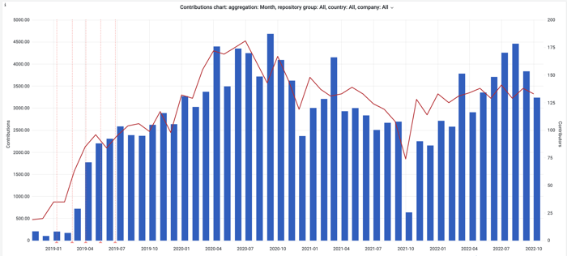
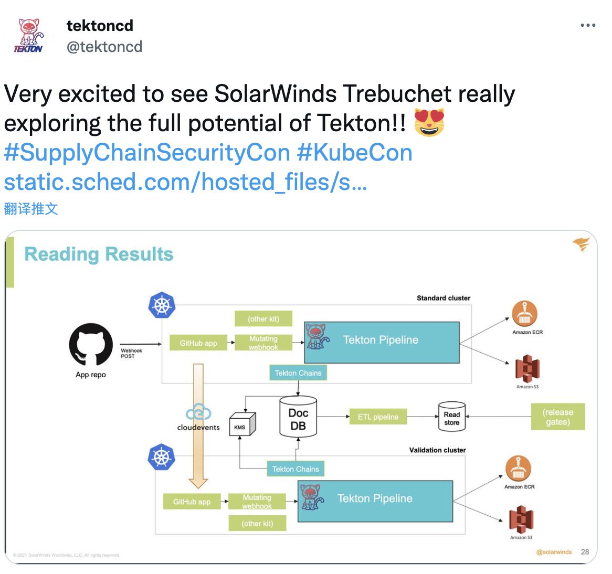
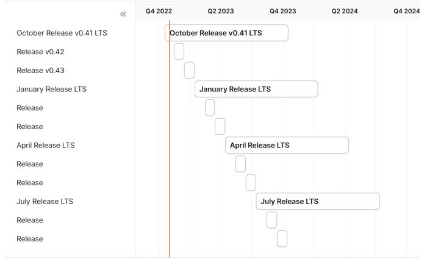
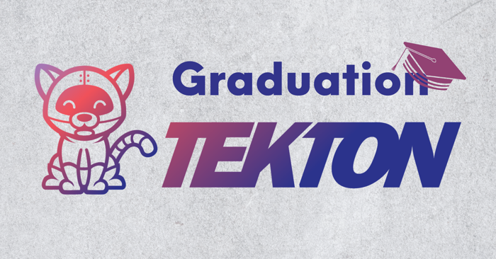

本文翻译自 tekton 官网 blog：[Tekton Graduation](https://tekton.dev/blog/2022/10/26/tekton-graduation/)。作者 Andrea Frittoli。已经获得了原作者的翻译许可。


我们非常高兴地宣布 Tekton 在持续交付基金会（CDF）中已经达到了可以毕业的状态。CDF 技术监督委员会（TOC）进行了公开[投票](https://lists.cd.foundation/g/cdf-toc/topic/94265202#861)来决定 Tekton 的毕业状态，结果是 TOC 们达成了一致。Tekton 社区对于此次投票结果感到非常自豪，并且将继续工作来让 Tekton 对终端用户变得更好和更安全。

本篇博客我将探索一下 Tekton 的历史，它的“毕业之旅”以及项目的一些重要里程碑。

## 早期

Tekton 项目源自 [Knative](https://knative.dev/)，起初被称为“Knative Build” 后期改为“Knative Pipeline”。2018 年 8 月该项目进行了拆分，然后获得了它现在的名称，以及在 GitHub 上有了一个新的主页 “[tektoncd/pipeline](https://github.com/tektoncd/pipeline)”。下面是一些这个项目刚开始的一些代码提交信息：

```
commit 49d2316d71e8c315e0a8fd76008bc2920f56b3c3
Author: Christie Wilson <bobcatfish@gmail.com>
Date:   Fri Aug 31 17:15:35 2018 -0700

Add pipeline strawman example

@dlorenc @ImJasonH @tejal29 @aaron-prindle and I have been working on a
strawman proposal for adding a Pipeline CRD and also for possibly
envolving the Build CRD into a slightly more generic Task CRD.

This PR demonstrates some paper prototype examples of what it could look
like to define pipelines using the CRDs described in the README.
```

几个月之后，也就是在 2019 年，[Tekton 被捐赠](https://cd.foundation/blog/2019/03/12/introducing-the-continuous-delivery-foundation-the-new-home-for-tekton-jenkins-jenkins-x-and-spinnaker/)到了新成立的[持续交付基金会（CDF）](https://cd.foundation/)。

## 成长的社区


从那时起，得益于丰富的社区贡献者，项目得以蓬勃发展。[社区仓库](https://github.com/tektoncd/community)就是早期创建的仓库中的一个，该仓库记录了社区治理、行为准则以及贡献指南。


到了 2019 年底，Tekton 的仓库数量增加到了 11 个。常规的月度发版机制建立了起来 —— Pipeline 已经发布了 9 个版本，Tekton Pipeline API 的 beta 版本也在 2020 年 3 月[正式发布](https://github.com/tektoncd/pipeline/releases/tag/v0.11.0)。在这期间，我们还用 Tekton 实现了该项目的自动化发布。


“results” 和 “chains” 两个项目开始于 2020 年春天，同年 8 月 Tekton Hub 正式[官宣发布](https://cd.foundation/blog/2020/08/10/introducing-tekton-hub/)。

感谢 Tekton 采用者以及终端用户贡献的特性、想法和议题得以让 Tekton 社区持续发展。



Tekton 项目的贡献和贡献者随着时间的变化。数据来自[devstats](https://tekton.devstats.cd.foundation/d/74/contributions-chart?orgId=1&from=1540938487786&to=1666996087786&var-period=m&var-metric=contributions&var-repogroup_name=All&var-country_name=All&var-company_name=All&var-company=all&viewPanel=5&theme=light&kiosk=)。

## 关注安全

一年以后，也就是在 2021 年，Tekton 已经相当成熟了，同时仍然忠实于其占用空间小的特性，并为用户提供了通过 Tekton 设置 CI/CD 系统的完全灵活性。

这种灵活性让 Tekton 变成了基于其构建多样化服务的实现基石，服务范围从开源项目、云服务以及终端用户的 DevOps 服务平台。

那时是彻底关注安全的黄金时间！在 2021 年 6 月，Tekton 漏洞团队成立了。Tekton pipeline 发布了 v0.29，这也是通过 Tekton chains 来签名的第一个版本，在发行说明中包含了  Rekor UUID。


终端用的的采用展示了 Tekton 是如何在 Tekton Chains 的帮助下来帮助解决软件供应链安全挑战的。




在 2022 年 3 月，感谢 CDF 的赞助支持，Tekton 完成了[一次独立的安全审计](https://cd.foundation/blog/2022/08/26/tekton-security-review-completed/)。

随后，Tekton 的六个核心组件获得了 [OpenSSF 最佳实践徽章](https://bestpractices.coreinfrastructure.org/en)。

## 长期支持

2022 年 10 月，Tekton 社区定义了它的[长期支持策略（LTS）](https://github.com/tektoncd/community/blob/main/releases.md#support-policy)：


> Tekton 的每一个项目都会维持 4 个发布分之，每三个月创建一个，最终的结果就是每个版本的最终支持窗口期约为一年。


那些版本被称之为 LTS，在整个支持周期内，补丁版本将被创建并用来解决：

* CVE （在 Tekton 漏洞团队的建议下）
* 依赖问题（包括基础镜像更新）
* 重要的核心组件问题


每个项目都可以扩展社区范围内的政策。Pipeline 在持续着它的月度发版，它每年为 LTS 选择四个版本。



Tekton Pipeline 发版和支持窗口。


## 毕业

CD 基金会旗下项目的毕业阶段是当它们达到其增长目标并且现在处于开发、维护和长期支持的持续循环中时。毕业阶段项目通常用于企业生产环境，并拥有大型、完善的项目社区。

进一步来说，TOC 将[毕业定义](https://github.com/cdfoundation/toc/blob/b4844654fe5d355496481bed1bff3166889584ed/PROJECT_LIFECYCLE.md#graduated-stage)为关于项目成熟度、最佳实践、安全立场和采用的一系列要求。

Tekton is the second project to graduate from the CD Foundation, after Jenkins. All the details about the twelve graduation criteria be found in the graduation proposal.

Tekton 是 CD 基金会毕业的第二个项目，紧随 Jenkins。关于十二个毕业标准的所有细节都可以在[毕业提案](https://github.com/cdfoundation/toc/blob/main/proposals/tekton/graduation.md)中找到。



## 下一步

毕业是项目的一个伟大里程碑及重大责任感。社区将通过持续工作来改进 Tekton，以让项目保持稳定和安全。

我们正在诸如信任源和信任负载的几个安全特性上工作，并且已经发布了 API 的 v1 版本。


## 感谢


毕业是 Tekton 社区多年长期工作的结果。恭喜！同时感谢所有的 Tekton 贡献者，是你们让这一切成为可能！


感谢 CDF 对于项目的托管和支持，特别是通过安全审计。感谢 TOC 以及主席 Oleg 的支持和赞助，同时感谢 CDF 团队，Fatih、Jesse 以及 Roxanne 在营销和组织[新闻稿](https://cd.foundation/announcement/2022/10/25/cd-foundation-welcomes-new-software-supply-chain-security-project-pyrsia-announces-tekton-graduation-and-cdevents-release/)方面所做的出色工作。
