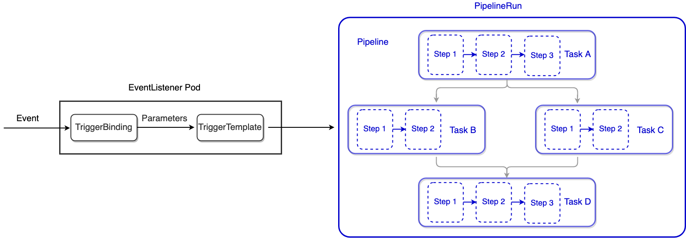

<p align="center">

</p>

## 关于 Apache Log4j 漏洞

log4j 漏洞在 2021 年的最后一个月掀起了很大的风波，由于 log4j 被广泛应用于 java 项目中，因此众多 java 小伙伴也是在加班加点应对。由于 log4j 在不断的爆发出新的漏洞，从 2.15 版本到 2.16 版本，目前最新的是 2.17 版本，关于 log4j 更多的详情以及修复手段，建议查看 [CVE 官网](https://cve.mitre.org/cgi-bin/cvename.cgi?name=CVE-2021-44228)或者 [NVD 官网](https://nvd.nist.gov/vuln/detail/CVE-2021-44228)。


## Tekton

[Tekton](https://github.com/tektoncd)是 Google 开源的一款灵活强大的 CI/CD 系统。原理图如下：



Tekton 大体可以分为两大块：**Event Handler** & **Pipeline Handler**。Event Handler 主要是接受 SCM 系统的事件消息（如代码变更），然后做一些处理，获取必要的信息（代码提交者、提交内容等），然后把这些内容当作输入（Input）传递到 Pipeline Handler 部分，Pipeline Handler 会根据用于自定义的流程（如完成源码到镜像的转换）来完成整个 CI/CD 构建。

对于 Pipeline Handler 部分，有几个概念需要了解一下：

- `Step`：`Step` 是 Tekton 最基本的操作单元，每一个 `Step` 就是用特定的构建工具来用特定的输入（Input）生成特定输出（Output）的过程，上一个 `Step` 的输出可以作为下一个 `Step` 的输入。`Step` 是在由用户提供的容器镜像拉起的容器里面完成工作的；

- `Task`：`Task` 是一系列 `Step` 的有序集合。`Task` 是在 Kubernetes pod 里面完成工作的；而 `Step` 是 pod 的单个容器中完成工作的；

- `TaskRun`：`TaskRun` 是 `Task` 的具体执行。每次创建一个 `TaskRun` 就会有一个指定的 `Task` 开始运行。`TaskRun` 可以单独运行，也可以被嵌入到 `PipelineRun` 中；

- `Pipeline`：`Pipeline` 是一系列 `Task` 的有序集合。Tekton 会收集所有的 tasks，将它们链接成一个有向无环图（directed acyclic graph，即 DAG），然后按顺序执行。`Pipeline` 的执行会生成一系列 pod。

- `PipelineRun`：`PipelineRun` 是 `Pipeline` 的具体执行。每次创建一个 `PipelineRun` 就会有一个指定的 `Pipeline` 开始运行。

- `PipelineResource`：`PipelineResource`，主要用来定义 `Step` 需要的输入（Input）以及相应的输出（Output）。


## 用 Tekton 检测 log4j 漏洞

### 用 Trivy 做镜像扫描

[Trivy](https://github.com/aquasecurity/trivy)是一款简单易用的漏洞扫描开源工具，可以对容器镜像、文件系统、Git Repo 及配置文件进行漏洞扫描。其扫描的大致原理是：**分析镜像（包括 OS，library 等）特征，然后将特征与数据库中进行比对，从而识别出具有漏洞的内容，出具漏洞报告**。

#### Trivy 安装

Trivy 的安装方式灵活多样（安装包、docker、helm 都可以），使用方便，详情可以查看[Trivy 官网安装指南](https://aquasecurity.github.io/trivy/v0.22.0/getting-started/installation/)。本文以 macOS 为例来简单说明：

```
$ brew install aquasecurity/trivy/trivy
```
可以用 `--help` 或 `--version` 来验证安装是否成功：

```
$ trivy --version
Version: 0.19.2
```

#### Trivy 使用

用 `trivy image + image_name` 即可开启镜像扫描，如以 `alpine:3.10` 为例说明使用方法：

```
$ trivy image alpine:3.10
2021-12-26T13:26:17.747+0800	INFO	Detected OS: alpine
2021-12-26T13:26:17.747+0800	INFO	Detecting Alpine vulnerabilities...
2021-12-26T13:26:17.749+0800	INFO	Number of language-specific files: 0
2021-12-26T13:26:17.749+0800	WARN	This OS version is no longer supported by the distribution: alpine 3.10.9
2021-12-26T13:26:17.749+0800	WARN	The vulnerability detection may be insufficient because security updates are not provided

alpine:3.10 (alpine 3.10.9)
===========================
Total: 1 (UNKNOWN: 0, LOW: 0, MEDIUM: 0, HIGH: 0, CRITICAL: 1)

+-----------+------------------+----------+-------------------+---------------+---------------------------------------+
|  LIBRARY  | VULNERABILITY ID | SEVERITY | INSTALLED VERSION | FIXED VERSION |                 TITLE                 |
+-----------+------------------+----------+-------------------+---------------+---------------------------------------+
| apk-tools | CVE-2021-36159   | CRITICAL | 2.10.6-r0         | 2.10.7-r0     | libfetch before 2021-07-26, as        |
|           |                  |          |                   |               | used in apk-tools, xbps, and          |
|           |                  |          |                   |               | other products, mishandles...         |
|           |                  |          |                   |               | -->avd.aquasec.com/nvd/cve-2021-36159 |
+-----------+------------------+----------+-------------------+---------------+---------------------------------------+
```

可以看到扫描出了一个高危漏洞 **`CVE-2021-36159`**。

### log4j Demo 构建

为了用 Trivy 扫描 log4j 漏洞，先构建一个用 maven 进行构建的 java 项目，简单的输出 `Hello World`，仅仅作为演示用。代码 Repo 在[这儿](https://github.com/majinghe/java-maven-hello-world-4-log4j2)。目录结构为：

```
$ tree
.
├── Dockerfile
├── LICENSE
├── README.md
├── pom.xml
└── src
    └── main
        └── java
            └── com
                └── example
                    └── hello
                        └── Hello.java
```

`Hello.java` 的内容如下：

```
package com.example.hello;

import org.apache.logging.log4j.Logger;
import org.apache.logging.log4j.LogManager;

public class Hello {

	private static Logger log = LogManager.getLogger(Hello.class.getClass());

	public static void main(String [] args) {
		log.info("Hello World!!!");
	}

}
```

`pom.xml` 文件中与 `log4j` 相关的依赖描述如下：

```
<dependencies>
  <dependency>
    <groupId>org.apache.logging.log4j</groupId>
    <artifactId>log4j-core</artifactId>
    <version>2.11.0</version>
  </dependency>
</dependencies>
```

Dockerfile 的内容如下：

```
FROM maven:3.8.4-jdk-11-slim

COPY . /tmp

WORKDIR /tmp/

RUN mvn package -Dmaven.test.skip=true
```

接下来就可以用 docker 来构建一个镜像：

```
$ docker build -t dllhb/tekton-scan-log4j2:0.0.1 .
```

用 Trivy 来扫描：

```
$ trivy image --severity CRITICAL --vuln-type library dllhb/tekton-scan-log4j2:1.0.0
2021-12-26T13:56:14.307+0800	INFO	Number of language-specific files: 148
2021-12-26T13:56:14.309+0800	INFO	Detecting jar vulnerabilities...

root/.m2/repository/org/apache/logging/log4j/log4j-api/2.11.0/log4j-api-2.11.0.jar (jar)
========================================================================================
Total: 2 (CRITICAL: 2)

+------------------------------------+------------------+----------+-------------------+---------------+---------------------------------------+
|              LIBRARY               | VULNERABILITY ID | SEVERITY | INSTALLED VERSION | FIXED VERSION |                 TITLE                 |
+------------------------------------+------------------+----------+-------------------+---------------+---------------------------------------+
| org.apache.logging.log4j:log4j-api | CVE-2021-44228   | CRITICAL | 2.11.0            | 2.15.0        | log4j-core: Remote code execution     |
|                                    |                  |          |                   |               | in Log4j 2.x when logs contain        |
|                                    |                  |          |                   |               | an attacker-controlled...             |
|                                    |                  |          |                   |               | -->avd.aquasec.com/nvd/cve-2021-44228 |
+                                    +------------------+          +                   +---------------+---------------------------------------+
|                                    | CVE-2021-45046   |          |                   | 2.16.0        | log4j-core: DoS in log4j 2.x          |
|                                    |                  |          |                   |               | with thread context message           |
|                                    |                  |          |                   |               | pattern and context...                |
|                                    |                  |          |                   |               | -->avd.aquasec.com/nvd/cve-2021-45046 |
+------------------------------------+------------------+----------+-------------------+---------------+---------------------------------------+

root/.m2/repository/org/apache/logging/log4j/log4j-core/2.11.0/log4j-core-2.11.0.jar (jar)
==========================================================================================
Total: 2 (CRITICAL: 2)

+-------------------------------------+------------------+----------+-------------------+---------------+---------------------------------------+
|               LIBRARY               | VULNERABILITY ID | SEVERITY | INSTALLED VERSION | FIXED VERSION |                 TITLE                 |
+-------------------------------------+------------------+----------+-------------------+---------------+---------------------------------------+
| org.apache.logging.log4j:log4j-core | CVE-2021-44228   | CRITICAL | 2.11.0            | 2.15.0        | log4j-core: Remote code execution     |
|                                     |                  |          |                   |               | in Log4j 2.x when logs contain        |
|                                     |                  |          |                   |               | an attacker-controlled...             |
|                                     |                  |          |                   |               | -->avd.aquasec.com/nvd/cve-2021-44228 |
+                                     +------------------+          +                   +---------------+---------------------------------------+
|                                     | CVE-2021-45046   |          |                   | 2.16.0        | log4j-core: DoS in log4j 2.x          |
|                                     |                  |          |                   |               | with thread context message           |
|                                     |                  |          |                   |               | pattern and context...                |
|                                     |                  |          |                   |               | -->avd.aquasec.com/nvd/cve-2021-45046 |
+-------------------------------------+------------------+----------+-------------------+---------------+---------------------------------------+
.... 只截取与 log4j 有关的信息.....
```

可以看到扫描出了与 log4j 有关的漏洞：**`CVE-2021-44228`**、**`CVE-2021-45046`**。接下来将 Trivy 和 Tekton 进行结合，将漏洞扫描嵌入到 Tekton CI/CD 中。

> 上述 Demo 代码只为扫描 log4j 而构建。

### Tekton CI/CD 扫描 log4j 漏洞

Tekton 的 Demo Repo 在[这儿](https://github.com/majinghe/tekton-chains-demo)。代码目录结构为：

```
$ tree
.
├── LICENSE
├── README.md
├── pipelineresource.yaml
├── sa.yaml
├── secret-credentials.yaml
├── task.yaml
└── taskrun.yaml
````

其中：

- **`pipelineresource.yaml`**：指定了 CI/CD 构建时的 Input（源码地址，即上述 java 的 GitHub 地址）；Output（dockerhub 地址）；
- **`sa.yaml`**：ServiceAccount 信息，里面关联了登陆 GitHub 以及 Dockerhub 的 `Secret` 信息；
- **`secret-credentials.yaml`**：登陆 GitHub 及 Dockerhub 时，所需要的用户名密码信息；
- **`task.yaml`**：`task` 定义信息；
- **`taskrun.yaml`**：`taskrun` 定义信息；

先创建一个 namespace，接着用 `kubectl apply` 命令创建上述的资源即可：

```
$ kubectl create ns tekton-scan-log4j2
namespace/tekton-scan-log4j2 created

$ kubectl -n tekton-scan-log4j2 apply -f pipelineresource.yaml
pipelineresource.tekton.dev/source-code created
pipelineresource.tekton.dev/docker-image created

$ kubectl -n tekton-scan-log4j2 apply -f secret-credentials.yaml
secret/dockerhub-user-pass created
secret/github-user-pass created
secret/ssh-key created

$ kubectl -n tekton-scan-log4j2 apply -f sa.yaml
serviceaccount/tekton-service created
```

接下来就是创建 `task` 以及 `taskrun` 的重头戏了：

```
$ kubectl -n tekton-scan-log4j2 apply -f task.yaml
task.tekton.dev/build-docker-image created

$ kubectl -n tekton-scan-log4j2 apply -f taskrun.yaml
taskrun.tekton.dev/build-docker-image-run created
```
查看创建的 `task` 以及 `taskrun`：

```
$ tkn -n tekton-scan-log4j2 t list
NAME                 DESCRIPTION   AGE
build-docker-image                 55 seconds ago

tkn -n tekton-scan-log4j2 tr list
NAME                     STARTED          DURATION   STATUS
build-docker-image-run   49 seconds ago   ---        Running
```

可以看到 `task`、`taskrun` 已经被创建出来并且在执行了。由于 `taskrun` 会创建一个 pod 来完成整个构建，所以可以在 tekton-scan-log4j2 namespace 下面查看 pod

```
$ kubectl -n tekton-scan-log4j2 get pods -w
NAME                         READY   STATUS    RESTARTS   AGE
build-docker-image-run-pod   0/5     Pending   0          0s
build-docker-image-run-pod   0/5     Pending   0          0s
build-docker-image-run-pod   0/5     Init:0/2   0          0s
build-docker-image-run-pod   0/5     Init:1/2   0          2s
build-docker-image-run-pod   0/5     PodInitializing   0          3s
build-docker-image-run-pod   5/5     Running           0          13s
build-docker-image-run-pod   5/5     Running           0          13s
build-docker-image-run-pod   4/5     NotReady          0          15s
build-docker-image-run-pod   3/5     NotReady          0          21s
```

可以看到有 pod 产生并且正在执行 CI/CD。

当 pod 状态为 `Completed` 时，证明 `TaskRun` 执行结束，是否成功，需要再次检查：

```
$ tkn -n tekton-scan-log4j2 tr list
NAME                     STARTED          DURATION     STATUS
build-docker-image-run   54 minutes ago   16 minutes   Succeeded
```

由于 `TaskRun` 的状态是 `Succeeded`，证明此次 `TaskRun` 执行成功。可以用 `kubectl logs -f ` 查看任意执行阶段的 log，如查看用 Trivy 扫描 log4j 漏洞的 log：

```
$ kubectl -n tekton-scan-log4j2 logs -f build-docker-image-run-pod -c step-image-scan
2021-12-26T10:21:40.676Z	INFO	Need to update DB
2021-12-26T10:21:40.676Z	INFO	Downloading DB...
2021-12-26T10:23:47.667Z	INFO	Number of language-specific files: 1
2021-12-26T10:23:47.667Z	INFO	Detecting jar vulnerabilities...

Java (jar)
==========
Total: 7 (CRITICAL: 7)

+-------------------------------------+------------------+----------+-------------------+---------------+-----------------------------------------+
|               LIBRARY               | VULNERABILITY ID | SEVERITY | INSTALLED VERSION | FIXED VERSION |                  TITLE                  |
+-------------------------------------+------------------+----------+-------------------+---------------+-----------------------------------------+
| org.apache.logging.log4j:log4j-api  | CVE-2021-44228   | CRITICAL | 2.11.0            | 2.15.0        | log4j-core: Remote code execution       |
|                                     |                  |          |                   |               | in Log4j 2.x when logs contain          |
|                                     |                  |          |                   |               | an attacker-controlled...               |
|                                     |                  |          |                   |               | -->avd.aquasec.com/nvd/cve-2021-44228   |
+                                     +------------------+          +                   +---------------+-----------------------------------------+
|                                     | CVE-2021-45046   |          |                   | 2.16.0        | log4j-core: DoS in log4j 2.x            |
|                                     |                  |          |                   |               | with thread context message             |
|                                     |                  |          |                   |               | pattern and context...                  |
|                                     |                  |          |                   |               | -->avd.aquasec.com/nvd/cve-2021-45046   |
+-------------------------------------+------------------+          +                   +---------------+-----------------------------------------+
| org.apache.logging.log4j:log4j-core | CVE-2021-44228   |          |                   | 2.15.0        | log4j-core: Remote code execution       |
|                                     |                  |          |                   |               | in Log4j 2.x when logs contain          |
|                                     |                  |          |                   |               | an attacker-controlled...               |
|                                     |                  |          |                   |               | -->avd.aquasec.com/nvd/cve-2021-44228   |
+                                     +------------------+          +                   +---------------+-----------------------------------------+
|                                     | CVE-2021-45046   |          |                   | 2.16.0        | log4j-core: DoS in log4j 2.x            |
|                                     |                  |          |                   |               | with thread context message             |
|                                     |                  |          |                   |               | pattern and context...                  |
|                                     |                  |          |                   |               | -->avd.aquasec.com/nvd/cve-2021-45046   |
+-------------------------------------+------------------+          +-------------------+---------------+----------------------

.... too long, just find the vulnerability info related with log4j ....
```
可以看到 CI/CD 的扫描阶段成功扫描出 log4j 漏洞，ID 为 **`CVE-2021-44228`**、**`CVE-2021-45046`**。

但是，在正常的 CI/CD Pipeline 中，有一个规则：**CI/CD Pipeline 中，任意阶段发生错误，都应该立即终止此次 Pipeline 终止，以防止有问题的代码被合并到主分支**。上述 CI/CD 扫描出了 log4j 漏洞，但是结果是成功的，下面在 Trivy 扫描的时候做一些修改，以避免这种情况：

```
trivy image --exit-code 1
```

**`--exit-code`** 表示当检测出指定级别的漏洞时候，返回非 0 值，从而可以终止后续的流程。继续触发 `TaskRun`：

```
$ tkn -n tekton-scan-log4j2 tr list
NAME                     STARTED          DURATION     STATUS
build-docker-image-run   53 minutes ago   41 minutes   Failed
```

可以看到此次 `TaskRn` 的状态为 **Failed**，可以 describe 一下此 `TaskRun`：

```
$ tkn -n tekton-scan-log4j2 tr describe build-docker-image-run
...... 截取主要部分 .....
 NAME                              STATUS
 ∙ create-dir-docker-image-4cdrq   Completed
 ∙ git-source-source-code-rzqsr    Completed
 ∙ image-build-and-push            Completed
 ∙ image-scan                      Error
 ∙ image-digest-exporter-q68zx     Error
```

可以看到拉取代码，构建镜像相关的 Step 都是成功的，而 `image-scan` Step 是 `Error` 状态，查看此 Step 的 log 可以看到与上面相同的结果，证明扫描成功，因为扫描除了 log4j 漏洞，所以终止了此次 Pipeline，后续的 Step 都没有执行。证明 `--exit-code 1` 生效。

上述就是用 Tekton 结合 Trivy 来扫描 log4j 漏洞的整个过程。


## 安全启示录

log4j 漏洞给我们带来了很多思考：

- **开源吞噬世界**已然发生，此次漏洞事件再次证实了这一点。开源软件是现代数字化社会的基石。开源和开源安全都值得更多的关注。
- 漏洞不可怕，漏洞伴随着软件的诞生而诞生。发现漏洞时，需要及时在漏洞官网（CVE 或 NVD）来查看跟踪详细动态，找到解决方案，及时修复即可。
- 将相关安全检测手段（SAST、DAST、Image Scan 等）融入到 CI/CD 中，做到**安全左移 && 安全检测持续自动化**，打造端到端的 DevSecOps CI/CD。
- 开源软件供应链安全需要提高优先级。此次 log4j 漏洞是一个典型的开源软件供应链安全案例。log4j 作为 Upstream，成为了众多 Downstream 软件的必要组建，Upstream 有安全漏洞，影响到了一大波 Downstream。为了更够在安全漏洞发生的时候，及时快速修复并将软件及时更新来避免漏洞带来的影响。而这就需要构建完整的开源软件供应链安全，需要所有组织、个人的共同参与，足够的透明化能够助力安全屏障的建立。关于开源软件供应链安全的详细介绍，可以查看前面的博文[从 Anchore 软件供应链安全报告深挖 SBOM & SPDX](https://majinghe.github.io/Cloud-Native-DevSecOps/devsecops/sbom/)。
