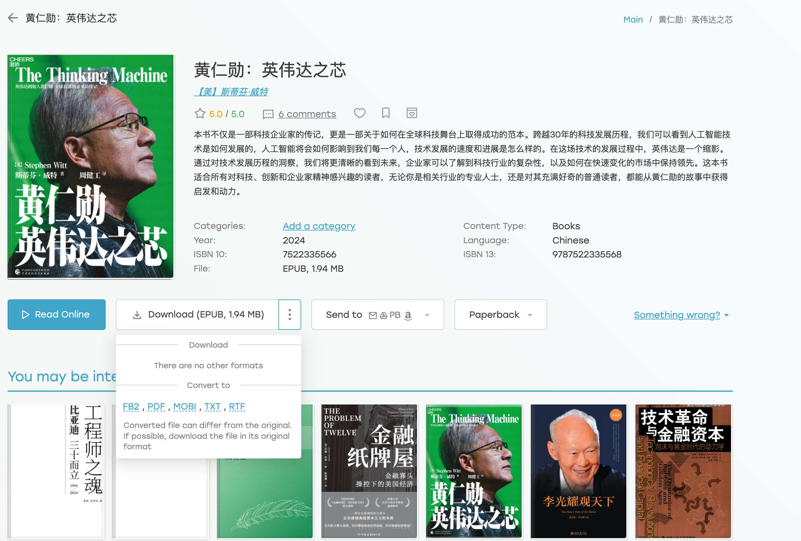

最近这段时间一直在用微信读书看一些关于芯片、经济方面的书籍，时间长了感觉微信读书有两个不甚方便的地方：

- 眼睛难受。每天对着电脑就已经感觉眼睛比较难受了，晚上再用微信读书看书就感觉眼睛越来越不舒服。
- 注意力不甚集中（可能是个人定力不行）。拿手机看书，总会有意想不到的打扰（微信消息、各种营销短信等）。

有一天，不经意间看到了工作台边上的 kindle（其实 kindle 一直在我的工作台上，好几年了）。

这个 kindle 还是刚参加工作时候，公司为了鼓励大家读书，然后“资助”大家购买的，算下来已有 7、8 年之久，刚开始还一直使用，看一些技术方面的书籍。

然后后面就一直落灰了，连盖泡面这种机会都没有，就是纯粹的落灰，然后我也一直没给它关机，神奇的是它一直未自动关机（好几年了，想想都厉害）。

突然就特别想用 kindle 看这些书籍，然后给擦灰、充电，一整套动作下来，**还是没办法把我想看的书籍搞到 kindle 里**。估计很多人都知道，kindle 在国内已经停止服务了，没办法按照官方的途径购买想看的书籍。

于是想到了晓辉，我记得他一直用 kindle 看书。然后就问他，怎么在现在这种情况下，还能让我的 kindle 变废为宝。晓辉告诉了我他用的方法：**z-library + calibre**。

对于 z-library 我倒是不陌生，估计喜欢看书的都不陌生。至于 calibre 这个我是真没听过。于是赶紧上网查了一下。

## calibre：电子书处理神器

在其官网（https://calibre-ebook.com）上看了一下。calibre 官网首页有一句话：

CALIBRE IS THE ONE STOP SOLUTION TO ALL YOUR E-BOOK NEEDS.

用大白话说就是，calibre 是你电子书需求的一站式解决方案。

当然，还有一个视频。如果不看上面的 Click to watch calibre demo 字样，都不知道这是个视频。点击查看这个 10 分 30 秒的视频，就能够了解 calibre 是干什么的、怎么用的。

总结起来，可以理解为 calibre 能够对电子书进行格式转换、元数据编辑、内容编辑、发送到设备（如 kindle）等。相当于，对于电子书，你有什么需求，你就能用它来实现。看完视频，亲自操作了一下，就是三个字 **爽歪歪**。

## 数据线：最终的拦路虎

一切研究明白后，让落灰的 kindle 重新焕发荣光的思路出来了：**从 z-library 下载书籍，然后用 calibre 转换格式，最后用数据线导入 kindle**。

于是，很快从 z-library 下载了我想看的书籍（微信书单中的书籍），然后用 calibre 做了一些处理，最后来到了把书籍导入 kindle。但是就是最后一步让我花费了太长时间。

按理来说，用数据线导入书籍是非常简单的。但是魔幻的是，这些年我早已经忘记了哪个数据线是 kindle 的“原配”，因为平时充电的时候，随便找一个接口合适的，一怼就好使了。但是这次要传输数据的时候，却不灵光了，于是我找到了家里所有类似的数据线（至少 6 条），然后一个个尝试，无一奏效。一度我以为是电脑的问题，然后秉承着 SRE（Service Restart Engineering）的精神，重启了好几次，但是 PC 人就无法识别出 kindle 这个设备。

高涨的情绪立马就到了谷底，我开始怀疑我这个 kindle 是不是过时了，毕竟 7、8 年了。但是就想用 kindle 看书的执念让我想买个数据线试一下，然后在网上买了一个看似还不错的 kindle 数据线。等了好几天（从来没有这么期望过一个快递），数据线终于到了。到了之后，立马插到电脑上，在设备中立马看到了 kindle 这个字眼，真的是欣喜若狂啊。

然后就直接把已经转换好或者下载好的书籍直接拖到了 kindle 的目录下。在 kindle 从设备中弹出后，就在 kindle 首页书单中看到了我想看的书籍。那种感觉真的是太爽了。

## 写在最后

在后面继续使用 z-library 的过程中，发现下载书籍时候，本身就有多种格式，诸如 PDF、MOBI、RTF 等。而 MOBI 格式本身就能被 kindle 所识别。所以如果直接下载为 MOBI 格式，其实是可以不用 calibre 进行格式转换的。

